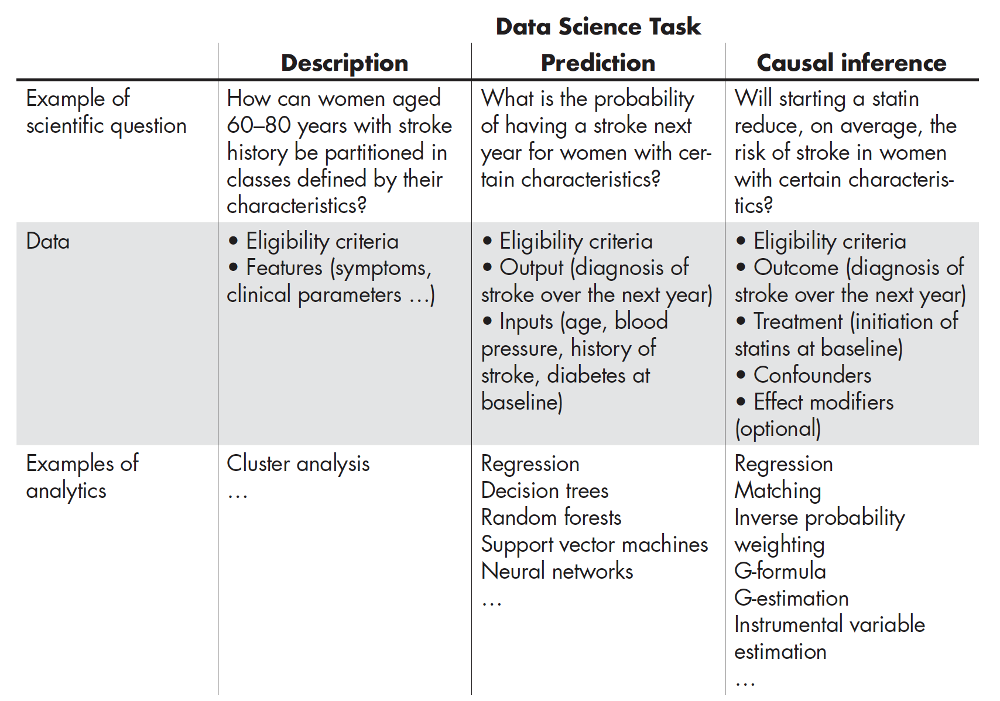
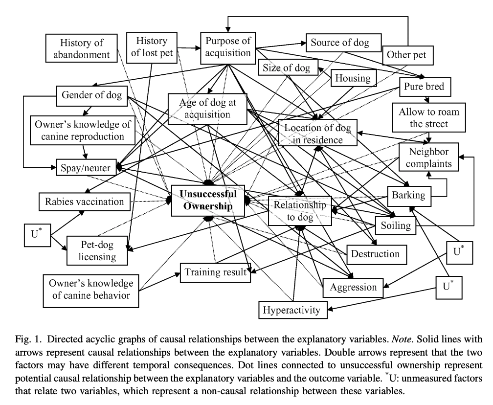

{width="75%"}

```{r setup, include=FALSE, warning=FALSE}
library(learnr)
library(tidyverse)
library(ggplot2)
library(dagitty)
library(ggdag)
library(ggpubr)
library(flipbookr)
library(kableExtra)
knitr::opts_chunk$set(echo = FALSE, warning = FALSE)


```

## Overview  
Welcome to HDAT9700 Statistical Modelling II - Directed Acyclic Graphs (DAGs)! 

In this chapter you will learn how to represent assumptions about casual mechansims using a special type of graph: a Directed Acyclic Graph, or DAG. DAGs are useful because they allow us to formalise our assumptions and can help inform variable selection for causal models. 

In this chapter you will learn how to:

* Represent common causal structures using a DAG 
* Identify adjustment variables using a DAG

***

### Prereadings

The pre-reading for this chapter is a _tweetorial_ by epidemiologist [Ellie Murray](https://twitter.com/EpiEllie) from Boston University School of Public Health. 

The tweetorial focuses on **"the importance of being clear about your question & using that to drive your methods"**. Find it [here](https://twitter.com/EpiEllie/status/1214641734900224003).

Ellie's tweetorial was prompted by a disparaging tweet about [this](https://www.nature.com/articles/bjc2017146.pdf) study, which explores the relationship between frozen shoulder and the risk of cancer. The disparaging tweet criticised the study for failing to adjust for confounding. In her tweetorial, Ellie explains that this was a descriptive study, not one addressing a causal question and that in fact adjusting for confounding may well have led to the wrong answer to the question at hand.

This pre-reading should help you understand that we always need to be clear about the purpose of our models, as our purpose dictates how we specify the model and what variables we should control for. 


### Core readings:

* [Miguel A. Hernán, John Hsu & Brian Healy (2019) A Second Chance to Get
Causal Inference Right: A Classification of Data Science Tasks, _Chance_, 32(1), 42-49](https://doi.org/10.1080/09332480.2019.1579578)

* [Etminan M, Collins GS, Mansournia MA. Using Causal Diagrams to Improve the Design and Interpretation of Medical Research. Chest. 2020 Jul 1;158(1):S21-8.](https://doi.org/10.1016/j.chest.2020.03.011)

### Additional resources: 

* [Shmueli G (2010) To explain or to predict?, _Statistical Science_, 25(3), 289-310](https://projecteuclid.org/euclid.ss/1294167961).
Also, if you haven't already, check out the related [video](https://www.youtube.com/watch?time_continue=1&v=vWH_HNfQVRI&vq=large), linked at the end of the last tutorial.

* [dagitty.net](http://www.dagitty.net/learn/): A great website explaing DAGs and related topics, with built-in applets to test your knowledge

* An excellent [YouTube video series on Causality and DAGs](https://www.youtube.com/playlist?list=PLcTBLulJV_AKmUTH-nUsxxFyRQoWnUzxU) presented by Assistant Professor Nick Huntington-Klein from Seattle University. This is a series of 14 videos that starts from the very basics of causal thinking with DAGs.

* The Causal Inference Podcast, hosted by Ellie Murray and Lucy D'Agostino McGowan. Check out the first episode: [Talking target trials with Miguel Hernán](https://casualinfer.libsyn.com/casual-inference-talking-target-trials-with-miguel-hernan-episode-01)

## Three tasks of data science

The statisical analyses you will perform as Health Data Scientists can be categorised according to three broad tasks of data science. 

1. Description 
2. Prediction 
3. Causal inference 

**Description** involves using statistical models to summarise the relationship between variables. There is no reliance on any underlying causal theory. 

**Prediction** involves using statistical models to predict new or future outcomes (Y) given a set of input values or variables (X). 

**Causal inference** involves estimating the causal effect of an exposure, treatment or intervention. Answering causal questions boils down to comparing outcomes under two or more scenarios, for example, "Would this patient have better chances of survival given treatment A or Treatment B"?


The table below (from [Hernán et al 2019](https://doi.org/10.1080/09332480.2019.1579578)) provides examples of the types of questions, data and analysis methods associated with the tasks of description, prediction and causal inference. 

{width="100%"}


```{r quiz1, echo=FALSE}
quiz(caption = "Quiz",
  question("Which modeling tasks are relevant to Health Data Science (Select all that apply)",
    answer("Description", correct = TRUE),
    answer("Prediction", correct = TRUE),
    answer("Causal inference", correct = TRUE),
    incorrect = "All three tasks are relevant to a career in Health Data Science. Machine Learning I (HDAT9500) is primarily concerned with prediction. Topics in Statistical Modelling II (HDAT9700) touch on description, prediction and causal inference. The important thing is choosing the most relevant approach for the research question."
  )
)
```

<div class="aside">

### "Explanation" or "Causal Inference"?

Causal inference tasks are often referred to as "Explanation" (recall the video at the end of Chapter 1 "To Explain or to Predict?" for example). However, Hernán et al (2019) emphasise that **quantifying causal effects doesn't necessarily equate to explaining causal mechanisms**. This is a fair point: knowing that smoking causes cancer is different to knowing which chemicals are carcinogenic, for example. 

</div>

 

## Variable selection
As you learned from this chapter's pre-reading, how we go about choosing the variables to include in the model depend crucially on what we are trying to achieve.

For **predictive** models, the goal is to build a model that accurately predicts the outcome of interest with high sensitivity and specificity, and performs well on new data. In terms of variable selection, the primary consideration is choosing variables that help to achieve this goal (although you would also consider practical things like what variables will be available at the time of prediction). Variable selection could be based on univariate analysis, selecting variables that show a strong association with the outcome, or a selection algorithm like forward, backward or stepwise selection. Many machine learning algorithms will will automatically select (or appropriately weight) the most predictive variables from those available. The covariates in a predictive model all play the same role so we can refer to them collectively as **predictors**.

For **causal** models, the goal is to estimate the effect of a given intervention or treatment on a predefined outcome of interest. Really, the only parameter of interest from our causal model is the estimate for that intervention or treatment. In this context, other variables (that may or may not be available in your dataset) have different roles and different names which you might already have come across: **confounders**, **mediators** and **colliders**. Importantly, this means that **just because a variable is correlated with the outcome of interest, that doesn't necessarily mean it is a good candidate to include in the model**. In order to understand what variables to include in a causal model, we need to recognise these different types of variables, and understand the role they play in the causal relationship of interest. 

Distinguishing between confounders, mediators, colliders and other types of variables relies on expert knowledge about the subject matter in question. There is no  algorithm or automated selection procedure that can replace this knowledge. Directed Acyclic Graphs, the main topic of this chapter, are an important tool that help us to formalise and graphically represent expert knowledge, and in doing so can help us to select the variables that should be included in a causal model.

## DAGS 

### Directed Acyclic Graphs (DAGs) 

DAGs are graphical tools used to represent the assumptions about causal relationships for a given problem. Representing these assumptions using a graph is an important approach because it allows you to 

* Express expert knowledge explicitly 
* Facilitate discussions about variable selection with co-authors 
* Communicate your assumptions to readers 

### What is a DAG 
DAGs are diagrams comprising nodes (circles or squares) connected by edges (arrows). These diagrams represent assumptions about the causal relationships of interest. The nodes in a DAG represent observed or unobserved variables or constructs while the arrows indicate the direction of the causal relationship between variables. 

In this simple DAG, the arrow points from X to Y, representing the asumption that **X** causes **Y**.

```{r}
dag1 <- dagify(Y ~ X) %>% ggdag() + theme_dag()
dag1
```

The absense of an arrow between two variables represents the assumption that neither neither variable is causing or caused by the other. In the next DAG, **Z** causes **X** and **Z** causes **Y**, but **X** and **Y** are _causally_ unrelated (there is no arrow pointing from **X** to **Y** or from **Y** to X). 

```{r}
ggdag_confounder_triangle() +
  theme_dag()
```

As we will discuss at length, the absense of an arrow between two nodes on a DAG, doesn't mean that the variables are unassociated in an observational dataset. What if our DAG above represented **sunshine**, **icecream sales** and **sunburn**?

```{r}
ggdag_confounder_triangle(x="icecream sales", y="sunburn", z="sunshine", 
                          use_labels = "label",
                          label_col = "black") +
  theme_dag()
```

We know that icecream sales definitely don't cause sunburn, but you wouldn't be surprised to find an association between icecream sales and incidence of sunburn (a case of correlation not implying causation!). This is a classic example of **confounding bias**. The relationship between icecream sales and sunburn is **confounded** by sunshine, inducing an association between the two variables, even though there is no causal relationship. 

By using expert knowledge to express our qualitative understanding of causal relationships of interest, DAGs help us to distinguish between association and causation.    


### Properties of DAGS
There are some formal requirements for a causal DAG. As indicated by the name, DAGs should be **directed** and **acyclic**.

* **Directed** The relationship between nodes are _directional_. The arrows indicate the direction of causality.

* **Acyclic** DAGs must not have _cycles_ between the nodes, i.e. a variable should not "cause" itself, either directly or through other variables. You can spot a cyclic relationship if it is possible to start at one node and follow the directional arrows to arrive back at the same node. 

Below is an example of a **cyclic** graph. The logic here is tempting: good health will improve educational outcomes, high levels of education will increase income and higher income can improve health. However this results in a cyclic graph: it is posible to start at any node and follow the directional arrows to return to that node, for example the path **health** $\rightarrow$ **education** $\rightarrow$ **income** $\rightarrow$ **health**.

```{r}
dag2 <- dagify(Y ~ X, Z ~ Y, X ~ Z, labels = c(X="health", Y="education", Z="income"))
ggdag(dag2, use_labels = "label") +
  theme_dag()
```

This would suggest that health status causes health status. Because this graph is cyclic and not acyclic, it does not meet the formal requirements for a DAG. Often, we can untangle cyclic relationships by considering the timing of causes and effects. For example, the relationship between health, education and income could be re-expressed more meaningfully by considering health status at different points in time, as represented below.


```{r}

coords <- list(
  x = c(X1 = 0, Y = 2, Z = 4, X2 = 6),
  y = c(X1 = 1, Y = 0, Z = 0, X2 = -1)
)

dag3 <- dagify(Y ~ X1, Z ~ Y, X2 ~ Z,
                labels = c(X1="health in childhood",
                            Y="education",
                            Z="income",
                            X2="health in adulthood"),
                coords = coords)
ggdag(dag3, use_labels = "label") +
  theme_dag()
```

This is a now valid DAG because it is **directional** and **acyclic**. Note the DAG above follows the convention that time moves from left to right. 

### The causal Markov assumption
A further property of a causal DAG is the **causal Markov assumption**. Although this sounds a bit scary, it is quite simple (cf Hernán and Robins 2020 Chapter 6 Technical Point 6.1 for a formal definition). It means that a common cause of any pair of variables on a DAG should also be included in the DAG.

As an example, let's say we are interested in the causal relationship between between aspirin and pulmonary embolism, in a setting where aspirin is more often prescribed to patients with high blood pressure. In this case, high blood pressure is a **common cause** of both aspirin usage and pulmonary embolism: patients with high blood pressure are more likely to be taking aspirin and high blood pressure increases the risk of a pulmonary embolism. To satisfy the causal Markov assumption, blood pressure should be included in the DAG.

``` {r}
ggdag_confounder_triangle(x="aspirin", y="pulmonary embolism", z="blood pressure", 
                          use_labels = "label",
                          label_col = "black",
                          text = FALSE,
                          x_y_associated = TRUE) +
  theme_dag()
```


Now, imagine a different setting where aspirin has been administered as the intervention in a randomised control trial. In this case, patients are randomly assigned, so there is no causal relationship between blood pressure and taking aspirin. Blood pressure still increases the risk of having a pulmonary embolism, but it is no longer a **common cause** of taking aspirin and having a pulmonary embolism so it is not necessary to include on the DAG. 

```{r}
coords <- list(
  x = c(x = 0, y = 1),
  y = c(x = 1, y = 1)
)

dag4 <- dagify(y ~ x,
                labels = c(x="aspirin", y="pulmonary embolism"),
                coords = coords)

ggdag(dag4, use_labels = "label", text = FALSE) +
  theme_dag()
```

*** 

### Other terminology

Consider the DAG below which an investigator might use when postulating the causal relationship between exercise and melanoma. We will use this DAG to explain some additional useful terminology.

``` {r}
coords <- list(
  x = c(a = 2, b = 1, c = 3, d = 5, e = 7),
  y = c(a = 2, b = 1.1, c = 1, d = 1, e = 1.5)
)

dag5 <- dagify(b ~ a,
               c ~ b,
               d ~ c,
               e ~ d,
               e ~ a,
               labels = c(a="health consciousness",
                          b="exercise",
                          c="sun exposure",
                          d="melanoma",
                          e="screening"),
               exposure = "b",
               outcome = "d",
               coords = coords) 
  ggdag(dag5, use_labels = "label", text = FALSE) + 
theme_dag()
```

#### Path
A path between two nodes in a DAG is a route that connects the two nodes, visiting no node more than once. The arrows don't have to point in the same direction, but if they do the path is considered a _causal path_. 

Below are examples of paths:

* exercise $\leftarrow$ health consciousness $\rightarrow$ screening (Not a causal path) 
* health consciousness $\rightarrow$ screening  $\leftarrow$ melanoma (Not a causal path) 

Below are examples of **causal** paths 

* exercise $\rightarrow$ sun exposure $\rightarrow$ melanoma
* sunexposure $\rightarrow$ melanoma 

#### Parent
The parents for a given node in a DAG are the set of variables with an arrow pointing directly into that node. For example, the parent of **melanoma** is **sun exposure**. 

#### Child
A child of a given node X is any variable with an arrow pointing directly from X. For example, **exercise** and **screening** are child nodes of **health consciousness**. 

#### Descendants and Ancestors
The ancestors of a node are any nodes on the causal path leading to that node. The descendants of a node are any nodes that can be reached by following causal paths. 

* The **ancestors** of sun exposure are exercise and health consciousness 
* The **descendants** of health consciousness are exercise, sun exposure, melanoma and screening


#### Confounder 
A confounder is a **common cause** of two nodes (usually the common cause of an exposure and an outcome)
* Health consciousness is a confounder of exercise and screening

#### Mediator
A mediator is a node that lies on the causal path between two other nodes.

* Sun exposure is a mediator on the path between exercise and melanoma 

#### Collider 
A collider is a node with two directional arrows pointing towards it. 

* Screening is a collider on the path health consciousness $\rightarrow$ screening $\leftarrow$ melanoma


## Quiz

```{r, out.width = '100%'}

a <- dagify(Z ~ X, Y ~ X) %>% ggdag(node_size = 6) + theme_dag() + border() + labs(title = "(A)")
b <- dagify(Y ~ X, X ~ Z, Z ~ Y) %>% ggdag(node_size = 6) + theme_dag() + border() + labs(title = "(B)")
c <- dagify(Y ~ X) %>% ggdag(node_size = 6) + theme_dag() + border() + labs(title = "(C)")

ggarrange(a, b, c, nrow = 1)

```

```{r quiz2, echo=FALSE}
quiz(caption = "Quiz: DAGS",
  question("Which of the diagrams above is not a valid DAG?",
    answer("A"),
    answer("B", correct = TRUE, message = "Correct, (B) is not a valid DAG because it is not _directional_. This DAG would suggest that **X** causes **Y** and **Y** causes **X**."),
    answer("C"),
    incorrect = "This is a valid DAG, try again!",
    allow_retry = TRUE
  )
)
```

*** 

```{r, out.width = '100%'}
ggdag_confounder_triangle(x="Maternal age", y="Low birthweight", z="Social deprivation", 
                          use_labels = "label",
                          label_col = "navy",
                          text = FALSE,
                          x_y_associated = TRUE) +
  theme_dag()
```

```{r quiz3, echo=FALSE}
quiz(caption = "Quiz: DAGS",
     question("Which of the following statements matches the DAG above?",
              answer("Maternal age confounds the relationship between social deprivation and low birth weight."),
              answer("Low birthweight confounds the relationship between social deprivation and maternal age."),
              answer("Social deprivation confounds the relationship between maternal age and low birthweight", correct = TRUE, message = "Correct. This DAG suggests that social deprivation is a common cause of maternal age and low birthweight"),
              incorrect = "Not quite right, try again!",
              allow_retry = TRUE
     )
)
```

#### Want more? 
Try testing yourself on DAG terminology using this applet on [dagitty.net](http://www.dagitty.net/learn/graphs/index.html).


## Confounding variables

### Definition
Confounding arises when there is a variable **Z** that influences the exposure of interest **X** _and_ the outcome of interest **Y**. We say that the relationship between **X** and **Y** is _confounded_ and that **Z** is the _confounder_.

Depending on the discipline, a confounder is also referred to as a third variable or a lurking variable. 


### Example
The relationship between mother's age at birth (exposure) and child's birth weight (outcome) may be confounded by mother's socioeconomic status.    


### How does this look in a DAG?

```{r}
ggdag_confounder_triangle(x="Maternal age", y="Birth weight", z="Socioeconomic status", 
                          use_labels = "label",
                          label_col = "black") +
  geom_dag_edges_link(arrow = grid::arrow()) + 
  theme_dag()
```


## Mediating variables

### Definition
A mediating variable **M** is a variable that lies on the causal pathway between an exposure **X** and outcome **Y**.

### Example
A researcher might hypothesise that quality of sleep is a mediating variable between exercise (exposure) and mood (outcome). We might assume that exercise will improve sleep quality, and a good night's sleep will in turn improve mood.

### How does this look in a DAG?

```{r}
ggdag_mediation_triangle(x="Exercise", y="Mood", m="Sleep quality",
                          use_labels = "label",
                          label_col = "black") +
  geom_dag_edges_link(arrow = grid::arrow(type = 'closed')) + 
  theme_dag()
```

Here there is no connecting arrow going from exercise to mood. Our DAG reflects the assumption that all of the effect of exercise is mediated through quality of sleep. This would be an indirect effect of exercise on mood. However, we might also hypothesis a direct effect, perhaps caused by the release of endorphins. In that case we would have both an indirect path ($\text{Exercise} \rightarrow \text{Sleep quality} \rightarrow \text{Mood}$) and a direct path ($\text{Exercise} \rightarrow \text{Mood}$)

```{r}
ggdag_mediation_triangle(x="Exercise", y="Mood", m="Sleep quality",
                         x_y_associated = TRUE,
                          use_labels = "label",
                          label_col = "black") +
  geom_dag_edges_link(arrow = grid::arrow(type = 'closed')) + 
  theme_dag()
```

***

<div class="aside">

### Muddling mediation

Mediation often gets confused with two closely related epidemiological concepts, _interaction_ and _effect modification_. Below is a quick summary distinguishing these three terms, adapted from the paper [Corraini, Priscila, et al. "Effect modification, interaction and mediation: an overview of theoretical insights for clinical investigators." Clinical epidemiology 9 (2017): 331](https://www.ncbi.nlm.nih.gov/pmc/articles/PMC5476432/)

The table below provides a quick summary of these three concepts. If you come across these terms and need a reminder please check out the paper!

</div>

```{r}
tab <- data.frame(
  type = c("Effect modification",
            "Interaction",
            "Mediation"),
  
  aim = c("Separate exposure effects according to another variable",
          "Evaluate individual and joint effects of exposures",
          "Evaluate direct and indirect effects of exposures"),
  
  question = c("Does the new drug have a different effect for men compared to women?",
               "Does drug A work better if the patient is also taking drug B?",
               "Does exercise improve mood directly, or does exercise improve sleep and then better sleep results in improved mood?") 
  
)


tab %>% 
  knitr::kable(col.names = c("Type of assessment", "Aim of the assessment", "Example question")) %>% 
  kable_styling()
```


## Collider variables
### Definition
A collider is a common effect of two variables. 

### Example
Suppose a researcher is interested in whether respiratory syncytial virus infection (exposure) during infancy causes asthma in early childhood (outcome). In this case, admissions to the Emergency Department (ED) during early childhood would be a potential collider, because both RSV and asthma will increase the probability of ED admission during early childhood.  

### How does this look in a DAG?
```{r}
ggdag_collider_triangle(x="RSV infection", y="Asthma", m="ED admission", 
                          x_y_associated = TRUE,
                          use_labels = "label",
                          label_col = "black") +
  geom_dag_edges_link(arrow = grid::arrow(type = 'closed')) + 
  theme_dag()
```

As we will see, identifying colliders is important because controlling for a collider can introduce bias. To continue the above example, controlling for the number of ED admissions during early childhood would actually _**bias**_ estimates of the relationship between RSV infection and asthma.


<div class="shiny">

### Explore this further
You can explore this example and the concept of collider bias further using this [interactive Shiny app](https://cbdrh.shinyapps.io/collider-bias/). The app can also be launched by entering `hdat9700tutorials::run('collider-bias')` at the console. 

</div>


## D-separation

Now that you know how to represent and recognise different types of relationships in a DAG, how can a DAG help us to choose what variables to include in a causal model? The answer lies in the concept of **d-separation**. 

**Definition:** Two variables in a DAG are said to be d-separated if there are no open backdoor paths between them.

This definition introduces two new concepts that we also have to define: _backdoor_ paths, and what makes an _open_ path.

#### 1. Backdoor paths
**Definition:** A backdoor path between X and Y is a path that leaves through a parent of X and ultimately points to Y.

An easy way to identify a backdoor path is to start with any arrows **pointing into the exposure**, and see if you can trace a path from there to the outcome. 

For example, the path $\text{icecream sales} \leftarrow \text{sunshine} \rightarrow \text{sunburn}$ is a backdoor path between icecream sales and sunburn.
```{r}
ggdag_confounder_triangle(x="icecream sales", y="sunburn", z="sunshine", 
                          use_labels = "label",
                          label_col = "black") +
  theme_dag()
```

You will recognise this as an example of confounding. In this case, the presence of sunshine induces a correlation or _dependence_ between icecream and sunburn. The "d" in d-connected stands for **dependence**! 

#### 1b. Frontdoor paths
While we are at it, lets also define frontdoor paths. These are any paths that start with an arrow **pointing from the exposure** and ending at the outcome. The causal effect of interest $\text{X} \rightarrow \text{Y}$  is one frontdoor path, but if mediators are present there will be more than one front door path. In the mediation example you saw earlier, both pathways are frontdoor paths because they start with an arrow pointing from the exposure (Exercise) and end up at the outcome (Mood).

```{r}
ggdag_mediation_triangle(x="Exercise", y="Mood", m="Sleep quality",
                         x_y_associated = TRUE,
                          use_labels = "label",
                          label_col = "black") +
  geom_dag_edges_link(arrow = grid::arrow(type = 'closed')) + 
  theme_dag()
```

Both paths are front door paths: 
* $\text{Exercise} \rightarrow \text{Sleep quality} \rightarrow \text{Mood}$) 
* ($\text{Exercise} \rightarrow \text{Mood}$)


#### 2. Open paths

A path between two nodes X and Y is open if the path carries information or dependence between X and Y. We can open or close a path between two nodes by controlling for intermediate variables. In most contexts, conditioning will mean stratifying by a variable or adding the variable to a regression model.

Importantly, however, whether or not controlling for an intermediate variable Z opens the the pathway or closes the pathway depends on the role of Z. The table below outlines what happens in three different scenarios.


```{r}
tab <- data.frame(
  
  A = c("{width='80%'}",
    "{width='80%'}",
    "{width='80%'}"
  ),
  
  B = c("Mediator",
            "Confounder",
            "Collider"),
  
  C = c("Path between X and Y is OPEN",
          "Path between X and Y is OPEN",
          "Path between X and Y is CLOSED"),
  
  D = c("CLOSES path between X and Y.",
          "CLOSES path between X and Y",
          "OPENS path between X and Y")
  
)


tab %>% 
  knitr::kable(col.names = c("DAG", "Role of Z", "Status before controlling for Z", "Effect of controlling for Z")) %>% 
  kable_styling() %>% 
  column_spec(1, width = "4cm") %>% 
  column_spec(2, width = "2cm") %>% 
  column_spec(3, width = "3cm")
```

Note that conditioning on a mediator or a confounder will CLOSE the path between X and Y. In the case of colliders, the path is closed unless we condition on Z in which case we OPEN the path between X and Y.


### How does this all help?

Having read through the section above, you should be comfortable with the idea of: 

1. A backdoor path (and a front door path)
2. An open or closed path

To estimate the TOTAL effect of X on Y you need to control for a set of variables that can close any backdoor paths, but do not close the frontdoor paths.

To estimate the DIRECT effect of X on Y you need to control for a set of variables that close any backdoor paths and close any frontdoor paths (except the path $\text{X} \rightarrow \text{Y}$). 


## Worked example

In this section we will use the principle of d-separation and backdoor paths to identify a minimal set of adjustment variables that will aloow us to estimate the effect of Exercise on Mood based on the following DAG. 

```{r}
coords <- list(
  x = c(a = -1, b = 5, c = 2, d = 1, e = 2.5, f = 3, g = 2),
  y = c(a = 2, b = 2, c = 1, d = 3, e = 2.3, f = 3, g = 0)
)

dag7 <- dagify(a~d,
               a~f,
               b~a,
               g~a,
               b~c,
               b~e,
               b~f,
               g~b,
               c~a,
               e~d,
               labels = c(a="exercise",
                          b="mood",
                          c="sleep quality",
                          d="club member",
                          e="social interaction",
                          f="season",
                          g="blood pressure"),
               exposure = "a",
               outcome = "b",
               coords = coords) 
ggdag_status(dag7, use_labels = "label", text = FALSE) + 
  theme_dag()
```

This DAG captures several plausible assumptions:

* Exercise has a direct effect on mood but also an indirect effect via sleep quality 
* Exercise also has an effect on blood pressure 
* Being a club member has an effect on exercise 
* The season also has an effect on exercise (perhaps people exercise less during cold weather) 
* Being a club member has an effect on social interactions 
* Social interactions have an effect on mood (hopefully a positive one!) 
* Season has an effect on mood (sunlight can have a positive effect on mood)
* Mood has an effect on blood pressure (perhaps being calmer and happier decreases stress-induced high blood pressure)

### Identifying backdoor paths
In order to estimate the **total** effect of exercise on mood we need to close all the available backdoor paths. If we are interested in the **direct** effect of mood on exercise we additionally need to close any frontdoor paths, other than the main causal pathway $\text{Exercise} \rightarrow \text{Mood}$. So let's start by identifying all of the backdoor and frontdoor paths between Exercise and Mood.

#### Backdoor paths 
To identify backdoor paths, start with all the **arrows pointing into the exposure** exercise, and trace all paths that lead from there back to the outcome Mood. There are two arrows pointing into Exercise: one from Club Member and one from Season. The corresponding backdoor paths are: 

* $\text{Exercise} \leftarrow \text{Club member} \rightarrow \text{Social interactions} \rightarrow \text{Mood}$ 
* $\text{Exercise} \leftarrow \text{Season} \rightarrow \text{Mood}$ 


#### Frontdoor paths 
To identify frontdoor paths, start with all the **arrows pointing away from the exposure** exercise, and trace all paths that lead from there to the outcome Mood. There are three arrows pointing from Exercise: one directly to Mood, one to Sleep quality and one to Blood pressure. The corresponding frontdoor paths are: 

* $\text{Exercise} \rightarrow \text{Mood}$ 
* $\text{Exercise} \rightarrow \text{Sleep quality} \rightarrow \text{Mood}$ 
* $\text{Exercise} \rightarrow \text{Blood pressure} \leftarrow \text{Mood}$ 


### Identifying adjustment sets

#### Total effect 
To estimate the total effect of Exercise on Mood we must close all of the backdoor paths. To close a path it is sufficient to control for any single variable along that path. 

* To close the path $\text{Exercise} \leftarrow \text{Club member} \rightarrow \text{Social interactions} \rightarrow \text{Mood}$ we could control for Club membership OR we could control for number of social interactions. Note that controlling for either variable is sufficient to close the path. We could also control for both variables; this isn't necessary to close the path, but it won't do any harm. 
* To close the path $\text{Exercise} \leftarrow \text{Season} \rightarrow \text{Mood}$ we would need to control for Season.

Thus, there are two possible minimal adjustment sets to identify the total effect of Exercise on Mood: 

1. Club membership and Season 

```{r}
dag7 %>% adjust_for(c('d', 'f')) %>% ggdag_adjust(use_labels = "label", text = FALSE) + theme_dag()
```

2. Number of Social interactions and Season 

```{r}
dag7 %>% adjust_for(c('e', 'f')) %>% ggdag_adjust(use_labels = "label", text = FALSE) + theme_dag()
```


#### Direct effect 
To estimate the direct effect of Exercise on Food we must also consider alternative frontdoor paths other than the path of interest. 

We identified three front door paths. The first was the path * $\text{Exercise} \rightarrow \text{Mood}$. this is the causal path of interst so we don't have to do anything here (obviously we will include our exposure and outcome in the model).

The second frontdoor path was $\text{Exercise} \rightarrow \text{Sleep quality} \rightarrow \text{Mood}$. This path implies that part of the effect of exercise is mediated through sleep quality. In order to estiamte the direct effect of execise we must close this pathway, i.e. control for sleep quality in our analysis.

The third frontdoor path is $\text{Exercise} \rightarrow \text{Blood pressure} \leftarrow \text{Mood}$. Notice that an arrow points from Exercise to Blood pressure and an arrow points from Mood to Blood pressure. So the node Blood pressure is a collider on the pathway $\text{Exercise} \rightarrow \text{Blood pressure} \leftarrow \text{Mood}$. Recall that controlling for a collider _opens_ the pathway, so in this case we do not have to for Blood pressure, the pathway is already closed!

Thus, there are two possible minimal adjustment sets to identify the direct effect of Exercise on Mood: 

1. Club membership, Season and Sleep quality

```{r}
dag7 %>% adjust_for(c('c', 'd', 'f')) %>% ggdag_adjust(use_labels = "label", text = FALSE, collider_lines = FALSE) + theme_dag()
```

2. Number of Social interactions, Season and Sleep quality

```{r}
dag7 %>% adjust_for(c('c', 'e', 'f')) %>% ggdag_adjust(use_labels = "label", text = FALSE, collider_lines = FALSE) + theme_dag()
```

*** 

Now try the exercise to practice this yourself!


## Exercise

<div class="shiny">

### Explore this further
Explore the concept of d-separation and backdoor paths adjustment further using this [interactive Shiny app](https://cbdrh.shinyapps.io/backdoor-paths/). The app can also be launched by entering `hdat9700tutorials::run('backdoor-paths')` at the console. 

This app will generate a random DAG and you must identify which variables to control for in order to estimate causal effect of the exposure on the outcome. You can vary the DAG complexity, and choose to focus on the total effect or the direct effect (you should practice both modes. 

</div>

## Selection Biases 

Many different types of biases arise from mechanisms that result in some individuals being recorded in our data and available for analysis, while data other individuals is unavailable. These biases are referred to as Selection Biases.

In this section we will take a closer look at one type of selection bias - nonresponse bias - and see how this can be represented as a type of collider bias. 

### Survey nonresponse bias

Suppose a researcher is interested in estimating the effect of wearing a face mask (x) on the risk on contracting COVID-19 (y) using data from a random-digit-dialling telephone survey. Survey respondents were asked whether they had been wearing a face mask in public during the last month and if they had tested positive for the coronavirus. Of course, there are numerous factors that we would need to include in our DAG to address this research question, including the number and type of contacts, individual characteristics like age, sex and smoking status, and the quality and correct use of masks. For the this example, we will zoom in on one aspect: survey participation.

There is a large literature documenting the many ways that survey respondents (those who agreed to participate in a survey) differ from survey nonrespondents (those who decline to participate or can't even be contacted). Like any survey we can assume this telephone survey suffered from a degree of nonresponse. In this context, we could imagine that survey respondents are more likely to wear masks, a correlation arising as a result of a latent variable: compliant personality type. Compliant people may be more likely to wear masks and more likely to agree to a survey request, resulting in an association (although not a causal relationship) between mask wearing and survey participation. 

We can also imagine that individuals with a recent coronavirus diagnosis may be more likely to participated in a telephone COVID-19 survey, perhaps because they have a personal interest in the topic, or they are easier to contact because they are self-isolating at home.

These assumptions about the key exposure, outcome and participation status could be represented with the DAG below.

```{r}

coords <- list(
  x = c(x = 1, y = 3, z = 0, m = 1),
  y = c(x = 0.7, y = 0.7, z = .5, m = 0)
)

dag6 <- dagify( m ~ y, y ~ x, x ~ z, m ~ z,
               exposure = 'x',
               outcome = 'y',
               latent = 'z',
                labels = c(x="Mask",
                            y="COVID-19",
                            z="Compliant",
                            m="Participation"),
                coords = coords) 

ggdag(dag6, use_labels = "label") + 
  theme_dag() 

```

When we estimated the effect of mask wearing on COVID-19 using data from respondents only, we are effectively controlling for response status. To see this, consider the  hypothetical scenario where data is available for respondents and nonrespondents alike. In this case, stratifying on response status and performing the analysis among survey respondents only is the same as only having data for survey respondents in the first place. 

Looking at the DAG above, it should be clear that survey participation (m) is a collider on the path $z \rightarrow m \leftarrow y$. And what happens when we condition on a collider? As you have learned in the section on Collider Variables, controlling for response status will **open** the triplet $z \rightarrow m \leftarrow y$. In addition, assuming compliant personality type is a latent, unobserved variable, we will be unable to close the pathway $ x \leftarrow z \rightarrow m $.  Thus there will be an open backdoor pathway between the exposure (x) and the outcome (y): $x \leftarrow z \rightarrow m \leftarrow y$.

Under this set of assumptions, our exposure and outcome would not be d-separated and our estimated causal effect of mask-wearing on the risk of contracting COVID-19 would likely be biased. 


```{r}

coords <- list(
  x = c(x = 1, y = 3, z = 0, m = 1),
  y = c(x = 0.7, y = 0.7, z = .5, m = 0)
)

dag6 <- dagify(y ~ x, x ~ z, m ~ y + z,
                exposure = 'x',
                outcome = 'y', 
               coords = coords) 

dag6 %>% 
  adjust_for('z') %>% 
  dplyr::mutate(adjusted = c(rep('unadjusted', 4), 'adjusted')) %>% # Had to do this manually because of error when passing 'm' to adjust_for
  ggdag_adjust() +
  theme_dag()


```

## M-Bias

M-bias is a common structure of bias that arises when collider bias is transmitted between ancestors of the exposure and outcome. When presented as a DAG, this structure results in an M shape as shown:

```{r}
ggdag_m_bias() + theme_dag()
```

It should be clear by now that adjusting for m would open a backdoor path between a and y in this DAG, as below:

```{r}
m_bias() %>% adjust_for('m') %>% ggdag_adjust() + theme_dag()
```

M-bias emphasises a key point of this lecture: just because a variable is available and correlated with the exposure and outcome, doesn't necessarily mean we should adjust for that variable in a causal model. This is still true **even for variables that are "pre-treatment" variables**, as is the case in M-bias.

### Example 

Below is a plausible example of M-bias presented by (Liu et al, 2020)[https://doi.org/10.1093/aje/kws165] where the exposure us SSRI use (SSRI = selective serotonin reuptake inhibitor, a common antidepressant).

```{r}
ggdag_m_bias(x="SSRI Use", 
             y = "Lung cancer",
             a = "Depression",
             b = "Ever smoker",
             m = "Coronary artery disease",
                          use_labels = "label",
                          label_col = "black") +
                          theme_dag()
```

If this DAG were a reasonable representation of the data generation mechanism, coronary artery disease would be associated with SSRI Use and Lung cancer in an observational dataset. However, adjusting for coronary artery disease would suggest an apparent effect of SSRI use on Lung cancer, even if one didn't exist.

```{r}

m_bias(x="SSRI Use", 
             y = "Lung cancer",
             a = "Depression",
             b = "Ever smoker",
             m = "Coronary artery disease") %>% 
             adjust_for('m') %>% 
             ggdag_adjust(use_labels = "label",
                          label_col = "black") +
                          theme_dag()
```

## Exercise


For this exercise, you need to read through a second tweetorial from [Dr Ellie Murray](twitter.com/EpiEllie)) (@EpiEllie), then answer the question below. This tweetorial focuses on **"applying conclusions about causation to results obtained via methods designed only for finding correlations"** and illustrates a real-world scenario where M-bias was potentially contributing to counter-intuitive (or misunderstood) results in a study of COVID-19 hospital deaths. Find it [here](https://twitter.com/EpiEllie/status/1258607277357006849).

Once you have read through the tweetorial, consider the following question.

```{r, fig.width = 3, fig.height=3}
ggdag_m_bias() + theme_dag()
```

```{r quiz4, echo=FALSE}
quiz(caption = "Quiz: M-Bias",
     question("What are the correct labels for the nodes in the DAG above to best reflect the example discussed in @EpiEllie's tweetorial",
              answer("x = 'COVID-19 death', a = 'Social determinants of health', m = 'Smoking history', b = 'Heart disease', y = 'Current smoking'"),
              answer("x = 'COVID-19 death', a = 'Social determinants of health', m = 'Heart disease', b = 'Smoking history', y = 'Current smoking'"),
              answer("x = 'Current smoking', a = 'Social determinants of health', m = 'Smoking history', b = 'Heart disease', y = 'COVID-19 death'"),
              answer("x = 'Current smoking', a = 'Social determinants of health', m = 'Heart disease', b = 'Smoking history', y = 'COVID-19 death'"),
              answer("x = 'Current smoking', a = 'Smoking history', m = 'Heart disease', b = 'Social determinants of health', y = 'COVID-19 death'", correct = TRUE, message = "Although the complete DAG is likely much more complicated."),
              incorrect = "Not quite right, try again!",
              allow_retry = TRUE,
              random_answer_order = TRUE
     )
)
```

You can use the code below to help visualise different possible answers, or to just take a sneak peek at the syntax for coding DAGs in R.

```{r m-bias, exercise = TRUE, exercise.lines = 12}

# Choices: COVID-19 death, Social determinants of health; Smoking history; Heart disease; Current smoking
ggdag_m_bias(x="Hmm", 
             y = "Not sure",
             a = "Could be",
             b = "Maybe",
             m = "Mehnunuh",
             use_labels = "label",
             label_col = "black") +
              theme_dag()

```


## Extra: Coding DAGs in R

### DAGitty

[DAGitty](http://dagitty.net/dags.html) is an online tool that allows you to easily create DAGs in a point-and-click fashion, without any coding required. Conveniently, DAGitty also automatically creates R code that will allow you to recreate the DAG you draw in DAGitty within R. In this section, you will see an example of how to copy the model code from DAGitty into an R environment for further manipulation with the `dagitty` and `ggdag` R packages. 

Below is a mirror to the DAGitty interface . Note that if you are reading this tutorial in the RStudio viewer pane you will need to show it in a browser window to view it properly. Alternatively, you can just go to [dagitty.net/dags.html](http://www.dagitty.net/dags.html).

```{r}
shiny::tags$iframe(style="height:800px; width:100%; scrolling=yes", src="http://www.dagitty.net/dags.html")
```

You can read the **How to...** section if you would like to learn how to creat your own DAG. In order to reproduce the DAG you create in R, scroll down to the box titled **Model code**. Copy this syntax to your clipboard and paste it between the single quotes as indicated in the interactive chunk below.

```{r dagitty1, exercise = TRUE, exercise.lines = 30}
# Load libraries
library(dagitty)
library(ggdag)

# Copy-paste model code from DAGitty online tool
modelCode <- 'paste the DAGitty model code here'

# Use dagitty to create a dagitty graph object from the model code
dagittyObject <- dagitty::dagitty(modelCode)

# Pass the dagitty object to ggdag
ggdag(dagittyObject)

# Add '+ theme_dag()' to the above code. What changes?

# Try passing the object to ggdag_status(). What's different?


```


*** 

### Coding DAGS in R
The DAGs in this tutorial are created using the `ggdag` package. If you are interested in learning more about how to draw DAGs in this way, check out the vignette on the package [here](https://cran.r-project.org/web/packages/ggdag/vignettes/intro-to-ggdag.html).


### DAGs for common structures

The `ggdag` package includes a set of convenience functions to quickly create DAGs with common bias structures. You can explore these below.

#### Confounding
```{r ggdag2, exercise = TRUE, exercise.lines = 8}

ggdag_confounder_triangle(x="icecream sales", y="sunburn", z="sunshine", 
                          use_labels = "label",
                          label_col = "black") +
                          theme_dag()

```

#### Mediation
```{r ggdag3, exercise = TRUE, exercise.lines = 8}

ggdag_mediation_triangle(x="Exercise", y="Mood", m="Sleep quality", 
                          use_labels = "label",
                          label_col = "black") +
                          theme_dag()

```

#### Collider
```{r ggdag4, exercise = TRUE, exercise.lines = 8}

ggdag_collider_triangle(x="RSV infection", y="Asthma", m="ED admission", 
                          use_labels = "label",
                          label_col = "black") +
                          theme_dag()

```

### Building up the elements of a DAG
For more complex DAGs, it might be necessary to use the bespoke `geom_dag_*` functions that come with `ggdag` to tailor the elements of your desired DAG. Click through the slides below to see an example of this in action. 

```{r, out.width='100%', out.height='100%'}
knitr::include_url("images/fb-ggdag.html")
```

Note that:

* By default, the position of nodes is random. You can specify fixed node positions using `coords = `. 
* The funtion `dagify()` is used to define the relationships between nodes. E.g. `y ~ x` indicates that an arrow will point from **x** to **y**.  
* Passing the output of `dagify()` to `node_parents(x)` creates a dataframe distinguishing between child and parent nodes of **x**. 
* `geom_dag_point()` and `geom_dag_edges()` plot the results. 
* Applying `theme_dag()` provides a nice clean plot. 
 
 
### Try it yourself
Try experimenting with the code below to create your own DAG.

```{r ggdag1, exercise = TRUE, exercise.lines = 25}
# specifying fixed coordinates means that the nodes of the DAG will 
# always be in the same in the same place. If we don't include this, 
# the nodes will be randomly arranged each time the DAG is drawn
coords <- list(
        x = c(x = 0, y = 1, a = 1, b = 0),
        y = c(x = 0, y = 1, a = 0, b = 1)
    )


dagify(y ~ x + a + b,
       x ~ a + b,
       exposure = "x",
       outcome = "y",
       coords = coords) %>%  
  node_parents("x") %>% 
  ggplot(aes(x=x, y=y, xend=xend, yend=yend, color=parent)) + 
  geom_dag_point() + 
  geom_dag_edges() +
  geom_dag_text(col = "white", size = 6) + 
  geom_dag_edges_link(arrow = grid::arrow()) + 
  theme_dag() + 
  scale_color_hue(
    breaks  = c("parent", "child")
    ) 
```

You might notice that this code differs slightly from the code in the flipbook slides above. The flipbook code uses _slow ggplot_ as described by the `flipbookr` package developer Evangeline Reynolds in her [blog](https://evangelinereynolds.netlify.app/post/slow-ggplot/). Slow ggplot is an approach to writing ggplot code that focuses on incremental changes, for example, instead of specifying `aes(x=xy, y=y, xend=xend, yend=yend, color=parent)` in a single line, slow ggplot separates out each aesthetic element to a separate line, to emphasise how that element affects the graph. The editable code above dispenses with the slow ggplot syntax, and is more typical of how you will write R code in the wild.    
 
 
## Summary 
 
DAGs are a useful tool that allow us to formalise our assumptions about causal mechanisms under study. Dong so has many advantages:
* Express expert knowledge explicitly 
* Facilitate discussions about variable selection with co-authors 
* Communicate your assumptions to readers 

### D-separation
In order to estimated the causal path between an exposure X and an outcome Y, the nodes X and Y should be **d-separated**. This means that there should be **no open backdoor paths** between X and Y. 

* To close a confounding path ($X \leftarrow C \rightarrow Y$) or a mediating path ($X \rightarrow M \rightarrow Y$) we can condition on the confounder C or mediator M. 
* Conversely, conditioning on a collider ($X \rightarrow C \leftarrow Y$) will open the pathway 

### Limitations

Causal inference is hard. DAGs can help, but they are no silver bullet. First of all, DAGs that truly represent causal mechanisms of interest are likely to be much more complicated that the simple scenarios presented in this chapter. Check out the posited DAG below, presented in the study _Risk factors for unsuccessful dog ownership: An epidemiologic study in Taiwan_ by [Weng et al 2006](doi:10.1016/j.prevetmed.2006.06.004). Woof.  

 {width="75%"}

It should be clear that any useful DAG needs to be informed by knowledge and understanding about the mechanism at hand. Consulting with experts is essential when developing a DAG...

{width="75%"}


***

DAGs are also limited in terms of what they can represent. For example: 

* DAGs don't contain information about the magnitude or direction of association between nodes. If an arrow points from X to Y we don't know if this is a strong negative effect or a weak positive one. In some contexts, the edges of a DAG are annotated with a number to indicate the magnitude and direction of the implied effect. 

* It is not simple to represent statistical interaction or effect modification in a DAG.

* A DAG does not show if a cause only applies to some individuals


*** 

Despite some limitations, DAGs are a powerful tool. Next time you are faced with a research question ask yourself, is this a casual question? If the answer is yes, before looking at any data see if you can draw the main elements of a DAG. To quote Miguel Hernán,
> Draw your assumptions before your conclusions


