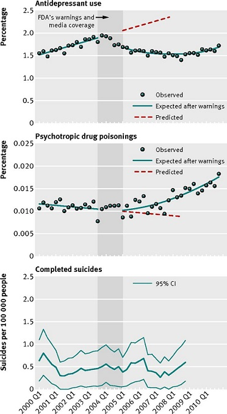
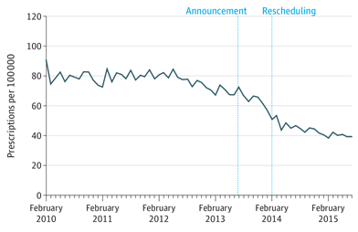

{width="75%"}

```{r setup, include=FALSE}
knitr::opts_chunk$set(echo = FALSE)

library("learnr")
library("astsa")
library("tseries")
library("forecast")
library("fpp")
library("fpp2")
library("kableExtra")
library("magrittr")
library("TSA")
library("tsoutliers")
library("lmtest")
library("zoo")
library("TTR")
library("gridExtra")

data(UKDriverDeaths)
UKDD <- window(UKDriverDeaths, start=c(1975,1))
UKDD <- ts(UKDD, start=c(1975,01), frequency=12)

belt <- as.numeric(as.yearmon(time(UKDD))>='Feb 1983')
belt <- ts(belt, start=c(1975,1), frequency=12)

UKDD.time <- seq(from=1, to=length(UKDD))
UKDD.time <- ts(UKDD.time, start=c(1975,01), frequency=12)

UKDD.after <- ifelse(as.yearmon(time(UKDD))<'Feb 1983', 0, UKDD.time-sum(belt==0))
UKDD.after <- ts(UKDD.after, start=c(1975,01), frequency=12)

belt.lag <- as.numeric(as.yearmon(time(UKDD))>='Mar 1983')
belt.lag <- ts(belt.lag, start=c(1975,01), frequency=12)

UKDD.after.lag <- ifelse(as.yearmon(time(UKDD))<'Mar 1983', 0, UKDD.time-sum(belt.lag==0))
UKDD.after.lag <- ts(UKDD.after.lag, start=c(1975,01), frequency=12)
UKDD.mon1 <- season(UKDD)
UKDD.mon2 <- seasonaldummy(UKDD)

alprazolam <- read.csv(file="data/alprazolam.csv", header=TRUE)
alp <- ts(alprazolam, start=c(2014,7), end=c(2018,6), frequency=12 )
step <- as.numeric(as.yearmon(time(alp))>='Feb 2017')
time <- seq(from=1, to=length(alp))
after <-ifelse(as.yearmon(time(alp))<'Feb 2017', 0, time-(sum(step==0)))
step.lag1 <-as.numeric(as.yearmon(time(alp))>='Mar 2017')
after.lag1 <-ifelse(as.yearmon(time(alp))<'Mar 2017', 0, time-(sum(step.lag1==0)))
alp.lag1 <- data.table::shift(alp)

month <- season(alp)
model1 <- glm(alp ~ time + month + step + after)
model2 <- glm(alp ~ time + month + step.lag1 + after.lag1)

UKDD.model1 <- glm(UKDD ~ UKDD.time + belt +  UKDD.after+ UKDD.mon1)
UKDD.lag <- data.table::shift(UKDD, type="lag")
UKDD.model2 <- glm(UKDD ~ UKDD.time + belt + UKDD.after + UKDD.mon1 + UKDD.lag)

UKDD.after.lag <- ifelse(as.yearmon(time(UKDD))<'Mar 1983', 0, UKDD.time-sum(belt.lag==0))
UKDD.after.lag <- ts(UKDD.after.lag, start=c(1975,01), frequency=12)

UKDD.model3 <- glm(UKDD ~ UKDD.time + belt.lag + UKDD.after.lag + UKDD.mon1 + UKDD.lag)

nobelt <- data.frame(belt=rep(0, length(belt)))
noslope <- data.frame(UKDD.after=rep(0, length(belt)))
UKDD.cf <- predict.lm(UKDD.model2, newdata=c(nobelt,noslope))
UKDD.cf <- ts.union(UKDD, UKDD.cf)


data(airmiles, package="TSA")
air <- airmiles/1000000
air.step <- ts(as.numeric(as.yearmon(time(air))>='Sep 2001'), start=c(1996,1), frequency=12)
air.pulse <- ts(as.numeric(as.yearmon(time(air))=='Sep 2001'), start=c(1996,1), frequency=12)
air.model1 <- sarima(air, p=0, d=1, q=1, P=0, D=1, Q=1, S=12, xreg=cbind(air.pulse,air.step), details=FALSE)


```


## Overview

Welcome to HDAT9700 Time Series Analysis!

In this chapter we will focus on interrupted time series analysis, and will involve the application of some of the concepts that we covered in the chapter on Time Series Analysis.

There will be three short lectures:  

1. Basics of interrupted time series design 
2. Segmented regression - Setting up your data
3. Segmented regression modelling and ARIMA modelling

Each lecture will be followed by a practical session where you will write your own R code to explore the concepts and methods we discuss.   

The prereading for this chapter is Bernal JL, Cummins S, Gasparrini A. Interrupted time series regression for the evaluation of public health interventions: a tutorial. *Int J Epidemiol* 2016;46:348-355. [DOI: 10.1093/ije/dyw098](https://academic.oup.com/ije/article/46/1/348/2622842)

The reference text is Shadish WR, Cook TD, Campbell DT. Experimental and quasi-experimental designs for generalized causal inference. 2002. Boston: Houghton Mifflin. ISBN: 0395615569. [Chapter 6](https://www.dropbox.com/s/uk97aukqw8n3mm3/Shadish_Cook_Campbell_Chap6.pdf?dl=0)

Some other useful references include:

* Soumerai et al. How Do You Know Which Health Care Effectiveness Research You Can Trust? A Guide to Study Design for the Perplexed. *Prev Chronic Dis* 2015;12:150187.[DOI: 10.5888/pcd12.150187](http://dx.doi.org/10.5888/pcd12.150187)

* Jandoc et al. Interrupted time series analysis in drug utilization research is increasing: systematic review and recommendations. *J Clin Epidemiol* 2015;68(8):950-6. [DOI: 10.1016/j.jclinepi.2014.12.018](https://www.sciencedirect.com/science/article/pii/S0895435615001237) **This article has useful guidance for the reporting of interrupted time series analysis methods.**

* Lopez Bernal et al. A methodological framework for model selection in interrupted time series studies. *J Clin Epidemiol* 2018;103:82-91 [DOI: 10.1016/j.jclinepi.2018.05.026](https://www.sciencedirect.com/science/article/pii/S0895435617314117)

* Lopez Bernal et al. The use of controls in interrupted time series studies of public health interventions. *Int J Epidemiol* 2018;0(0):1-12 [DOI: 10.1093/ije/dyy135](https://academic.oup.com/ije/advance-article/doi/10.1093/ije/dyy135/5049576)

* Lagarde. How to do (or not to do): Assessing the impact of a policy change with routine longitudinal data. *Health Policy Planning* 2012;27(1):76-83. [DOI: 10.1093/heapol/czr004](https://doi.org/10.1093/heapol/czr004)

Let's get started!  

## Lecture 1: Basics of interrupted time series design

### Why is interrupted time series analysis important?

Interrupted time series (ITS) analysis is increasingly being used to study the impact of large scale interventions, such as public health interventions, health policies and regulatory changes.

Health policies and regulations are often implemented by governments with the goal of improving the health of the population. A recent example would be the rescheduling of over-the-counter codeine products to prescription-only medicines in February 2018 to deter its misuse and prevent dependence.

However, these types of interventions are commonly introduced with a limited evidence base to support their rationale and despite the good intentions, many interventions can have unintended consequences. For instance, in 2003 the US Food and Drug Administration (FDA) put out warnings about an increased risk of suicidality in young people using antidepressants. Using interrupted time series analysis, Lu *et al* found that this led to a reduction in antidepressant use in young people, but also appeared to have led to an increase in suicide attempts ([Lu et al](https://www.bmj.com/content/348/bmj.g3596.full.pdf+html)).



This is in part because these types of interventions are blunt tools, targeting entire populations rather than those at risk. Thus, it is important to evaluate these interventions to make sure they are targeting the right individuals, resulting in the intended outcomes, and not resulting in unintended, negative outcomes. 

***

### What is ITS analysis?

Recall from the last Chapter that a time series is a chronological sequence of measurements equally spaced through time, with one observation for every time point.  ITS analysis is a quasi-experimental approach that takes advantage of the natural experiment that occurs when an intervention is implemented, dividing a time series into "pre-intervention" and "post-intervention" periods.

The causal hypothesis is that the time series after the intervention will behave differently than before as a result of the intervention. This is called an *interruption* in the time series. In ITS designs, the *counterfactual* is the path that the time series would have followed had the intervention not occurred.

***

#### Advantages of ITS analysis

Policies, regulations, and other large scale interventions that target whole populations, such as media events, cannot easily be evaluated with randomised controlled trials (RCTs), the gold standard for assessing causality. However, observational studies are prone to bias, especially if not properly designed. 

Some studies that evaluate large scale health interventions rely on a before-and-after design (also called pre-post design), where the outcome is measured at one time point before the intervention, and one time point after. However, this design is subject to significant bias, as it does not control for pre-existing trends. If the desired outcome is higher post-intervention than before, this may simply be the result of a pre-existing trend and would have occurred regardless of the intervention. 

Take a look at the figure below - in which of these scenarios would a before-and-after design with the outcome measured only at the red time points before and after lead to an accurate conclusion about the intervention (indicated by the grey bar)?


***

* For **outcome y1**, the rates of the outome would appear lower after the intervention in a pre-post design. However, this would be the result of a pre-existing downward trend, and not attributable to the intervention.
* For **outcome y2**, the rates of the outcome would appear the same after the intervention in a pre-post design. However, the outcome would be decreasing, whereas before it was increasing, representing a true impact of the intervention.
* For **outcome y3**, the outcome would appear lower after the intervention in a pre-post design, which would reflect the true effect of the intervention.
* For **outcome y4**, the outcome would appear lower after the intervention, but a simple pre-post design would not capture the fact that the outcome is now decreasing at a faster rate than before.

***

As with before-and-after designs, in ITS analysis the "pre-intervention" period acts as a control for the "post-intervention" period. However, in contrast to simple pre-post design, ITS analysis controls for the underlying trend, including both short-term fluctuations and seasonality, and longer-term trends. In addition, ITS designs tend to use data from entire populations, rather than a select cohort. Thus, **selection bias and confounding are rare**, as population characteristics tend to remain relatively stable over time, or only change very gradually. 

In fact, the ITS design is considered the best study design for determining causality after RCTs, and is sometimes referred to as **quasi-experimental**. It is especially strong when combined with a control series, which we will discuss later.

***

**Table 1.1.** Hierarchy of study designs. (Adapted from Soumerai et al. 2015. *Prev Chronic Dis*)

```{r 1_1, echo=FALSE, eval=TRUE}
text_tbl <- data.frame(
  Hierarchy = c("Strong designs: often trustworthy effects",
                " "," ","Intermediate designs: sometimes trustworthy effects",
" ","Weak designs: rarely trustworthy effects"," "),
  Design = c("Multiple randomised controlled trials",
                "Randomised controlled trials",
                "Interrupted time series with a control series",
             "Single interrupted time series",
             "Before and after with comparison group",
             "Uncontrolled before and after (pre-post)",
             "Cross-sectional design"),
  Description = c("The gold standard of evidence","A strong design, but sometimes not feasible","Baseline trends often allow visible effects and controls for biases","Controls for trend but has no comparison group",
                  "Comparability of baseline trend often unknown",
                  "Simple observations before and after, no baseline trends",
                  "Simple correlation, no baseline, no measure of change"))

kable(text_tbl) %>%
  kable_styling(full_width = F, position="left")%>%
  column_spec(1, bold = T, border_right = T) %>%
  column_spec(2, border_right=T, width = "25em") %>%
  column_spec(3, border_right=T, width= "25em") %>%
  row_spec(0, color="#2D8787") %>%
  row_spec(1:3, background="#F8F9F9") %>%
  row_spec(6:7, background="#F8F9F9") 
```

***

#### Disadvantages of ITS analysis

One of the criteria for causal inference is that alternative explanations other than the intervention of interest must be ruled out. This is ITS design's weakest point, as it can be difficult to say with certainty that there were no other events or changes that may have occurred around the same time as the intervention of interest. Therefore, it is important to investigate whether there were any co-occurring interventions around the same time as the intervention of interest that could be an alternative explanation for any findings.

ITS analysis also does not easily allow for the investigation of person-level effects, since by its nature time series data are aggregate. One way around this is to construct multiple time series in different subgroups or populations to identify any variability of effects. For instance, in a study of the impact of a television program critical of statins on statin dispensing in Australia, we constructed separate time series for people with different underlying cardiovascular risk, to identify differential effects ([Schaffer et al. 2015. *MJA*](https://www.mja.com.au/journal/2015/202/11/crux-matter-did-abcs-catalyst-program-change-statin-use-australia)).

***

```{r quiz1_1, echo=FALSE}
quiz(caption = "Quiz 1.1: Advantages of ITS analysis", 
     question("Which is not an advantage of ITS analysis?",
    answer("It is rarely subject to selection bias"),
    answer("It takes advantage of natural experiments"),
    answer("It is one of the strongest observational study designs"),
    answer("It is good for identifying person-level predictors", correct=TRUE),
    answer("They are all advantages"),
    random_answer_order = FALSE, allow_retry = TRUE))
```

***

### Interventions that can be evaluated using ITS analysis

ITS analysis is most useful for evaluation of large-scale, population-level interventions - it can be a planned intervention, or an unexpected event. Some examples include:

* **Health policies**, e.g. the impact of tobacco plain packaging on Quitline calls in Australia ([Young et al](https://www.mja.com.au/journal/2014/200/1/association-between-tobacco-plain-packaging-and-quitline-calls-population-based)) ;
* **New treatment guidelines**, e.g. the effect of a change in the mammography guidelines on screening rate in the US ([Jiang et al](https://www.sciencedirect.com/science/article/pii/S1049386715000274))
* **Safety warnings**, e.g. FDA warnings about antidepressants and suicidality in young people and suicidal behaviour ([Lu et al](https://www.bmj.com/content/348/bmj.g3596.full.pdf+html));
* **Media events**, e.g. a television program critical of statins on statin use and discontinuation ([Schaffer et al](https://www.mja.com.au/journal/2015/202/11/crux-matter-did-abcs-catalyst-program-change-statin-use-australia));
* **And many others**, e.g. the economic recession and suicide/self-harm in Ireland ([Corcoran et al](https://academic.oup.com/ije/article/44/3/969/631832)).

*** 

Ideally, the intervention to be assessed should occur at a well defined point in time (as opposed to a gradual roll-out). If an intervention occurs over a set period in time (e.g. several months), that period can be excluded from the modelling, or modelled separately. However, there should be a clearly defined "before" period and "after" period to make valid causal inference.

In some cases, there may also be an "anticipatory" period. For example, when alprazolam (a benzodiazpine used to treat panic disorder) was rescheduled from a "Prescription-Only" medicine to a "Controlled Drug" on 1 February 2014, the decision was actually announced on 28 June 2013. Therefore, prescribing started to decline prior to the actual intervention date. In this scenario, it may be appropriate to model this "anticipatory" period so that it can be estimated along with the impact of the actual implementation of the intervention. 



***

```{r quiz1_2, echo=FALSE}
quiz(caption="Quiz 1.2: Types of interventions", 
     question("Which of these interventions would be BEST to evaluate with an ITS design?",
    answer("A public health campaign aimed at reducing alcohol binge drinking"),
    answer("The publication of a high profile paper on the harms of long-term proton pump inhibitor use"),
    answer("De-listing of very high strength opioids from the PBS ", correct=TRUE),
    answer("A hand-washing campaign rolled out in select hospitals over 1 year"),
    random_answer_order = FALSE, allow_retry = TRUE))
```

***

### ITS analysis with a control series

One way of strengthening causal inference from ITS analysis is to add a **negative control time series**. A negative control time series is one where no effect is expected to be observed. Ideally the outcome and population measured in the control series should be as similar as possible to the one in the intervention series, with the exception that it was not targeted by the intervention. In a study of the impact of helmet legislation on cycling-related injuries in multiple Canadian provinces, the control series was made up of provinces that had *not* implemented the legislation ([Dennis et al (2013) *BMJ*](https://www.bmj.com/content/346/bmj.f2674)). 

A good example is illustrated below. This shows the impact of introducing surveillance of benzodiazepine prescribing in New York, compared with a neighbouring state, New Jersey, with no such policy. In this case we see a large decline in benzodiazepine use in New York, but not New Jersey, despite similar rates before the intervention. 


***

The table below describes the types of potential control groups in ITS analysis. In some cases, no appropriate controls exists, while other times it may be appropriate to include multiple control series.

**Table 1.2.** Types of control series

```{r, eval=TRUE, echo=FALSE}
text_tbl <- data.frame(
  Type = c("Location-based control","Characteristic- or behaviour-based control","Historical cohort control","Control outcome","Control time period"),
  Desc = c("Same outcome in similar location that did not receive the intervention","Same outcome in group that was not targeted by the intervention","Same outcome in similar cohort from previous time period","Related outcome not targeted by the intervention in the same population","Same outcome during different time period not targeted by intervention"))

kable(text_tbl, col.names=c("Type of control series","Description")) %>%
  kable_styling(full_width = F, font_size=12, bootstrap_options="striped", position="left") %>%
  column_spec(1, bold = T, width="15em") %>%
  column_spec(2, width = "30em") %>%
  row_spec(0, color="#2D8787")
```

(Adapted from Lopez Bernal et al. 2018. *Int J Epidemiol*)

***

To make use of a control series, both the intervention time series and control series should be modelled separately. If no change is observed in the control series, this provides evidence that any changes observed in the intervention series were due to the intervention. If a change *is* observed in the control series, that suggests there is another factor at play.

***

### What time period to use?

It may be tempting to use as many time points as possible. However, there may have been changes that have occurred over the study period that resulted in changes in the time series. This is particularly an issue with administrative data, when there may be changes in how the data are recorded, such as differences in coding or definitions (e.g. ICD-10-AM vs ICD-9-AM). This is why it is important to start by plotting the data to identify any unusual patterns or extreme values, and to be aware of any administrative changes that have occurred over time. 

In terms of minimum number of time points, relatively few time points are needed for a simple linear segmented regression. With seasonal data, at a minimum you should have enough time points to establish the seasonal pattern *prior* to the intervention. While there are many "rules of thumb" out there, generally it should be considered on a case by case basis. Rob Hyndman provides a good discussion of required sample sizes in time series analysis, both linear regression and ARIMA [here](https://robjhyndman.com/papers/shortseasonal.pdf). 

***

### What time unit to use?

Daily, weekly, monthly, yearly? Consider the potential impact of the intervention on your outcome - will it be large or small? short-term or permanent? It doesn't make sense to use yearly data if you expect the impact to last a few weeks only - however, using smaller time units increases the complexity of the seasonality. On the other hand, with long-term trends yearly data may be sufficient, and avoids any issues related to seasonality, but also decreases the number of time points.

***

### Wild time points

In some cases, there may be extreme values seemingly unrelated to the intervention. If the cause of these extremes is known (e.g. measurement error), it is best to include an indicator for these time points in the model to account for them. If they are likely caused by random variation, then they should be left as is.

***

```{r quiz1_3, echo=FALSE}
quiz(caption = "Quiz 1.3: Designing an ITS study", 
     question("Which of these statements is false?",
    answer("Outlier values should be controlled for if they are the result of measurement error"),
    answer("Control series improve the causal inference from ITS studies"),
    answer("The unit of time should be informed by your particular study question"),
    answer("You should always use as many time points as possible", correct=TRUE),
    random_answer_order = FALSE, allow_retry = TRUE))
```

***

### Defining the impact of intervention

Different interventions can have different impacts on an outcome. For instance, a regulatory change such as rescheduling codeine would be expected to have a sudden, or abrupt, impact on sales. On the other hand, a practice review sent by NPS MedicineWise to doctors about appropriate prescribing of opioids would have a more gradual impact. The shape of the impact is also influenced by the outcome - increasing the cost of cigarettes may have an immediate impact on sales, but a delayed and gradual impact on lung cancer rates. It is useful to specify the expected shape of the impact a priori to conducting your analysis. 

***

#### Types of impacts

Let's start by introducing some terminology.

* The **change point** is the date or time period at which the intervention occurred. 

* A **step change** (also called a **level shift** or a **level change**) is when the entire time series is shifted either up or down by a given value following the intervention. This is observed in the second plot below. This represents an immediate, and permanent change.

* A **slope change** (sometimes called a **ramp** in the context of ARIMA modelling) is when the observed trend or rate of change increases or decreases following the intervention. This is observed in the third plot below. The direction of the trend can reverse (i.e. go from increasing to decreasing), or it can continue to increase/decrease but at a slower or faster rate than before the intervention. This represents a gradual impact. 

* A **pulse** is when the observed outcome increases or decreases immediately after the intervention only, and then returns to the baseline level. It is a "one-off" effect and represents an immediate, but temporary change.

There are many other ways that a change may manifest. There may be both a step change and a slope change, or a step change and a pulse. The effect may be temporary, or waning over time. 


***

```{r quiz1_4, echo=FALSE}
quiz(caption = "Quiz 1.4: Types of impacts", 
     question("A Current Affair airs a news story about the dangers of paracetamol/ibuprofen combination products. The month of the airing, sales drop by 10%, but return to baseline levels the month after. What type of impact is this?:",
    answer("A step change"),
    answer("A slope change"),
    answer("A pulse", correct=TRUE),
    answer("No impact"),
    random_answer_order = FALSE, allow_retry = TRUE))
```

***

## Practical 1 

In this practical session you will think through how to design an interrupted time series analysis. 

Benzodiazepines are medicines intended to be used to treat insomnia and anxiety in the short-term only (a couple of weeks), as they lose effectiveness and may result in dependence. Alprazolam is a benzodiazepine that is commonly misused, particularly the higher tablet strengths. 

Due to concerns about this misuse, on 1 February 2017 several changes were made to the  availability of alprazolam: first, the highest tablet strength (2 mg) of alprazolam was delisted from the PBS;  prescriptions could not have any repeats; and pack sizes were restricted to 10 tablets. More information about the intervention is here: https://www.nps.org.au/radar/articles/reduced-pack-sizes-and-delisting-of-2-mg-doses-of-alprazolam-alprax-gen-rx-alprazolam-kalma-for-panic-disorder.

#### Exercise 1.1 Designing an ITS analysis study

a) Think about the intervention. Do you think this is an appropriate intervention to evaluate using an ITS design? Why or why not?


b) What outcome measure would you suggest using? Think about what data are available in Australia.


c) Would you expect the impact to be abrupt or gradual? Permanent or temporary?


d) Is there an appropriate negative control series that you can think of? Think of the pros and cons of different options.


***

## Lecture 2: Segmented regression - Setting up your data

Segmented regression is the simplest approach to analysing ITS designs. It is most appropriate for series with either linear or otherwise easily modelled trends, limited or no autocorrelation, and simple or no seasonality.

Essentially, a segmented regression is conducted in the same way as a regular linear regression, the exception being that the model will include indicators representing the baseline trend, and changes after the intervention. If you recall from the previous Chapter, the other difference is that time series data have potential autocorrelation and seasonality that will need to be controlled for to get valid inference.

Let's start with the basic regression equation. First, some notation:

* $Y_t$ = the outcome variable;
* $T_I$ = the time of the intervention.

The intervention variable ($X_t$) is defined as 0 before the intervention and 1 after:

$$ X_t= \begin{cases} 0, & \text{if} \;t<T_I \\1, & \text{if}\;t \geq T_I \end{cases} $$
The time since the intervention ($A_t$) is defined as 0 before the intervention and increases by 1 after:

$$ A_t =  \begin{cases} 0, & \text{if} \;t<T_I \\t-T_I+1, & \text{if}\;t \geq T_I \end{cases} $$
A pulse is defined as 1 at the time of the intervention, and 0 otherwise:

$$ P_t = \begin{cases} 0, & \text{if} \;t \neq T_I \\1, & \text{if}\;t = T_I \end{cases} $$

***

A standard segmented regression analysis can be expressed as:

$$Y_t = \beta_0  + \beta_1 \times \text{time since start of study} + \beta_2 \times \text{intervention} + \beta_3 \times\text {time since intervention} + \epsilon_t$$

In this equation, 

* $\beta_0$ is the intercept,
* $\beta_1$ is the baseline trend (slope),
* $\beta_2$ is the step change after the intervention, and
* $\beta_3$ is the change in the trend (slope) after the intervention. 

The new slope after the intervention is $\beta_1 + \beta_3$. Pulses are less common but can also be incorporated if necessary.

If there is a second intervention that you wish to model, this can also be incorporated by including a second intervention indicator, and the change in slope after the second intervention. 


***

### Setting up your data

Let's work through an example.

On January 31, 1983 the UK introduced compulsory wearing of seatbelts for front passengers when driving. This is an example of a legislative intervention. Before getting started, think about how seatbelt legislation would impact on driving deaths. Would it be a gradual impact? sudden impact?

Now load the ts object `UKDriverDeaths`. It is the number of drivers killed or seriously injured in the UK per month from Jan 1969 to Dec 1984. As with any data, the first step is to explore your time series. 

```{r UKdeaths, exercise=TRUE, exercise.eval=FALSE, fig.width=5, fig.height=4}
# Load the driver deaths data
data(UKDriverDeaths)

# Explore the data
plot(UKDriverDeaths, ylim=c(500,3000), ylab="Driver deaths", xlab="Month", main="Driver deaths in Great Britain (1969-1984)")
summary(UKDriverDeaths)
```

***

The first question is whether this series can be modelled using a linear regression. In the plot above, we see that the trend is mostly linear. And while there is seasonality, it appears to be predictable. Thus, it may be a good option for linear regression. 

One thing to note is that there appears to have been a shift around 1974 or so. We don't know what was happening during this time period - maybe there was a change in how data were recorded, or some other intervention targeted to drivers. Since we aren't interested in this change, and in the absence of information about the cause, let's restrict to 1975 onwards, as this will still leave us with sufficient data points. Alternatively, you could include a variable representing this shift or time period in your model. 

To restrict our data, let's use the `window()` function. With the `window()` function you need to specify either the start date, end date, or both. 

```{r UKDD, exercise=TRUE, exercise.eval=FALSE, tidy=TRUE, fig.width=5, fig.height=4}
# Restrict to January 1975 onward and check that it has worked
UKDD <- window(UKDriverDeaths, start=c(1975,1))
head(UKDD)
```

*** 

#### ITS variables

Let's now create the necessary variables to represent the potential changes in the time series after the seatbelt law came into effect. Since we are working with ts objects, it is easiest to create separate vectors. If you prefer, this can also be done with a data frame, or combined into one mts object. 

Because the date information in a ts object is stored in an index, we can access it by using `time()`. Try it:


```{r time, exercise=TRUE, exercise.eval=FALSE}
# Extract time information
time(UKDD)
```

As you can see, ts objects store time as a fraction, not a date. To convert the time index to date formats, we can use `as.Date()`, `as.yearmon()`, `as.yearqtr()` which are part of the `zoo` package. Note that there are circumstances where this won't work; we'll cover an alternative later.

Other useful functions that we will use to generate our variables are:

* `seq()`, which creates a numerical sequence;
* `length()`, which extracts the length of a ts object;
* `as.numeric()`, which converts a non-numeric vector to numeric;
* `ifelse()`, to create a new variable according to conditions; and
* `sum()`, which counts the number of occurrences of a value.

Run the code below to create three variables: the intervention indicator that represents the step change after the law came into effect (*belt*); the time since start of the study that represents the baseline slope or trend (*UKDD.time*); and the time since the seatbelt law came into effect, that represents the change in trend or slope (*UKDD.after*). Make sure you understand what each one represents.

```{r vector, exercise=TRUE, exercise.eval=FALSE}
# Create vector for introduction of seatbelt law
belt <- as.numeric(as.yearmon(time(UKDD))>='Feb 1983')

# Convert to ts object and view
# This isn't essential but does help to check that you created the variable correctly
belt <- ts(belt, start=c(1975,01), frequency=12)
print(belt)

# Create vector for time since start of study
UKDD.time <- seq(from=1, to=length(UKDD))

UKDD.time <- ts(UKDD.time, start=c(1975,1), frequency=12)
print(UKDD.time)

# Create vector for time since intervention
# Zero if before the intervention
# Otherwise equal to time since start of study - date before intervention
UKDD.after <- ifelse(as.yearmon(time(UKDD))<'Feb 1983', 0, UKDD.time-sum(belt==0))

UKDD.after <- ts(UKDD.after, start=c(1975,01), frequency=12)
print(UKDD.after)
```

***

```{r quiz2_1, echo=FALSE}
quiz(caption = "Quiz 2.1: Defining ITS variables", 
     question("What would the following code produce: x <- as.numeric(as.yearqtr(time(y))>='2001 Q2'):",
    answer("A step change that is 1 after 2001 Q2 and 0 before", correct=TRUE),
    answer("A step change that is 1 before 2001 Q2 and 0 after"),
    answer("A slope change that is 0 before 2001 Q2 and increases by 1 after"),
    answer("A variable representing time since the start of the study"),
    random_answer_order = FALSE, allow_retry = TRUE))
```

***

#### Delayed effects

If you suspect that the impact of the intervention has been delayed, you can deal with this by creating new intervention variables that are shifted by 1, 2, etc. To determine the most appropriate lag, you can create several models with the intervention starting at different lags - the most appropriate model would be the one where the intervention variable has the smallest p-value. Information criteria (AIC, BIC) can also be used to compare models. Note that it is better to create a new intervention variable, rather than just "lagging" the original one, as the latter will result in the first observation being dropped.

Don't forget to also recreate the "time since intervention" variable to start lagged at one month too!

```{r shift, exercise=TRUE, exercise.eval=FALSE}
# Create vector for introduction of seatbelt law, lagged by one month
belt.lag <- as.numeric(as.yearmon(time(UKDD))>='Mar 1983')

belt.lag <- ts(belt.lag, start=c(1975,01), frequency=12)
print(belt.lag)

# Create vector for time since intervention
UKDD.after.lag <- ifelse(as.yearmon(time(UKDD))<'Mar 1983', 0, UKDD.time-sum(belt.lag==0))

UKDD.after.lag <- ts(UKDD.after.lag, start=c(1975,01), frequency=12)
print(UKDD.after.lag)
```


***

#### Seasonal dummy variables
  
If the time series is seasonal, we will need to create dummy variables representing the seasonal component. This is so we can adjust for seasonality (i.e. seasonal autocorrelation) within our segmented regression model. 

To do so, we can either use `season()` in the `TSA` package, which creates one variable representing the month as a factor. Alternatively, you can use `seasonaldummy()` in the `forecast()` package. This creates a matrix with a dummy variable for each month (0/1), with December as the reference. Try both methods to compare.

```{r dummy, exercise=TRUE, exercise.eval=FALSE, tidy=TRUE}
# Create vector with month as factor
UKDD.mon1 <- season(UKDD)
print(UKDD.mon1)
class(UKDD.mon1)

# Create vector with month dummy variables
UKDD.mon2 <- seasonaldummy(UKDD)
head(UKDD.mon2, n=12)
class(UKDD.mon2)
```

If the seasonality occurs in an oscillating patterns (as with hospital admissions for influenza), this can be controlled for using harmonic terms, e.g. a combination of sine and cosine terms. 

***

#### Autocorrelation variables

Recall that one of the key assumptions of a linear regression is that the residuals are independent and not correlated. After fitting your segmented regression model, you need to check for autocorrelation of the residuals. The best way to do this is using the Durbin-Watson test, which we will cover later. 

If there is remaining autocorrelation after adjusting for trend and seasonality, then the best option is to create variables representing a lag of the outcome. You may require multiple lag variables to adequately control for autocorrelation. However, if you find it difficult to remove the autocorrelation from your model, you may want to consider an ARIMA model which we will discuss in Lecture 3.

To create lag variables, use the `shift()` function. Note that you will have to use the syntax `data.table::shift()`, otherwise R may return an error. Recall that the first observation will be missing.

```{r lag, exercise=TRUE, exercise.eval=FALSE}
# Create lagged outcome variable
UKDD.lag <- data.table::shift(UKDD, n=1)
head(UKDD.lag)
```

***

```{r quiz2_2, echo=FALSE}
quiz(caption = "Quiz 2.2: Dummy variables and lag variables ", 
     question("Which statement is false?",
    answer("Including seasonal dummy variables in your model will allow you to estimate the monthly variation"),
    answer("Including the time since start of study variable in your model is enough to control for autocorrelation", correct=TRUE),
    answer("If your data are yearly, seasonal dummy variables are not needed"),
    answer("Multiple lagged outcome variables may be needed to control for autocorrelation"),
    random_answer_order = FALSE, allow_retry = TRUE))
```

***
 
### Visualising interventions

When performing an ITS analysis, it is useful to plot the date of the intervention together with the raw data. We'll do it below using `abline()`. 

Note that `as.yearmon(time())` doesn't work with `abline()` - so instead we'll use the numeric version of the date. If you aren't sure what that is, you can check using `time()`.

```{r time2, exercise.eval=FALSE, exercise=TRUE}
# Check how ts objects store information about time
time(UKDD)
```

Here we see that February 1983 is represented by 1983.083. So we'll use that:

```{r abline, exercise=TRUE, exercise.eval=FALSE, fig.height=4, fig.width=5}
# Plot raw data
plot(UKDD, ylim=c(500,3000), col="blue", ylab="Driver deaths", xlab="Month", main="Driver deaths in Great Britain (1975 to 1984)")

# Add a vertical line - "col" is colour, "lty" is line type, "lwd" is line width
abline(v=1983.083, col="red", lty="dashed", lwd=2)
```

***

Like we saw in the last chapter, we can also plot the seasonally adjusted series along with the raw data. This can help visualise the impact of the intervention. 

```{r plottrend, exercise=TRUE, exercise.eval=FALSE, fig.height=4, fig.width=5}
# Extract trend information from time series and seasonally adjust
season <- decompose(UKDD)$season
deseason <- UKDD-season

# Plot deseasoned data and raw data together
plot(cbind(UKDD, deseason), plot.type="s", ylim=c(500,3000), col=c("dodgerblue","dodgerblue4"), ylab="Driver deaths", xlab="Month", main="Driver deaths in Great Britain (1975 to 1984)", lty=c("dashed","solid"))

abline(v=1983.083, col="red", lty="dashed", lwd=2)

legend("topright", legend=c("Observed","Seasonally adjusted"), col=c("dodgerblue","dodgerblue4"), lty=c("dashed","solid"), cex=.8)
```


***

## Practical 2 

In this practical session you will practice setting up your data for an interrupted time series analysis.

For these exercises you will use data on monthly dispensings of alprazolam in Australia. As mentioned in Practical 1, on 1 February 2017 the high strength tablet strength (2 mg) was delisted from the PBS and there was a limit on pack size and repeats. The data were extracted from here: https://www.pbs.gov.au/info/statistics/dos-and-dop/dos-and-dop. 

The dataset *alprazolam* is already loaded as a vector. The series is monthly and starts in July 2014 and ends in June 2018.

You will learn the following functions:  

* seq()
* abline()
* as.yearmon()/time()
* ifelse()
* shift()

#### Exercise 2.1 Creating interrupted time series variables
```{r exercise2_1, exercise.cap="Exercise 2.1", exercise=TRUE, exercise.eval=FALSE, exercise.lines=19}
# First convert the vector "alprazolam" to a time series object called alp
alp <- ts(alprazolam, start=c(2014,7), end=c(2018,6), frequency=12)

# Create a vector representing a step change (before/after the intervention)
step <-

# Create a sequence vector representing time since start of study
time <-
  
# Create a sequence vector representing time since intervention 
after <-
  
# Print your new vectors to check
# Note it is easier to check if they are correct by converting them to ts objects
  
  
```
```{r exercise2_1-hint-1}
# To create intervention variable use:
step <- as.numeric(as.yearmon(time(alp))>='Feb 2017')
```
```{r exercise2_1-hint-2}
# To create sequence variables use:
time <- seq(from=1, to=length(alp))
```
```{r exercise2_1-hint-3}
# To create sequence variable for time since intervention use:
after <-ifelse(as.yearmon(time(alp))<'Feb 2017', 0, time-(sum(step==0)))
```


#### Exercise 2.2 Creating seasonal dummy variables
```{r exercise2_2, exercise.cap = "Exercise 2.2", exercise=TRUE,  exercise.eval=FALSE, exercise.lines=9, fig.width=6, fig.height=8}
# Plot the decomposed series
plot(decompose(alp))

# Create seasonal dummy variables
month <-

# Print to check that they were created correctly


```
```{r exercise2_2-hint-1}
# To create seasonal dummy variables, use either of the following:
season(alp)
seasonaldummy(alp)
```


#### Exercise 2.3 Delayed effects and lagged variables
```{r exercise2_3, exercise.cap="Exercise 2.3", exercise=TRUE, exercise.eval=FALSE, fig.height=4, fig.width=5}
# Create vectors representing the impact (e.g. step change, change in slope) if the effect were delayed by 1 month
step.lag1 <-
after.lag1 <-

# Create a vector representing the first order lag of the outcome
alp.lag1 <-

# Print to make sure they were created correctly
  
  
```
```{r exercise2_3-hint-1}
# To create the new intervention variable, use the same code as for the original but change "Feb 2017" to "Mar 2017"
```
```{r exercise2_3-hint-2}
# To create the lagged outcome, use
alp.lag1 <- data.table::shift(alp)
```

#### Exercise 2.4 Visualising interrupted time series data
```{r exercise2_4, exercise.cap="Exercise 2.4", exercise=TRUE, exercise.eval=FALSE, exercise.lines=5}
# Plot the time series including a vertical line representing the intervention
plot( )
abline( )

```
```{r exercise2_4-hint-1, exercise.eval=FALSE}
# To plot a vertical line use:
abline(v=2017.083, col= , lty= )
```


***

## Lecture 3: Segmented regression modelling and ARIMA modelling

### Segmented regression modelling

First, let's check the distribution of our outcome variable using a histogram.

```{r hist, exercise=TRUE, exercise.eval=FALSE, fig.width=5, fig.height=4}
# Check distribution
hist(UKDD)
```

Even though the number of deaths is a count, large counts (i.e. that are not bounded by zero) can be treated as continuous. Thus, we will use a Gaussian distribution (rather than Poisson).

***

Let's continue with the example of the impact of the seatbelt legislation on driver deaths in the UK.

```{r plot, echo=FALSE, eval=TRUE}
plot(UKDD, ylim=c(500,3000), ylab="Driver deaths",xlab="Month",main="Driver deaths in the UK (1975 to 1984)")
```

***

The next step is to explore the series in further detail. 

```{r 2343, exercise=TRUE, exercise.eval=FALSE, tidy=TRUE}
# Plot the decomposed series, the seasonal plot, and the ACF plot
plot(decompose(UKDD))
ggseasonplot(UKDD, year.labels=TRUE)
acf(UKDD)
```

**What do these plots tell you about the time series and the intervention?**

* The plot of the decomposed series tells us that the trend in deaths is fairly constant until it drops in 1983 (our hypothesised change point);
* The seasonal plot tells us that driver deaths are most common in December, and that 1983 and 1984 (after the intervention) appear to have the lowest number of deaths;
* The ACF plot confirms that there is significant monthly seasonality, with a large spike at lag 12 (lag 1.0 on the plot) and thus we will need to include seasonal dummy variables in our model.

Based on this information, we can hypothesise that the impact of this intervention was a *step change*. However, we will also test for a change in slope. 

***

Let's model our time series, including as predictors the vectors we created in Lecture 2:

* Baseline trend (*UKDD.time*);
* Step change (*belt*);
* Change in trend (*UKDD.after*); and
* Seasonal dummy variables (*UKDD.mon1*).

We will use `glm()` to estimate our model. Afterwards, we will check the fit using the residual plots. We will also test for residual autocorrelation using the Durbin-Watson test (`dwtest` in the `lmtest` package). Note that the null hypothesis for the Durbin-Watson test is that the autocorrelation of the residuals is zero. Therefore, a p-value<0.05 suggests the presence of autocorrelation.

```{r model1, exercise=TRUE, exercise.eval=FALSE, fit.width=5, fit.height=5}
# Estimate model
UKDD.model1 <- glm(UKDD ~ UKDD.time + belt + UKDD.after + UKDD.mon1)

# Check residual plots
plot(UKDD.model1)

# Durbin Watson test for autocorrelation of residuals
dwtest(UKDD.model1)
```

The residual plots look good, and the Durbin-Watson is borderline (p=0.049). Our model might be okay. Let's look at the estimates using `summary()` and use `confint()` to get the confidence intervals.

```{r 24, exercise=TRUE, exercise.eval=FALSE}
# Get parameter estimates and confidence intervals
summary(UKDD.model1)
confint(UKDD.model1)
```

***

Here is the summary of our model.

**Table.** Summary of Model 1

```{r, eval=TRUE, echo=FALSE}

text_tbl <- data.frame(
  Param = c("Intercept","Baseline trend","Level shift","Change in trend","AIC"),
  Estimate = c("1626 (1547, 1705)","-0.1 (-0.9, 0.7)","-363 (-468, -259)","5.8 (-1.2, 12.8)","1485.3"))

kable(text_tbl, col.names=c("Parameter","Model 1, Estimate (95% CI)"), align="c") %>%
  kable_styling(full_width = F, font_size=12,  position="left") %>%
  column_spec(1, bold = T, width="10em") %>%
  column_spec(2, width = "12em") %>%
  row_spec(0, color="#2D8787")
```

Here we see that the baseline trend was essentially zero. Immediately after the seatbelt law came into effect, there was a significant level shift (or step change) reduction in driver deaths. We can thus say that the intervention was associated with in an immediate reduction in deaths (-363, 95% CI -468 to -259), that was sustained for the duration of the study period. There was no change in trend. It is always a good idea to go back to your plot, and check that these numbers make sense.

Of course, with any regression we cannot extrapolate our findings beyond the range of our study period. Therefore, we can only say that the law resulted in fewer driver deaths up until the end of 1984.

***

The borderline Durbin-Watson test is a bit concerning, so let's try including a first order lag of the outcome in our model to control for the remaining autocorrelation. Recall that we use the `shift()` function. 

```{r model2, exercise=TRUE, exercise.eval=FALSE}
# Create vector of lagged outcome variable
UKDD.lag <- data.table::shift(UKDD, type="lag")

# Rerun the model with the lag included
UKDD.model2 <- glm(UKDD ~ UKDD.time + belt + UKDD.after + UKDD.mon1 + UKDD.lag)

# Test for autocorrelation again
dwtest(UKDD.model2)

# Output the summary statistics
summary(UKDD.model2)
confint(UKDD.model2)
```

The Durbin-Watson test is now 0.38, so autocorrelation is no longer a problem. The p-value for the lag variable is not significant however, but the AIC is 1474, which is lower than for Model 1. 

*Table.* Summary for Models 1 and 2

```{r, eval=TRUE, echo=FALSE}
text_tbl <- data.frame(
  Param = c("Intercept","Baseline trend","Level shift","Change in trend","AIC"),
  Model1 = c("1626 (1547, 1705)","-0.1 (-0.9, 0.7)","-363 (-468, -259)","5.8 (-1.2, 12.8)","1485.3"),
  Model2 = c("1370 (966, 1774)","-0.1 (-0.9, 0.7)","-318 (-442, -194)","5.3 (-1.8, 12.3)","1474"))

kable(text_tbl, col.names=c("Parameter","Model 1, Estimate (95% CI)", "Model 2, Estimate (95% CI)"), align="c") %>%
  kable_styling(full_width = F, font_size=12,  position="left") %>%
  column_spec(1, bold = T, width="10em") %>%
  column_spec(2, width = "12em") %>%
  column_spec(3, width="12em") %>%
  row_spec(0, color="#2D8787")
```

***

Now let's say we suspected that the impact of the intervention was delayed. Let's create a new intervention step variable, starting in March 1983, and redefine the "time since intervention"  variable. 

```{r lagseatbelt, exercise=TRUE, exercise.eval=FALSE}
# Create new intervention variable, starting in March
belt.lag <- as.numeric(as.yearmon(time(UKDD))>='Mar 1983')
belt.lag <- ts(belt.lag, start=c(1975,01), frequency=12)
print(belt.lag)

UKDD.after.lag <- ifelse(as.yearmon(time(UKDD))<'Mar 1983', 0, UKDD.time-sum(belt.lag==0))
UKDD.after.lag <- ts(UKDD.after.lag, start=c(1975,01), frequency=12)
print(UKDD.after.lag)

# Rerun the model 
UKKDD.model3 <- glm(UKDD ~ UKDD.time + belt.lag + UKDD.after.lag + UKDD.mon1 + UKDD.lag)
summary(UKDD.model3)
confint(UKDD.model3)
```

**Table.** Summary of Models 1,2, and 3

```{r, eval=TRUE, echo=FALSE}
text_tbl <- data.frame(
  Param = c("Intercept","Baseline trend","Level shift","Change in trend","AIC"),
  Model1 = c("1626 (1547, 1705)","-0.1 (-0.9, 0.7)","-363 (-468, -259)","5.8 (-1.2, 12.8)","1485.3"),
  Model2 = c("1370 (966, 1774)","-0.1 (-0.9, 0.7)","-318 (-442, -194)","5.3 (-1.8, 12.3)","1474"),
  Model3 = c("1290 (863, 1716)","-0.4 (-1.2, 0.5)","-273 (-407, -139)","4.5 (-3.6, 12.4)","1484.1"))

kable(text_tbl, col.names=c("Parameter","Model 1, Estimate (95% CI)", "Model 2, Estimate (95% CI)","Model 3, Estimate (95% CI)"), align="c") %>%
  kable_styling(full_width = F, font_size=12,  position="left") %>%
  column_spec(1, bold = T, width="10em") %>%
  column_spec(2, width = "12em") %>%
  column_spec(3, width="12em") %>%
  column_spec(4, width="12em") %>%
  row_spec(0, color="#2D8787")
```

Model 3, which includes the lagged intervention has a higher AIC than Model 2. Second, the estimate for the delayed intervention has a larger p-value than the non-delayed intervention. Thus, Model 2 is the best of the 3. 

We can conclude that the seatbelt law appears to have resulted in fewer driver deaths. Although with observational studies we can never say with 100% certainty the relationship is causal, the magnitude of the effect, and the strength of the association provide evidence for a causal relationship. 

***

### Plotting the counterfactual 

Now let's plot the counterfactual - that is, the number of deaths we would have expected to see in the absence of the law. To do so, we will use the function `predict()`. 

To do this, you will have to create a data frame with the "new" seatbelt variables - that is, a variable representing "no seatbelt law", that is just 0 for both the step change and change in slope. A useful function for this is `rep()`, which replicates a given value (here, 0) a specified number of times (here, the length of the seatbelt vector). Ensure that the column within the data.frame has the same name as the original vector (*belt* and *UKDD.after*) so that the `predict()` function recognises it.

```{r 23423, exercise=TRUE, exercise.eval=FALSE, fig.width=6, fig.height=5}
# Create variables representing the step change and slope change had the law NOT been implemented
# Note that it must be a data frame, and have the same name as the vector used in the modelling
nobelt <- data.frame(belt=rep(0, length(belt)), UKDD.after=rep(0, length(UKDD.after)))

# Create the predicted time series in the absence of the intervention (i.e. the counterfactual)
UKDD.cf <- predict(UKDD.model2, newdata=nobelt)

# Merge with the original data
UKDD.cf <- ts.union(UKDD, UKDD.cf)

# Plot
plot(UKDD.cf, plot.type="s", ylim=c(500,3000), col=c("blue","red","gray40","gray40"), lty=c("solid","solid","dashed","dashed"), ylab="Driver deaths", xlab="Month", main="Driver deaths in Great Britain (1975 to 1984)")

abline(v=1983.083, col="gray", lwd=2, lty="dashed")

legend ("topright", legend=c("Observed","Predicted"), col=c("blue","red"), lty=c("solid","solid"))

```

***

### Autoregressive Integrated Moving Average models (ARIMA)

Sometimes, segmented regression is not sufficient or appropriate. For instance, your time series may have cyclic trends, or complex seasonality (e.g. daily or weekly) that are difficult to capture with dummy variables. 

Essentially what ARIMA does is forecasts $Y_t$ in the absence of the intervention, and determines how the observed diverges from that forecast. We will use what we learned in the previous chapter to fit an ARIMA model to an ITS analysis.

***

Let's use the `airmiles` time series from the `TSA` package. It includes the monthly passenger airmiles in the US from January 1996 to May 2005. The hypothesis we will test is that the terrorist attacks in September 2001 resulted in a decline in passenger airmiles.

Let's start by exploring the data.

*** 

#### Step 1. Stationarity and seasonality

Check for trends, non-constant variance, and seasonal effects, visually and/or using formal tests. Determine the necessary order of first differencing (*d*) and seasonal differencing (*D*).

```{r 4_234, exercise=TRUE, exercise.eval=FALSE}
# Load data
data(airmiles, package='TSA')

# Given the large numbers, let's transform it into millions
air <- airmiles/1000000

# Plot data
plot(air, ylab="Airmiles (millions)", xlab="Month", ylim=c(0,60), main="Passenger airmiles in the US")

# Plot decomposed data
plot(decompose(air))

# Plot seasonal data
ggseasonplot(air, color=rainbow(12), year.labels=TRUE)

# Plot ACF plot
acf(air)
```

***

**What do these plots tell us?**

* The plot of the raw data suggests that the variance is fairly constant over time so no log transformation is needed;
* The plot of the decomposed series tells us that there is generally an increasing trend in the number of airmiles, and we should include a first difference (*d*);
* The seasonal plot tells us that the number of passengers is greatest in July and lowest in February and September;
* The seasonal plot also tell us that the number of airmiles was the lowest in September 2001 (as we'd expect);
* The ACF plot confirms that there is significant seasonality, and we should include a seasonal difference (*D*).

***

#### Step 2. Set up data

Setting up your data for an ARIMA model is very similar to a segmented regression. However, the "time since start of study" variable and seasonal dummy variables are not needed, as ARIMA deals with trends and seasonality by differencing. 

Now, let's create two vectors representing the intervention effects. We hypothesise that the September 11 attacks will result in a level shift (step change) in airmiles. Further, we observed in the plots that there was a large drop (outlier) in September 2001, suggesting a pulse effect too.

```{r step11, exercise=TRUE, exercise.eval=FALSE}

# Create vector for step change after September 11 attack
air.step <- ts(as.numeric(as.yearmon(time(air))>='Sep 2001'), start=c(1996,1), frequency=12)
print(air.step)

# Create vector for pulse in September 2011
air.pulse <- ts(as.numeric(as.yearmon(time(air))=='Sep 2001'), start=c(1996,1), frequency=12)
print(air.pulse)

```

***

```{r quiz3_1, echo=FALSE}
quiz(caption = "Quiz 3.1: ITS ARIMA models", 
     question("Which of these are true differences between segmented regression (SR) and ITS ARIMA modelling?",
    answer("In SR, seasonality is controlled with dummy variables while in ARIMA it is by differencing"),
    answer("In SR, trend is controlled with a time variable while in ARIMA it is by differencing"),
    answer("In SR, autocorrelation is controlled with manually created lag variables while in ARIMA you must specify the AR/MA terms"),
    answer("In SR, the baseline trend can be estimated while in ARIMA it generally cannot"),
    answer("These are all true", correct=TRUE),
    random_answer_order = FALSE, allow_retry = TRUE))
```

***

#### Step 3. Identify AR and MA orders

Using the ACF and PACF plot, identify the potential AR (*p*) and MA (*q*) orders, and the seasonal AR (*P*) and MA (*Q*) orders. Make sure to do this on the differenced series.

```{r 3298, exercise=TRUE, exercise.eval=FALSE, fig.width=5, fig.height=4}
# Plot the ACF/PACF plots - remember to use the differenced series
acf2(diff(diff(air), lag=12))
```

It's appears that the PACF is tailing off while the ACF drops off at lag 1, so our series is potentially the result of an MA process. Let's check with `auto.arima()` - make sure to prespecify *d* and *D* based on what we found above. 

Here we also specify our external variables to include in our ARIMA model (step, pulse), using the argument `xreg=`. Note that you do not have to include the "time since start of study" variable, or the seasonal dummies, in an ARIMA model, as the differencing elminates the trend. 

```{r 98098, exercise=TRUE, exercise.eval=FALSE}
# Check for most appropriate AR/MA orders
auto.arima(air, d=1, D=1, xreg=cbind(air.step, air.pulse), ic="bic")
auto.arima(air, d=1, D=1, xreg=cbind(air.step, air.pulse), ic="aic")
auto.arima(air, d=1, D=1, xreg=cbind(air.step, air.pulse), ic="aicc")
```

All three information criteria suggest that the model is $(0,1,1)\times(0,1,1)_{12}$.

***

#### Step 4. Model Estimation 

Next, fit the proposed model and check the model fit. Make sure to include the step and pulse functions when specifying the model - like before, you do this by including the argument `xreg=`.

```{r sarima1, exercise=TRUE, exercise.eval=FALSE, fig.width=6, fig.height=7}
# Model estimation
sarima(air, p=0, d=1, q=1, P=0, D=1, Q=1, S=12, xreg=cbind(air.pulse,air.step))
```

***

The model fits looks good. Let's just check that a simpler model isn't better.
```{r sarima2a, exercise=TRUE, exercise.eval=FALSE, fig.width=6, fig.height=7}
# Try (0,1,1)x(0,1,0)12
sarima(air, p=0, d=1, q=1, P=0, D=1, Q=0, S=12, xreg=cbind(air.pulse,air.step))
```
```{r sarima2b, exercise=TRUE, exercise.eval=FALSE, fig.width=6, fig.height=7}
# Try (0,1,0)x(0,1,1)12
sarima(air, p=0, d=1, q=0, P=0, D=1, Q=1, S=12, xreg=cbind(air.pulse,air.step))
```

Neither of those look any good - let's stick with $(0,1,1)\times(0,1,1)_{12}$.

***

Now, let's get our final estimates:

```{r sarima3, exercise=TRUE, exercise.eval=FALSE}
# Model estimation 
air.model1 <- sarima(air, p=0, d=1, q=1, P=0, D=1, Q=1, S=12, xreg=cbind(air.pulse,air.step))

# Get estimates and confidence intervals
air.model1$fit
confint(air.model1$fit)
```

***

#### Final model

Our final model is $(0,1,1)\times(0,1,1)_{12}$.

The estimates of effect are:

* The step variable represents an immediate reduction in passenger airmiles (-8.6 million, 95% CI -11.0 to -6.2) that was sustained for the duration of the study period;
* The pulse variable represents 4.2 million fewer passenger airmiles (95% CI -6.5 to -1.9) in September 2001 *on top of* the level shift of -8.6 million passenger airmiles;
* Therefore, in September 2001 there were 12.8 million (8.6 million + 4.2 million) fewer passenger airmiles than would have been expected in the absence of the attacks.

*** 

## Practical 3 

We will continue to use the alprazolam data for this practical. Now, we will conduct a segmented regression. 

You will learn the following functions:

* glm( )
* dwtest( )
* data.table::shift()
* predict.lm( )

The previously created vectors are:

* Baseline trend/slope - *time*
* Step change - *step*
* Step change (lagged 1 month) - *step.lag1*
* Slope change - *after*
* Slope change (lagged 1 month) - *after.lag1*
* Month dummy variables - *month*.

#### Exercise 3.1 Regression modelling and model checking
```{r exercise3_1, exercise.cap = "Exercise 3.1", exercise=TRUE, tidy=TRUE, exercise.eval=FALSE, exercise.lines=11, fig.width=5, fig.height=4}
# Model your time series using a combination of a step change and slope change
# Include month as a dummy variable 
model1 <- glm( )

# Model summary - are both the step change and slope change significant?
summary( )

# Check your model fit by plotting the residuals
plot( )

```
```{r exercise3_1-hint-1}
# To output the model summary use:
summary(model1)
```
```{r exercise3_1-hint-2}
# To plot the residual, use:
plot(model1)
```

#### Exercise 3.2 Testing for residual autocorrelation
```{r exercise3_2, exercise.cap = "Exercise 3.2", exercise=TRUE, tidy=TRUE, exercise.eval=FALSE, exercise.lines=6}
# Conduct a Durbin-Watson test for autocorrelation
# Recall that the null hypothesis is that the data are NOT autocorrelated
dwtest( )

```
```{r exercise3_2-hint-1}
# To conduct a Durbin-Watson test, use:
dwtest(model1)
```


#### Exercise 3.3 Delayed intervention
```{r exercise3_3, exercise.cap="Exercise 3.3", exercise=TRUE, exercise.eval=FALSE, exercise.lines=7}
# Rerun the model with this intervention variables delayed by 1 month
model2 <-

# Compare it to the first model using AIC - is it any better?
  
  
```
```{r exercise3_3-hint-1}
# To compare models, extract the AIC  
model1$aic
model2$aic
```


#### Exercise 3.4 Plotting the counterfactual
```{r exercise3_4, exercise.cap="Exercise 3.4", exercise=TRUE, exercise.eval=FALSE, fig.height=4, fig.width=5, exercise.lines=15 }
# Create variables representing the intervention had it not occurred 
# Note that it must be a data frame, and have the same name as the vector used in the modelling
noint <- data.frame(step=rep(), after=rep())
print(noint)

# Predict the series had the intervention NOT occurred
cf <- predict( , newdata= )

# Merge with the original data
alp.cf <-

# Plot both on the same plot - don't forget the legend and vertical line representing the intervention
plot( )
abline( )
legend( )
```

#### Exercise 3.5 Final model 
```{r exercise3_5, exercise=TRUE, exercise.cap="Exercise 3.5", exercise.eval=FALSE, exercise.lines=4}
# Produce the estimates of your final model
# How do you interpret these results? What can you conclude about the intervention?
summary( )
```

