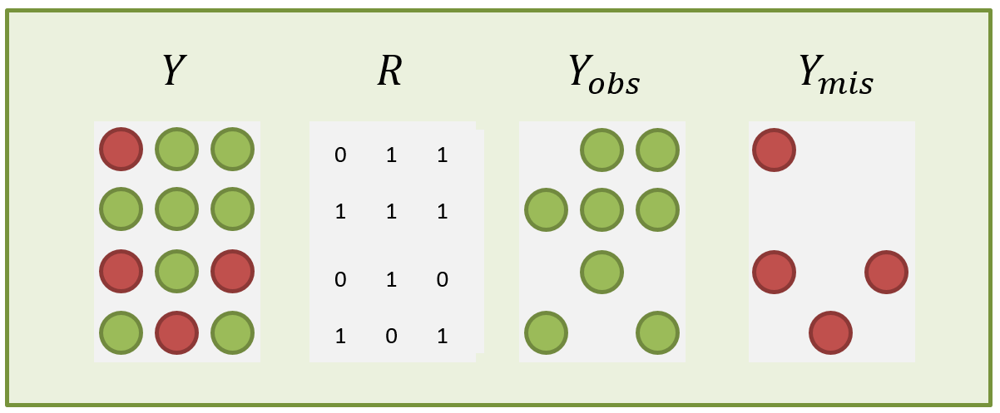

```{r setup, include=FALSE}
library(learnr)
knitr::opts_chunk$set(echo = FALSE)

## required packages for examples - note that RMarkdown, learnr (and RStudio!) are also required.
library("mice")
library("gam")
library("lattice")
library("VIM")
library("tidyverse")

```

{width="75%"}


## Overview  

### Welcome to HDAT9700 Missing Data and Multiple Imputation!

This chapter focuses on the problem of missing data. You will learn the core skills to summarise and analyse an incomplete dataset. 
At the end of this chapter you will be able to

1. Describe patterns of missing data
2. Distinguish between three main missing data mechanisms
3. Implement multiple imputaton, a leading approach to rigourously address missing data 

The reference text for this chapter is "Flexible Imputation of Missing Data" by Stef Van Buuren, which is available through the [UNSW library](https://ebookcentral-proquest-com.wwwproxy1.library.unsw.edu.au/lib/unsw/detail.action?docID=888580).  

Let's get started!  

## The problem of missing data

Missing data are ubiquitous in health research. There are two possible consequences:  

1. The available sample size is reduced, resulting in less-precise estimates.   
2. Estimates may be biased. 

**Issue 1** _can_ be ameliorated by collecting more data. This is not always an option of course, and too much missing data can lead to less precicise estimates.

**Issue 2** is an even bigger problem. Failure to account for the bias introduced through missing data can undermine findings and lead to incorrect conclusions.


## Illustration

Suppose we want to estimate the mean and standard deviation of height (in cm) in a population using a simple random sample of ten observations. We can simulate this scenario by drawing 10 observations from $N(170, 10)$.

```{r 1_1, exercise=FALSE, echo=TRUE}
set.seed(123)  

heights <- sort(rnorm(10,170,10), decreasing = FALSE)  

heights  

```

```{r 1_1a, exercise=FALSE, echo=FALSE}
cat("Sample mean: ", mean(heights, na.rm = TRUE))

cat("Sample standard error: ", sd(heights, na.rm = TRUE)/length(heights[!is.na(heights)]))  
```

***

We can delete some values from the sample to simulate missing data. Notice that with observations 3, 6 and 9 recoded to missing, the sample mean is still close to the population mean, but the standard error of the mean increases: the number of observations is reduced and the sample-based estimate of the mean is less precise.  

```{r 1_2, exercise=FALSE, echo=TRUE}

heights <- replace(heights, c(3,6,9), NA)

heights

```

```{r 1_2a, exercise=FALSE, echo=FALSE}
cat("Sample mean: ", mean(heights, na.rm = TRUE))

cat("Sample standard error: ", sd(heights, na.rm = TRUE)/length(heights[!is.na(heights)]))  
```

***

In the next example, the missing values are concentrated among taller individuals. Notice that the sample mean is biased downwards as a result.


```{r 1_3-setup, exercise=FALSE, echo=FALSE}

set.seed(123)  

heights <- sort(rnorm(10,170,10), decreasing = FALSE) 

```


```{r 1_3, exercise=FALSE, echo=TRUE}

heights <- replace(heights, c(8,9,10), NA)

heights

```

```{r 1_3a, exercise=FALSE, echo=FALSE}
cat("Sample mean: ", mean(heights, na.rm = TRUE))

cat("Sample standard error: ", sd(heights, na.rm = TRUE)/length(heights[!is.na(heights)]))  
```


## Mini Exercice {data-progressive=TRUE}

### Try the exercise below 

In the code below, $p$ is the probability of whether a height observation is observed. $p$ is related to height according to the relationship 
$$p = logit^{-1}(w_{1} \times height + w_{2} \times N(0,1))$$
The weights $w_{1}$ and $w_{2}$ dictate the extent to which the probability of being missing is related to height ($w_{1}$) or is simply random ($w_{2}$). To start, the parameters are set so that there is a strong relationship between height and missingness, with no random component ($w_{1}=1, w_{2}=0$). Explore how the magnitude of bias changes when you vary these parameters. What can you deduce about the relationship between $p$, height and the magnitude of bias?  

```{r 1_3b, exercise=TRUE, eval=FALSE, echo=TRUE, exercise.lines=25}
# Draw 100 random values of height from N(170, 10)
heights <- rnorm(100,170,10) 

# Define a function to calcualte the inverse logit 
invlogit <- function(x) {exp(x)/(1+exp(x))}  

# Define p, the probability of being missing, as a function of height and a random component N(0,1)
p <- invlogit(1*scale(heights) + 0*rnorm(100,0,1))

# Define a missing value vector based on the probabilities in p
missing <- rbinom(100,1,p)

# Define a vector of observed heights
obs_heights <- heights
obs_heights[missing==1] <- NA

# Assess the relationship between height and p
scatter.smooth(heights, p)
print("Correlation between height and p:")
cor(heights, p)

# Calculate the mean of the observed heights
print("Mean of the observed heights:")
mean(obs_heights, na.rm=TRUE)

```

### Discuss

<div class="discuss">

### What have we learned?
What can you deduce about the relationship between $p$, height and the magnitude of bias? 

</div>

### What have we learned?

<div class="thinking">

### Key messages

* Setting $w_{1}$ to 0 produces unbiased estimates of the average height  
* Positive values of $w_{1}$ $\Rightarrow$ taller individuals are more likely to be missing $\Rightarrow$ estimate for average height biased downwards   
* Negative values of $w_{1}$ $\Rightarrow$ shorter individuals are more likely to be missing $\Rightarrow$ estimate for average height biased upwards  

**_Missing data causes bias when the probability of being missing relates to the quantity of interest_**

</div>


## Patterns of missing data

Missing data can arise in many different ways, leading to distinct patterns of missing data in a dataset. Different patterns of missingness can have implications for how we address the missing data problem. It is useful to distinguish between different patterns of missing data:  

**Univariate** Data are missing on a single variable.   
**Multivariate** Data are missing on multiple variables.   
**Monotone** Variables $Y_j$ can be arranged in such a way that that if $Y_j$ is missing then all variables $Y_k$, where $k>j$ are also missing.   
**File matching** Data are taken from different sources, resulting in large blocks of information missing for some individuals.  
**General** Multiple variables have missing data, and the variables can not be ordered monotonically.    


```{r 1_4}
data <- matrix(sample(1:100,4*8*3,replace=TRUE),nrow=8*4,
               dimnames=list(NULL,c("A","B","C")))
data <- as.data.frame(data)
data[c(27,31:32),"A"] <- NA
data[c(15:16,22:24,30,32),"B"] <- NA
data[c(6:8,12:16,17:21,27,29,31),"C"] <- NA
mdpat <- cbind(expand.grid(rec = 8:1, pat = 1:4, var = 1:3), r=as.numeric(as.vector(is.na(data))))
pattern1 <- data[1:8,]
pattern2 <- data[9:16,]
pattern3 <- data[17:24,]
pattern4 <- data[25:32,]

# Figure 4.1 from Van Buuren P96
# http://www.stefvanbuuren.nl/mi/FIMDmaterials/src/fimd4.r.txt
types <-  c("Univariate","Monotone","File matching","General")
tp41 <- levelplot(r~var+rec|as.factor(pat), data=mdpat,
                  as.table=TRUE, aspect="iso",
                  shrink=c(0.9), 
                  col.regions = mdc(1:2, cso="darkseagreen4", csi="darkseagreen2"),
                  colorkey=FALSE,
                  scales=list(draw=FALSE),
                  xlab="", ylab="",
                  between = list(x=1,y=0),
                  strip = strip.custom(bg = "grey95", style = 1,
                                       factor.levels = types))
print(tp41)

```

**Figure 1** Patterns of Missing Data *(Adapted from Van Buuren, Ch4.)*

***

### Unit and Item missing data
We also distinguish between **unit** missing data, whereby all observations on an individual are missing, and **item** missing data whereby some observations are missing and some observations are available. Unit missing data can arise in probability sample surveys when a sampled individual does not participate in the survey. In this case, the sampled unit has missing values on all survey items. In contrast, item missing data arise if, for example, the sampled individual participates but skips some survey questions.  

***

## Quiz 1

### Patterns of Missing Data.

#### Think about the main pattern of missing data that would arise from the following hypothetical scenarios

```{r quiz1, echo=FALSE}
quiz(caption = "Quiz 1: Patterns of Missing Data",
  question("In a longitudinal household study, some study members drop out when they move house and can't be contacted for subsequent waves",
    answer("Univariate"),
    answer("Monotone", correct = TRUE),
    answer("File Matching"),
    answer("General"),
    random_answer_order = TRUE,
    incorrect = "That's not the answer we were looking for. Have another go!",
    allow_retry = TRUE
  ),
  question("Hospital and emergency department data are linked using a unique patient id number. But not every hospital patient has an ED visit, and not every person who visited ED has a hospital admission",
    answer("Univariate"),
    answer("Monotone"),
    answer("File Matching", correct = TRUE),
    answer("General"),
    incorrect = "That's not the answer we were looking for. Have another go!",
    random_answer_order = TRUE,
    allow_retry = TRUE
  ),
  question("Survey participants often get bored and skip some questions",
    answer("Univariate"),
    answer("Monotone"),
    answer("File Matching"),
    answer("General", correct = TRUE),
    random_answer_order = TRUE,
    allow_retry = TRUE
  )
)
```

## Missing Data Mechanisms

The previous section discusses patterns of missing data. It is arguably more important to consider *why* data are missing: the missing data mechanisms. Donald Rubin---the statistician who proposed and developed the theory behind multiple imputation in the 1970s---defined the following taxonomy of three types of missing data.    

**Missing Completely at Random (MCAR)**  
Missing data are said to be MCAR if the probability of being missing is independent of the data value, and the missingness is truly random. This is quite rare, but MCAR mechanisms can arise in practice. For example, if a random sample of a Wave 1 cohort members were chosen for follow-up at wave 2, the mechanism leading to unselected sample members having no data would be MCAR.  

**Missing Not at Random (MNAR)**  
Missing data are said to be MNAR if the probability of being missing depends on the data value. MNAR mechanisms are much more common in practice. For example, in a sample survey of healthcare utilisation, younger people (with fewer healthcare needs) might be more difficult to contact and interview. Unhelpfully, MNAR is also sometimes written as NMAR (Not Missing at Random).

**Missing at Random (MAR)**  
Missing data are said to be MAR if the probability of being missing is independent of the data value, **conditional on the observed data**. To clarify this, consider the first MNAR example above--that younger people are less likely to respond to a survey. Suppose that age is known in advance for sampled individuals (perhaps from the sampling frame, a linked data source or an earlier wave of data collection). If, within categories defined by age, the probability of being missing is independent of the data value then the missing data mechanism is said to be MAR with respect to age.  


<div class="anxiety">

### Confused?

It is worth acknowledging that the names given to these three mechanisms are not particularly helpful; if they seem confusing at first, you are not alone. Nonetheless, the terms MCAR, NMAR and MAR are firmly embedded in the statistical canon so it is unavoidable to learn them.

</div>

*** 

### The missing data mechanism is usually an _assumption_

Sometimes data are missing by design, for example if only a subset of respondents are followed-up, or if a question is only asked to random individuals to reduce response burden. In this scenario, the missing data mechanism is under the control of the researcher. However, usually when we are concerned about missing data it is because the reason for missingness is beyond our control. In this situation, the missing data mechanism is not a property of the data or the study design, but rather, an assumption we must make about the process resulting in unobserved data. In real-world situations, these assumptions are usually untestable but---as we will see---are a cornerstone of the methodological approach to handling missing data. Many formal approaches to handling missing data rely on the assumption that the data are MAR.


## Notation  
To help formalise the theory and analysis of missing data it is useful to introduce some notation.

Let $Y$ represent the desired dataset, an $n \times p$ matrix of $n$ observations on $p$ variables. Observations could be for any unit, such as hospitals or ED admissions, but without loss of generality we will assume we are dealing with people.  

Let $R$ represent a matrix of responses, such that individual elements of $R$, $r_{ij}$, are coded as 1 or 0 depending on whether the corresponding data element $y_{ij}$ is observed ($r_{ij}=1$) or missing ($r_{ij}=0$).  

Denote the observed data by $Y_{obs}$ and the missing data by $Y_{mis}$, such that the complete dataset $Y$ can be partitioned into $Y=(Y_{obs}, Y_{mis})$.

Finally, let $\psi$ (the Greek letter *psi*, pronounced "sigh") denote the parameters of the missing data model, which we write as $Pr(R=0)$.


{width="75%"}


***

Having defined this notation, we can formally express Rubin's taxonomy of missing data mechanisms. In the equations below, pay particular attention to the role of the observed data $Y_{obs}$ and the missing data $Y_{mis}$.

#### **MCAR** Missing Completely at Random  

_**The probability of being missing is independent of the missing data and the observed data**_  

$$Pr(R=0|Y_{obs},Y_{mis},\psi) = Pr(R=0|\psi)$$   


#### **MNAR** Missing Not at Random  

_**The probability of being missing depends on observed and missing data**_

$$Pr(R=0|Y_{obs},Y_{mis},\psi) = Pr(R=0|Y_{obs},Y_{mis},\psi)$$    

#### **MAR** Missing at Random   

_**The probability of being missing depends on observed data, but not on missing data**_ 

$$Pr(R=0|Y_{obs},Y_{mis},\psi) = Pr(R=0|Y_{obs},\psi) $$  

***

<div class="discuss">

### Discuss?

Can you please give an example of a scenario that would give rise to either an MCAR, MAR or MNAR missing data mechanism?

</div>
  


## Quiz 2

### Missing Data Mechanisms

#### What is the principal missing data mechanism in the following hypothetical examples?

```{r quiz2, echo=FALSE}
quiz(caption = "Quiz 2: Missing Data Mechanisms",
  question("In a study on antidepressants, patients with higher scores on a baseline depression and anxiety scale were less likely to return a follow up questionaire",
    answer("Missing Completely at Random (MCAR)"),
    answer("Missing Not at Random (MNAR)"),
    answer("Missing at Random (MAR)", correct = TRUE, message = "The data are MAR with respect to the baseline measure of depression and anxiety"),
    random_answer_order = TRUE,
    allow_retry = TRUE
  ),
  question("In a random sample survey for the first wave of a longitudinal study of ageing, individuals with multimorbidity were less likely to participate",
    answer("Missing Completely at Random (MCAR)"),
    answer("Missing Not at Random (MNAR)", correct = TRUE),
    answer("Missing at Random (MAR)", message = "Health status typically will be unknown at recruitment to the first wave"),
    random_answer_order = TRUE,
    allow_retry = TRUE
  )
)
```

## Recap

#### Let's recap some of the key messages so far

1. Missing data increase variance in estimates.  
2. Missing data can bias an estimate if the probability of being missing is related to the value of the data point.  
3. Many formal approaches to addressing missing data rely on the MAR assumption.  
4. Whether the missing data mechanism is MAR or NMAR depends on whether missingness is related to the observed data only (MAR) or the missing data and the observed data (NMAR)


## Practical 1: Exploring patterns of missing data

In this practical session you will use functions from the R libraries `VIM` and `MICE` to visualise and explore patterns of missing data. The exercises are based on the [sleep](http://science.sciencemag.org/content/194/4266/732/tab-pdf) dataset, a dataframe with sleep habits and other characteristics on 39 mammalian species. Mammals of various size and disposition are included, such as mice, bats, foxes, humans and elephants.

You will learn the functions:

* md.pattern()
* aggr()


#### Exercise 1.1 Load the `VIM` library and the sleep data
```{r exercise1_1, exercise.cap = "Exercise 1.1", exercise=TRUE, exercise.eval=FALSE}
data(XXX , package = "VIM")
```

***

#### Exercise 1.2 Data exploration
```{r exercise1_2, exercise.cap = "Exercise 1.2", exercise=TRUE, exercise.eval=FALSE, exercise.setup = "exercise1.1", exercise.lines=8}
# How many variables are there in the sleep dataset?

# How many observations are there in the sleep dataset?

# What proportion of the data have missing values on one or more variables?

```

```{r exercise1_2-hint-1}
# The function complete.cases() can be used to identify variables with complete cases versus one or more missing values
```

```{r exercise1_2-hint-2}
summary(complete.cases(sleep))
```

***

#### Exercise 1.3 Visualising patterns of missing data
The [`VIM`](https://www.rdocumentation.org/packages/VIM/versions/4.7.0) (**V**isualization and **I**mputation of **M**issing Values) package includes a collection of visualisation techniques for incomplete data. You can read more about `VIM`, and see some examples of visualisations produced by `VIM`, in [this journal article](https://link.springer.com/content/pdf/10.1007%2Fs11634-011-0102-y.pdf).

The [`aggr`](https://www.rdocumentation.org/packages/VIM/versions/4.7.0/topics/aggr) function plots the proportion of missing data for all variables, as well as common patterns of missing data. Run the code below to summarise missing data in the sleep dataset. You'll need to expand on the code to answer all of the questions.
```{r exercise1_3, exercise.cap = "Exercise 1.3",  exercise=TRUE, exercise.eval=FALSE, exercise.setup = "exercise1.1", exercise.lines=14, fig.width=7, fig.height=5}
aggr(sleep)

# What variable has the most missing values?


# What is the missing data pattern observed here?


# Can you edit the code above to sort the variables by the number of missings?


# What proportion of the observations have missing data on all three variables NonD, Dream and Sleep?

```

```{r exercise1_3-hint}
# The arguments sortVars=TRUE and numbers=TRUE will be useful)
```

***

#### Exercise 1.4 Summarising patterns of missing data
The [`md.pattern`](https://www.rdocumentation.org/packages/mice/versions/2.46.0/topics/md.pattern) function from the [`mice`](https://www.rdocumentation.org/packages/mice/versions/2.46.0) (**M**ultivariate **I**mputation by **C**hained **E**quations) package offers another way to summarise patterns of missing data in a dataset. Use the `md.pattern()` function to answer the question below.

```{r exercise1_4, exercise.cap = "Exercise 1.4",  exercise=TRUE, exercise.eval=FALSE, exercise.setup = "exercise1.1", exercise.lines=6}
# How many records in the sleep dataset have missing data on three or more variables?

library("mice")

```

***

#### Exercise 1.5 Visualising incomplete variables
The [`histMiss`](https://www.rdocumentation.org/packages/VIM/versions/4.7.0/topics/histMiss) function from the `VIM` package plots a histogram that includes the proportion of missing values in a variable, and can also plot missing values in one variable by the values of another variable. The variable **NonD** records the hours the mammal spent asleep but not dreaming. Use `histMiss` below to explore missing values on the variable **NonD** with respect to the values of other variables in the dataset.
```{r exercise1_5, exercise.cap = "Exercise 1.5",  exercise=TRUE, exercise.eval=FALSE, exercise.setup = "exercise1.1", exercise.lines=20, fig.width=7, fig.height=7}
# This figure shows that most missing values of nonD occured for values of BodyWgt <1000
# The bar on the right indicates that no values of X were missing
histMiss(sleep[, c("BodyWgt", "NonD")])

# Adapt the code above to explore missing values of NonD with respect to observed
# values of the variables Span, Gest, Pred, Exp and Danger.
# Are there any obvious patterns of missing data?

# The skewed distribution of the variable BodyWgt masks the visualisation.
# Can you think of a recoding that will make the distribution of missing
# values on NonD easier to see with respect to BodyWgt?

```

```{r exercise1_5-hint-1}
# Try the natural log
```

```{r exercise1_5-hint-2}
sleep$lnBodyWgt <- log(sleep$BodyWgt)
histMiss(sleep[, c("lnBodyWgt", "NonD")])
```

***

#### Exercise 1.6 Visualising incomplete variables
The [`marginsplot`](https://www.rdocumentation.org/packages/VIM/versions/4.7.0/topics/marginplot) function from the `VIM` package plots a scatterplot with additional information in the margins.
```{r exercise1_6, exercise.cap = "Exercise 1.6",  exercise=TRUE, exercise.eval=FALSE, exercise.setup = "exercise1.1", exercise.lines=8, fig.width=7, fig.height=7}
# Use the marginplot function to explore patterns of missing data in the dataset
marginplot(sleep[, c("XXX", "XXX")])

```

## Simple approaches to handling missing data

The next few slides review some simple approaches to handling missing data.

One set of approaches is to exclude incomplete records or observations:

* Listwise deletion
* Pairwise deletion

Another set of approaches replaces missing data with some plausible substitute:

* Mean imputation
* Regression imputation
* Stochastic regression imputation
* Predictive mean matching
* Last observation carried forward

## Listwise deletion
Under listwise deletion, all records with any missing data are excluded from the analysis. This approach is also sometimes referred to as (i) casewise deletion and (ii) complete case data

**Pros**

* Convenient
* Produces valid estimates under MCAR mechanisms

**Cons**

* Potentially very wasteful of data


### Illustration

The example below demonstrates that **small proportions of missing data on individual variables can still result in a relatively large proportion of incomplete cases**

Review the results to answer the following questions:
1. What is the range of missing data on individual variables?
2. What is the overall proportion of complete cases?

```{r 2_1, exercise=TRUE, exercise.cap = "Listwise deletion", exercise.eval=FALSE, exercise.lines=14}

# Generate random data
complete <- data.frame(replicate(10,rnorm(100,0,1)))

# Create missing values under a MCAR mechanism
missing <- ampute(complete, prop=0.3, mech="MCAR")

# What proportion of data are missing on individual variables
aggr(missing$amp, sortVars = TRUE)

# What proportion have observed data on all 10 variables?
summary(complete.cases(missing$amp))

```


## Pairwise deletion
* Under pairwise deletion, the mean for each variable and the (co)variance for each pairwise combination of variables is calculated using the maximum amount of data available for each calculation. The resulting mean vectors and variance/covariance matrices can then be passed to analytical methods such as regression or principal components analysis. Pairwise deletion is also referred to as available case analysis.

**Pros**

* Uses all observed data
* Produces valid estimates under MCAR mechanisms

**Cons**

* Estimating standard errors is computationally problematic
* Estimates can be biased if data are not MCAR

### Illustration

The code below generates random data, then deletes some observations under an MCAR missing data mechanism. Next, it compares the number of observations contributing to the correlation matrix under listwise deletion (complete cases) and pairwise deletion (available cases). This is done using the function `corr.test` from the library `psych` which has already been installed in the R environment.

```{r 2_2, exercise=TRUE, exercise.cap = "Pairwise deletion", exercise.eval=FALSE, exercise.lines=20}

# Load the psych library
library("psych")

# Generate random data
complete <- data.frame(replicate(5,rnorm(100,0,1)))

# Create missing values under a MCAR mechanism
missing <- ampute(complete, prop=0.5, mech="MCAR")

# The complete case correlation matrix (listwise deletion)
cor_cc <- corr.test(missing$amp, use="complete")

# The available case correlation matrix (pairwise deletion)
cor_pw <- corr.test(missing$amp, use="pairwise")

cor_cc$n

cor_pw$n


```

<div class="discuss">

### Discuss?
1. How many observations contribute to the correlation matrix under the complete-case analysis?
2. How many observations contribute to the correlation matrix under the pairwise analysis?
3. What is the distinction between complete cases and available cases?

</div>


## Mean imputation
Under mean imputation, all missing values on a variable are replaced with the mean of that variable.

**Pros**

* Fast and convenient
* Allows all cases to be included in analyses
* Yields unbiased estimates of the mean under MCAR

**Cons**

* Underestimates standard errors in the imputed data
* Biases the relationship between variables
* Problematic for categorical variables


```{r 2_3}
data(sleep, package = "VIM")
sleep1 <-sleep[,c("Gest", "Span")]

### impute the mean
imp <- mice(sleep1, method="mean", m=1, maxit=1, printFlag=FALSE)


### Figure 2
lwd <- 1.5
par(mfrow=c(1,2))
breaks <- seq(-100, 700, 100)
nudge <- 1
x <- matrix(c(breaks-nudge, breaks+nudge), ncol=2)
obs <- sleep1[,"Gest"]
mis  <- imp$imp$Gest[,1]
fobs <- c(hist(obs, breaks, plot=FALSE)$counts, 0)
fmis <- c(hist(mis, breaks, plot=FALSE)$counts, 0)
y <- matrix(c(fobs, fmis), ncol=2)
matplot(x, y, type="s",
        col=c("darkseagreen2", "darkseagreen4"), lwd=2, lty=1,
        xlim = c(-100, 700), ylim = c(0,35), yaxs = "i",
        xlab="Gestation",
        ylab="Frequency")
box()

tp <- xyplot(imp, Gest ~ Span, na.groups=ici(imp),
             ylab="Gestation", xlab="Span", col=c("darkseagreen2", "darkseagreen4"),
             cex = 0.75, lex=lwd,
             ylim = c(-100, 700), xlim = c(-10,100))

print(tp, newpage = FALSE, position = c(0.48,0.08,1,0.92))

```

**Figure 3** Mean imputation *(Adapted from Van Buuren, Ch1.)*

Figure 3 above illustrates mean imputation for two variables from the **sleep** dataset: **Gest** and **Span**. Note that _all_ missing values on the variable **Gest** are replaced with the mean gestation time (142 days) and _all_ missing values on the variable span are replaced with the mean life span (19.9 years). This is a straightforward approach, but because of the drawbacks listed above, mean imputation is generally ill-advised, unless the proportion of missing data is very small.

## Regression imputation
Under regression imputation, missing values are replaced with predicted values from a model. The model for the incomplete variable(s) must be estimated using the observed data.

**Pros**

* Produces unbiased estimates of the mean under MCAR
* Can produce unbiased regression estimates if the variables leading to missingness are included in the imputation model

**Cons**

* Underestimates standard errors in the imputed data
* Can bias estimates of correlation between variables included in the imputation model

```{r 2_4}
data(sleep, package = "VIM")
sleep1 <-sleep[,c("Gest", "Span")]

### impute the regression prediction
imp <- mice(sleep1, method="norm.predict", m=1, maxit=1, printFlag=FALSE)

### Figure 4
lwd <- 1.5
par(mfrow=c(1,2))
breaks <- seq(-100, 700, 100)
nudge <- 1
x <- matrix(c(breaks-nudge, breaks+nudge), ncol=2)
obs <- sleep1[,"Gest"]
mis  <- imp$imp$Gest[,1]
fobs <- c(hist(obs, breaks, plot=FALSE)$counts, 0)
fmis <- c(hist(mis, breaks, plot=FALSE)$counts, 0)
y <- matrix(c(fobs, fmis), ncol=2)
matplot(x, y, type="s",
        col=c("darkseagreen2", "darkseagreen4"), lwd=2, lty=1,
        xlim = c(-100, 700), ylim = c(0,35), yaxs = "i",
        xlab="Gestation",
        ylab="Frequency")
box()

tp <- xyplot(imp, Gest ~ Span, na.groups=ici(imp),
             ylab="Gestation", xlab="Span", col=c("darkseagreen2", "darkseagreen4"),
             cex = 0.75, lex=lwd,
             ylim = c(-100, 700), xlim = c(-10,100))

print(tp, newpage = FALSE, position = c(0.48,0.08,1,0.92))

```

**Figure 4** Regression imputation *(Adapted from Van Buuren, Ch1.)*

Note in Figure 4, the imputed values lie along one of two regression lines. Missing values for **Gest** lie on the predicted values from $gest \sim span$ and imputed values for **Span** lie on the predicted values from $span \sim gest$.


## Stochastic regression imputation
Under regression imputation, the imputed values all lay on a regression line, thus underestimating the variability in the data. Stochastic regression imputation overcomes this by adding some random noise to the predictions. This noise is drawn from a random distribution based on the estimated model parameters.

**Pros**

* Produces unbiased estimates of the mean under MCAR
* Can produce unbiased estimates under MAR, i.e. if the variables leading to missingness are included in the imputation model

**Cons**

* Underestimates standard errors in the imputed data
* Can result in imputations outside of the valid range of the data


```{r 2_5}
set.seed(123)
data(sleep, package = "VIM")
sleep1 <-sleep[,c("Gest", "Span")]

### impute the regression prediction
imp <- mice(sleep1, method="norm.nob", m=1, maxit=1, printFlag=FALSE)

### Figure 5
lwd <- 1.5
par(mfrow=c(1,2))
breaks <- seq(-100, 700, 100)
nudge <- 1
x <- matrix(c(breaks-nudge, breaks+nudge), ncol=2)
obs <- sleep1[,"Gest"]
mis  <- imp$imp$Gest[,1]
fobs <- c(hist(obs, breaks, plot=FALSE)$counts, 0)
fmis <- c(hist(mis, breaks, plot=FALSE)$counts, 0)
y <- matrix(c(fobs, fmis), ncol=2)
matplot(x, y, type="s",
        col=c("darkseagreen2", "darkseagreen4"), lwd=2, lty=1,
        xlim = c(-100, 700), ylim = c(0,35), yaxs = "i",
        xlab="Gestation",
        ylab="Frequency")
box()

tp <- xyplot(imp, Gest ~ Span, na.groups=ici(imp),
             ylab="Gestation", xlab="Span", col=c("darkseagreen2", "darkseagreen4"),
             cex = 0.75, lex=lwd,
             ylim = c(-100, 700), xlim = c(-10,100))

print(tp, newpage = FALSE, position = c(0.48,0.08,1,0.92))

```

**Figure 5** Stochasic regression imputation *(Adapted from Van Buuren, Ch1.)*

Note in Figure 5, the imputed values no longer lie exactly on the regression lines; the added noise reflects the variability in the underlying data.


## Predictive Mean Matching
Under predictive mean matching, values from incomplete cases are replaced with observed values from similar complete cases.

* To begin, a linear regression is used to estimate the predicted value of an each incomplete observation.
* Based on this predicted value, a set of candidate observations with similar value are selected.
* From this pool of candidate donors, a single value is selected at random to be imputed for the missing observation

**Pros**

* Imputations are drawn from the observed data so they are always within plausible ranges
* There is no need define a model, therefore the risk of model misspecification is lower

**Cons**

* There is a danger that the same value will be imputed multiple times, especially when there are few complete observations that are similar to the incomplete observations.


## Last Observation Carried Forward
Last Observation Carried Forward (LOCF) is used in the context of longitudinal data. The idea is simple: missing values at time $t$ are replaced with they observed value from time $t-1$.

**Pros**

* Convenient

**Cons**

* Can yield biased estimates

```{r 2_7}
par(mfrow=c(1,1))
Oz <- airquality$Ozone
locf <- function(x) {
  a <- x[1]
  for (i in 2:length(x)) {
    if (is.na(x[i])) x[i] <- a
    else a <- x[i]
  }
  return(x)
}
Ozi <- locf(Oz)
colvec <- ifelse(is.na(Oz),"darkseagreen4", "darkseagreen2")

plot(Ozi[1:80],col=colvec,type="l",xlab="Day number",ylab="Ozone (ppb)")
points(Ozi[1:80],col=colvec,pch=20,cex=1)
```

**Figure 6** Imputation using LOCF *(Adapted from Van Buuren, Ch1.)*


## Practical 2: Comparing simple approaches to handling missing data

In this practical session you will compare some simple  approaches to handling missing data, including listwise deletion, mean and regression imputation. The exercises are based on the [sleep](http://science.sciencemag.org/content/194/4266/732/tab-pdf) dataset.


#### Exercise 2.1 Load the sleep data and examine the first five rows
```{r exercise2_1, exercise.cap = "Exercise 2.1", exercise=TRUE, exercise.eval=FALSE}
data(XXX , package = "VIM")

head(XXX , n= XXX)

```

***

#### Exercise 2.2 The variable NonD contains the number of hours that a mammal slept without dreaming. Calculate the mean and standard error of the mean using **casewise deletion**.
```{r exercise2_2, exercise.cap = "Exercise 2.2", exercise=TRUE, exercise.setup = "exercise2.1", exercise.eval=FALSE, exercise.lines=5}

```

```{r exercise2_2-hint-1}
# The standard error can be calculated by hand, or alternatively many R libraries include convenience functions to return the standard error for the mean of a variable.
```

```{r exercise2_2-hint-2}
# The R library 'psych' includes a nice function called 'describe' whose outputs include the mean and the standard error of the mean.
```

***


#### Exercise 2.3 Calculate the mean and standard error of the variable NonD using **mean imputation** to fill in missing values.
```{r exercise2_3, exercise.cap = "Exercise 2.3", exercise=TRUE, exercise.setup = "exercise2.1", exercise.eval=FALSE, exercise.lines=10}
# Create a copy of the NonD variable
sleep$NonD.mean <- XXX

# Replace missing values with the mean of the observed values
sleep$NonD.mean <- replace(sleep$NonD.mean, XXX, XXX)

```

```{r exercise2_3-hint-1, exercise.eval=FALSE}
sleep$NonD.mean <- replace(sleep$NonD.mean, is.na(sleep$NonD.mean), XXX)
```

```{r exercise2_3-hint-2, exercise.eval=FALSE}
sleep$NonD.mean <- replace(sleep$NonD.mean, is.na(sleep$NonD.mean), mean(sleep$NonD,na.rm=TRUE))
```

***


#### Exercise 2.4 Calculate the mean and standard error of the variable NonD using **regression imputation** to fill in missing values.
```{r exercise2_4, exercise.cap = "Exercise 2.4", exercise=TRUE, exercise.setup = "exercise2.3", exercise.eval=FALSE, exercise.lines=10}

# Fit a model for the complete values of NonD conditional on the fully observed variables
imp.model <- lm(XXX <- XXX , data = XXX)

# Create a copy of the NonD variable
sleep$NonD.reg <- XXX

# Replace missing values with the predicted values from the fitted model
sleep$NonD.reg <- replace(XXX, XXX, XXX)

```

```{r exercise2_4-hint-1, exercise.eval=FALSE}
# Fit a model for the complete values of NonD conditional on the fully observed variables
imp.model <- lm(NonD ~ BodyWgt + BrainWgt + Pred + Exp + Danger, data=sleep)

# Create a copy of the NonD variable


# Replace missing values with the predicted values from the fitted model

```

```{r exercise2_4-hint-2, exercise.eval=FALSE}
# Fit a model for the complete values of NonD conditional on the fully observed variables
imp.model <- lm(NonD ~ BodyWgt + BrainWgt + Pred + Exp + Danger, data=sleep)

# Create a copy of the NonD variable
sleep$NonD.reg <- sleep$NonD

# Replace missing values with the predicted values from the fitted model

```

```{r exercise2_4-hint-3, exercise.eval=FALSE}
# Fit a model for the complete values of NonD conditional on the fully observed variables
imp.model <- lm(NonD ~ BodyWgt + BrainWgt + Pred + Exp + Danger, data=sleep)

# Create a copy of the NonD variable
sleep$NonD.reg <- sleep$NonD

# Replace missing values with the predicted values from the fitted model
sleep$NonD.reg <- replace(sleep$NonD.reg, is.na(sleep$NonD.reg), predict(imp.model, sleep)[is.na(sleep$NonD)])
```

## Multiple Imputation

The simple approaches described in the previous section---mean imputation, regression imputation etc---are examples of *univariate* imputations, whereby missing values are replaced with just one set of plausible values. Analysing the resulting dataset as if the filled-in values were "true" inherently underestimates the uncertainty in the data. Under multiple imputation, values of incomplete variables are imputed several times, resulting in multiple copies of the complete dataset. Analyses are then performed on each individual copy of the incomplete data and the results are pooled. Because the imputations (and therefore the estimated parameters) differ slightly with each version, the uncertainty of the imputed values is captured. The innovative idea to combine multiple sets of imputed values was pioneered by Donald B. Rubin, working with the U.S. Census Bureau in the 1970s. With considerale foresight, Rubin set out a formalised, theoretically-driven methodology, which over the past four decades has become perhaps the most widely accepted approach to handling missing data, with implementations in all major statistical packages.


### Multiple imputation comprises three distinct stages

**1. Imputation**
Missing values are repeatedly filled-in to generate m>1 copies of the completed dataset.

**2. Analysis**
The analysis of interest is performed in each of the m complete datasets

**3. Pooling**
The estimates from each distinct analysis are combined to provide point estimates and standard errors which incorporate the uncertainty of the imputed values.

Figure 5 below depicts these stages in the multiple imputation process for the case where m=3.


**Figure 5** Representation of the multiple imputation process


## Drawing imputations

Many of the simple imputation methods described previously (such as mean or regression imputation) are not suitable for multiple imputation.
**Why is this the case?**

Rather than rely directly on model-based predictions, valid imputations should incorporate two types of uncertainty:
1. **Prediction error** to reflect that the model-based prediction is inherently uncertain.
2. **Parameter uncertainty** to reflect that the parameters of the prediction model themselves are unknown and estimated from the data.

Van Buuren (Chapter 3) provides explicit algorithms for drawing imputations which incorporate both types of missingness.

### Multivariate missing data
When data are missing on one variable only, it is possible to draw imputations using a univariate method, however things are more complex when mutliple variables are incomplete (which is typically the case).

Van Buuren (Chapter 4) outlines three general strategies for drawing imputations for multivariate missing data:

**Monotone Data Imputation**
When the pattern of missing data is monotone, the incomplete variables can be ordered in descending order of completeness, and imputation can proceed by a series of univariate imputations.

**Joint Modelling**
Imputations are drawn from a multivariate model fitted to the data. Typically the multivariate normal distribution is used. Directly drawing from a multivariate distribution is more difficult when variables are non-normal, or when the incomplete data include a mix of categorical and continuous variables.

**Iterative Chained Equations**
Iterative Chained Equations (ICE) involve iteratively cycling through, and drawing from, univariate distributions. This process results in draws from the correct multivariate distribution, thus avoiding the need to specify a multivariate distribution for the model, which---as mentioned---is difficult when the incomplete data include a mix of categorical and continuous variables.

This approach is also referred to as:

* Fully Conditional Specification
* Switching Regressions

Iterative Chained Equations is a very flexible and popular approach to drawing imputations. It will be discussed in more detail later, and will be applied in the final exercise.

## Pooling estimates

In the second stage of multiple imputation, the analysis of interest is repeated on each distinct dataset. This produces $m$ estimates of the parameter of interest, which could be a mean or regression parameter for example. This parameter is denoted $Q$, and its associated variance in each dataset is denoted $U$. Combining information from multiply imputed datasets is straightforward using Rubin's Rules (Rubin, 1987).

### Point estimates (e.g. mean, regression coefficient)
The point estimate for a parameter is simply the average parameter estimate from the $m$ imputed datasets.

$$
\overline{Q} = \frac{1}{m} \sum_{l=1}^{m} \hat{Q}_l
$$

### Variance
The total variance for the estimate $Q$ is $T$ and combines three sources of information (van Buuren p38):

1. $\overline{U}$, the variance caused by the fact that we are taking a sample rather than observing the entire population. This is the conventional statistical measure of variability. $\overline{U}$ is defined as the average variance across the $m$ imputed datasets.

$$
\overline{U} = \frac{1}{m} \sum_{l=1}^{m} \hat{U}_l
$$

2. $B$, the between-imputation variance caused by the fact that there are missing values in the sample. $B$ is calculated as
$$
B = \frac{1}{m-1} \sum_{l=1}^{m} (\hat{Q}_l - \overline{Q})^2
$$

3. $B/m$, the extra simulation variance caused by the fact that $\overline{Q}$ itself is estimated for finite $m$.


Finally, the total variance $T$ associated with $Q$ is given by
$$
T = \overline{U} + B + \frac{B}{m}
$$
<div class="discuss">

### Discuss?
Thinking in terms of $m$ (the number of imputations) and $B$ (the between-imputation variance), when will the total variance $T$ be minimised?

</div>


## How many imputed datasets?
When performing multiple imputation the number of imputed datasets $m$ must be chosen by the analyst.

There are different guidelines about how many imputations are necessary. Originally, as few as five were suggested as adequate (Rubin, 1987), a guideline based on the efficiency of the parameter estimate, which does not rise substantially when $m$ is increased beyond this.

More recently, others have argued that efficiency is not the only consideration, and simulations have illustrated that important quantities such as p-values can vary substantially across independent replications when $m$ is low. In practice this means that when the number of imputed datasets is small two different analysts may get noticeably different results even when imputing the same dataset with the same imputation model (assuming they are using different random seeds). To distinguish from other sources of error this variation is termed Monte Carlo variability or simulation error.

As a rule of thumb, White et al. (2011) suggest that $m$ should be approximately equal to the percentage of cases that are incomplete. So if 20% of the data were incomplete, we would use $m=20$. van Buuren makes the practical suggestion to use $m=5$ for model building and increase afterwards as required.

## What variables should be included in the imputation model?
White et al (2011) offer the following advice on which variables to include in the imputation model:

**1. Covariates from the analysis model**
This also includes any interactions present in the analysis model. Additionally, analysis model variables should be included in the correct functional form, for example if age features in the analysis model as a quadratic term then the quadratic term should also be included in the imputation model.

**2. The outcome from the analysis model**
The dependent variable of interest from the analysis model (your outcome), can and should be included to help impute values of incomplete independent variables.

**3. Predictors related to the incomplete variable(s) and *ideally* to the probability of being missing**
Including predictors related to both the incomplete variables and the probability of being missing should improve the plausibility of the MAR assumption and result in bias reduction. Predictors related to the imputed variables only can improve the quality of predictions, thus reducing the standard error of the analysis model outputs.

## Iterative Chained Equations
Iterative Chained Equations (ICE) is a flexible approach used to draw multiple imputations from intractable multivariate distributions. Such distributions often arise in practice, i.e. when incomplete variables have unusual distributions and/or are of different types (continuous/categorical/ordinal/binary).

In brief, the ICE algorithm achieves draws from a multivariate distribution by iteratively drawing from univariate distributions for each incomplete variable.

### The ICE algorithm
1. Initialise the process by filling in all missing values using some simple method;

2. Fit a model for the most complete variable $X_{1}$, using all remaining variables $X_{2} \text{--} X_{n}$ as predictors;
$$
X_{1}^{0} \sim X_{2}^{0} + X_{3}^{0} \ldots + X_{n}^{0}
$$

3. Impute missing values of $X_{1}$ based on this fitted model;

4. Fit a model for $X_{2}$ based on the updated variable $X_{1}$ and the remaining variables $X_{3} \text{--} X_{n}$;
$$
X_{2}^{0} \sim X_{1}^{1} + X_{3}^{0} \ldots + X_{n}^{0}
$$
5. Impute missing values of $X_{1}$ based on this fitted model;

6. Continue in this way until all the variables have been imputed once (this constitutes one **cycle** of the algorithm;
$$
X_{n}^{0} \sim X_{1}^{1} + X_{2}^{1} \ldots + X_{n-1}^{1}
$$

7. Iterate for a set number of cycles, taking the last set of updated values as one set of imputations. The imputed values should converge to draws from the correct multivariate distribution;

8. Iterate steps 1-7 $m$ times to create $m$ sets of imputed values.


### How many cycles
As with the number of imputed datasets $m$, the number of cycles used in the ICE algorithm must be specified by the analyst. A surprisingly small number of cycles are needed to reach convergence, e.g. 10-20. An important visual diagnostic check is to examine parameter estimates by cycle number---known as a trace plot---to ensure that the estimates have stabilised.

### Tailoring the imputation model
An attractive feature of ICE is that it is possible to tailor the imputation model for individual variables. This can be done in several ways:

* It is possible to specify the appropriate model type for each variable (logistic for binary outcomes; multinomial logistic for categorical outcomes etc).

* If desired, the model predictors can also be personalised for each individual incomplete variable. This flexibility allows the user to adapt the imputation model to reflect different missing data mechanisms for different variables---gestational age might be useful in the imputation model for birthweight but not useful to predict missing values of paternal age, for example.

* Passive imputation allows you to impute variables based on existing imputed values in a single cycle of ICE. This allows for consistency, for example if BMI was included in the analysis model it is possible to impute BMI passively from imputed values of height and weight.

* Conditional imputation allows you to restrict imputations to certain categories. For example, imputations for a binary indicator of testicular cancer could be restricted to men only.


## The MICE package

This section will demonstrate the `MICE` package, which implements **M**ultiple **I**mputation by **C**hained **E**quations in R. Developed by Stef van Buuren, `MICE` is a very flexible package that implements a range of imputation models.

***

In this demonstration we will return to the sleep dataset. We can use the `md.pattern()` function to review the pattern of missing data.
``` {r demo1, exercise=FALSE, echo=TRUE, fig.height=9, fig.width=9}
library("mice")
library("VIM")
data(sleep,package="VIM")
md.pattern(sleep)
```
We can see that 42 records are fully observed; five variables are complete, and five variables are incomplete. The highest number of missing observations is for the variable **NonD** (Hours spent not dreaming) which has 14 missing observations.

To impute the missing values we can use the `mice()` function:
```{r demo2, exercise=FALSE, echo=TRUE, results='hide', warning=FALSE}
imp1 <- mice(sleep, seed=8102)
```

The `mice()` function returns an object of class `mids` (multiply imputed dataset), which above has been assigned to **imp1**. We can summarise **imp1** to learn more about the default parameters used when we called `mice()`.

```{r demo3, exercise=FALSE, echo=TRUE}
summary(imp1)
```

**Note**

* The default number of imputed datasets is 5
* The univariate imputation method for each of the five incomplete variables was **pmm** (predictive mean matching)
* The predictor matrix shows which variables were included as predictors for each univariate model. Here, all other variables have been used.

Later we will see how these default parameters can be customised by the analyst.


We can use the `complete` function to view the original and imputed data. Below we have printed the first five rows of (i) the incomplete data, (ii) the first imputed dataset and (iii) the second imputed dataset. Note that the *NA*s from the incomplete data have been replaced with plausible data values in the first two imputed datasets. The actual imputed values will of course differ across the imputed datasets.
```{r demo4, exercise=FALSE, echo=TRUE}
mice::complete(imp1,0)[1:5,]

mice::complete(imp1,1)[1:5,]

mice::complete(imp1,2)[1:5,]
```

### Visualising imputations

The `MICE` package includes several functions to help visualise imputations. Below we use the `stripplot()` function to examine the observed and imputed data for the five incomplete variables. This helps us check if any unusual values have been imputed. In this case, because the default univariate imputation method for continuous variables is **PMM**, the imputed values all correspond to existing data points.
```{r demo5, exercise=FALSE, echo=TRUE, out.width='100%'}
stripplot(imp1, NonD+Dream+Sleep+Span+Gest~.imp)
```

A very important diagnostic graph to examine is the _trace plot_. The trace plot is simply the value of an estimate plotted at each cycle of the `MICE` algorithm, producing a different line for each imputed dataset. Any estimate can be plotted but by default the `plot()` function shows the trace plot of the mean and SD for the imputed values of each incomplete variable. The trace plot is used to detect non-convergence of the `MICE` algorithm. The plotted lines from each imputation should "mix well", i.e. they should move up and down the parameter space without any patterns or trends.

Let's examine the trace plot for the most incomplete variable, **NonD**

```{r demo6a, exercise=FALSE, echo=TRUE, out.width='100%'}
plot(imp1, "NonD", layout = c(2, 1))
```
This doesn't look good. The trace lines from the five different sets of imputations are not mixing well. This indicates that there may be problems with the algorithm, such as non-convergence.

Let's explore this further. To examine relationships between variables we can use the `xyplot()` function. This is useful to check whether the imputed values have preserved existing relationships in the observed data.  Below we examine the relationship between the variables **NonD** (Hours asleep not dreaming) and **Gest** (gestation in days).

```{r demo6, exercise=FALSE, echo=TRUE, out.width='100%'}
xyplot(imp1, NonD~Gest, xlab="Gestation (days)", ylab="Hours spent dreaming")
```

Here we can see that the relationship between **Gest** and the imputed values of **NonD** depart from the observed data relationship. This is particularly true for imputed values of **NonD** at higher levels of **Gest**.


### Changing the univariate modelling method

Let's try a different choice of univariate imputation model for **NonD** to see if we can get better imputations that preserve the relationship between **NonD** and **Gest**. A quick way to specify the univariate method(s) is to edit the existing method vector. Below we edit the method vector from the previous imputation output, selecting **quadratic** for **NonD**. Using a quadratic model here may help to capture the nonlinear relationship betweeen gestation and hours asleep not dreaming variables.

```{r demo7, exercise=FALSE, echo=TRUE}
meth1 <- imp1$method
meth2 <- meth1
meth2["NonD"] <- "quadratic"

# Compare the two method vectors
meth1
meth2
```

Now lets impute again, specifying our new personalised method vector with the `method=` option.
```{r demo8, exercise=FALSE, echo=TRUE, results='hide', warning=FALSE}
imp2 <- mice(sleep, method=meth2, seed=8102)
```
Now, let's re-examine the relationship between **NonD** and **Gest** under this new imputation model.
```{r demo9, exercise=FALSE, echo=TRUE, out.width='100%'}
xyplot(imp2, NonD~Gest, xlab="Gestation (days)", ylab="Hours spent dreaming")
```
This looks a bit better. By modelling the variable **NonD** using a **quadratic** model, rather than **pmm**, the imputed values better reflect the non-linear relationship between NonD and other variables.

### Passive imputation
We often work with variables which are derived from two or more other variables. An example is Body Mass Index (BMI) which is a function of height and weight: $BMI = {weight \over height^2}$
When imputing such variables we would like to preserve the relationship between height, weight and BMI. If all three variables were imputed, the resulting values of BMI would not neccessarily equal weight divided by height squared. To maintain the desired relationship, we can first impute values of the underlying variables (height and weight) and then use these imputed variables to derive BMI. This is called _passive imputation_.

In the **sleep** dataset, there are missing values on three inter-related variables: **NonD**, **Dream** and **Sleep**. The sum of hours dreaming and hours not dreaming should of course add up to the total number of hours asleep, i.e. we want to preserve the relationship:
$$
NonD=Sleep-Dream
$$
We can see in the previous imputations that this is not neccessarily the case when we examine the first few rows of the first imputed dataset:

```{r demo10, exercise=FALSE, echo=TRUE}
mice::complete(imp2,1)[1:5,]
```

To impute passively, we must first customise the univariate models to remove **NonD** as a predictor variable from the models **Sleep** and **Dream**. This is to avoid circularity, because we will impute values of **NonD** passively from the values of **Sleep** and **Dream**.

By default, all variables are included as predictors for each incomplete variable. The `mice()` function stores this information in a matrix named **predictorMatrix**:
```{r demo11, exercise=FALSE, echo=TRUE}
imp2$predictorMatrix
```

We can customise this matrix, to remove **NonD** from the list of predictor variables for **Dream** and **Sleep**.
```{r demo12, exercise=FALSE, echo=TRUE}
predmatnew <- imp2$predictorMatrix
predmatnew[c("Dream", "Sleep"), "NonD"] <-0
predmatnew
```
Note that comparing the default prediction matrix to **predmatnew**, **NonD** is marked as a 0 in the rows for **Dream** and **Sleep**.

The second step is to specify the formula for the passive imputation in the methods vector. To indicate the method as passive imputation we use the syntax `~I(formula)`. For example, to passively impute BMI from weight and height we would specify the method for BMI as `~I(weight/height^2)`. Lets customise the method to passively impute **NonD** = **Sleep** + **Dream**.

```{r demo13, exercise=FALSE, echo=TRUE}
meth3 <- meth2
meth3["NonD"] <- "~I(Sleep-Dream)"
meth3
```

We can now rerun the imputation, calling the customised predictor matrix and method vector.
```{r demo14, exercise=FALSE, echo=TRUE, results='hide', warning=FALSE}
imp3 <- mice(sleep, predictorMatrix = predmatnew, method = meth3, visitSequence = "monotone", seed=8102)
mice::complete(imp3,1)[1:5,]
```

Now when we examine the imputed data values, the number of hours dreaming and non dreaming corresponds to the total number of hours asleep.
```{r demo15, exercise=FALSE, echo=TRUE}
mice::complete(imp3,1)[1:5,]
```

Let's examine the trace plots for this imputation.
```{r demo16, exercise=FALSE, echo=TRUE, out.width='100%'}
plot(imp3, "NonD", layout = c(2, 1))
```
This looks much better than what we saw previously. The lines from the individual imputations are overlapping, and we can be more confident that the `MICE` algorithm has converged to a stationary distribution.

### Modelling multiply imputed data
Recall the three stages of multiple imputation analysis:

* Imputation
* Analysis in parallel
* Pooling estimates

So far we have focussed on Step 1---imputation. Now that we have a set of imputed datasets it is time to fit some models. The `MICE` package contains the `with()` function which allows us to analyse complete datasets. The `with()` function takes as its argument a `mids` object (i.e. the output of the `mice()` function) and an expression corresponding to the desired model to be estimated in each imputed dataset.

We would fit the simple model $Dream = \beta_{0} +\beta_{1}Pred_{2} + \beta_{2}Pred_{3} + \beta_{3}Pred_{4} + \beta_{4}Pred_{5}$ as follows:

```{r demo17, exercise=FALSE, echo=TRUE}
mod1 <- with(imp3, exp=lm(Dream ~ factor(Pred)))
mod1
```

As you can see, the model has been estimated five times---once in each imputed dataset. The parameter estimates are slightly different in each model, reflecting the variation introduced through imputation. The output of the `with()` function is an object of class `mira` (**m**ultiple **i**mputation **r**epeated **a**nalyses) The final step of the multiple imputation analysis is to pool these estimates using Rubin's Rules, as discussed previously. To do this we use the `pool()` function from the `MICE` package. The `pool()` function takes an object of class `mira` as its argument.

```{r demo18, exercise=FALSE, echo=TRUE, results='hide', warning=FALSE}
out1 <- pool(mod1)
```

The output of the `pool()` function is an object of class `mipo` (**m**ultiple **i**mputation **p**ooled **o**utcome). We can summarise this object to access summary statistics for the pooled analysis.

```{r demo19, exercise=FALSE, echo=TRUE, results='hide', warning=FALSE}
summary(out1)
```


### Further learning
The section has briefly demonstrated the `MICE` package, but there is much more to learn. Below are some useful resources to help you in future real-world applications.

* [Detailed documentation](https://www.rdocumentation.org/packages/mice/)
* [A series of vignettes](https://gerkovink.github.io/miceVignettes/)
* [Book (Flexible imputation of Missing Data by Stef Van Buuren)](https://ebookcentral-proquest-com.wwwproxy1.library.unsw.edu.au/lib/unsw/detail.action?docID=888580)


## Practical 3: Applying Multiple Imputation {data-progressive=TRUE}

Now its your turn to get hands on with the `MICE` package. In this practical session you will be analysing the `nhanes2` dataset. NHANES is the National Health and Nutrition Examination Survey, and `nhanes2` is a small  subset supplied with the `MICE` package. Included are 25 observations on four variables: Age, BMI, hypertensive status, and serum cholesterol. Below is a snapshot of the data.
```{r exercise3_0,  exercise=FALSE, echo=FALSE}
head(nhanes2, n=4)
```
Your goal is to fit the model $chl \sim age + hyp + bmi + bmi^{2}$, using multiple imputation to analyse all the available data. To do this you will perform the three main steps of the multiple imputation process---impute, analyse and pool---and the corresponding `MICE` functions:

1. `mice()` to generate imputations
2. `with()` to analyses imputed datasets in parallel
3. `pool()` to combine estimates

You will use visualisation functions to examine the imputed values. This could include the functions discussed in the previous demo: `plot()`, `stripplot()` and `xyplot()`; you can also explore other available visualisations described in the `MICE` [documentation](https://www.rdocumentation.org/packages/mice/versions/3.1.0).

*_Let's get started!_*

***

### Exercise 3.1 Familiarise yourself with the NHANES data. What is the pattern of missing values? Which variables are incomplete? What proportion of the dataset is fully observed?

```{r exercise3_1, exercise.cap = "Exercise 3.1(of 8)", exercise=TRUE, exercise.eval=FALSE, exercise.lines=10}

# Explore the nhanes2 dataset
library("mice")
head(nhanes2)
```

```{r exercise3_1-hint-1}
# Useful commands to explore the dataset include head() nrow(), ncol(), summary()
# Useful commands to explore the pattern of missing data include md.pattern(), ncc(), nic(), cci() and ici()
```

***

### Exercise 3.2 How does missingness vary by age group?
```{r exercise3_2, exercise.cap = "Exercise 3.2(of 8)", exercise=TRUE, exercise.eval=FALSE, exercise.lines=10}

```

```{r exercise3_2-hint-1}
## The function cci from the mice package might be useful
```

```{r exercise3_2-hint-2}
table(nhanes2$age, cci(nhanes2))
```

### Exercise 3.3 Impute missing values in NHANES using multiple imputation. Examine the traceplot to check for chain convergence.
```{r exercise3_3, exercise.cap = "Exercise 3.3(of 8)", exercise=TRUE, exercise.eval=FALSE, exercise.lines=10}

```

```{r exercise3_3-hint-1}
# Use the mice() to impute. Use plot() to examine the chains.
```

```{r exercise3_3-hint-2}
imp1 <- mice(nhanes2)
plot(imp1)
```


### Exercise 3.4 Explore the chain convergence when you increase the chain length (i.e. the number of iterations)
```{r exercise3_4, exercise.cap = "Exercise 3.4(of 8)", exercise=TRUE, exercise.eval=FALSE, exercise.lines=10}


```

```{r exercise3_4-hint-1}
# Use the maxit= option to specify the chain length.
```

```{r exercise3_4-hint-2}
imp2 <- mice(nhanes2, maxit=25)
plot(imp2)
```

### Exercise 3.5 Explore the imputed values. Are there any unusual imputations?
```{r exercise3_5, exercise.cap = "Exercise 3.5(of 8)", exercise=TRUE, exercise.eval=FALSE, exercise.lines=10}
imp1 <- mice(nhanes2)

```
```{r exercise3_5-hint-1}
# use mice::complete() to examine the imputed datasets
# Visualise imputations using stripplot(), xyplot(), bwplot() etc
```

### Exercise 3.6 Use passive imputation to impute the variable bmi-squared
```{r exercise3_6, exercise.cap = "Exercise 3.6(of 8)", exercise=TRUE, exercise.eval=FALSE, exercise.lines=20}


```

```{r exercise3_6-hint-1}
# First create the bmi^2 data using the observed data. Run a dummy imputation to get the initial methods vector and predictor matrix, then edit these to impute passively
```

```{r exercise3_6-hint-2, exercise.lines=20}
# Create the variable bmi^2

# Run a dummy imputation

# Edit the imputation vector to passively impute bmi^2


# Edit the predictor matrix to remove bmi^2 from the predictors for bmi


# Rerun the imputation with the customised methods vector and predictor matrix
```

```{r exercise3_6-hint-3, exercise.lines=20}
# Create the variable bmi^2
nhanes2$bmisq <- nhanes2$bmi*nhanes2$bmi

# Run a dummy imputation
ini <- mice(nhanes2)

# Edit the imputation vector to passively impute bmi^2
meth <- ini$method
meth["bmisq"] <- "~I(bmi*bmi)"

# Edit the predictor matrix to remove bmi^2 from the predictors for bmi
pred<-ini$predictorMatrix
pred["bmi", "bmisq"] <- 0

# Rerun the imputation with the customised methods vector and predictor matrix
imp4 <- mice(nhanes2, method=meth, predictorMatrix=pred)
summary(imp4)
```


```{r exercise3_7-setup, echo=FALSE, results=FALSE}
# Create the variable bmi^2
nhanes2$bmisq <- nhanes2$bmi*nhanes2$bmi

# Run a dummy imputation
ini <- mice(nhanes2)

# Edit the imputation vector to passively impute bmi^2
meth <- ini$method
meth["bmisq"] <- "~I(bmi*bmi)"

# Edit the predictor matrix to remove bmi^2 from the predictors for bmi
pred<-ini$predictorMatrix
pred["bmi", "bmisq"] <- 0

# Rerun the imputation with the customised methods vector and predictor matrix
imp4 <- mice(nhanes2, method=meth, predictorMatrix=pred)
summary(imp4)
```

### Exercise 3.7 Fit the model of interest in each imputed dataset
Recall the model of interest is $chl \sim age + hyp + bmi + bmi^{2}$
This exercise space has been preloaded with the solution to the previous exercise: a `mids` object named **imp4**.
Alternatively you can use your own solution from the previous exercise, but you will have to rerun your code below
```{r exercise3_7, exercise.cap = "Exercise 3.7(of 8)", exercise=TRUE, exercise.eval=FALSE, exercise.lines=10}
is.mids(imp4)
```
```{r exercise3_7-hint-1}
# Use the function with()
```
```{r exercise3_7-hint-2}
# mod1 <- with(imp4, exp=lm(chl~age+hyp+bmi+bmisq))
```

```{r exercise3_8-setup, echo=FALSE, results=FALSE}
# Create the variable bmi^2
nhanes2$bmisq <- nhanes2$bmi*nhanes2$bmi

# Run a dummy imputation
ini <- mice(nhanes2)

# Edit the imputation vector to passively impute bmi^2
meth <- ini$method
meth["bmisq"] <- "~I(bmi*bmi)"

# Edit the predictor matrix to remove bmi^2 from the predictors for bmi
pred<-ini$predictorMatrix
pred["bmi", "bmisq"] <- 0

# Rerun the imputation with the customised methods vector and predictor matrix
imp4 <- mice(nhanes2, method=meth, predictorMatrix=pred)
mod1 <- with(imp4, exp=lm(chl~age+hyp+bmi+bmisq))
```

### Exercise 3.8 Pool the model estimates. How does the MI model compare to the complete cases model?
This exercise space has been preloaded with the solution to the previous exercise: a `mira` object named **mod1**.
Alternatively you can use your own solution, but you will have to rerun your code below
```{r exercise3_8, exercise.cap = "Exercise 3.8(of 8)", exercise=TRUE, exercise.eval=FALSE, exercise.lines=10}
is.mira(mod1)
```

```{r exercise3_8-hint-1}
# Use the function pool()
```
```{r exercise3_8-hint-2}
# pool(mod1)
```
