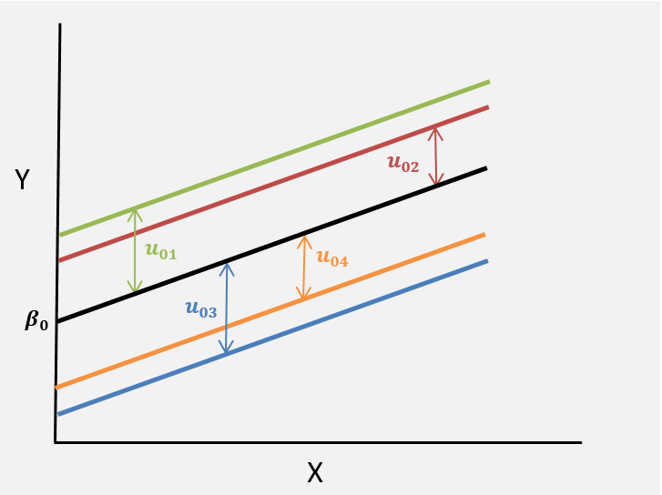

{width="75%"}

```{r setup, include=FALSE}
knitr::opts_chunk$set(echo = FALSE)

library(learnr)
library(tidyverse)
library(epiDisplay)
library(dplyr)    
library(ggplot2)  
library(lme4)     
library(lattice)
library(nlme)
library(sjPlot)
library(sjmisc)
library(HLMdiag)


birwt.dat <- read.csv("data/smoking_data.csv", header=T) %>% 
  mutate(birwtc = (birwt-mean(birwt))/sd(birwt), magec = (mage-mean(mage))/sd(mage))
```


## Overview  
Welcome to HDAT9700 Statistical Modelling II - Multilevel Modelling part I! 

This chapter introduces multilevel modelling---a statistical approach to analyse grouped or clustered data. You will cover:

* Multilevel structures
* Multilevel research questions
* Multilevel notation
* Variance components models    
* Random intercept models  
* Random slope models  

A case study focusing on birth weight is used throughout for illustration.

***

### Core reading:

The reference text for this chapter is [A Primer on Using Multilevel Models in Clinical and Experimental Psychopathology Research by Andy Field and Daniel Wright, Journal of Experimental Psychopathology 2(2) 2011](https://journals.sagepub.com/doi/abs/10.5127/jep.013711).

### Additional reading: 

Blance (2012) Chapter 5 Multilevel Modelling _in_ Modern Methods for Epidemiology by Yu-Kang and Greenwood (eds)
The text is available online [here](https://link.springer.com/chapter/10.1007/978-94-007-3024-3_5).


## Multilevel contexts

Health systems often have a complex structure, with factors at different levels influencing health outcomes. For example, the success of a surgery may depend on the patients' own health status but may also be influenced by characteristics of their surgeon, the hospital they are attending or the environment or country that they are living in. 

Many real-world datasets will exhibit this complex structure. This can because the natural complexity of the system has been successfully captured in the data, for example, population-level administrative datasets which record information on patients who attend many different hospitals, as well as information on the hospitals. Complexity can also be the captured by the methodology used to collect the data, such as sample surveys with two or more sample stages at different levels. Rather than sample 1,000 patients at random from the population, one could sample 20 GPs from a GP registry, and then sample 50 patients for each GP. The resulting dataset comprises patients who are nested or clustered within GPs. (This methodological approach has a practical advantage: if recruiting patients through GPs, it is administratively simpler to handle a smaller number of GP clinics than a different GP clinic for each individual in the study. This approach also has an analytical advantage. Recording data for multiple lower level units within each higher level unit makes it possible to study the different levels of a complex system, for such as how characteristics at the level of the GP may affect outcomes at the level of the patient.)         


Data exhibiting complex structure with factors operating at different levels are referred to as **multilevel** data. In general we consider three broad multilevel structures:  

1. Hierarchical 
2. Multiple membership
3. Cross-classified


### Hierarchical data structures 

Hierarchical data structures arise when lower level units are nested or clustered within higher level units. Examples of a two-level hierarchical data structure include:

1. Patients nested within hospitals
2. Observations nested within patients. 

***

#### A two level hierarchy: patients (level 1) nested within hospitals (level 2) 
{width="75%"}

***

#### A two level hierarchy: repeated observations (level 1) nested within patients (level 2)
{width="75%"}

***

Note that, in the first example, patient is the lower level unit whereas in the second example patient is the higher level or grouping unit. The choice of higher or lower levels depends on the nature of the data and the research question at hand.  

Hierarchical data structures needn't be limited to two levels. We could have three level hierarchies, such as patients nested within hospitals which are in turn nested within within regions. An example of a four level hierarchy would be repeat observations from patients, who are clustered within hospitals which are in turn nested within regions.  

***

#### A three level hierarchy: patients (level 1) nested within hospitals (level 2) nested within areas (level 3)
{width="75%"}

***

### Multiple membership data structures
The previous examples deal with strict hierarchies: lower level units belong to one higher level unit only. Real life data and applications can be more complicated of course. Multiple membership data arise when lower level units are members of multiple higher level units. Examples of multiple membership data structures include: 

1. Patients attending multiple hospitals
2. Consultants employed by multiple health districts

***

#### Multiple membership: patients (level 1) attend multiple hospitals (level 2)
{width="75%"}

### Cross-classified data structures

Cross-classified data structures arise when lower level units lie within a cross-classification of multiple higher level units. An example of this is the cross-classification of patients within hospitals and areas. People from the same area will attend different hospitals and people attending the same hospital will come from different areas. 

*** 

#### Cross-classification: Patients (level 1) lie within a cross-classification of areas and hospitals.   
{width="75%"}

***

## Challenges

Analysing data with a multilevel structure presents a challenge because lower level units clustered within the same higher-level unit are likely to have share some common characteristics.  

* Patients attending a public hospital may be more similar than patients attending a private hospital  
* Repeat observations taken from the same individual may be more similar compared to an observation from a different individual  
* Surgeries performed by the same surgeon may have more similar results compared to a different surgeon  
* Children from the same family have a more similar risk of cystic fybrosis compared to children from different families 

### A challenge?
This similarity between observations from the same higher level unit is refered to as **dependency**. Dependency violates a key assumption of (generalised) linear models: observations should be independent. By ignoring dependency, we falsely inflate the number of independent observations available in the data and as a consequence, model-based estimates will be overly confident (i.e. standard errors are too small and confidence intervals are too narrow).

Various options are available to address dependency between higher level units:

**1. Ignore it**  
This can be a valid option if the dependency is very low (but generally it is not a good idea). More later on what counts as a "low" dependency

**2. Adjust standard errors**  
Standard error calculations can be adjusted to account for the clustering of similar lower-level units within higher level units.  

**3. Add fixed effects for each category of the higher level**  
It is possible to control for a higher level variable by including a dummy for each category of the higher level in a statistical model. This is referred to as a **fixed effects** model. This can be reasonable if there is a small number of higher level units which are distinct from each other. For example, if our data comprised patients clustered within the eight local health districts (LHDs) in New South Wales, we could control for dependency between by the LHDs including a dummy variable for each district in the model.

This approach has a few downsides:  

* It is not possible to control for characteristics of the higher level variable(s) (e.g. LHD level statistics).
* There is an additional model parameter for each category of the higher level, so this becomes an issue if there are a large number of categories, especially if some categories are sparse.

**4. Control for higher level variables**
It is possible to control for higher-level variables in a single-level model. However, this approach focuses on variation within higher level units; variation between higher level units is still ignored.


### An opportunity?

The approaches outlined above treat the clustering inherent to many datasets as _a nuisance_ to be dealt with. However, often we are explicitly interested in understanding the roles of factors at different levels, and the relationships between them. From this perspective, multilevel data offers _an opportunity_ to understand complex structures and answer research questions about factors operating at different levels. **Multilevel modelling** is a methodological approach for modelling hierarchical data structures. This approach overcomes the drawbacks of the approaches which treat clustering as a nuisance. With multilevel modelling, we can:   

* Correct for the dependency caused by the clustering of similar lower level units within higher level units  
* Understand the relationship between higher level characteristics and lower-level outcomes  
* Explicitly model the variation between higher level groups and within higher level groups 

<div class="aside">

### A model by any other name...
Multilevel models are also referred to as:  

* Hierarchical linear models (especially in the USA)  
* Mixed effects models  
* Random effects models

</div>


## Opportunities 

### Multilevel propositions

Multilevel data with a two-level hierarchy allow us to pose three kinds of propositions:

1. Propositions about lower level factors  
For example, "elderly patients are more likely to pick up an infection in hospital"


2. Propostions about higher levels factors  
For example, Hospital-acquired infections are lower in hospitals with well-funded hygiene service departments 


3. Propositions about interactions between higher level and lower level factors  
For example, Elderly patients are at a lower risk of infection in well-funded hospitals


### Multilevel research questions

Multilevel modelling is a very popular method that is used to address thousands of applied reaserch questions annually, in health research and many other domains. Examples of some recent questions addressed using multilevel modelling include  

* Is the risk of developing Alzheimer's disease really higher in rural areas? [(Astell-urt and Feng 2018)](https://doi.org/10.1016/j.healthplace.2018.09.003)

* What hospital- and patient-level factors predict agreement between self-report and administrative records of morbidity. [(Lujic et al 2014)](http://dx.doi.org/10.1136/bmjopen-2014-005768)

* How does ethnicity and occupation influence residential segregation in Sydney [(Jones et al 2017)](https://doi.org/10.1177/0042098017730239)


## Visualising MLMs {data-progressive=TRUE}

Multilevel models can be viewed as an extension of general linear regression so, to start, consider two continuous variables, X and Y. 

{width="75%"}


### Adding a line

We can fit a straight line to our data. The model has the familiar form

$$
y_{i} = \beta_{0} + \beta_{1}x_{i} + e_{i}
$$
{width="75%"}

### Multilevel data
But what if our individual data points are grouped according to some higher level unit, for example patients nested within hosptitals? In the scatterplot below, imagine that each point represents a patient and that the colours indicated different hospitals. So all patients represented by green points attended the same hospital, and so on. 

{width="75%"}

### Separate lines
In this case it might be tempting to fit a separate line for each higher level unit

{width="75%"}

With some rearranging, the regression equation becomes
$$
y_{ij} = \beta_{0j} + \beta_{1}x_{ij} + e_{ij}
$$


Note that all of the model parameters now all have **a $j$ subscript** to indicate that individual $i$ belongs to hospital $j$.

To allow for a seperate line for each hospital we can seperate out the intercept term into the group mean intercept $\beta_{0}$ and the departures from the group mean for each hospital, denoted $u_{0j}$.
$$
\beta_{0j} = \beta_{0} + u_{0j}
$$
The regression equation becomes
$$
y_{ij} = \beta_{0} + \beta_{1}x_{i} + u_{0j} + e_{ij}
$$
The values $u_{0j}$ represent the difference from the group mean intercept for each group, as depicted below:

{width="75%"}

## Practical 1 

### Introducing the sample data

The practical sessions in this chapter are based on data from [Abrevaya (2006)](https://onlinelibrary.wiley.com/doi/abs/10.1002/jae.851) _Estimating the effect of smoking on birth outcomes using a matched panel data approach_. The description of the variables in the dataset can be found [here](http://qed.econ.queensu.ca/jae/2006-v21.4/abrevaya/readme.ja.txt). This is a panel dataset, meaning that there are multiple birth records for each mother. The dataset can be obtained from the data archive of the Journal of Applied Econometrics. We only look at a random 10% of the original data in this exercise.

We will focus on the relationship between *maternal age* and *birthweight*.

#### Here is a brief description of the available variables:                                         
* **momid** identification number of the mother                                    
* **idx** index number of a mother's birth                              
* **mage** age of mother (in years)                                               
* **gestat** length of gestation (in weeks)                                         
* **birwt** birthweight (in grams)
* **smoke** indicator variable for smoking status (1=smoker, 0=nonsmoker)
* **married** indicator variable for marital status (1=married, 0=unmarried)
* **collgrad** college-graduate indicator 
* **black** indicator variable for black race (1=black, 0=white)
* **birwtc** Standardised values of **birwt**
* **magec** Standardised values of **mage**

The data are pre-loaded in your environment in a dataframe named **birwt.dat**  

#### Use the space below to explore the data and answer the questions:

``` {r ex1, exercise=TRUE, exercise.lines=20}
# How many records and variables are present?
dim(birwt.dat)


# Examine the data---which variables are at level 1 (baby) and which are at level 2 (mother)?


# How many mothers are in the dataset?


# What is the average number of births per mother?

```

#### Fit a linear model to exlore the relationship between maternal age (exposure) and birthweight (outcome), ignoring the clustering of births within mothers for now.  

``` {r ex2, exercise=TRUE, exercise.lines=5}


```

``` {r ex2-hint-1}
# Use the lm function

```

``` {r ex2-hint-2}
# Use the lm function
mod.lm <- lm(birwt ~ mage, data=birwt.dat)
summary(mod.lm)
```


#### Plot the predicted values from this model

``` {r ex2b, exercise=TRUE, exercise.lines=10}


```

``` {r ex2b-hint-1}
mod.lm <- lm(birwt ~ mage, data=birwt.dat)

# Use the predict function to predict values from your model
birwt.dat$p.lm <- predict(mod.lm) 

# now use ggplot!

```

``` {r ex2b-hint-2}
mod.lm <- lm(birwt ~ mage, data=birwt.dat)

# Use the predict function to predict values from your model
birwt.dat$p.lm <- predict(mod.lm) 

# now use ggplot!
ggplot(birwt.dat) + 
geom_point(aes(x=mage, y=birwt), color='grey') +
geom_line(aes(x=mage, y=p.lm), size=1, color="purple") 
```

## Review {data-progressive=TRUE}

### Linear regression model output

If you got to the end of the first exercise, you should have produced a plot that looks something like this:


``` {r}
mod.lm <- lm(birwtc ~ magec, data=birwt.dat)

# Linear model
birwt.dat$p.lm <- predict(mod.lm) 

# Plot
baseplot <- birwt.dat[1:400,] %>% ggplot() + 
geom_point(aes(x=magec, y=birwtc), color='grey') +
geom_line(aes(x=magec, y=p.lm), size=1, color="purple") +
  labs(title="Birthweight and maternal age (first 400 records)", x = "Maternal age (standardised)", y = "Birthweight (standardised)")

baseplot
```

### What about dependency?
This model ignores the fact that the dataset includes many sets of siblings born to the same mother. These siblings might share genetic or environmental factors that influence their birth weight.

Looking ahead, this is what we we get if we used a multilevel modelling approach to reflect the clustering of children within mothers.

``` {r}
mod.lm <- lm(birwtc ~ magec, data=birwt.dat)
mod.mlm1 <- lmer(birwtc ~ magec + (1|momid), data=birwt.dat)

# Predictions
birwt.dat$p.lm <- predict(mod.lm) 
birwt.dat$p.mlm1 <- predict(mod.mlm1) 

# Plot
baseplot <- birwt.dat[1:400,] %>% ggplot() + 
    geom_point(aes(x=magec, y=birwtc), color="grey") +
    geom_line(aes(x=magec, y=p.lm), size=1, color="purple") +
    geom_line(aes(x=magec, y=p.mlm1, group=momid), size=.4, color="red") +
    labs(title="Birthweight and maternal age (first 400 records)", x = "Maternal age (standardised)", y = "Birthweight (standardised)") +
    theme(legend.position = "none")

baseplot
```

### This should be familiar...
...to the plot we saw earlier:

{width="75%"}


## Fixed parameters or random effects? 

Consider the statistical model

$$
y_{ij} = \beta_{0} + \beta_{1}x_{i} + u_{0j} + e_{ij}
$$

There are two ways to treat the values $u_{0j}$ in this model: as fixed parameters or as random effects.

**1. Fixed parameters**  
Treating the $u_{0j}$ as _fixed parameters_ means that there is a seperate model parameter for each upper level unit (i.e. hospital in our example). This leads to the **fixed effects** model mentioned previously.  

For our toy example with four hospitals, we would have (with some reordering) the model 
$$
y_{ij} = \beta_{0} + \beta_{1}u_{01} + \beta_{2}u_{02} + \beta_{3}u_{03} + \beta_{1}x_{i} + e_{ij}
$$

Note that there is a parameter for each of the first three hospitals. One parameter is left out as the baseline. Recall the pros and cons of the fixed effects model:  

* Can be suitable if the higher level unit has only a small number of distinct categories (e.g. eight local health districts in NSW)  
* This approach is less practical as the number of categories in the higher level unit increases, and becomes more general (e.g. 100s of hospitals in Australia)  
* This approach means we can't include higher level variables in our model


**2. Random variables**  
Treating the $u_{0j}$ as _random variables_ means that we assume that they can be modelled as draws from a normal distribution with mean $0$ and variance $\sigma_{u0}^{2}$: 

$$
u_{0j} \sim N(0, \sigma_{u0}^{2})
$$
Under this formulation, the values $u_{0j}$ represent unexplained group level effects, also referred to as _residuals_ or _random effects_. This approach leads to a **multilevel model**. 

**An important distinction of the multilevel model is that rather than have an additional model parameter for each group residual $u_{0j}$, only one additional parameter is estimated: the variance $\sigma_{u0}^{2}$**

## Residuals

In the two-level multilevel model 
$$
y_{ij} = \beta_{0} + \beta_{1}x_{i} + u_{0j} + e_{ij}
$$
there are two sets of residuals, higher level (level 2) residuals $u_{0j}$ and lower level (level 1) residuals $e_{ij}$.

The higher level residuals $u_{0j}$, are the differences between the average regression line and the group regression line for each group $j$. This is illustrated in the figure below. 

{width="75%"}


Note that the values $u_{0j}$ are the difference between the grand mean intercept $\beta_{0}$ and the the intercept for each individual group. The intercept for group 1, for example, is $\beta_{0} + u_{01}$. Under a multilevel model, we assume that the higher-level residuals are drawn from a normal distribution with mean $0$ and variance $\sigma_{u0}^{2}$:   


***

The individual level residuals $e_{ij}$ are the difference between the data point for unit $i$ and the regression line for group $j$  

{width="75%"}


Here, all patients in hospital 1 (the green hospital) share the residual for hospital 1 $u_{01}$ but they each have their own indivual level residual $e_{1,1}$, $e_{2,1}$ etc. As with single level models, we assume that the lower-level residuals are drawn from a normal distribution with mean $0$ and variance $\sigma_{e}^{2}$: 
$$
e_{ij} \sim N(0, \sigma_{e}^{2})
$$


## Partitioning the variance

Consider a simple multilvel model: a two-level hierarchy with no explanatory variables:
$$
y_{ij} = \beta_{0} + u_{0j} + e_{ij}
$$

The residual variance can be decomposed into two parts:  

* The variance of the group residuals $u_{0j}$ around the grand mean $\beta_{0}$
* The variance of the individual residuals $e_{ij}$ around the group means.     

Recall that an assumption of a multilevel model is the values $u_{0j}$ and $e_{ij}$ are both normally distributed with means $0$ and variance $\sigma^{2}_{u0}$ and $\sigma^{2}_{e}$ respectively. 

Thus the total model variance is $\sigma^{2}_{u0} + \sigma^{2}_{e}$.

The null or empty model that allows us to decompose the total variance into the residual variance at different levels is sometimes referred to as a **variance components model**.

### The Variance Partition Coefficient  

The Variance Partition Coefficient (VPC) is defined as the proportion of the total variance at the higher level:
$$
\frac{\sigma^{2}_{u0}}{\sigma^{2}_{u0} + \sigma^{2}_{e}}
$$
The VPC is also the equivalent to the correlation between two randomly selected lower level units in a randomly selected higher level unit (e.g. the correlation between two randomly selected patients in a randomly selected hospital).    

### Interpreting the VPC

The VPC statistic quantifies how much group dependency is present in the data. Values lie between 0 and 1. High values of the VPC arise when the group level variance is much greater than the individual level variance, i.e. $$ \sigma^{2}_{u0} >> \sigma^{2}_{e} $$

We can visualise this scenario below.  

{width="75%"}  

#### High VPC (closer to 1) Groups have a big impact on response  

* The group means are spread out away from the grand mean  
* The individual observations for each group are close to the group mean  
* Most of the variation is between groups; there is little variation within groups  

*** 

Low values of the VPC arise when the group level variance is much smaller than the individual level variance, i.e. $\sigma^{2}_{u0} << \sigma^{2}_{e}$

We can visualise this scenario below:

{width="75%"}  

#### Low VPC (closer to 0)  Groups have little impact on the outcome

* The group means are tightly clustered around the grand mean  
* The individual observations for each group are widely spread out around the group mean  
* Most of the variation is within groups; there is very little variation between groups


***

To take the examples above to the extreme, if the individual datapoints all lay on the group mean for each group, then there would be no within-group variation whatsoever and we would have VPC=1. At the other extreme, if all of the groups means lay exactly on the grand mean then we would have no between-group variarion and we would have VPC=0.

In applied settings, a VPC close to 1 is unlikely. A VPC close to zero can arise in settings where the group level has little bearing on the outcome. In such scenarios it would be ok to ignore the hierarchical grouping and undertake a single-level analysis.  

The magnitude of the VPC depends on the research context, and we can expect higher or lower values in different settings. Consider a study of children's health status, based on data from the following scenarios:

**Children clustered within communities**  
Children from the same area might have a somewhat similar health status due to shared environmental exposures and similar socio-economic backgrounds. Nonetheless, we would still expect health to vary widely within communities, and that on average, health status would be pretty similar between communities (at least in an equal society). So we might expect the proportion of the variance at the higher level to be quite small, around **5%**$^*$.

**Children clustered within schools**
Children attending the same school might be even more similar than children living in the same area because of self-selection into the school system. Nonetheless, we would still expect to see most of the variation in health at the child level. Overall we would expect a higher VPC than the previous example, but still relatively small, about **10%**$^*$.

**Children clustered within families**
Children from the same family will have a lot of shared exposures that may impact health, including genes, housing and socio-demograpic background. Therefore, we can expect a relatively higher proportion of variation in health to be due to families, perhaps **30%**$^*$. 

$^*$ _These are just rough estimates to give a sense of how the VPC will change in different contexts, don't take them too seriously._


## Shrinkage

A special feature of multilevel regression models is **shrinkage**. When estimating the group residuals $u_{0j}$, the model shrinks these values towards the group mean $\beta_{0}$. The scale of the shrinkage is inversely proportional to the size of the group $j$. For large groups, there is little or no shrinkage---the estimated regression line is based on the observed data. 

For small groups, however, shrinkage will be larger and the estimated regression line will be pulled toward the average regression line. This facet of multilevel models mean that small groups can "borrow" statistical strength from the population. 


The amount of shrinkage is defined by the **shrinkage factor**
$$
\frac{\sigma^{2}_{u}}{\sigma^{2}_{u} + \frac{\sigma^{2}_{e}}{n_{j}}}
$$
where $n_{j}$ denotes the number of observations in group $j$.  

* For larger groups, i.e. as $n_{j}$ increases, the term $\frac{\sigma^{2}_{e}}{n_{j}}$ gets smaller and the shrinkage factor gets closer to 1 (i.e. no shrinkage).  
* For small groups the shrinkage factor will tend towards the VPC (imagine if $n_{j}=1$)  
* What is important is the absolute group size, not the proportion of a group observed. e.g. it doesn't matter if we have 10 patients from a hospital with 20 patients or 2,000 patients, the level of shrinkage is the same. 

## Fitting MLMs in R

There are numerous packages available for fitting multilevel models in R with the package `lme4` probably the most widely used. As with any choice of R packages, different options come with various pros and cons. All packages will be able to deal with simple models, but for more complex scenarios the choice of package may depend on your application. Some of the available packages and their pros and cons are listed below.

#### `lme4` **L**inear **M**ixed **E**ffects 

* Faster and more memory-efficient than `nlme` 
* Can fit linear (`lmer()`), generalized linear (`glmer()`) and nonlinear (`nlmer()`) multilevel models.
* Not as well-documented as `nlme`

#### `nlme` **N**on **L**inear **M**ixed **E**ffects

* More flexible than `lme4`
* Allows for complex variance-covariance structures 
* Allows for correlation of residuals

#### `brms` **B**ayesian **R**egression **M**odels using **S**tan 

* Calls the probabilistic programming language [Stan](https://mc-stan.org) 
* Bayesian framework offers many advantages (e.g. incorporate prior information and flexible model structure) 
* Uses `lme4` syntax

***

Today we will be using `lme4`. Full documentation is available [here](https://www.rdocumentation.org/packages/lme4/versions/1.1-18-1/topics/lme4-package), or by entering `help("lme4")` at the console.

The basic syntax to fit a **linear multilevel model with a random intercept** using `lme4` is 

```{r ex3, exercise=FALSE, eval=FALSE, echo=TRUE}
lmer(y~x1 + x2 + (1|level-2-grouping-variable), data=dataset)
```

* The fixed part ($y \sim x_{1} + x_{2}$) of the model is as usual, with the response on the left of a ~ (_tilde_) operator and the covariates separated by + operators
* The random-effects part of the model is enclosed in parentheses: (|)

The `lme4` syntax for specifying a range of multilevel models are summarised [here](http://bbolker.github.io/mixedmodels-misc/glmmFAQ.html#model-specification).


## Practical 2

### Variance Components model
In this practical you will fit a variance components (VC) model to the birth weight data. Recall that VC models do not include any covariates in the fixed part. The model has the form:
$$
birwt_{ij} =\beta_{0}  + u_{0j} + e_{ij}
$$


#### Work through the code below to fit a variance components model with birth weight as the outcome

```{r ex4, exercise=TRUE}
# Fit the VC model (i.e. a multilevel model with no predictors and a random intercept for level 2)
mod.vc <- lmer(birwt ~ (1|momid), data=birwt.dat)
summary(mod.vc)

# we can also produce the confidence intervals for the VC model
confint(mod.vc)

# we can get the fixed part of the model
fixef(mod.vc)

# we can get the standard deviation between mothers and within mother
VarCorr(mod.vc)

```

#### Examining the output above, can you answer:
* What is the average birth weight $\beta_{0}$  
* What is the estimated level 1 (child) variance $e_{ij}$?  
* What is the estimated level 2 (mother) variance $u_{0j}$?  
* Based on the above, what proportion of the observed variation in birthweight is attributable to mother-level factors?  


## Random intercept model

Recall that the variance components model 

$$
y_{ij} = \beta_{0} + u_{0j} + e_{ij}
$$


The variance components model has a two-level hierarchical structure, without any explanatory variables. We can picture this model as below:

{width="75%"} 


***

Earlier we wrote down a similar model for a two-level hierarchy which also included an explanatory variable $X$:

$$
y_{ij} = \beta_{0} + \beta_{1} x_{ij} + u_{0j} + e_{ij}
$$

Below is a simple representation of this model:

{width="75%"}


*** 

Both of these multilevel models are examples of **random intercept models**. They are so named, because the intercept values for each higher level have a random component. i.e. the values $u_{0j}$.

Recall that we assume the values $u_{0j}$ are the result of some unmeasured process which can be modelled as draws from a normal distribution
$$
u_{0j} \sim N(0, \sigma_{u0}^2)
$$


This means that the model allows the values $u_{0j}$ to vary for different higher level units $j$: the intercept for Group 1 is $\beta_{0} + u_{01}$; the intercept for Group 2 is $\beta_{0} + u_{02}$ and so on. 

### Fixed and random parts

Multilevel models can be decomposed into **fixed parts** and **random parts**. For example, in the random intercept model
$$
y_{ij} = \beta_{0} + \beta_{1} x_{ij} + u_{0j} + e_{ij}
$$
the fixed part is $\beta_{0} + \beta_{1} x_{ij}$ and the random part is $u_{0j} + e_{ij}$.

The estimated model will have two parameters relating to the fixed part ($\beta_{0} \text{ and } \beta_{1}$) and two parameters relating to the random part ($\sigma_{0u}^2$ and $\sigma_{e}^2$; the variance of the level 1 and level 2 residuals respectively). These different parts of a multilevel model are used to answer different sorts of questions. 

**Fixed part**

The fixed part of the model can be used to answer questions about **variables**. For example, the fixed part parameters could be used to anwser the question _is birth weight related to a gestational age?_.

If we had data on children $i$ nested within mothers $j$ our model might look like
$$
\text{Weight}_{ij} = \beta_{0} + \beta_{1}\text{Gestation}_{ij} + u_{j} + e_{ij}  
$$

In this example, the question about the association between birthweight and gestational age would be given by the fixed part parameter $\beta_{1}$. In this case, the random part parameter is not really of interest---it is a _nuisance_ parameter. Nonetheless, even though the fixed part of the model provides the answer, we would still use a multilevel model here to account for the clustering of children within mothers---ignoring this would result in incorrect standard errors.   

As with a single level model, the fixed part of a multilevel model can be expanded to include additional explanatory variables, including 

* Categorical or continuous variables  
* Variable transformations (e.g. $\text{log}(x)$, $x^2$)  
* Variables at the lower level and variables at the higher level.
* Interactions (including interactions between lower and higher level variables, referred to as cross-level interactions) 

So, to extend our example above, we could fit a random intercept model of the form
$$
\text{Weight}_{ij} = \beta_{0} + \beta_{1}\text{Gestation}_{ij} + \beta_{2}\text{Sex}_{ij} + \beta_{3}\text{Maternal_Age}_{ij} + \beta_{4}\text{Maternal_Education}_{j} + u_{0j} + e_{ij}  
$$

* The variables _Weight_, _Gestation_, _Maternal Age_ and _Sex_ refer to the baby (level 1) and receive $ij$ subscripts  
* The variable _Maternal Education_ refers to the mother (level 2) and receives a $j$ subscript.  

**Random part** 

The random part of a multilevel model can be used to ask questions about the _levels_ in the model. For example, the random parameters could be used to answer the question _how much of the variation in birth weight is attributable to mothers?_  

Given data on children $i$ nested within mothers $j$, we could fit a similar model 

$$
\text{Weight}_{ij} = \beta_{0} + \beta_{1}\text{Gestation}_{ij} + \beta_{2}\text{Sex}_{ij} + \beta_{3}\text{Maternal_Age}_{ij} + \beta_{4}\text{Maternal_Education}_{j} + u_{0j} + e_{ij} 
$$
To answer the research question at hand, our focus is now on the random part of the model: the level 2 variance $u_{0j}$ and the level 1 residual variance $e_{ij}$ (in order to calculate the total variance and hence to proportion of residual variance attributable to mothers). 

## Practical 3 {data-progressive=TRUE}

### Random Intercepts model
In this practical you will extend the variance components model to include predictors in the fixed part of the model. i.e. you will fit models of the form
$$
birwt_{ij} =\beta_{0} + \beta_{1}mage_{ij} + u_{0j} + e_{ij}
$$
the fixed covariates can be at level-1 or level-2. Here, the exposure of interest---maternal age--- is a level-1 variable.

#### Expand on the code below to specify a random intercepts model with maternal age as the sole predictor, and then answer the questions

```{r ex5, exercise=TRUE, exercise.lines=20}
# Simple linear regression
mod.lm <- lm(birwt ~ mage, data=birwt.dat)

# Variance components model
mod.vc <- lmer(birwt ~ (1|momid), data=birwt.dat)

# Random intercepts model
#mod.ri <- lmer( )


# Q1. What is the model estimate of the maternal age parameter (with 95% CIs) based on the simple linear regression


# Q2. What is the model estimate of the maternal age parameter (with 95% CIs) based on the random intercepts model?

```

<div class="discuss">
### Discuss
Which model had the wider confidence interval for the estimate of the maternal age parameter?
Why is this so?
</div>

### Do we really need a random effect?
We can use a likelihood ratio test to compare model fits, and help decide if we need to account for the clustering of births within mothers when analysising birthweight. By default, the `lmer` estimates the model using restricted maximum likelihood (REML) because it can provide accurate estimates, especially when the number of clusters is small. However, when we do a likelihood ratio test, we need to fit the models with maximum likelihood. Luckily, R will automatically refit these models using maximum likelihoods before performing the test. Alternatively, we could update the model by using the update function with REML attribute equal to FALSE before comparing the two models e.g. update(model2, REML=FALSE).

The exercise block below is primed with the models you have estimated above. Use the `anova` command to compare model fit between the simple linear regression and the random intercepts model. Note that the basic syntax for ANOVA is as below, where model 1 is the simpler model, nested within model 2. 

```{r ex6, exercise=FALSE, eval=FALSE, echo=TRUE}
anova(model2, model1)
```

```{r ex7, exercise=TRUE, exercise.lines=12}
# Simple linear regression
mod.lm <- lm(birwt ~ mage, data=birwt.dat)

# Random intercepts model
mod.ri <- lmer(birwt ~ mage + (1|momid), data=birwt.dat)

# Compare models
anova(mod.ri, mod.lm)

```
<div class="discuss">
### Discuss
Based on the above, which model provides a better fit?
Is this answer intuitive?
</div>

## Random slope models

Consider the following multilevel data, where individuals are represented by points, and groups are distinguished by colour. 

{width="75%"}

(Of course multilevel level applications always have more than four higher level units, but we will focus on four for ease of illustration)

***

Fitting a random intercept model to these data results in a seperate line for each group.

{width="75%"}

An assumption inherent to the random intercept model is that the fitted group lines must be parallel. An equivalent way of saying this is that the association between $X$ and $Y$ is the same in each group.

But is this assumption adequate? 

*** 

Not always. In some cases, the effect of an explanatory variable can be different across higher level groups. In the example above, the relationship between $X$ and $Y$ is stronger in the green group and weaker in the yellow group.

A **random slopes model** allows us to relax the assumption that the association between $X$ and $Y$ is the same in each higher level grouping variable. This means that we can fit a model with different slopes for each group line, resulting in a better fit to the data:

{width="75%"}

*** 

Recall that the basic equation for the random intercept model was

$$
y_{ij} = \beta_{0} + \beta_{1} x_{ij} + u_{0j} + e_{ij} 
$$

where 
$$
u_{0j} \sim N(0, \sigma_{u0}^2) 
$$

and 
$$
e_{ij} \sim N(0, \sigma_{e}^2)
$$

In this model the slope parameter $\beta_{1}$ is the same for all groups. 

In a **random intercept** model, the slope parameter can vary across groups. Notationally, we replace $\beta_{1}$ with $\beta_{1j}$ to indicate this. We can rewrite $\beta_{1j}$ as

$$
\beta_{1j} = \beta_{1} + u_{1j}
$$
where $\beta_{1}$ indicates the average slope across all groups and $u_{1j}$ indicates departures from the average slope for individual groups. The values $u_{1j}$ are referred to as random slopes. They represent unmeasured factors which vary the relationship between $X$ and $Y$ in different groups. As with the random intercept values $u_0j$ we assume that the random slope values $u_{1j}$ follow a normal distribution with mean 0 and variance $\sigma_{u1}^2$:
$$
u_{1j} \sim N(0, \sigma_{u1}^2)
$$


The random slope for Group 1 $u_{11}$ is depicted below.    

{width="75%"}

* $\beta_{0}$ is the intercept of the average lines for all groups  
* $\beta_{1}$ is the slope of the average line for all groups  
* $u_{11}$ is the difference between the average slope $\beta_{1}$ and the slope for Group 1  
* The dotted lines in the diagram aren't fitted lines, they are just there to help illustrate the different slopes

***

Adding the term $\beta_{1j} = \beta_{1} + u_{1j}$ to our random intercepts model equation, and rearranging slighlty, we get the following random slopes model equation
$$
y_{ij} = \beta_{0} + \beta_{1} x_{ij} + u_{0j} + u_{1j} + e_{ij}
$$
As before, the **fixed part** of the model is 
$$
\beta_{0} + \beta_{1} x_{ij}
$$
The random part of the model now has an additional term  
$$
u_{0j} + u_{1j} + e_{ij}
$$
Earlier we said that the random intercepts $u_{0j}$ and the random slopes $u_{1j}$ both follow normal distributions with means 0 and variances $\sigma_{u0}^2$ and $\sigma_{u1}^2$ respectively.

But this is not the full story.

The random slopes model also allows for a correlation between the values $u_{0j}$ and the random slopes $u_{1j}$. This correlation is denoted $\sigma_{u01}$. Thus, rather than assume the values $u_{0j}$ and $u_{1j}$ are drawn from independent normal distributions, the random slopes model assumes that they are drawn from a multivariate normal distribution:
$$
\binom{u_{0j}}{u_{1j}} \sim \text{MVN} \left(\begin{matrix} \sigma_{u0}^2 & \sigma_{u01}\\ \sigma_{u01} & \sigma_{u1}^2 \end{matrix} \right) 
$$

* $\sigma_{u0}^2$ is the variance of the random intercepts  
* $\sigma_{u1}^2$ is the variance of the random slopes
* $\sigma_{u01}$ is the covariance between the intercepts and slopes

The parameter $\sigma_{u01}$ is the _covariance_

### How do we interpret correlated random intercepts and random slopes?

**Positive covariance**  

Positive values of $\sigma_{u01}$ indicate that positive random intercepts tend to have positive random slopes and negative random intercepts tend to have negative random slopes. This corresponds to a **fanning-out** pattern for the fitted group lines:

{width="75%"}

**Negative covariance**

Negative values of $\sigma_{u01}$ indicate that positive random intercepts tend to have negative random slopes, and negative random intercepts tend to have positive random slopes. This corresponds to a **fanning-in** pattern for the fitted group lines:

{width="75%"}


**Null covariance**
$\sigma_{u01}$ close to zero indicate no consistent relationship between the slopes and the intercepts:

{width="75%"}

## Practical 4 {data-progressive=TRUE}

### Random Slope models
The random intercept model you fitted previously constrained the effect of maternal age on birthweight to be the same for all mothers. Now we will relax this constraint, and fit a model which allows the effect of maternal age to vary across mothers. i.e. we will fit models of the form
$$
birwt_{ij} =\beta_{0} + \beta_{1}mage_{ij} + u_{0j} + e_{ij} + u_{1ij}mage_{ij}
$$
Extend the code for the random intercepts model to specify a random slopes model:

```{r ex8, exercise=TRUE, exercise.lines=12}
# Random Intercepts model
mod.ri <- lmer(birwt ~ mage + (1|momid), data=birwt.dat)

# Random slopes model

```

```{r ex8-hint-1}
# The variable 'mage' should appear in the fixed part and the random part of the model

```

```{r ex8-hint-2}
# Random slopes model

# Having convergence problems?
# Try using the centred versions of the variables! birwtc and magec

```


```{r ex8-hint-3}
# Random slopes model
mod.rs <- lmer(birwtc ~ magec + (1 + magec|momid), data=birwt.dat)
```


<div class="discuss">
### Discuss
How do you interpret the sign of the level two covariance estimate?
Can you draw a rough picture to help understand this?

**Hints**

* Birthweight on the y-axis;
* Maternal age on the x-axis
* Draw three lines for three hypothetical mothers: one with an average $\beta_{0}$, one with an above average $\beta_{0}$, and one with a below average $\beta_{0}$  

</div>

## Summary 

### Overview
This chapter has introduced multilevel models. We have covered the motivation and notation for multilevel models and fitted three types of models using the `lmer` package in R: 

* Variance components models
* Random intercept models  
* Random slope models  

### Next week

Next week we will continue to focus on multilevel models. We will cover 

* Multilevel models for binary outcomes  
* Diagnostics 
* Predictions 
