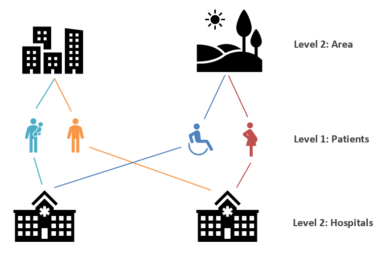
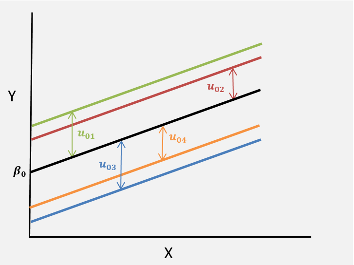

{width="75%"}

```{r setup, include=FALSE}
knitr::opts_chunk$set(echo = FALSE)

library(learnr)
library(tidyverse)
library(dplyr)
library(ggplot2)
library(xtable)
library(kableExtra)
library(reshape2)
library(nlme)
library(lme4)
library(lattice)

birwt.dat <- read.csv("data/smoking_data.csv", header=T) %>% 
  mutate(birwtc = (birwt-mean(birwt))/sd(birwt), magec = (mage-mean(mage))/sd(mage))

bp <- read.csv("data/bp_data.csv", header=T) %>% 
  dplyr::select(-pop) %>% 
  mutate(bpc = (bp-mean(bp))/sd(bp),
                  bmic = (bmi-mean(bmi))/sd(bmi))

incentives <- read.csv("data/incentives.csv", header=T)

```


## Overview  
Welcome to Chapter 7 of HDAT9700: Statistical Modelling II! 


In this Chapter we will continue to work on multilevel modelling, covering topics such as model comparison, model predictions and models for binary outcomes

### Pre-reading

The pre-reading for this chapter is [Hanly, Savva, Clifford & Whelan (2014). Variation in Incentive Effects across Neighbourhoods. Survey Research Methods, 8(1)](https://ojs.ub.uni-konstanz.de/srm/article/view/5485/5336). 

### Core reading:

The reference text for this chapter is Andy Field, Jeremy Miles, Zoë Field (2012) Discovering statistics using R, **Chapter 19** (Available from the UNSW library, also accessible [here](https://nyu-cdsc.github.io/learningr/assets/discoveringstatistics.pdf))

### Additional reading: 

Online videos from the Centre for Multilevel Modelling, University of Bristol [http://www.bristol.ac.uk/cmm/learning/videos/](http://www.bristol.ac.uk/cmm/learning/videos/)


## Recap

Let's recap some key ideas from last week.

### 1. Multilevel data 
Health systems often have a complex structure, with factors at different levels influencing health outcomes. There are three broad classes of multilevel data: 

* Hierarchical 
* Multiple Membership 
* Cross-classified

{width="75%"}

***

{width="75%"}

***

{width="75%"}


### 2. A nuisance or an opportunity? 

#### A nuisance? 

Multilevel structures often give rise to dependency between observations in a dataset. Lower level units clustered within the same higher level unit may share charateristics and as a result, the usual assumption of independence between observations is violated. In some cases, this dependence is considered a nuisance, and something to get around. Practioners might

* Ignore 
* Use a statistical adjustment to correct the standard errors for dependency between observational units
* Add fixed effects (e.g. a dummy variable) for each category of the higher level 
* Control for characteristics of the higher level 

#### An opportunity? 

In other contexts, multilevel data often presents a great opportunity for researchers.

* Answer multilevel questions
* Understand role of factors at different levels 
* Understand relationships between factors at different levels 


### 3. Group level residuals = random effects

Multilevel modeling treats group-level residuals as being randomly drawn from a normal distribution.

{width="75%"}

The values $u_{0j}$ represent unexplained group level effects, also referred to as _residuals_ or _random effects_. Mathematically, we write this assumption as:

$$
u_{0j} \sim N(0, \sigma_{u0}^{2})
$$


## Model comparison


Two nested multilevel models can be compared using a likelihood ratio test. The test statistic for this test is the difference in deviance for the smaller and larger model, which follows a chi-square distribution with degrees of freedom equal to the number of additional parameters in the larger compared to the smaller model. Note that for the likelihood ratio test the models must be nested, i.e. the parameters of the smpler model should be a subset of the parameters of the more complex model.  

***

$\begin{aligned}
\textrm{test stat} &= \textrm{Deviance}_{smaller} -  \textrm{Deviance}_{larger} \\
\textrm{degrees of freedom} &= \textrm{Number of parameters}_{smaller} -  \textrm{Number of parameters}_{larger} 
\end{aligned}$

***

You may recall from HDAT9600 Statistical Modelling I that the deviance is defined as $-2 \times \textrm{log-likelihood}$ and that we use the Deviance because it has convenient statistical properties, in particular it follows a chi-square distribution. 

Multilevel models can also be compared using the following criteria.

**Akaike's Information Criterion (AIC)**  

* The AIC is a goodness-of-fit test that penalises for the number of parameters included in the model.

**Bayesian Information Criterion (BIC)**  

* The BIC is similar to the AIC but penalises more heavily for the number of parameters used in the model. This is preferable for models with large sample sizes and a small number of parameters.

Note that the AIC and BIC don't have any real interpretation in isolation, but can be used to compare models, with smaller values indicating a better model fit (Field, Miles and Field (2012) Discovering Statistics Using R Chapter 19). The AIC and BIC can be used to compare non-nested models.   

*** 

Multilevel models fitted with `lme4` in R report the log-likelihood, deviance, AIC and BIC **but only when estimated using Mamimum Likelihood**. By default in `lme4`, models are estimated using REML (reducued maximum likelihood), which has been shown to provide better estimates of random effect parameters, especially when there are a relatively small number of higher level units. The differences betweeen the REML and ML estimation approaches are beyond this course but if you are interested in reading more an intuitive explanation is provided in [Daniel McNeish (2017) Small Sample Methods for Multilevel Modeling: A Colloquial Elucidation of REML and the Kenward-Roger Correction, Multivariate Behavioral Research, 52:5, 661-670](https://doi.org/10.1080/00273171.2017.1344538). 

In order to make model comparisons we must specify that we want to use maximum likelihood when fitting the model. This is done with `lme4` using the `REML = FALSE` option. Try exploring this below.


```{r ex1, exercise=TRUE, exercise.lines=10}

# Experiment with REML versus ML estimation, are there any differences?
lmer(birwt ~ (1|momid), data=birwt.dat, REML = TRUE)

```

As seen in HDAT9600, two nested models can be compared using the `anova` function. Explore the results below. How do we interpret the output of the `anova` function?


```{r ex2, exercise=TRUE, exercise.lines=10}

# Compare to a model with an additional parameter
m0 <- lmer(birwt ~ (1|momid), data = birwt.dat, REML = FALSE)
m1 <- lmer(birwt ~ mage + (1|momid), data = birwt.dat, REML = FALSE)

anova(m0, m1)

```

```{r ex2-hint}

# The AIC and BIC are both smaller for the model that includes
# maternal age, and the log-likelihood test is highly 
# significant indicating that m1 is the preferred model.
# (no surprises here)

```

<div class="aside">

### What about p-values?

You might have noticed that the output from `lmer` includes point estimates, standard errors, and t-values but no p-values. What's going on? The p-values have been deliberately excluded in the implementation of `lme4` due to concerns about their calculation. You can read an explanation from the package author Douglas Bates [here](https://stat.ethz.ch/pipermail/r-help/2006-May/094765.html). 

If you really want a p-value for a parameter you can compare two models, one with and one without that parameter, using a likelihood ratio test. Other options for obtaining p-values are documented [here](https://rdrr.io/cran/lme4/man/pvalues.html).

</div>


### Do we even need a multilevel model?

To determine whether a multilevel model is neccessary, usual practice is to assess the significance of the random intercept parameter $\sigma_{u0}^{2}$ in an empty random intercept model (i.e. no predictors). As p-values from REML estimates of this parameter are unreliable (and not provided in R), it is preferable to compare the empty random intercept model to an empty single-level model using a log-likelihood test.

The usual trick of performing a log-likelihood test using the `anova` function doesn't work on the output of `lmer()` so we can perform the test manually, using the `logLik()` function to extract the log-likelihood for each model. 

```{r ex3, exercise=TRUE, exercise.lines=10}

# Compare empty two-level model to empty single-level model
m0 <- lmer(birwt ~ (1|momid), data = birwt.dat, REML = FALSE)
m_single <- lm(birwt ~ 1, data = birwt.dat)

logLik(m0)
logLik(m_single)

```


### Model building
It is recommended to use an iterative process when developing a multilevel model. You should start with a very basic model and gradually build in complexity, comparing to the simpler model with each step. 

For example, when developing a random intercept model you might follow these steps: 

1. Start with an empty random intercept model and compare to an empty single-level model to confirm that introducing random effects is suitable.

2. Include independent/explanatory variables.

3. Add a random slope for the explanatory variable of interest to test whether the effect varies significantly over higher-level units.

At each step, you can compare the more complex model to the simpler model using the LRT, AIC or BIC. Note that when comaparing models in this gradual model building process:

* You should avoid adding fixed _and_ random parameters to a model in the same step - it won't be clear if any improvement is due to the fixed part or to the random part. 


## Model predictions


There are many reasons why we might be interested in making predictions from a model.

**Model testing** 
We may want to test the validity of our model by checking if the predicted values of our outcome are close to the observed values.

**Visualisation** 
To help understand a model it can useful to plot the predicted outcomes against the exposure of interest.

**Out-of-sample predictions**
We might want to predict outcomes for new observations (the colloquial sense of prediction familiar from HDAT9500).


### Model predictions in R

To predict values following the `lmer()` function we can simply use the `predict()` command.

```{r ex4, exercise=TRUE, exercise.lines=20}
# Predicting from a multilevel model

# Fit the model
m0 <- lm(birwt ~ mage, data = birwt.dat)

m1 <- lmer(birwt ~ mage + (1|momid), data = birwt.dat)

# Store the predicted values 
birwt.dat$p0 <- predict(m0)
birwt.dat$p1 <- predict(m1)

# Visualise the predictions

baseplot <- birwt.dat[1:400,] %>% ggplot() + 
    geom_point(aes(x=mage, y=birwt), color="grey") +
    geom_line(aes(x=mage, y=p0), size=1, color="purple") +
    geom_line(aes(x=mage, y=p1, group=momid), size=.4, color="red") +
    labs(title="Birthweight and maternal age (first 400 records)", x = "Maternal age", y = "Birthweight") +
    theme(legend.position = "none")

baseplot

```


### Predicting group-level residuals

Recall that in a multilevel model we don't get direct estimates of the group-level residuals such as $u_{0j}$ or $u_{1j}$, instead we get an estimate of their variance e.g. $\sigma_{u0}^{2}$ and $\sigma_{u1}^{2}$ (and where relevant their covariance $\sigma_{u01}$). However, we can obtain estimates of the residuals after fitting the model. These estimates are referred to as posterior estimates, empirical Bayes estimates or BLUPs (Best Linear Unbiased Predictors).

The estimated residuals can be used to test the underlying assumptions of these values (i.e. that they are normally distributed with mean 0). Severe departures from this would indicate issues with the model. 

The residuals can also be plotted for each higher level unit. Sorting by the magnitude of the estimated residuals results in what is known as a **caterillar plot**. This allows us to visualise and identify higher-level units that have a particularly high or low residual indicating different behaviour compared to the average.  

To extract the estimated residuals in R we use the `ranef()` function from the `lme4` package. This is illustrated in the code block below; the main points are as follows:

* Pass the stored model object to `ranef()`
* Include the `condVar = TRUE` option to also get standard errors for the estimated residuals.
* Pass the output from `ranef()` to `lattice::dotplot()` to get a quick caterpillar plot.
* Pass the output from `ranef()` to `as.data.frame()` to save the results in a data frame for further exploration.


### BLUP estimates of level 2 residuals

The example in the code chunk below demonstrates how to access and store the BLUP estimates from a simple random intercept model. The key functions are: 

* `ranef()` to extract the random effect estimates from a saved model object. 
* `lattice::dotplot()` to plot the estimated level 2 residuals as a caterpillar plot. 
* `as.data.frame()` to save the random effect estimates and their standard deviations fo furhter processing.

```{r ex5, exercise=TRUE, exercise.lines=20}
# Fit the model
m1 <- lmer(birwt ~ mage + (1|momid), data = birwt.dat)

# Use ranef() with condVar = TRUE
re1 <- ranef(m1, condVar = TRUE)

# Use dotplot for a quick caterpillar plot
lattice::dotplot(re1)  

# Use as.data.frame to store the estimates
df_re1 <- as.data.frame(re1)

```

* Note that the outut from dotplot is fine for a quick exploration, but to obtain a publication-quality figure you would want to plot these nicely with `ggplot`. 

## Practical 1

You are provided with a dataset **bp** which provides information on blood pressure and Body Mass Index for individuals nested within areas. The following eight variables are included:

* **area** Indicator for areas
* **id** Indicators for individuals
* **sex** Sex (0=Female, 1=Male)
* **bmi** Body Mass Index (kg/m^2)
* **bp** Blood pressure (mmHg)
* **seifa** Socio-Economic Index for Areas
* **bmic** BMI standardised to mean=0, SD=1
* **bpc** blood pressure standardised to mean=0, SD=1

The outcome of interest is blood pressure. Take some time to familiarise yourself with the dataset and then answer the questions below.

#### Does average blood pressure vary significantly across areas? i.e. is a multilevel model neccessary here?

``` {r ex7, exercise=TRUE, exercise.lines=10}


```

``` {r ex7-hint-1}
# Compare a null single-level model for bp to a null random intercept model for BP
```

``` {r ex7-hint-2}
# Remember to use REML=FALSE for the multilevel model and logLik() to assess the log-likelihood
```

``` {r ex7-hint-3}
# empty single level model
m0 <- lm(bpc ~ 1, data=bp)

# Empty random intercept model
m1 <- lmer(bpc ~ 1 + (1|area), data=bp, REML = FALSE)

# Is random intercept significant?
logLik(m0)
logLik(m1)  # Yes, it is!
```


#### What proportion of the variance in blood pressure is between areas?

``` {r ex8, exercise=TRUE, exercise.lines=10}


```

``` {r ex8-hint-1}
# Check notes on VPC statistic from the previous chapter. Use a null random intercept model
```

``` {r ex8-hint-2}
# Recall vpc = sig_u_sq/(sig_u_sq + sig_e_sq)
```


#### Fit a random interept model for blood pressure including BMI as a predictor. Is this an improvement on the previous model? Plot the fitted lines by area.

``` {r ex9, exercise=TRUE, exercise.lines=20}


```

``` {r ex9-hint-1}
# Use the anova() function to compare nested models
```

``` {r ex9-hint-2}
# Use the predict() function to save the predictions
```

``` {r ex9-hint-3}
# Look back to the model predictions section to get ggplot code for plotting the predictions
```


#### Store the random effects estimates and plot a caterpillar graph. Is the area-level random effect significantly different from zero for all areas?

``` {r ex10, exercise=TRUE, exercise.lines=25}


```

``` {r ex10-hint-1}
# Use the ranef() function to store the residuals and as.data.frame() to save these as a dataframe
```

``` {r ex10-hint-2}
## Full solution

# Fit the model
m2 <- lmer(bpc ~ bmic + (1|area), data=bp, REML = FALSE)

# Store the random effects
re1 <- as.data.frame(ranef(m2))
head(re1)

# Check the random effects are normally distributed
ggplot(re1, aes(x = condval)) + geom_histogram(bins=12)

# Let's make it interactive so the viewer can hover over lines to see the name of the area
library(ggiraph)
plot <- ggplot(data=re1, aes(x=condval, y=grp, tooltip = grp)) +
  geom_vline(xintercept=0, color = "red", size = 1.2) +
  geom_point_interactive() +
  geom_errorbarh(aes(xmin = condval - 2*condsd, xmax = condval + 2*condsd), height=0) +
  labs(title="Caterpillar Plot", x = "Estimated area-level residual", y = "Area ID") +
  coord_flip()

# Plot the interactive graph object
girafe(ggobj = plot, width_svg = 20, height_svg = 10)


```


#### Fit two additional random intercept models, one with sex and another with sex + seifa. Assess the model fit for both.

``` {r ex11, exercise=TRUE, exercise.lines=10}


```

``` {r ex11-hint-1}
# Use the anova() function to compare models
```

#### Add a random slope to test the hypothesis that the effect of BMI varies across areas

``` {r ex12, exercise=TRUE, exercise.lines=10}


```


``` {r ex12-hint-1}
# Add the BMI variable to the random part of the model syntax using the syntax (1 + bmic|area)
```

``` {r ex12-hint-2}
# Fit the model
m3 <- lmer(bpc ~ bmic + sex + (1|area), data=bp, REML = FALSE)

m5 <- lmer(bpc ~ bmic + sex + (1+bmic|area), data=bp, REML = FALSE)

summary(m3)

summary(m5)

anova(m3,m5)

# The comparison of deviance would suggest the more complex model is an improvement
# BUT note that the variance of the random slope is very small (0.002), and note the 
# warning about the singularity: the random effects covariance is exactly 1.0 so there 
# is an issue with the estimation here. 

```

## Modelling binary outcomes

   

In our previous examples we have looked at multilevel models for continuous outcomes, such as birthweight measured in grams. But often outcomes of interest are coded dichotomously (such as preterm birth yes/no), or are inheritently dichotomous (such as death). Examples of multilevel questions for binary outcomes include:

1. What characteristics of mothers are associated with preterm birth?

2. Does the likelihood of death following ICU admission vary across ICUs?

3. What family-level factors are associated with children completing their vaccine schedule by age five?

### Dependency
As with multilevel data with binary outcomes, multilevel data with continuous outcomes may display dependency, i.e. similarity between level 1 units in the same level 2 units.

* Children born to the same mother may share genetic factors predisposing them to preterm birth.
* ICUs attached to large hospitals may receive more serious cases.
* Children from the same family are more likely to have similar vaccine status.


### Random intercept model for binary responses

Recall the equation for a **two-level random intercept model** with a continuous response for individuals $i$ nested within groups $j$:

$$
y_{ij} = \beta_{0} + \beta_{1} x_{ij} + u_{0j} + e_{ij}
$$
Where

* $y_{ij}$ is the outcome for individual $i$ in group $j$
* $\beta_{0}$ is the grand mean intercept
* $x_{ij}$ are covariates for individual $i$ in group $j$
* $u_{0j}$ are group or level 2 residuals (the distance between the grand intercept and the group intercept)
* $e_{ij}$ are individual or level 1 residuals (the distance between the observation and the regression line for group $j$)

With a binary outcome, $y_{ij}$ can only take outcomes $0$ or $1$. Similar to the single level model for binary outcomes covered in HDAT9600, when $y$ is binary we can model the log odds of the response. The model becomes

$$
\textrm{log}\left(\frac{\pi_{ij}}{1-\pi_{ij}}\right)=\beta_{0} + \beta_{1}x_{ij} + u_{0j}
$$

where $\pi_{ij}$ is the probablity of individual $i$ in unit $j$ experiencing the outcome.

$$
\textrm{Pr}(y_{ij} = 1) = \pi_{ij}
$$

Note that there is no level one residual in this model.

Similar to a single-level logistic regression model, $\beta_{0}$ and $\beta_{1}$ are estimated on the log-odds scale. We can take the exponent to obtain the odds of the outcome occurring.

For example,

* $e^{\beta_{0}}$ is the odds that $y$=1 when $x$=0 and $u_{0j}$=0.
* $e^{\beta_{1}}$ is the odds ratio of experiencing the outcome associated with each one-unit increase in the variable $x$.

As with multilevel models for continuous outcomes, the intercept for higher-level group $j$ is $\beta_{0} + u_{0j}$.


### Variance Partition Coefficient

Because there is no individual-level variance $\sigma_{e}^{2}$, there is no immediate way to calculate the VPC statistic.

Instead, to calculate the VPC for non-continuous outcomes, the formula becomes

$$
\frac{\sigma^{2}_{u0}}{\sigma^{2}_{u0} + \sigma^{2}_{e^{*}}}
$$

where $\sigma^{2}_{e^{*}}$ is approximated by $\pi^{2}/3 \approx 3.29$ for models using the logit link and by $1$ for models using the probit link.

So for a multilvel logistic regression model, the VPC would be given by
$$
\frac{\sigma^{2}_{u0}}{\sigma^{2}_{u0} + 3.29}
$$
where $\sigma_{u0}^{2}$ is the level-2 variance estimated from a null multilvel model.

## Example {data-progressive=TRUE}

### Cash incentives for survey recruitment: variation in effect across geographic areas

This example is based on the paper [Variation in Incentive Effects across Neighbourhoods](https://ojs.ub.uni-konstanz.de/srm/article/view/5485) (Hanly, Savva, Clifford and Whelan, _Survey Research Methods_ 2014 8(1))

Monetary incentives are commonly used in survey research as an effective way to boost survey participation. An experiment was carried out to compare the effectiveness of two different cash incentives (\$10 versus \$25) on recruiting sampled households to a longitudinal study. The survey sample was a two-staged clustered random sample: in the first stage 20 neighbourhoods were sampled; in the second stage, 60 addresses were sampled from each neighbourhood.

Within each neighbourhood, half of the sampled households were assigned to receive a \$10 cash incentive and half were assigned to receive \$25. Neighbourhood-level variables, such as the percentage of high SES households in each area, were available from the national Census.

#### Research questions

With this experimental design, the researchers could answer many questions:

1. Does survey participation vary across neighbourhoods?
2. Does the higher incentive increase participation?
3. Does the effect of the higher incentive vary across neighbourhoods?
4. Are there any area-level variables (e.g. area-level SES) that help identify where incentives will be most effective?

Answering these questions could help with the survey design, in particular the level of incentive to use, whether that incentive should be targeted to particular areas, and whether there are any area-level factors that could help identify where the incentive budget should be spent.

<div class="discuss">

### Discuss...
1. What is the multilevel structure of the experiment described here?

2. What levels of that structure do the questions above pertain to?

</div>


### Notation

A snapshot of the data from the experiment described above might look like this:

```{r eval=TRUE}
data <- cbind("Neighbourhood j" = c(rep("A",4), rep("B",4)),
              "Household i" = c(letters[1:4], letters[1:4]),
              "Incentive" = c(0,0,1,1,0,0,1,1),
              "% high SES" = c(rep(20,4), rep(5,4)),
              "Participation" = c(0,1,1,1,0,0,1,0)
              ) %>%
  as.data.frame()
xtable(data, auto=TRUE)

```

Note that households are nested within clusters and that there are household-level variables (**Incentive** & **Participation**) and area-level variables (**% high SES**) present.

We can translate this example into the formal notation for a multilevel model.

$y_{ij}$ = participation status for household $i$ in neighbourhood $j$ (No=0, Yes=1)}

$x_{ij}$ = incentive level for household $i$ in neighbourhood $j$ (\$10=0 / \$25=1)

$ses_{j}$ = percentage high SES in area $j$

Because we have a binary outcome we can use a logistic regression model. Recall from HDAT9600 the expression for a single-level model with one predictor can be written as:

$$
\text{log} \left(  \frac{\text{Pr}(y_{ij}=1)}{1-\text{Pr}(y_{ij}=1)} \right) = \beta_{0} + \beta_{1}x_{ij}
$$
Recall:

* $\frac{\text{Pr}(a)}{1-\text{Pr}(a)}$ is the odds of event $a$
* $\textrm{log}\left( \frac{\text{Pr}(a)}{1-\text{Pr}(a)} \right)$ is the log-odds or **logit link function**
* $\beta_{0}$ is the intercept
* $\beta_{1}$ is the effect of the variable $x_{i}$

We can simplify our notation by writing

$$
\text{Pr}(y_{ij}=1) = \pi_{ij}
$$
Thus our single level model becomes
$$
\text{log} \left(\frac{\pi_{ij}}{1-\pi_{ij}}\right)=\beta_{0} + \beta_{1}x_{ij}
$$

The single-level logistic regression model assumes a single intercept $\beta_{0}$. A multilevel random intercept logistic regression model assumes a seperate intercept or each high-level unit. We write this as
$$
\text{log} \left(\frac{\pi_{ij}}{1-\pi_{ij}}\right)=\beta_{0} + \beta_{1}x_{ij} + u_{0j}
$$
As with in the model for continuous outcomes, the values $u_{0j}$ are referred to random intercepts and they represent departures from the global intercept for each higher-level group $j$.

* The intercept for group 1 is $\beta_{0} + u_{01}$ 
* The intercept for group 2 is $\beta_{0} + u_{02}$ 
* The intercept for group 3 is $\beta_{0} + u_{03}$ 

And so on.

***

For our incentive experiment example the model can be written as
$$
\text{log} \left(\frac{\pi_{ij}}{1-\pi_{ij}}\right)=\beta_{0} + \beta_{1}\text{Incentive}_{ij} + u_{0j}
$$
where

$$
\pi_{ij} = \text{Pr}(\text{Participation}_{ij}=1)
$$

i.e. $\pi_{ij}$ is the probability of household $i$ in area $j$ participating with the survey request. 

### Graphical interpretation: Random Intercept Model

Fitting a **random intercept** logistic regression model to the incentive experiment data would correspond to the following picture:

```{r ri}

set.seed(131)

x <- cbind(tx0 = rnorm(20, 0, .5)) %>%
  as.data.frame() %>%
  mutate(tx1 = tx0 + .8) %>% # Random intercept
  mutate(tx2 = tx0 + .5*(abs(tx0+1))) %>% # Random slope positive covariance
  mutate(tx3 = tx0 + 1.5 - tx2) %>%
  mutate(tx4 = tx0 + .8 + rnorm(20, 0, .5)) %>%
  arrange(tx0) %>%
  mutate(id = 1:n())

  x %>%
    ggplot() +
    geom_linerange(aes(x=id, ymin=tx0, ymax=tx1), linetype="dashed", color="gray35") +
    geom_point(aes(id, tx0), color="purple", shape=16) +
    geom_point(aes(id, tx1), color="orange", shape=17) +
    labs(title="Multilevel logistic regression (Random intercept model)", x="Cluster ID", y= bquote(beta[1] ~"(Probability of response on log odds scale)") ) +
    scale_y_continuous(limits = c(-1, 2)) +
    scale_x_continuous(limits=c(1,20), breaks=c(1:20), minor_breaks = NULL)

```

Note:

* The baseline response varies across neighbourhoods (random intercept)
* The effect of the higher incentive is the same in each neighbourhood


### Graphical interpretation: Random Slope Models

The model underlying the previous figure constrained the higher incentive effect to be equal across all areas. The following figure reflects a model where that constraint is lifted by adding a random effect for incentive in a random intercept - random slope model. The next three figures show three possible patterns which differ in the covariance between random intercepts and random slopes. 

#### 1. Positive covariance between random intercept and random slope
```{r rsp}
  x %>%
    ggplot() +
    geom_linerange(aes(x=id, ymin=tx0, ymax=tx2), linetype="dashed", color="gray35") +
    geom_point(aes(id, tx0), color="purple", shape=16) +
    geom_point(aes(id, tx2), color="orange", shape=17) +
    labs(title="Multilevel logistic regression (Random slope, positive covariance)", x="Cluster ID", y= bquote(beta[1] ~"(Probability of response on log odds scale)") ) +
    scale_y_continuous(limits = c(-1, 2)) +
    scale_x_continuous(limits=c(1,20), breaks=c(1:20), minor_breaks = NULL)
```

Note:

* The baseline response varies across neighbourhoods (random intercept)
* The effect of the higher incentive varies across neighbourhoods (random slope)
* The incentive effect is higher in areas where the baseline response is **higher** 
* This pattern would indicate a **positive** covariance $\sigma_{u01}$ in the random effects variance-covariance matrix. 

***

#### 2. Negative covariance between random intercept and random slope
```{r rsn}
  x %>%
    ggplot() +
    geom_linerange(aes(x=id, ymin=tx0, ymax=tx3), linetype="dashed", color="gray35") +
    geom_point(aes(id, tx0), color="purple", shape=16) +
    geom_point(aes(id, tx3), color="orange", shape=17) +
    labs(title="Multilevel logistic regression (Random slope, negative covariance)", x="Cluster ID", y= bquote(beta[1] ~"(Probability of response on log odds scale)") ) +
    scale_y_continuous(limits = c(-1, 2)) +
    scale_x_continuous(limits=c(1,20), breaks=c(1:20), minor_breaks = NULL)
```

Note:

* The baseline response varies across neighbourhoods (random intercept)
* The effect of the higher incentive varies across neighbourhoods (random slope)
* The incentive effect is higher in areas where the baseline response is **lower** 
* This pattern would indicate a **negative** covariance $\sigma_{u01}$ in the random effects variance-covariance matrix. 

***

#### 3. Null covariance between random intercept and random slope
```{r rs0}
  x %>%
    ggplot() +
    geom_linerange(aes(x=id, ymin=tx0, ymax=tx4), linetype="dashed", color="gray35") +
    geom_point(aes(id, tx0), color="purple", shape=16) +
    geom_point(aes(id, tx4), color="orange", shape=17) +
    labs(title="Multilevel logistic regression (Random slope, zero covariance)", x="Cluster ID", y= bquote(beta[1] ~"(Probability of response on log odds scale)") ) +
    scale_y_continuous(limits = c(-1, 2)) +
    scale_x_continuous(limits=c(1,20), breaks=c(1:20), minor_breaks = NULL)

```

Note:

* The baseline response varies across neighbourhoods (random intercept)
* The effect of the higher incentive varies across neighbourhoods (random slope)
* There is no association between the magnitude of the random intercept and the random slope 
* This pattern would indicate a **null** covariance $\sigma_{u01}$ in the random effects variance-covariance matrix. 

***

## Fitting GLM models in R
Generalised linear models, including models for non-continuous outcomes, can be estimated using the `glmer()` function from the `lme4` package in R.

Like the `glm()` function for single-level models, the `glmer()` function can fit a variety of GLMs by varying the `family = ` and `link()` parameters.

The syntax for a `glmer()` model combines elements of the `glm()` and `lmer()` syntax that you have already seen. Consider the following example for a multilevel logistic regression model with a random intercept and slope.

A single-level logistic regression model would be specified as below:
```{r echo=TRUE, eval=FALSE, exercise=FALSE}
glm(y ~ 1 + x, family = binomial(link="logit"), data = mydata)
```


A multilevel logistic regression model for a continuous outcome would be specified as below:
```{r echo=TRUE, eval=FALSE, exercise=FALSE}
lmer(y ~ 1 + x + (1+x|hospital), data = mydata)
```


The syntax for `glmer()` combines elements from `glm()` and `lmer()`. A multilevel logistic regression model (with random intercept and random slope for variable x) would be specified like this:
```{r echo=TRUE, eval=FALSE, exercise=FALSE}
glmer(y ~ 1 + x + (1+x|hospital), family = binomial(link="logit"), data = mydata)
```


## Practical 2

In this practical, you will fit a **multilevel logistic regression model**, emulating some of the analysis from the incentives experiment example.

Your tutorial environment is preloaded with a dataset named **incentives**. This (simulated) dataset contains data on 200 areas with 50 observations per area. Three variables are recorded:

* **area** a numeric indicator for area
* **inc** a binary indicator for receipt of a lower (0=\$10) or higher (1=\$25) incentive amount
* **resp** a binary indicator for survey participation (1) or refusal (0)

Familiarise yourself with the dataset and answer the following questions.

#### Is there a random effect on the probablity of participation by area?

``` {r ex13, exercise=TRUE, exercise.lines=10}


```


``` {r ex13-hint-1}
# compare a null single level model to a null random intercept model using the logLik() function
```

``` {r ex13-hint-2}
# m0 <- glm( ~ 1, family = , data = )

# m1 <- glmer( ~ 1 + (  |  ), family = , data = )

# logLik( )
# logLik( )
```


``` {r ex13-hint-3}
m0 <- glm(resp ~ 1, family = binomial(link="logit"), data = incentives)

m1 <- glmer(resp ~ 1 + (1|area), family = binomial(link="logit"), data = incentives)

logLik(m0)
logLik(m1)
```


#### What is the effect of the higher incentive?

``` {r ex14, exercise=TRUE, exercise.lines=10}


```


``` {r ex14-hint-1}
# include the incentive variable in the fixed part of the model
```


#### Does the incentive effect vary across areas?

``` {r ex15, exercise=TRUE, exercise.lines=10}


```


``` {r ex15-hint-1}
# include the incentive variable in the fixed and random parts of the model
# The use anova() to copare to simpler model
```

``` {r ex15-hint-2}
m3 <- glmer(resp ~ 1 + inc + (1 + inc|area), family = binomial(link="logit"), data = incentives)

```


#### Which hypothesis is there most support for? (a) incentives are more effective in areas with low baseline response or (b) incentives are more effective in areas with high baseline response.

``` {r ex16, exercise=TRUE, exercise.lines=15}


```


``` {r ex16-hint-1}
# Examine the correlation estimate in the model summary

# Or, combine the as.data.frame() and ranef() functions to access and store the random effects. 
# Then look at a scatterplot of the random intercepts versus random slopes.

# Or, predict from the model and plot the average predictions by area
```

``` {r ex16-hint-2}
# Examine the correlation estimate in the model summary

# Fit model
m3 <- glmer(resp ~ 1 + inc + (1 + inc|area), family = binomial(link="logit"), data = incentives)

# Examine variance-covariance matrix
lme4::VarCorr(m3)

```

``` {r ex16-hint-3}
# Combine the as.data.frame() and ranef() functions to access and store the random effects.
# Then look at a scatterplot of the random intercepts versus random slopes.

# Fit model
m3 <- glmer(resp ~ 1 + inc + (1 + inc|area), family = binomial(link="logit"), data = incentives)

# Store the random effect estimates in a data.frame
re <- as.data.frame(ranef(m3, cond = TRUE))

# Scatterplot of random intercepts versus random slopes. 
plot(re$condval[re$term=="(Intercept)"], re$condval[re$term=="inc"])

```

``` {r ex16-hint-4}
# Predict from the model and plot the average predictions by area


# Fit Model
m3 <- glmer(resp ~ 1 + inc + (1 + inc|area), family = binomial(link="logit"), data = incentives)

# Get predictions
incentives$p3 <- predict(m3)

# Plot predictions (note use of reorder() to sort x-axis from smallest p value)
library(dplyr)
incentives %>% group_by(area, inc) %>% summarise(p = mean(p3)) %>% 
ggplot(aes(x = reorder(area, p), y = p, color = as.factor(inc))) + geom_point() +
labs(x = "Area", y = "Probability of response (log odds scale)")
```

``` {r ex16-hint-5}
# All of these approaches indicate a positve covariance between random intercepts across areas 
# and the random slope for incentive, i.e. the incentive is more effective where 
# baseline participation is high.
```

## Summary

This week we covered

* Model comparison
* Model building
* Model predictions
* Fitting models for binary outcomes

You should know how to

* Assess whether a multilevel model is neccessary in a given context
* Compare nested models using a likelihood ratio test
* Predict individual outcomes from fitted multilevel models
* Predict estimates of random effects from fitted multilevel models
* Fit and interpret a multilevel logistic regression model

Next week we will focus on how multilevel models are applied to repeated measures data (repeat observations clustered within individuals)


