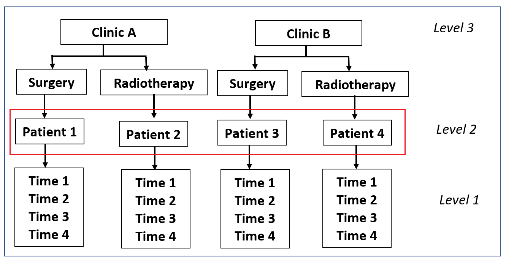

{width="75%"}

```{r setup, include=FALSE, warning=FALSE}
knitr::opts_chunk$set(echo = FALSE)

# Load required libraries
library("learnr")
library("car")
library("ggplot2")
library("nlme")
library("reshape")

# Load data
incontinenceData = read.csv("data/incontinence.csv", header = TRUE)

# Set up long data
LI<-melt(incontinenceData, id.vars = c("Person", "Treatment", "Clinic"), measure.vars = c("Incontinence_Baseline", "Incontinence_6_Months", "Incontinence_12_Months", "Incontinence_18_Months"), variable = "Time",  value = "Incontinence_Score")
Time<-c(rep(0,115),rep(1,115),rep(2,115),rep(3,115))
LI$Time<-Time
rm(Time)
longIncontinenceData<-data.frame(Person = LI$Person, Treatment = LI$Treatment, Clinic = LI$Clinic, Time = LI$Time, Incontinence_Score = LI$value)
longIncontinenceData$Time_cat <- factor(longIncontinenceData$Time, labels = c("Baseline", "6 Months", "12 Months", "18 Months"))

#Load regression models
intercept<-gls(Incontinence_Score ~ 1, data = longIncontinenceData, method = "ML", na.action = na.exclude)
randomIntercept <-lme(Incontinence_Score ~ 1, data = longIncontinenceData, random = ~1|Person, method ="ML", na.action = na.exclude, control = list(opt="optim")) 
TimeRI <-lme(Incontinence_Score ~ Time, data = longIncontinenceData, random = ~1|Person, method ="ML", na.action = na.exclude, control = list(opt="optim")) 
TimeRS <-lme(Incontinence_Score ~ Time, data = longIncontinenceData, random = ~Time|Person, method ="ML", na.action = na.exclude, control = list(opt="optim"), correlation = corAR1(0, form = ~Time|Person)) 
TimeQuadratic <-lme(Incontinence_Score ~ Time + I(Time^2), data = longIncontinenceData, random = ~1|Person, method ="ML", na.action = na.exclude, control = list(opt="optim"), correlation = corAR1(0, form = ~1|Person)) 
TimeTreatment <-lme(Incontinence_Score ~ Time + I(Time^2) + Treatment, data = longIncontinenceData, random = ~1|Person, method ="ML", na.action = na.exclude, control = list(opt="optim"), correlation = corAR1(0, form = ~1|Person))
TimeTreatmentInteraction <-lme(Incontinence_Score ~ Time + I(Time^2) + Treatment + Treatment:Time, data = longIncontinenceData, random = ~1|Person, method ="ML", na.action = na.exclude, control = list(opt="optim"), correlation = corAR1(0, form = ~1|Person))
```

## Growth Curve Modelling
Welcome to HDAT9700 Statistical Modelling II - Growth Curve Modelling! 

In this chapter, we will expand on our knowledge of multilevel linear models (MLMs) to explore longitudinal linear models and non-linear growth curve models. 

We will cover the following concepts:

1. What is growth curve modelling?
2. What are the data requirements?
3. Introduction to the example data set used throughout this chapter (incontinence in men after treatment for prostate cancer)
4. Understanding growth curve analysis as an extension of simple linear models and MLMs
5. Performing growth curve analysis in R
6. Assessing model fit

The pre-reading for this chapter is [Curran, Obeidat, and Losardo (2010) Twelve Frequently Asked Questions About Growth Curve Modeling" J Cogn Dev 11(2)](https://media.openlearning.com/NEL6pFMdd45AmcgbiY9XJLskpgF5ZUGU4s2nTcvBFCaZaZ6LFjbeNGmZujMFNAif.1538706341/Curran_et_al_2010_-_12_FAQs_about_Growth_Curve_Modelling.pdf)


Material for this chapter has been adapted from Field, A., Miles, J., Field, Z. (2012) Discovering Statistics Using R. SAGE Publishing.

So let's get started!! 

{width="25%"}

## Longitudinal Data Analysis
The principles of multilevel modelling can be expanded from data that is nested or clustered to data that is measured over multiple timepoints. Health data often consist of multiple measurements of health sataus on the same patient over time. For example, blood sugar levels among patients with diabetes; and quality of life at multiple times following a health intervention. In this case, the level 1 variable is no longer the 'patient' but the 'observation' witin patient. 

### Multilevel Model - non-longitudinal

{width="80%"}

### Multilevel Model - longitudinal

{width="90%"}

## What is Growth Curve Modelling?
Growth curve modelling is a form of regression analysis that evaluates the change in an outcome variable over time. The most basic form of change over time is a linear trend. However, in the field of medicine change over time often occurs in a non-linear way. E.g. rate of recovery after surgery, or blood cell counts over time. We can use a mathematical function to find the best way to describe the non-linear change over time and incorporate this function into the regression equation. Commonly used functions are quadratic, cubic, logarithmic and exponential. The figure below shows an example of linear, quadratic, cubic and higher order change over time. 

{width="80%"}

The aim of this chapter is to provide you with an introduction to growth curve modelling, and to build the skills that you need to confidently conduct and interpret standard growth curve models. We will gently introduce the theory of growth curve models as an extension of linear regression. The figure below is a schematic diagram explaining how growth curve models are built from other less complex forms of regression.

{width="75%"}

## Data Requirements for Growth Curve Models
The basic data requirements of growth curve models are the same as for standard multilevel models, which were discussed in earlier chapters. The minimum sample size required for upper levels is approximately 20 people. The standard regression assumptions are still important, such as appropriately distributed residuals, appropriately structured outcome variance across covariate values, and correctly specified underlying relationship between the outcome variable and any explanatory variables. In standard MLMs, this relationship had to be linear. However, in growth curve models we can explicitly model a non-linear relationship. 

Growth curves can be fitted using polynomials up to one minus the number of timepoints in the dataset. Therefore, with two timepoints, only a linear model (x) can be used. With three timepoints, a quadratic (x2) or linear (x) function can be used. With four timepoints, polynomials up to cubic can be used (x, x2 or x3), etcetera. This limitation is rarely a problem in practice, as it is not very often that polynomials higher than a quadratic or cubic function are utilised. It quickly becomes difficult to provide clinically meaningful interpretations for functions above a cubic function.


### Missing Data
In longitudinal models, there is very often missing data. An individual may have data recorded at baseline, but then not be present for some of the later appointments for a variety of reasons. This will result in incomplete follow-up for some participants, and 'holes' in the data. Later chapters in this course will deal explicitly with methods to address missing data. However, one of the key advantages of MLMs is that they can tolerate some missing data. Other types of longitudinal regression (e.g. repeated measures ANOVA) will remove an entire patient from the analysis if they are missing data for any of the time-points. This ensures a balanced design. However, in MLMs individuals with missing data are retained in the analysis. 


## Quiz 1

```{r quiz1, echo=FALSE}
quiz(caption = "Quiz 1",
  question("In the context of multilevel models, what do we mean by a random regression coefficient?",
    answer("A regression coefficient that is assumed to be different in the population and the sample"),
    answer("A regression coefficient that varies across different samples"),
    answer("A regression coefficient that is assumed to vary across groups", correct = TRUE),
    answer("A regression coefficient that is a random value rather than an estimated value"),
    random_answer_order = TRUE,
    allow_retry = TRUE
  )
)
```

## Introduction to the Incontinence Dataset

The main example data file we will be using throughout this chapter is called "Incontinence". Men with prostate cancer commonly experience urinary incontinence following treatment with either surgery or radiotherapy.

A survey was conducted to evaluate difficulty caused by urinary incontinence among men who had received treatment for prostate cancer. Men received treatment either by radiotherapy or surgery. Men who experienced urinary incontinence post-treatment were recruited to this study from two oncology-urology private clinics (A and B). The main outcome variable was a score where men indicated the extent to which urinary incontinence caused difficulty in completing activities of daily living. Higher scores indicate greater difficulty.  Incontinence score was measured at 4 timepoints:

a) Baseline (after treatment)
b) 6-months post-treatment
c) 12-months post-treatment
d) 18-months post-treatment

The researchers were interested in the rate of improvement in urinary incontinence over time, and whether this differed between treatment modes.

Let's load the data into R. 

```{r 1, exercise=TRUE}
head(incontinenceData)
```

The variables are as follows:
1) Person: Unique participant identifier
2) Incontinence_Baseline: Incontinence score at baseline
3) Incontinence _6_months: Incontinence score at 6 months
4) Incontinence _12_months: Incontinence score at 12 months
5) Incontinence _18_months: Incontinence score at 18 months
6 Treatment: 0 = surgery; 1 = radiotherapy
7) Clinic	: 0 = Clinic A; 1 = Clinic B


```{r 2, exercise=TRUE, eval=FALSE, echo=TRUE, exercise.lines=20}
#Familiarise yourself with the dataset "incontinenceData"


#How many people are in the dataset?


#How many people received radiotherapy vs. surgery?


#What is the mean incontinence score at each timepoint? 


```

## Restructuring Data for Longitudinal Analysis

The data "incontinenceData" are currently in WIDE format. By wide format, we mean that each patient only has data contained in one row of the data file, and the incontinence scores for each timepoint are in separate columns. 

The correct data format differs between statistical programs and between different analyses within programs!

In this chapter, we will be using the `lme` function from the `nlme` package within RStudio. This package requires the data to be in **LONG** format to perform growth curve analyses. Therefore, we need to restructure the datafile such that the four timepoint columns will be combined into one column, and each patient will have data over as many rows as there are timepoints.

In RStudio, we will use the `melt()` function in the `reshape` package to convert our data from wide to long.  

```{r 3, exercise=TRUE, echo=TRUE, exercise.lines=22}
LI <- reshape::melt(incontinenceData, id.vars = c("Person", "Treatment", "Clinic"),
           measure.vars = c("Incontinence_Baseline", 
                            "Incontinence_6_Months",
                            "Incontinence_12_Months",
                            "Incontinence_18_Months"), 
           variable = "Time",  value = "Incontinence_Score")

Time <- c(rep(0,115), rep(1,115), rep(2,115), rep(3,115))

LI$Time <- Time

rm(Time)

longIncontinenceData <- data.frame(Person = LI$Person, Treatment = LI$Treatment, 
                                   Clinic = LI$Clinic, Time = LI$Time, Incontinence_Score = LI$value)

longIncontinenceData$Time_cat <- factor(longIncontinenceData$Time, 
                                        labels = c("Baseline", "6 Months", "12 Months", "18 Months"))

head(longIncontinenceData)
```


Exploring the Data in Long Format

```{r 4, exercise=TRUE, eval=FALSE, echo=TRUE, exercise.lines=20}
# Use ggplot to create a plot of Incontinence Score vs. Time.
boxplot <- ggplot(longIncontinenceData, aes(x = Time_cat, y = Incontinence_Score)) +
            geom_boxplot() +
            scale_y_continuous(name = "Difficulty with Incontinence Score", limits=c(0, 10)) +
            stat_summary(fun.y=mean, geom="line", aes(group=1)) +
            stat_summary(fun.y=mean, geom="point")
boxplot 


#What do you notice about the relationship between the two variables?


```

## Introduction to Growth Curve Modelling as a Regression

Multilevel Linear Models  and their extension into growth curve analysis, can sound a little scary at first. The mathematics underlying these models is complex. However, to use these models correctly we only need to understand how MLMs and growth curves are an extension of simple linear regression. 

Simple linear regression is quite...simple (hopefully by this point!). It examines how change in an x-variable predicts change in a y-variable.

{width=75%}

The line of best fit can be found, and the equation of that line (like any other line) can be expressed as:
$$y = b_{0} + b_{1}x$$		

Where $b_{0}$ is the intercept (the place where the line of best fit crosses the y-axis); and $b_{1}$ is the slope of the line of best fit (i.e. how much does y increase per unit change in x?). The line of best fit itself is the regression equation. The process of generating this line of best fit, and calculating a p-value to test whether the slope of this line is significantly different from zero, is simple linear regression.

Any value of the variable y for any person (say person i) can be given by the regression equation plus some error (e):

$$Y_{i} = b_{0} + b_{1}X_{i} + e_{i}$$			


Almost every statistical test you ever perform will be an extension of this simple linear regression equation. Different algebraic expressions of this equation can look messy, for example: i) when the outcome variable is no longer continuous and link functions are required; ii) when there is nesting or clustering as in MLMs; iii) when the x variable is not linearly related to the y variable.

The line of best fit in the regression is calculated using different methods depending on the complexity of the data. Different test distributions are required depending on the distribution of the data. However, all regressions are just different formulations of the same basic principle. 


## Developing the Model for Growth Curve Analysis

As in the previous chapters, we will begin with the most basic model possible: an intercept-only simple linear regression. We will then build the growth curve model using a step-by-step approach to help you to understand how the model is constructed. We will conduct the following models:

1) Simple Linear Regression: non-hierarchical intercept-only model
2) Intercept-Only Multilevel Linear Model: variance components
3) Longitudinal Multilevel Linear Model: random intercept
4) Longitudinal Multilevel Linear Model: random slopes
5) Longitudinal Multilevel Non-Linear Model (Growth Curve Analysis)
6) Growth Curve analysis with the Addition of a Fixed Covariate
7) Growth Curve analysis with the Addition of a Level 3 Random Variable 


## Quiz 2

```{r quiz2, echo=FALSE}
quiz(caption = "Quiz 2",
  question("A researcher was interested in the effects of information about exercises that relieve back pain delivered in two different ways. Several doctors within the same hospital delivered the information to multiple patients. How many levels are there in this hierarchical data structure?",
    answer("1"),
    answer("2",correct = TRUE),
    answer("3"),
    answer("4"),
    random_answer_order = TRUE,
    allow_retry = TRUE
  )
)
```


## 1) Simple Linear Regression: non-hierarchical intercept-only model

In the first instance, we will create just a simple non-random intercept only model with no x variables (predictors).  

{width=75%}


In this case, all of the explanatory variables (and their hierarchical structure) in the above figure will be ignored, and the intercept ($b_{0}$) will be equal to the mean of all values of the outcome variable $y$ (Incontinence Score). This is equivalent to the formula:

$$Y_{i} = b_{0} + e_{i}$$		


{width=75%}

In R package, an intercept only model is specified using the code y ~ 1.

At this stage, we need to tell R how we would like it to deal with the missing data. Missing data are coded in the Incontinence file as "NA". We include the code na.action = na.exclude in the model to tell R that we would like it to exclude only the specific missing values, not the entire patient with missing values.

```{r 5,  exercise=TRUE, eval=FALSE, echo=TRUE, exerciese.lines=8}
# Create a non-hierarchical intercept only model for the 
# Incontinence data by correcting the values of XXX in the code below. 

# intercept<-gls(Incontinence_Score ~ XXX, 
# data = longIncontinenceData, method = "ML", na.action = na.exclude)
# summary(intercept)
```

```{r 5-solution}
intercept<-gls(Incontinence_Score ~ 1, data = longIncontinenceData, method = "ML", na.action = na.exclude)
```


## 2) Intercept-Only Multilevel Linear Model: variance components

In the first instance, we will expand our non-hierarchical intercept only model to include a random intercept. To revise from earlier chapters, this model is also called a variance components model. In the incontinence example, the Level 2 variable is Person, and timepoints are nested within Person.

{width=75%}

The variance components model allows each person to have a different intercept. This would allow the effect of treatment on urinary incontinence to vary between people. The term $U_{0j}$ is added to the intercept, which measures the difference in intercept for each person $j$. The intercept then changes from $b_{0}$, a fixed effect, to $(b_{0} + U_{0j})$, a random effect. The model is specified as:

$$Y_{ij} = (b_{0} +U_{0j}) + e_{ij}$$     	

Which can also be written as: 
$$Y_{ij} = b_{0j} + e_{ij}$$	
$$b_{0j} = b_{0} +U_{0j}$$		
		
In this way, if we wanted to know the estimated intercept for person number 5, we could express the equation as:
$$b_{0,Person5} = b_{0} +U_{0,Person5}$$

{width=75%}

In R package, we can specify a linear or non-linear MLM using the package `lme4` or the package `nlme`. In this chapter we will use the `lme` function in the `nlme` package. The random intercept is specified using the command random = ~1|Person,

The differences in the structure of the r code differ slightly between `lme4` and `nlme`, and are shown here for an intercept only model.

### lme4
modelname <-lmer(Outcome_variable ~ 1 + (1 | Level_2_Variable), data=dataset)

### nlme
modelname <-lme(Outcome_variable  ~ 1, data=dataset, random=~1|Level_2_Variable)

```{r 6, exercise=TRUE, exercise.eval=FALSE, exercise.lines=13}
# Create a variance components model on the incontinence data 
# by correcting the values XXX in the code below. 

# randomIntercept <-lme(Incontinence_Score ~ XXX, 
#                       data = longIncontinenceData, 
#                       random = XXX, 
#                       method ="ML", 
#                       na.action = na.exclude, 
#                       control = list(opt="optim")) 
# 
# summary(randomIntercept)
```

```{r 6-solution}
randomIntercept <-lme(Incontinence_Score ~ 1, 
                      data = longIncontinenceData, 
                      random = ~1|Person, 
                      method ="ML", 
                      na.action = na.exclude, 
                      control = list(opt="optim")) 
```

```{r 7, exercise=TRUE, exercise.eval=FALSE}
#Use the anova function to compare the goodness-of-fit (-2 Log Likelihood) between the fixed interectp and random intercept models.
anova(intercept, randomIntercept)


#What does this tell us about whether we should use a multilevel model?


```

Discussion
What is the difference between a nested variable and a nested model?


## 3) Longitudinal Multilevel Linear Model: random intercept 

In this third model, we will add a longitudinal variable to the model: Time. Incontinence score was measured at four timepoints - baseline, 6 months, 12 months and 18 months. The different time points are not independent. Time points within individuals are more likely to be similar than timepoints between people. Also, timepoints that are closer together are more likely to be similar than those further apart. However, in the first instance we will ignore this lack of independence, and simply add time to the model as a fixed covariate. 

{width=75%}

The model is specified as:

$$Y_{ij} = b_{0j} + b_{1}X_{ij} + e_{ij}$$    	

where $b_{1}X_{ij}$ is the fixed regression coefficient for the effect of time for observation $i$ from person $j$.

{width=75%}

```{r 8, exercise=TRUE, exercise.eval=FALSE, exercise.lines=15}
#Update the random intercept model above to include time as a fixed effect
# TimeRI <- lme(Incontinence_Score ~ XXX, 
#               data = longIncontinenceData, 
#               random = ~1|Person, 
#               method ="ML", 
#               na.action = na.exclude, 
#               control = list(opt="optim")) 
# 
# summary(TimeRI)

#Is there a significant effect of time on urinary incontinence. What is the direction of this effect?

```

```{r 8-solution}
TimeRI <-lme(Incontinence_Score ~ Time, 
             data = longIncontinenceData, 
             random = ~1|Person, 
             method ="ML", 
             na.action = na.exclude, 
             control = list(opt="optim")) 
```


## 4) Longitudinal Multilevel Linear Model: random slopes

In order to model whether the effect of time on urinary incontinence varies between people, then the slope of the relationship must be allowed to vary between people. We can do this by specifying the slope of time as a random variable.

The random slopes model can be expressed as:

$$Y_{ij} = (b_{0} +U_{0j}) + (b_{1}+U_{1j})X_{ij} + e_{ij}$$     	

Which can also be written as: 
$$Y_{ij} = b_{0j} + b_{1j}X_{ij} + e_{ij}$$			
$$b_{0j} = b_{0} +U_{0j}$$					
$$b_{1j} = b_{1} +U_{1j}$$					


In this model, the overall intercept and slope are still estimated as $b_{0}$ and $b_{1}$ as in a standard regression model. However, the intercept is allowed to vary by Person (by the addition of the term $U_{0j}$), and the slope is allowed to vary by person (by the addition of term $U_{1j})$ so that we can quantify the effect of non-independence in the Level 1 and Level 2 variables. 

For example, in the incontinence data, if we wished to estimate the incontinence score for the Observation 3 from Person 2 we could replace the $i$'s and $j$'s as follows:

$$Incontinence Score_{Obs3,Person2} = b_{0,Person2} + b_{1,Person2}X_{Obs3,Person2} + e_{Obs3,Person2}$$

{width=75%}

A beautiful visualisation of the concepts of random intercepts and slopes in multilevel models by Michael Freeman (University of washington) is available [here](http://mfviz.com/hierarchical-models/)

## Types of Covariance Structures
In the case of longitudinal or other random effects, it is possible to specify the type of covariance structure used in your data. R uses the covariance structure as a starting point to measure the model parameters. It is specified as a variance-covariance matrix (variances are on the diagonal, and covariances are the off-diagonal elements of the matrix, and describes the type of dependence in the random variables. In longitudinal models we typically use an AR(1) covariance structure, as this assumes that timepoints close together are more similar that timepoints further apart. It is possible to experiment with different covariance structures, and use a likelihood ratio test to determine which covariance structure suits the data better. In `nlme`, the covariance structure is specified using the code "correlation = corAR1(0, form = ~Time|Person))" for a random slopes model.

{width=75%}

```{r 9, exercise=TRUE, exercise.eval=FALSE, exercise.lines=30}
# Run a random intercept and slopes model with AR1 covariance 
# structure for the effect of timepoint on incontinence score.

# The correlation structure is specified with the code: 
# correlation = corAR1(0, form = ~Time|Person).
# 
# TimeRS <-lme(Incontinence_Score ~ XXX, 
#         data = longIncontinenceData, 
#         random = XXX, 
#         method ="ML", na.action = na.exclude, 
#         control = list(opt="optim"), correlation = XXX) 
# summary(TimeRS)
# 
# #use the intervals() function to obtain confidence intervals for your estimates
# intervals(TimeRS)

# Compare the random intercepts model (TimeRI) to the 
# random intercepts and slope model (TimeRS) using the anova() function


#How can you interpret the results of this model?

# Try using an unstructured covariance structure and compare the results 
# to the model in a) (this is the default setting if the correlation statement is removed)

```

```{r 9-solution}
TimeRS <-lme(Incontinence_Score ~ Time, 
             data = longIncontinenceData, 
             random = ~Time|Person, 
             method ="ML", 
             na.action = na.exclude, 
             control = list(opt="optim"), 
             correlation = corAR1(0, form = ~Time|Person)) 
```


## 5) Longitudinal Multilevel Non-Linear Model (Growth Curve Analysis)
In Models 3 and 4 above, incontinence score over time was measured as a linear variable. However, the graphs we produced earlier when exploring our data showed that there was an increase in incontinence score between baseline and 6 months, followed by a decrease. 

{width=75%}

In this case, it is possible to specify a non-linear function of time in the regression equation to achieve a better model fit.  As introduced earlier in the chapter, different possible non-linear functions include quadratic and cubic. There is no way to automatically detect which function will be best suited to the data. This must be selected manually by looking at the data, trying a couple that seem appropriate, and choosing the one that most improves model fit. 

When a higher-order polynomial is included in the regression model, the lower order variables must also be retained. For example, in a model of x^3 (such as Time^3), x^2 and x (Time^2 and Time) must also be kept as covariates in the model. 

The growth curve model with time as a quadratic function can be expressed as:

$$Y_{ij} = b_{0j} + b_{1j}X_{ij} + b_{2j}(X_{ij})^2 + e_{ij}$$   

Or:

$$Incontinence Score_{ij} = b_{0j} + b_{1j}Time_{ij} + b_{2j}(Time_{ij})^2 + e_{ij}$$  

{width=75%}

The variable Time^2 can be entered into R as the expression "I(Time^2)".

```{r 10, exercise=TRUE, exercise.eval=FALSE, exercise.lines = 22}
# Run a growth curve analysis in R of the effect of time on 
# incontinence score, using an i) quadratic, and ii) cubic function. 

# TimeQuadratic <-lme(Incontinence_Score ~ XXX, 
#               data = longIncontinenceData, 
#               random = ~1|Person, method ="ML", 
#               na.action = na.exclude, 
#               control = list(opt="optim"), 
#               correlation = corAR1(0, form = ~1|Person))  
# summary(TimeQuadratic)

#Which model (quadratic or cubic) better fits the data?


# Look at how you specified the structure of the random effect 
# statement in the model? Can you think of different ways this 
# could be done, and how might this effect your results?


```

```{r 10-solution}
TimeQuadratic <-lme(Incontinence_Score ~ Time + I(Time^2),
                    data = longIncontinenceData, random = ~1|Person,
                    method ="ML", na.action = na.exclude,
                    control = list(opt="optim"),
                    correlation = corAR1(0, form = ~1|Person))  
```


## 6) Growth Curve analysis with the Addition of a Fixed Covariate
In our example study of the effect of prostate cancer treatment on urinary incontinence over time, one of the main variables of interest to the researchers was the effect of treatment (surgery vs radiotherapy). Treatment is a fixed effect in our study design.

{width=75%}

```{r 11, exercise=TRUE, exercise.eval=FALSE, exercise.lines = 13}
# Use ggplot to get a descriptive feel for whether there is 
# a difference in incontinence scores between treatment types.

boxplot_treatment <- ggplot(longIncontinenceData, aes(x = Time_cat, y = Incontinence_Score)) + 
  geom_boxplot() + 
  scale_y_continuous(name = "Difficulty with Incontinence Score", limits=c(0, 10)) + 
  stat_summary(fun.y=mean, geom="line", aes(group=1)) + 
  stat_summary(fun.y=mean, geom="point") + 
  facet_wrap(~Treatment)

boxplot_treatment
```

```{r 12, exercise=TRUE, exercise.eval=FALSE, exercise.lines=20}
# Add the fixed effect "treatment" to the quadratic growth curve model 
# obtained in the previous exercise. Is there a difference in overall 
# incontinence score between people who received 
# radiotherapy vs. people who received surgery?

# TimeTreatment <-lme(Incontinence_Score ~ XXX)
# summary(TimeTreatment)

#For the model above, assess whether your model meets the assumptions of multilevel linear regression. 

```

```{r 12-solution}
TimeTreatment <-lme(Incontinence_Score ~ Time + I(Time^2) + Treatment, 
                    data = longIncontinenceData, 
                    random = ~Time|Person, 
                    method ="ML", 
                    na.action = na.exclude, 
                    control = list(opt="optim"), 
                    correlation = corAR1(0, form = ~1|Person)) 
```


```{r 13, exercise=TRUE, exercise.eval=FALSE, exercise.lines=20}
# Suppose instead that the researchers were interested in whether 
# there was a difference in the incontinence score trajectory over 
# time between people who received radiotherapy vs. people who 
# received surgery? How would you specify your growth curve model 
# to test this? (Hint: add an interaction term to the model)

# TimeTreatmentInteraction <-lme(Incontinence_Score ~ XXX)
# summary(TimeTreatmentInteraction)

# Which parts of the output for this model would you report in a manuscript for pulication?

```

```{r 13-solution}
TimeTreatmentInteraction <- lme(Incontinence_Score ~ Time + I(Time^2) + Treatment + Treatment:Time, 
                                data = longIncontinenceData, 
                                random = ~1|Person, 
                                method ="ML", 
                                na.action = na.exclude, 
                                control = list(opt="optim"), 
                                correlation = corAR1(0, form = ~1|Person)) 
```

## 7) Growth Curve analysis with the Addition of a Level 3 Random Variable 
To complete this chapter, this section provides an advanced extension of the work we have done so far. Patients with prostate cancer were treated at two difference clinics. The variable 'Clinic' is a Level 3 random variable. It is possible that people who attended the same clinic had more similar incontinence outcomes compared to people who attended different clinics. 

{width=75%}

```{r 14, exercise=TRUE, exercise.eval=FALSE, exercise.lines=20}
#In the incontinence study, men attended one of two clinics, A or B. 
# Use ggplot to visualise the pattern of incontinence scores over time.

```

```{r 14-solution}
boxplot_clinic <- ggplot(longIncontinenceData, aes(x = Time_cat, y = Incontinence_Score)) + 
  geom_boxplot() + 
  scale_y_continuous(name = "Difficulty with Incontinence Score", limits=c(0, 10)) + 
  stat_summary(fun.y=mean, geom="line", aes(group=1)) + 
  stat_summary(fun.y=mean, geom="point") + facet_wrap(~Clinic)

boxplot_clinic
```


```{r 15, exercise=TRUE, exercise.eval=FALSE, exercise.lines=20}
# How would you change the R code for the growth curve model (Model #6 above) to 
# incorporate a the level 3 random variable "Clinic"?

# TimeClinic <-lme(Incontinence_Score ~ XXX)
# summary(TimeClinic)   

# Use a likelihood ratio test to determine whether the addition of the 
# variable clinic improves the fit of the model.  

```

```{r 15-solution}
TimeClinic <-lme(Incontinence_Score ~ Time + I(Time^2) , 
                 data = longIncontinenceData, 
                 random = ~1|Clinic/Person, method ="ML", 
                 na.action = na.exclude, 
                 control = list(opt="optim"), 
                 correlation = corAR1(0, form =~1|Clinic/Person))
```


Details of the algebraic specification of this and similar models can be found in the following online reference:
Magnusson, K. Using R and lme/lmer to fit different two- and three-level longitudinal models. Available at: http://rpsychologist.com/r-guide-longitudinal-lme-lmer


## Quiz 3
```{r quiz3, echo=FALSE}
quiz(caption = "Quiz3",
  question("The researchers who are conducting the incontinence study have hired you to analyse thier data and report the results. Which of the regression models would you report to the researchers as the final model.",
    answer("intercept (non-hierarchical interpect-only model)"),
    answer("TimeRI (random intercept model)"),
    answer("TimeRS (longitudinal random intercept and slopes model)"),
    answer("TimeQuadratic (longitudinal random intercept model with quadratic term for time)",correct = TRUE),
    answer("TimeCubic (longitudinal random intercept model with cubic term for time)"),
    answer("TimeTreatment (longitudinal random intercept model with quadratic term for time and treatments as a fixed effect)"),
    answer("TimeTreatmentInteraction (longitudinal random intercept model with quadratic term for time and a time by treatment interaction)"),
    answer("TimeClinic (longitudinal random intercept model with quadratic term for time and random intercept for clinic)"),
    random_answer_order = FALSE,
    allow_retry = TRUE
  )
)
```


```{r 16, exercise=TRUE, exercise.eval=FALSE, exercise.lines=20}
# Explain why you have chosen this model as your final model. 


# Write a brief paragraph to explain what analysis method you have used.


```


## Reporting the results of a study
When we report the results of amultilevel model, there are number of key elements that we must communicate in a brief and clear manner. These include:

1) What is the main clinical finding of the study? (Address then research question and hypothesis)

3) What is the size and direction of the fixed effects? (Report fixed coefficients and confidence intervals)

2) What values are significant? (Report the p-values)

4) What is the result of the random effects analysis (report random coefficents, confidence intervals, and comment on the meaning)


```{r 17, exercise=TRUE, exercise.eval=FALSE, exercise.lines=20}

# Write a paragraph for the researchers reporting the results of the study.


```

## Summary of what we have learned
Growth curve models are a useful way to quantify change in an outcome over time, particularly in the case where there is some missing data. Different mathematical functions can be used to estimate the shape of the relationship between the outcome variable and time. Multilevel models and growth curve models can be expressed as extensions of the simple linear regression framework.

1. What is growth curve modelling?
2. What are the data requirements?
3. Introduction to the example data set used throughout this chapter (incontinence in men after treatment for prostate cancer)
4. Understanding growth curve analysis as an extension of simple linear models and MLMs
5. Performing growth curve analysis in R
6. Assessing model fit

## References
Field, A., Miles, J., Field, Z. (2012) Discovering Statistics Using R. SAGE Publishing.

Galecki, AT., Burzykowski, T. (2013) Linear Mixed-Effects Models Using R: A Step-By-Step Approach. Springer.

Magnusson, K. Using R and lme/lmer to fit different two- and three-level longitudinal models. Available at:    http://rpsychologist.com/r-guide-longitudinal-lme-lmer

University of Twente. Growth Modeling. Slide presentation. Available at: https://slideplayer.com/slide/13828326/

West, BT., Welch, KB., Galecki, AT. (2015) Linear Mixed Models: A Practical Guide Using Statistical Software. CRC Press.
