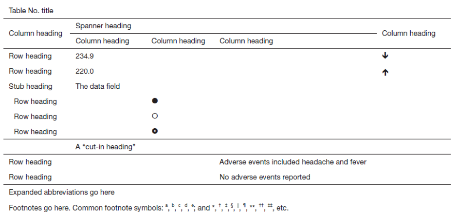
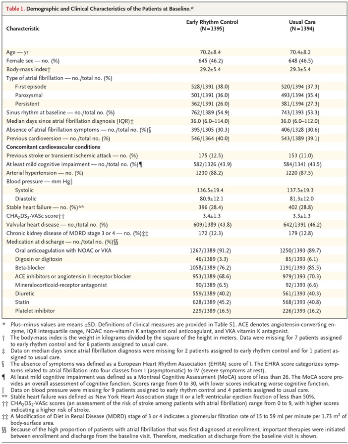
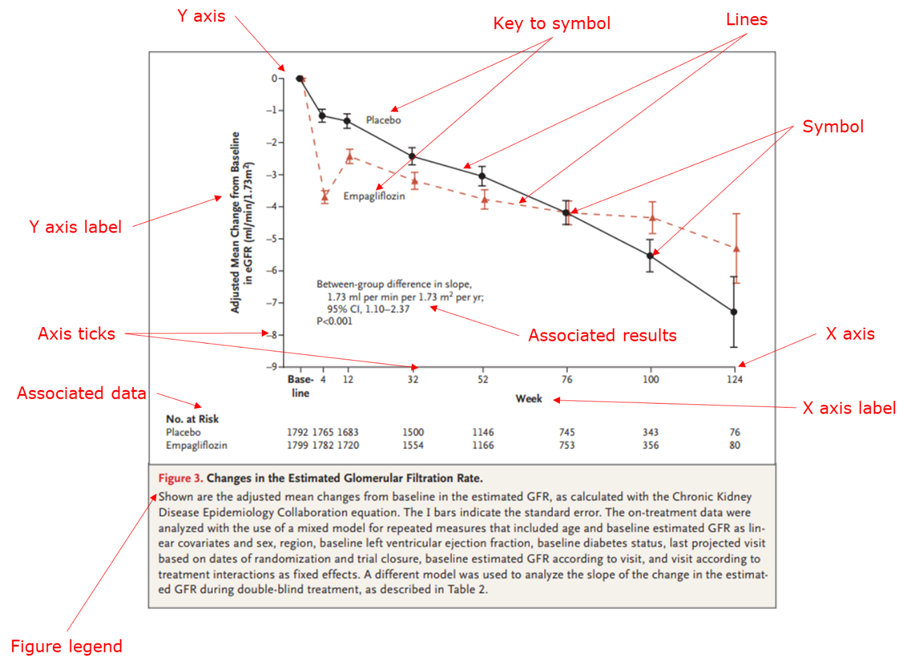
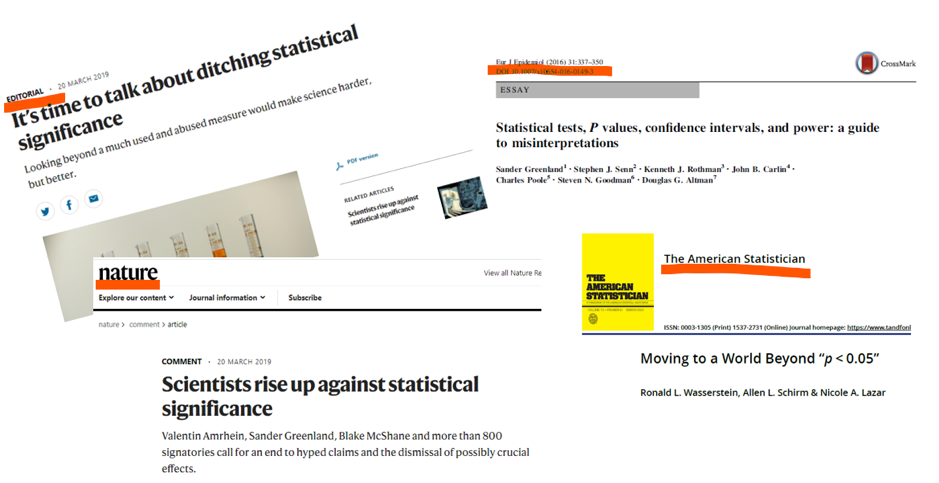
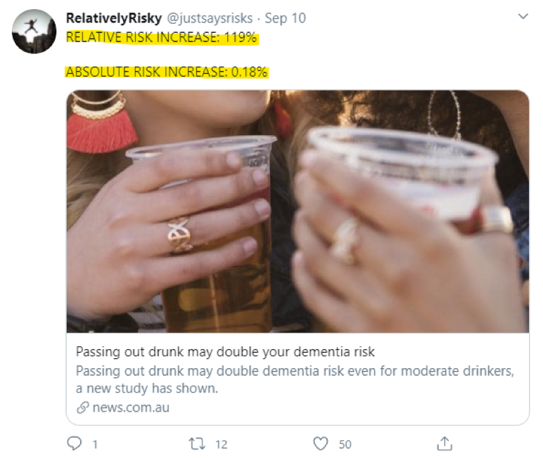
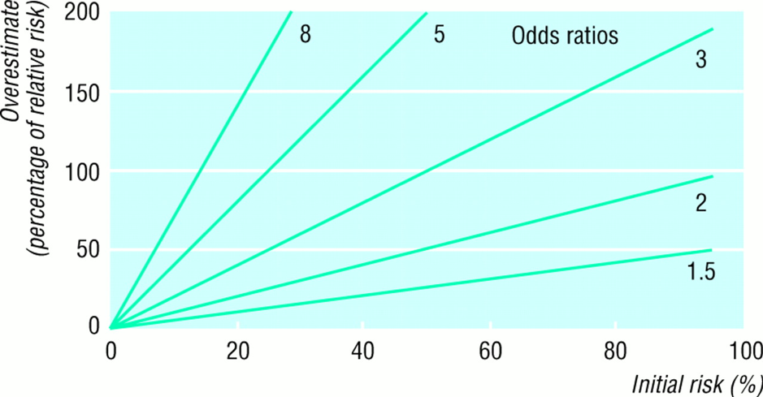
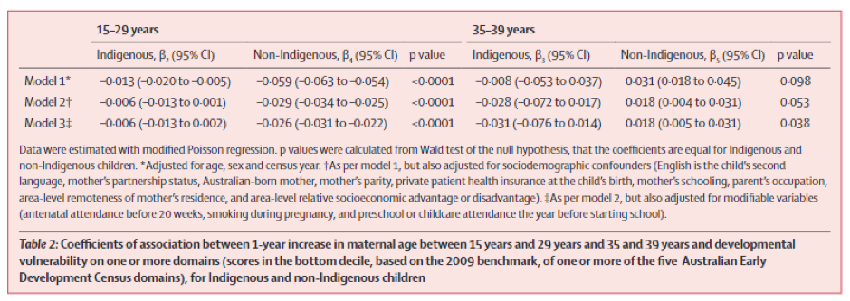

{width="75%"}

```{r setup, include=FALSE, warning=FALSE}

## required packages for examples - note that RMarkdown, learnr (and RStudio!) are also required.
library("learnr")
library("knitr")
library("kableExtra")
library("janitor")
library("ggplot2")
library("dplyr")
library("compareGroups")
library("sjPlot")
library("COVID19")

# Datasets
lalonde <-MatchIt::lalonde # lalonde data from the MatchIt package
#covidData <- COVID19::covid19(country = "Australia", level = 2) 

# Chunk options
knitr::opts_chunk$set(echo = FALSE)

```


## Overview  
Welcome to HDAT9700 Statistical Modelling II Chapter 10! 

As data scientists, you will always explore your research questions of interest by using various analytical strategies and statistical models you have already learned so far. Once your statistical analyses are complete, you will need to summarize and present the results for the readers. This chapter will help you understand how to present and interpret model results appropriately and effectively. 

### Learning outcomes 
At the end of this chapter, you will be able to: 

1.	Evaluate characteristics of good plots and tables
2.	Understand how to report statistical significance by interpreting P-values and confidence intervals  
3.	Communicate the estimates for measures of association
4.	Identify key guidelines and checklists for reporting of statistics


### Pre-reading 
Most of the content in this chapter is provided as written course notes. Although we referenced external papers and reports, we do not expect you to read every one. 
Our suggested list of prereadings for this chapter include: 

1.	Kenneth Rothman **Six Persistent Research Misconceptions** _J Gen Intern Med._ 2014 Jul; 29(7): 1060–1064. Available online [here](https://www.ncbi.nlm.nih.gov/pmc/articles/PMC4061362/) 

2. Gary King **Presenting and Interpreting Statistical Results** Available on [YouTube](https://www.youtube.com/watch?v=gbokhfMdfE8&list=PLmpS1iNDaUFtat0QiqXZhlsAgseWtJ1Kk&index=11&t=0s) (For the key comments relating to the topic of this chapter **_watch until 11m30s_**)


## Presentation of results 
Tables and figures are an integral part of presenting model results in a well-written scientific document - be it a journal paper, a thesis, or a technical report. Readers (editors, reviewers, and others) typically look at tables and figures before they read the text. Therefore, each table and figure should stand alone, and tell a complete story as much as possible. The readers should not need to refer back and forth to the text to make sense of them. Tables and Figures that are poorly rendered or that merely repeat information given in the text, however, can confuse the reader or clutter the paper. Therefore, each Table and Figure should serve its purpose well or be omitted. A high level of detail for tables and figures is a must.

### Tables vs. Figures: which one to choose? 
One of the decisions we must make is, which data belong in a table and which data belong in a figure. To decide that, we first need to understand the differences between them.  

Figures are helpful because 
* Figures have strong visual impact
* Figures are used to show trends and patterns in data 
* Figures can be used to highlight the most important results 

Tables can be helpful because 
* Tables can give precise values
* We can display a lot of information (many variables with many values) in a table

## Making better tables
>Tables are for communication, not data storage 

_Howard Wainer, American statistician_

Tables must have informative titles, a clear structure, and reliable data to allow readers to easily recognize and interpret important information or patterns in the data. Here, we will discuss how to design a good table, and several common mistakes we need to avoid when designing a table.

### The anatomy of a Table 
A table has a table number, a title, row and column headings, a field of data (numbers or symbols or text), units, perhaps some expanded abbreviations, and footnotes (Figure 1). In addition to numbers, tables can use symbols and text to communicate information. 



#### Table title 
* To make the table understandable independent of the text, the table title should provide enough information and also be specific. For example, a title like “Cancer incidence in Australia” is too broad and does not have specific information, whereas “Cancer incidence in Australia in 2010-2018, by age group and sex” provides specific information about the data in the table. 
* Use the same key terms in the table title, the column headings, and the text of the paper.  

#### Body of the table   
* The body of a table is composed of column heads, row heads, and the data field. 
* Column heads and row heads should identify the variables being presented. 
* A Spanner heading, which apply to two or more columns, allow data to be presented for subgroups. 
* When several row subheads are needed, they can be indented under a stub heading or introduced with a “cut-in” heading that crosses the entire data field. 
* The units of measurements should be included in either row or column headings as appropriate and need not follow individual values in the table. Using a % symbol in a row or column heading avoids the unnecessary repetition of the symbol for each cell in the row/column.  Units in the column or row headings must apply to every cell in the column or row. When the units of only one or two variables differ from those of the other variables in a table, they must be clearly mentioned in a footnote. 
* The precision of data (the number of decimal points given) should be consistent and not overemphasised.  There is no point of giving mean age or an odds ratio or relative risk to five decimal points. It is also important to remember that decimal points may vary according to the measures presented, for example, % don’t necessarily have the same number of decimal points as means. 
* Data also need to be aligned consistently by the decimal point in cells, while text, particularly row headings, is usually left-aligned. 
* The data field should not contain empty cells unless no value could logically be expected. When some data are missing, the missing status should be clearly indicated with an ellipsis (…) in the cell and accompanied by a footnote to indicate that the data were “not available”, “not detectable”, “not applicable”, as appropriate, which can sometimes be abbreviated in the table. 

#### Footnotes 
* Footnotes are placed below the body of a table, after any expanded abbreviations, and provide further information about some entries in the table. 
* In public health and medical journals, footnotes are generally indicated with two sets of marks: superscript, lower-case letters used in alphabetical order (a, b, c, d, e) and symbols (*, †, ‡, §, ||, ¶, **, ††, ‡‡, etc.). 
* We can use footnotes to explain statistical details (e.g. test used and reference group) involved with any particular result. 

*** 

### Example 
Let us look an example of a well-designed table from a recently published paper in the New England Journal of Medicine: 



Points to note: 

* Labels for all values are clearly explained. 
* Definitions for relevant variables (for example, body mass index) are given in the footnotes. 
* All units are given, as appropriate. 
* There are no empty cells. 
* Use of appropriate number of decimal points. 
* In the footnote, it is clearly mentioned what the ± values indicate. Abbreviations are also explained. 
* Stud-headings are used when several row subheads are needed (e.g. type of atrial fibrillation). 
* Cells are consistently aligned. 
* Information about missing data is given in the footnotes.  

### Some tips for making tables for journals 
1.	While preparing tables for a journal manuscript, model the format of the tables from already published tables in that journal (Do not reinvent the wheel!). 
2.	Most journals use three horizontal lines: one above the column headings, one below the column headings, and one below the data. Vertical lines are usually unnecessary.

3.	Read the journal’s Author Guidelines to find out information on the number, content, structure, and any other aspects of tables. Remember, some journals count tables in the word count of a manuscript. 

4.	Finally, all tables/figures should be referred to in the text somewhere too.


## Creating tables in R
There are many R packages available to help you create attractive tables. We recommend: 

* `compareGroups::compareGroups` and `compareGroups::createTable` to build compact and publication quality tables of summary statistics by group 

* `sjplot::tab_model()` to create HTML tables from regression models

* `janitor::tabyl()` and the associated `adorn_*` functions as a flexible set of tools to get tabular data in the format you need (the results can also be passed to kable).  

* `knitr::kable()` and `kableExtra()` for incorporating tables in R Markdown outputs> See https://cran.r-project.org/web/packages/kableExtra/vignettes/awesome_table_in_html.html

* This blogpost reviews several other options: https://rfortherestofus.com/2019/11/how-to-make-beautiful-tables-in-r/ 


### Exercises

#### Example 1. Summary statistics by group

The `compareGroups` package contains several functions to help build attractive and publication quality. Use the code chunk below to explore this function.  

```{r tab-ex1, exercise=TRUE, exercise.lines = 10}

tab <- compareGroups(treat ~ age + educ + black, 
                     data = lalonde,
                     method = c(2,2,3)
                     )

createTable(tab) 

## Try changing the summary method for age to 1 (e.g. normally distributed). What changes?

```

**Notes** 

* The `compareGroups()` function uses the usual formula syntax, with the grouping variable on the right hand side of ~ and the variables to be summarised on the left hand side of ~.
* The `method()` option in the `compareGroups()` function determines how a variable is summarised. The main method options are: 
    1: Treats the variable as continuous and normally distributed (returns means and standard deviations)
    2: Treats the variable as continuous (returns medians and quartiles)
    3: Treats the variable as categorical (returns proportions)
* Passing the output of `compareGroups()` to `createTable()` creates the summary table. 
* Enter `vignette("compareGroups_vignette")` at the console to find out more about the features of `compareGroups`.


```{r tab-ex1-hint-1}

## Try changing the summary method for age to 1 (e.g. normally distributed). What changes?
tab <- compareGroups(treat ~ age + educ + black, 
                     data = lalonde,
                     method = c(1,2,3)
                     )

createTable(tab) 
# Note that the summary of age changes from medians and quartiles to means and standard deviations. 
# The test of equality across groups is now statistically significant

```


***

#### Example 2. Present model results in table

The function `tab_model()` from the `sjPlot` package is one convenient way to plot model outputs. Use the code chunk below to explore this function.  

```{r tab-ex2, exercise=TRUE, exercise.lines = 10}
library(sjPlot)

mod1 <- lm(re78 ~ treat + age + educ, data = lalonde)

tab_model(mod1)

## Add a second model that extends mod1 above to include the variables `black` and `married` as model covariates. Present the two models side by side

```

```{r tab-ex2-hint-1}

## Add a second model that extends mod1 above to include the variables `black` and `married` as model covariates. Present the two models side by side
mod1 <- lm(re78 ~ treat + age + educ, data = lalonde)
mod2 <- lm(re78 ~ treat + age + educ + black + married, data = lalonde)
tab_model(mod1, mod2)

```

**Notes** 

* `tab_model() accepts model objects as inputs.
* Enter `vignette("tab_model_estimates")` at the console to find out more about the features of `sjPlot::tab_model()`.

***

#### Example 3 Creating summary tables with `janitor::tabyl()`

The `tabyl()` function from the `janitor` package is a tidyverse-orientated tool that makes it easy to work with tables as data.frames, incorporate into your `%>%` pipe workflows and get tables looking the way you want. 

```{r tab-ex3, exercise=TRUE, exercise.lines = 20}
library(dplyr)
library(janitor)

df1 <- lalonde %>% 
  filter(treat==0) %>% 
  tabyl(age) 
  
is.data.frame(df1)

df1

# Use dplyr::arrange() to sort df1 by the most common year of age 


# Use the pipe operator to also add percent formatting (adorn_pct_formatting())
```

```{r tab-ex3-hint-1}
# Use dplyr::arrange() to sort df1 by the most common year of age 
df1 %>% arrange(-n)
```

```{r tab-ex3-hint-2}
# Use the pipe operator to also add percent formatting (adorn_pct_formatting())
df1 %>% arrange(-n) %>% adorn_pct_formatting()
```


**Notes** 

* `tabyl()` takes data.frames as inputs and returns data.frames as outputs 
* tabyls work well in dataflows that use the `%>%` pipe operator 
* The `adorn_*` functions can be used to further customise tabyls 
* Enter `vignette("tabyls")` at the console to find out more about the features of `janitor::tabyl()`.

***

#### Example 4 Creating tables for HTML or LaTeX using `knitr::kable()` and `kableExtra()`

The `kable()` function from the `knitr` package is a simple function to create simple tables. `kableExtra` is a second package that adds visual features to `kable` output. 

```{r tab-ex4a, exercise=TRUE, exercise.lines = 25}
library(knitr)
library(kableExtra)

# Prep some tabular data
dt <- lalonde %>% 
  group_by(treat) %>% 
  summarise(educYrs = mean(educ)) 

# kbl() produces a very simple table
kbl(dt)

# Add some basic styling with a kableExtra theme
kbl(dt) %>% kable_styling() 

## Try exploring other available styles: 
# kable_paper
# kable_classic
# kable_classic_2
# kable_minimal 
# kable_material
# kable_material_dark

```

There are many ways to improve on this basic table, as you can see below.

```{r tab-ex4b, exercise=TRUE, exercise.lines = 20}
# Prep some tabular data
dt <- lalonde %>% 
  group_by(treat) %>% 
  summarise(educYrs = mean(educ)) 

# With some extra options...
kbl(dt, 
col.names = c("Treatment", "Years of education"), 
digits = c(0,1),
caption = "Table 1. Fancy table") %>% 
kable_styling(bootstrap_options = c("hover", "striped"),
full_width = F, 
position = "left") %>%
column_spec(1, bold = T, border_right = T, width = "2") %>%
column_spec(2, width = "4")
```


**Notes** 

* `kbl()` generates a very simple table. 
* `kableExtra` features can turn a plain `kable` table into an elegant HTML table. 
* Enter `vignette("awesome_table_in_html")` at the console to find out more about the features of `kableExtra`.


## Making better figures 
>“Figure quality is a paper’s suit and tie.”

_American Journal Experts (AJE) Report_

Figures are becoming more and more important for scientific communication. One indication of how Figures are drawing the attention is that in the last several years, PubMed and journal websites have begun to display thumbnails of figures alongside abstracts for all their indexed publications. This means that from the initial search for your papers, your figures are already making an impression.  

Broadly, we can distinguish between two types of figure: 

1.	**Graphs** line graphs, bar graphs, scatter plots, histograms, boxplots, forest plots etc.

2.	**Drawings and diagrams** Directed acyclic graphs (DAGs), participants’ flow-chart etc. 

### What kind of graph to choose? 

You might wonder what kind of figure you should choose for presenting your results. This totally depends on two things: i) what kind of data do you have; and ii) what you want to highlight (e.g. trends vs associations). For example, the graphic possibilities for presenting two numeric variables are very different from those for presenting two categorical variables.

A useful website to help you figuring out the appropriate graphs for your data is: [From Data to Viz](https://www.data-to-viz.com/). This website has classification of chart types based on input data format. It comes in the form of a decision tree leading to a set of potentially appropriate visualizations to represent the dataset. It also provides a reproducible code snippet in `R`. 

### The anatomy of a Figure 
A Figure has a Figure legend, axes information, data points, perhaps some expanded information, and footnotes (Figure 2). 



#### Figure Legend 
Like a Table, A Figure should also be able to stand alone. Readers want to understand it without going back and forth between the figure and the text sections. A good legend will make or break a figure. 

A figure legend may contain: 
* A brief title 
* Variable definitions 
* Definitions of symbols or lines 
* Explanation of panels (A, B, C, D) 
* Statistical information (statistical model specification, tests used, p-values) 
* Brief description of the key findings that are seen in the figure 

If we look at the legend of the supplied figure, we can see that it contains most of these details.

### Avoid ‘Chartjunk’: 
_Chartjunk_ refers to all the unnecessary or confusing visual elements found in a figure that do not improve the message (in the best case) or add confusion (in the worst case). For example, chartjunk may include the use of too many colours, too many labels, gratuitously coloured backgrounds, useless grid lines, etc. The term was first coined by Edward Tutfe, in which he argues that any decorations that do not tell the viewer something new must be banned: ‘Regardless of the cause, it is all non-data-ink or redundant data-ink, and it is often chartjunk.’

### Choosing appropriate y-axis 
The choice of y-axis in a graph can have a substantial influence on the story that it tells. Choosing an inappropriate y-axis can conceal or mislead the readers. As a rule of thumb, y-axis in a bar chart should include zero, whereas y-axis in a line graph does not necessarily have to include zero. This is because a bar chart emphasizes the absolute magnitude of values associated with each category, whereas a line graph emphasizes the change in the dependent variable (usually the y value) as the independent variable (usually the x value) changes.

If you are interested to know more about how the choice of axes on graphs can be misleading (with relevant examples), you can read this blogpost here: https://www.callingbullshit.org/tools/tools_misleading_axes.html  

### Some tips for making figures for journals 
* Title or no title? Usually a title for Figures included in a document is not needed because the legend conveys all the necessary information and the title just takes up extra space. However, for posters or projected images, where people may have a harder time reading the small print of a legend, a larger font title is very helpful.

* Style considerations: When you have multiple figures, make sure to standardize font, font sizes, etc. such that all figures look stylistically similar.
* Things to look for in journal guidelines: 
    * Figure width
    * File type (tiff or EPS) and resolution (600 dpi) 
    * Does the journal allow or encourage you to use colour? Does it cost more for coloured figures? Also, even if the journal accepts colour, lots of people will print it out in black and white. So, we suggest including colours in different shades or different linetypes (where relevant and possible) to distinguish between groups. 
    * If the use of colour is encouraged, is the colour space RGB? 
    * Font size and type
    * Line weight
    
### Multi-panel plots 
The number of display items in a scientific paper should be commensurate with the word length. Depending on this word count, manuscripts may have a limited number of display items (figures and/or tables). Thus, when preparing a figure for publication, you will often need to combine multiple plots or add objects (e.g., image or text) to an existing plot. In addition, multi-panel plots are a convenient way to make graphic comparisons between different shapes or trends (with axes in each plot having the same scale).
The legend of a multi-panel figure must also identify each graph and the data it presents by letter.

Of note, unlike figures, tables cannot have multiple panels or parts. Below is an example of multi-panel plot. 


## Creating figures in R
As you will know, `ggplot2` is the go-to package for creating beautiful figures in `R`, and is a key package to master if you are working in this environment. There are numerous introductions and tutorials available for `ggplot2` online, for example the tutorial on [r-statistics.co](http://r-statistics.co/Complete-Ggplot2-Tutorial-Part1-With-R-Code.html).

For the uninitiated, a good place to start is the Data Visualisation with `ggplot2` [cheat sheet](https://github.com/rstudio/cheatsheets/blob/master/data-visualization-2.1.pdf)

Useful additions to ggplot2 include  
* The `ggiraph` package for adding interactive elements to your ggplot2 output. See https://davidgohel.github.io/ggiraph/

* The `daggity` and `ggdag` package for drawing DAGs. See https://cran.r-project.org/web/packages/ggdag/vignettes/intro-to-ggdag.html

* The ggmap package for plotting spatial data

### Exercise

The plot below shows cumulative confirmed cases of COVID19 per 100,000 population for Australia, Ireland and Singapore. The data are accessed through the `COVID19` R package which uses data from John Hopkins University. The plot is ok but it could be a lot better! Can you extend this code to: 

1. Include an appropriate title, x- and y-axis titles and a caption to indicate the data source 
2. Update the legend to replace "id" with a proper title, use complete country names rahter than three-letter acronyms and use lines coloured Gold for Australia, Green for Ireland and Red for Singapore.

```{r figs-ex, exercise = TRUE, exercise.lines = 20}
covidData <- COVID19::covid19(country = c("Australia", "Ireland", "Singapore"), verbose = FALSE)

ggplot(covidData, aes(x=date, y=100000*confirmed/population, color=id)) + 
  geom_point()

```

```{r figs-ex-hint-1}
# To label the plot add + labs(x = , y =, title = , caption =)
```

```{r figs-ex-hint-2}
ggplot(covidData, aes(x=date, y=100000*confirmed/population, color=id)) + 
  geom_point() +
  labs(y="Cases per 100,000 population", 
     x = 'Date', 
     title = "Cumulative COVID19 cases, Jan-Oct 2020",
     caption = "Data source: John Hopkins University") 
```

```{r figs-ex-hint-3}
# To personaised the legend add + scale_color_manual(name = , values = , labels =)
```

```{r figs-ex-hint-4}
ggplot(covidData, aes(x=date, y=100000*confirmed/population, color=id)) + 
  geom_point() +
  labs(y="Cases per 100,000 population", 
     x = 'Date', 
     title = "Cumulative COVID19 cases, Jan-Oct 2020", 
     caption = "Data source: John Hopkins University") + 
  scale_color_manual(name="Country", 
                   values = c("Gold", "Green", "Red"), 
                   labels = c("Australia", "Ireland", "Singapore"))
```


## Reporting statistical inference: P-values and confidence intervals

### The pervasive problem of statistical significance 
Misinterpretation and abuse of statistical tests, p-values, and confidence intervals have been rampant in health research for many decades. Much statistical teaching and practice has developed a strong (and unhealthy) focus on the idea that we should conclude there is ‘no difference’ or ‘no association’ just because a P value is larger than a threshold such as 0.05 or, equivalently, because a confidence interval includes zero (or one in case of exponentiated estimates). Similarly, we should not conclude that two studies conflict because one had a statistically significant result and the other did not. 
Bucketing results into ‘statistically significant’ and ‘statistically non-significant’ is unnecessary and often damaging to valid interpretation of data. The trouble is human and cognitive more than it is statistical. The correct use and interpretation of these statistics requires an attention to detail and acceptance of uncertainty which seems to tax the patience of many researchers.

Good news is there have been uprisings against such misinterpretations from many veteran statisticians in recent times. Here are some recent examples: 



### Fundamental Problems of Statistical Significance Testing
Among the many reasons are that statistical significance testing is based on the P-value, which mixes effect size with precision. It is problematic to measure two things with one such number. Therefore, measuring effect size and its precision as separate tasks is a more direct and clearer approach to data interpretation. Confidence interval gives effect size by the location of the interval on the parameter scale, and the distance between the lower and upper limit indicates the precision. 

Another problem with statistical testing is that it reduces the quantitative P-value to a qualitative measure - "significant" or "non-significant". It is unfortunate that a confidence interval is also typically used merely to judge whether it contains the null value or not, thus converting it to a significance test.

To know more about P-values, you can look at the six principles provided by the American Statistical Association (ASA). 

<div class="aside">

### American Statistical Association (ASA) Statement on Statistical Significance and P-Values: Six principles 

1. P-values can indicate how incompatible the data are with a specified statistical model. 
2. P-values do not measure the probability that the studied hypothesis is true, or the probability that the data were produced by random chance alone. 3. Scientific conclusions and business or policy decisions should not be based only on whether a p-value passes a specific threshold. 
4. Proper inference requires full reporting and transparency. 
5. A p-value, or statistical significance, does not measure the size of an effect or the importance of a result. 
6. By itself, a p-value does not provide a good measure of evidence regarding a model or hypothesis.

</div>

### The way forward: a shift from significance testing to estimation 

It is important to remember that estimation of the effect size and the uncertainty surrounding the estimates are far more important for scientific inference and sound judgment than any arbitrary classification of results into ‘‘significant’’ and ‘‘non-significant’’. 

Here are seven points (five **Don’t**s and two **Do**s) you should remember while interpreting the results from your statistical models: 

**Don't**

* Don’t base your conclusions solely on whether an association or effect was found to be “statistically significant” (i.e., the P-value passed some arbitrary threshold such as p < 0.05). 
* Don’t believe that an association or effect exists just because it was statistically significant. 
* Don’t believe that an association or effect is absent just because it was not statistically significant. 
* Don’t believe that your p-value gives the probability that chance alone produced the observed association or effect or the probability that your test hypothesis is true.
* Don’t conclude anything about scientific or practical importance based on statistical significance (or lack thereof). 

**DO** 

* Do use confidence intervals as quantitative measures indicating magnitude of effect size and degree of precision, with little attention paid to the precise location of the boundaries of the confidence interval. 
* Do accept uncertainty: P-values, confidence intervals, and other statistical measures are all uncertain. 


### Statistical significance vs. clinical significance 

Statistical significance implies that the difference seen in the sample also exists in the population. Clinical significance implies that the difference between treatments in effectiveness is clinically important, and it is possible that clinical practice will change if such a difference is seen. Statistical significance is used to inform clinical significance. However, clinical significance and statistical significance are often confused. The terms are often used interchangeably, although one does not necessarily imply the other. Researchers sometimes infer that the effectiveness of a treatment is clinically significant because the difference between treatments is statistically significant. However, clinical significance cannot necessarily be inferred from statistical significance, and statistical significance cannot be inferred from clinical significance. 
This is particularly relevant in this era of “big data” because with a large enough sample size any result can be significant. So obviously relying just on statistical significance is not useful.

For example, a recent study published in the Journal of Clinical Oncology compared overall survival in 569 patients with advanced pancreatic cancer who were randomised to receive erlotinib plus gemcitabine versus gemcitabine alone. Median survival was found to be “significantly” prolonged in the erlotinib/gemcitabine arm (6.24 months vs. 5.91 months, P = 0.038). In this example, the clinical relevance of this study is the “treatment effect” or difference in median survival between 6.24 and 5.91 months – a mere 10 days, which most oncologists would agree is a clinically irrelevant “improvement” in outcomes, especially when considering the added toxicity and costs involved with the combination.

## Communicating the estimates for measures of association

>Odds ratio - a stranger to both physicians and gamblers, but a friend of many biostatisticians and epidemiologists.
_Sinclair JC, J Clin Epidemiol. 1994_

While communicating the results from our statistical models, another important issue we need to consider is how to communicate the estimates for measures of association. Often, we use relative risks and odds ratios as measures of effect size for dichotomous outcomes (an outcome that is either present or absent, such as mortality). 

In this section, we will cover how to communicate these estimates in plain English language for scientific communications, and in particular, what are the caveats we should consider while communicating odds ratios. 

For illustrative purpose, let us consider a hypothetical randomised controlled trial (RCT). In this RCT, 76 depressed patients were randomly assigned to receive either venlafaxine (n = 40), an antidepressant, or placebo (n = 36) for 8 weeks. During the trial, new-onset sexual dysfunction was identified in 8 patients treated with venlafaxine and in 3 patients treated with placebo. These results are presented in the following Table. 
Table 1: Hypothetical results of an 8-week randomised controlled trial of venlafaxine (n = 40) vs placebo (n = 36) 

```{r}

dt <- data.frame(
  category = c("Received venlafaxine", "Received placebo", "Total"), 
  yes = c(8, 3, 11),
  no = c(32, 33, 65),
  total = c(40, 36, 76)
)

dt %>%
  kbl(col.names = c("", "Developed sexual dysfunction", "Did not develop sexual dysfunction", "Total"), 
      caption = "Table 1: Hypothetical results of an 8-week randomised controlled trial of venlafaxine (n = 40) vs placebo (n = 36)") %>%
  kable_styling(bootstrap_options = "striped", full_width = F, position = "left") %>% 
  column_spec(1, width = "25%") %>%
  column_spec(2, width = "25%") %>% 
  column_spec(3, width = "25%") %>% 
  column_spec(4, width = "25%")

```

### Communicating relative risks

As you can remember from your previous readings, a relative risk is the ratio of two probabilities. The relative risk of an event is the likelihood of its occurrence after exposure to a risk variable as compared with the likelihood of its occurrence in a control or reference group.

With reference to the data in Table 1, the absolute risks of sexual dysfunction with venlafaxine and place are 8/40 = 20.00% and 3/36 = 8.33%, respectively. Therefore, the relative risk of sexual dysfunction with venlafaxine vs. placebo is 20.00/8.33 = 2.40.

We can communicate the result in plain English in several ways: 
* Venlafaxine, relative to placebo, is associated with a 2.4-fold risk of sexual dysfunction. 
* Venlafaxine is associated with a more than doubled risk of sexual dysfunction. 
* The risk of sexual dysfunction with venlafaxine is 2.4 times that with placebo. 
* The risk of sexual dysfunction with venlafaxine is 240% that with placebo. 
* Compared with placebo, venlafaxine is associated with a 1.4-fold increased risk of sexual dysfunction. 
* Compared with placebo, venlafaxine is associated with a 140% increased risk of sexual dysfunction.   

As you have realised that some of these ways of expressing the findings sound more alarming than others, and we (the researchers) may manipulate the readers by using more or less alarming terminology to increase or decrease the emotional impact of our findings. 

<div class="aside">

### An explanatory note

Why 1.4 and 140%? Because a relative risk of 2.4 means “2.4/1”, or 2.4 cases with venlafaxine for every case with placebo. In other words, there are 1.4 extra case with venlafaxine for every case with placebo; 1.4 and 140% are synonymous. You should consider the subtle differences in wording between “2.4-fold risk” vs. “1.4-fold increased risk” and “240% the risk” vs. “140% increased risk” since it can be confusing.

</div>

### Relative vs absolute risk
Another important thing to consider is that relative risk might give us a very misleading estimate of the actual risk, especially when the risks are quite small. Therefore, reporting absolute risk estimates in each group (or their difference) helps the readers to understand risk in a more comprehensive manner. While relative risk is the ratio between one risk and another, absolute risk difference is the absolute difference between the two risks.



Let’s look at this example. A study on more than 131,000 people found that losing consciousness from alcohol may double your risk of developing dementia later in life. As you can see, the relative risk increase was 119%, whereas the absolute risk increase was 0.18%. Using absolute as well as relative risk differences can make a huge difference in how we all understand risk.

If you are interested to see many of such examples, you can explore this Twitter account: https://twitter.com/justsaysrisks 


### Communicating odds ratios 
Unlike relative risks, which are the ratio of two probabilities, the odds are the probability of an event occurring, divided by the probability of that event not occurring. Therefore, an odds ratio is the ratio of two odds.

With reference to the data in Table 1, the odds of developing sexual dysfunction with venlafaxine are 8/32 = 0.25, and the odds of developing sexual dysfunction with placebo are 3/33 = 0.091. The odds ratio, therefore, is 0.25/0.091 = 2.75. 

We can interpret the result in plain English: 
* The odds of developing sexual dysfunction with venlafaxine (relative to placebo) are 2.75 to 1. 
* The odds of developing sexual dysfunction with venlafaxine are 2.75 as large compared with placebo. 
* There is a 175% increase in odds of developing sexual dysfunction with venlafaxine when compared with odds of developing sexual dysfunction with placebo. 
As you can see here, the communications for odds ratios are not as intuitive as relative risks, particularly because odds are not an easy-to-understand concept like probabilities. 

### When can odds ratios mislead?
Despite the fact that the communications of odds ratios are unintuitive, they are commonly used in public health and medical research because of their statistical properties. Odds ratios are useful in case-control studies, where the absolute risks and hence the relative risks cannot be estimated. They also greatly facilitate statistical analyses (logistic regression), particularly when researchers are interested in adjusting for multiple variables in multivariable analyses.

Nevertheless, odds ratios are often inappropriately communicated. Odds ratios are often communicated as though they were relative risks. Translation of an odds ratio of X to an “X-fold risk,” is seen commonly in published papers. This is wrong because odds ratios are based on a different underlying concept than relative risks, as the worked examples here show. Then, “why has this practice has been so rampant for so long?” – you might ask. 

Under certain circumstances, odds ratios and relative risks are essentially equivalent. Such a situation occurs when the probability of an event occurring is low. This has been called the “rare disease assumption” with a probability of less than 10% being a commonly used benchmark. However, when an event occurs more commonly, the odds ratios always overstate any effect size whereas relative risks remain constant. The odds ratio is smaller than the relative risk for odds ratios of less than one, and bigger than the relative risk for odds ratios of greater than one. Thus, interpreting an odds ratio as though it were a relative risk could mislead us into believing that an effect size is bigger than is actually the case.
Let us see the following figure to understand how much overestimation happens when odds ratios of >1 are interpreted as relative risks. 



It is also important to remember that because of the mathematical behaviour of the odds ratio, estimates of the odds ratio may vary among studies of differing designs, even if the actual risk ratio is constant.

Of course, although qualitative judgments about effect size may be unaltered by the odds ratio deviating from the relative risk, quantitatively we can still be led astray. A helpful rule of thumb is the “rule of five”. If the odds ratio is greater than one but no greater than five and the occurrence of the outcome in the unexposed group is no greater than 5%, then the odds ratio exceeds the relative risks by less than 20%. 

## Association versus causation 

You have already come to know that statistical models fall into three categories: i) descriptive, ii) predictive, and iii) explanatory or causal. As data scientists, what we really want to communicate from our explanatory or causal statistical models is that variable X “causes” / “impacts” / “benefits” the outcome Y. However, such interpretations are usually categorised as “causal” and therefore, they are routinely avoided in scientific communications, particularly in those involving observational data. Instead, we often limit our interpretations to language that indicate association rather than causation. Now the question is “Why do we do it, especially when a core task of science is to understand causal relationship?” When we observed a statistical association between two variables, it can merely suggest a hypothesis, such as a common cause, but cannot offer proof of causation. This is mainly because confounding is always a possibility. 

Suppose we want to know whether daily drinking of 4 cups of coffee affects the risk of developing skin cancer. Since randomly assigning people to drink certain amount of coffee is unethical (hence forbidden), we analyse observational data and say that our analysis yields a relative risk of 0.8 for daily drinking 4 cups of coffee when compared no coffee drinking. We can communicate the results in two ways: 

1)	In associational language: “those who drink 4 cups of coffee daily have, on average, a 20% lower risk of skin caner than those who do not drink coffee”; and 
2)	In causal language: “drinking 4 cups of coffee daily lowers the risk of skin cancer by 20%”.     

The second interpretation (in causal language) is not appropriate because the observed association does not necessarily mean that coffee confers resistance to cancer. One might argue that people who drink a lot of coffee work indoors for long hours and thus have little exposure to the sun, a known risk factor for skin cancer. Therefore, in this is the case, the number of hours spent outdoors is a confounding variable – a correlate of both coffee drinking and skin cancer – can partly or fully explain the observed association. This is why researchers often refrain from explicitly interpreting results as causal effect estimates. 

However, in his [recent commentary in American Journal of Public Health](https://pubmed.ncbi.nlm.nih.gov/29565659/), Miguel Hernán argued that although causal language should be avoided while communicating measures of association, we need to use causal language to accurately describe the aims of our research, be it based on randomized trial or observational data. He suggested that the term “causal effect” can be appropriate in the title and Introduction section of our article when describing the aim of our research, in the Methods section when describing which causal effect we are trying to estimate through an association measure, and in the Discussion section when providing arguments for and against the causal interpretation of our association measure. The only part of the article in which the term “causal effect” has no place is the Results section, which should present the findings without trying to interpret them. If you are interested in knowing more, you can read the commentary here: https://pubmed.ncbi.nlm.nih.gov/29565659/

## Describing results: An example  

At this point, you might be wondering how to incorporate all these concepts of communicating model results into practice! Let us look at an example of a table providing the main results from statistical models and accompanying paragraph describing those results. 

[Hanly et al (2020)](https://doi.org/10.1016/S2352-4642(19)30334-7) examined the role of maternal age at birth in child development among Indigenous and non-Indigenous Australian children in their first school year, and they presented the results from statistical models in Table 2. 

{width="85%"}

Now let us see how they explained these results in the text. Note that the descriptive text links the estimated model parameters in the table to a plain-English interpretation. Each point estimate is quoted together with the corresponding 95% confidence intervals. The text re-emphasises the different sets of controls used for each model and p-values are used to support comparisons between different subgroups.  

>With statistical modelling, we confirmed decreasing developmental vulnerability with increasing maternal age in children of mothers aged 15–29 years for both populations (table 2). However, the slope of model 1 was significantly shallower in Indigenous than non-Indigenous children (β2=–0·013; 95% CI −0·020 to −0·005 vs β4=–0·059; −0·063 to −0·054; p<0·0001), indicating that the decreased risk of developmental vulnerability with each additional year of maternal age between 15 and 29 years was greater in the non-Indigenous children than in the Indigenous children. Controlling for socioeconomic advantage and disadvantage (model 2) reduced the magnitude of the association between maternal age and childhood development between maternal ages of 15 and 29 years in Indigenous (β2=–0·006; −0·013 to 0·001) and non-Indigenous (β4=–0·029; −0·034 to −0·025) children. Further controlling for potentially modifiable factors—including antenatal attendance before 20 weeks, smoking during pregnancy, and preschool or childcare attendance in the year before starting school (model 3)—had little additional impact on the estimated effect of increasing maternal age within the age range of 15–29 years for Indigenous (β2=–0·006; −0·013 to −0·002) or non-Indigenous children (β4=–0·026; −0·031 to −0·022). The stronger association between maternal age and developmental vulnerability for non-Indigenous children compared to Indigenous children was maintained in the adjusted models. 
We found no association between maternal age and developmental vulnerability among Indigenous children born to mothers aged 35–39 years (β3=–0·008; 95% CI −0·053 to 0·037; table 2). By contrast, increasing risk was observed with increasing maternal age in non-Indigenous children born to mothers aged 35–39 years (β5=0·031; 0·018 to 0·045), although the difference in model slopes for the two groups was not significant in the baseline model (model 1) which adjusted for age, sex and census year (p=0·098). For Indigenous children, the relationship between maternal age and the risk of developmental vulnerability is null or slightly negative in this age range; however, due to the small sample size for this population, the slope did not statistically differ from zero in any of the models.
 
## Guidelines for reporting model results

The reporting of model results is often inadequate, which hampers the assessment of strengths and weaknesses and generalisability of findings. Also, statistical models should be reported transparently so that readers can follow what was planned, what was done, what was found, and what conclusions were drawn. Therefore, to provide guidance on how to report study results, several reporting guidelines (with checklist of items) have been developed by the methodologists, researchers, and journal editors. 

The use reporting guidelines depends on the underlying study design and data source. You can find the list of these reporting guidelines on the website of **E**nhancing the **QUA**lity and **T**ransparency **O**f health **R**esearch (Equator) Network. https://www.equator-network.org/reporting-guidelines/ 

As health data scientists, you will be dealing mostly with observational data. So, the most relevant reporting guidelines for you are: 

1.	The **St**rengthening the **R**eporting of **Ob**servational Studies in **E**pidemiology (STROBE) Statement: guidelines for reporting observational studies https://www.equator-network.org/reporting-guidelines/strobe/

2.	The **RE**porting of studies **C**onducted using **O**bservational **R**outinely-collected health **D**ata (RECORD) Statement https://www.equator-network.org/reporting-guidelines/record/ 

Download the guidelines and have a look at the checklist items. 

## References 
_The papers below are for referencing purpose only_

1. Sedgwick P. Clinical significance versus statistical significance. BMJ. 2014 Mar 14;348. 

2. Persoskie A, Ferrer RA. A most odd ratio: Interpreting and describing odds ratios. American Journal of Preventive Medicine. 2017 Feb 1;52(2):224-8. 

3. Holcomb Jr WL, Chaiworapongsa T, Luke DA, Burgdorf KD. An odd measure of risk: use and misuse of the odds ratio. Obstetrics & Gynecology. 2001 Oct 1;98(4):685-8. 

4. Altman N, Krzywinski M. Association, correlation and causation. 

5. Greenland S, Senn SJ, Rothman KJ, Carlin JB, Poole C, Goodman SN, Altman DG. Statistical tests, P values, confidence intervals, and power: a guide to misinterpretations. European Journal of Epidemiology. 2016 Apr 1;31(4):337-50. 

6. Assel M, Sjoberg D, Elders A, Wang X, Huo D, Botchway A, Delfino K, Fan Y, Zhao Z, Koyama T, Hollenbeck B. Guidelines for reporting of statistics for clinical research in urology. BJU International. 2019 Mar;123(3):401-10. 

7. Stratton IM, Neil A. How to ensure your paper is rejected by the statistical reviewer. Diabetic Medicine. 2005 Apr 1;22(4):371-3. 

8. Greenwood DC, Freeman JV. How to spot a statistical problem: advice for a non-statistical reviewer. BMC Medicine. 2015 Dec;13(1):1-3. 

9. Wasserstein RL, Schirm AL, Lazar NA. Moving to a world beyond “p< 0.05”. 

10. Norton EC, Dowd BE, Maciejewski ML. Odds ratios—current best practice and use. JAMA 2018 Jul 3;320(1):84-5. 

11. Liu W. Preparing better tables. Journal of Public Health and Emergency; 2018, 2(1): 

12. Hardwicke TE, Ioannidis JP. Petitions in scientific argumentation: dissecting the request to retire statistical significance. European Journal of Clinical Investigation. 2019 Oct;49(10):e13162. 

13. Rothman KJ. Six persistent research misconceptions. Journal of General Internal Medicine. 2014 Jul 1;29(7):1060-4. 

14. Rougier NP, Droettboom M, Bourne PE. Ten simple rules for better figures. PLoS Comput Biol. 2014 Sep 11;10(9):e1003833. 

15. Katz KA. The (relative) risks of using odds ratios. Archives of dermatology. 2006 Jun 1;142(6):761-4. 

16. Wasserstein RL, Lazar NA. The ASA statement on p-values: context, process, and purpose. 

17. Hernán MA. The C-word: scientific euphemisms do not improve causal inference from observational data. American Journal of Public Health. 2018 May;108(5):616-9. 

18. Andrade C. Understanding relative risk, odds ratio, and related terms: as simple as it can get. The Journal of Clinical Psychiatry. 2015 Jul 22;76(7):857-61. 

19. Davies HT, Crombie IK, Tavakoli M. When can odds ratios mislead?. BMJ. 1998 Mar 28;316(7136):989-91.

