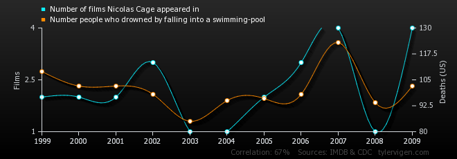
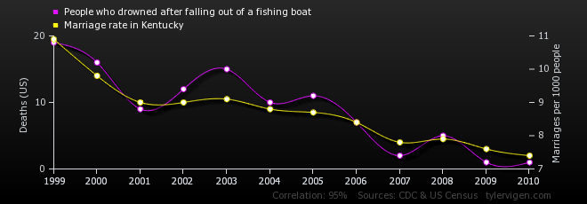
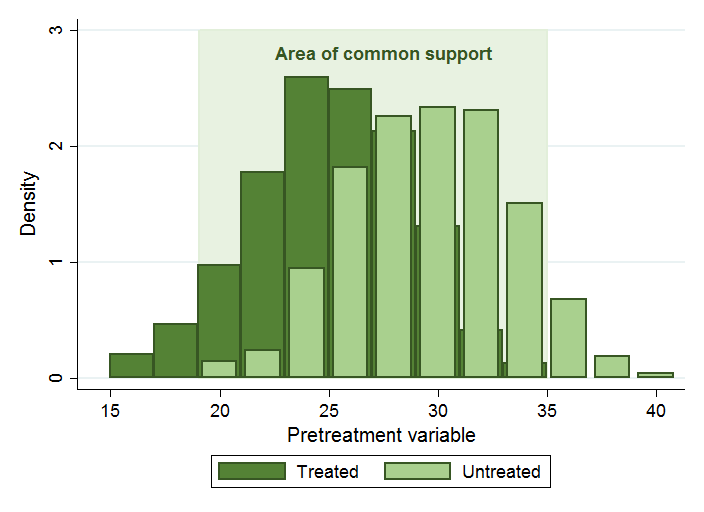

{width="75%"}

```{r setup, include=FALSE, warning=FALSE}
library("learnr")
knitr::opts_chunk$set(echo = FALSE)

## required packages for examples - note that RMarkdown, learnr (and RStudio!) are also required.
library("MatchIt")
library("cem")
library("optmatch")
library("knitr")
library("kableExtra")
library("ggdag")
```


## Overview  
Welcome to HDAT9700 Statistical Modelling II Propensity Score Matching! 

This chapter focuses on the challenge of drawing **causal inferences from observational data**.  

Previously, you learned about randomised control trials (RCTs), and different approaches to randomisation, including simple, block and stratified randomisation. RCTs are the gold standard design for estimating causal effects: because treatment assignment is under the researchers' control, it is possible to balance the characteristics of treated and untreated individuals, therefore any difference in their outcomes can be ascribed to the effect of the treatment or intervention.  

When analysing observational data (e.g. a cohort study or administrative data), treatment assignment is no longer under the researchers control. As a result, treated and untreated individuals may differ in ways related to the outcome, therefore it is not straightforward to ascribe differences in the outcome to the treatment.  

In this chapter we will explore **matching** as a general approach used to improve causal inferences from observational data. In broad terms, matching is a preprocessing technique that relies on pruning or duplicating observations so that the treated and untreated groups are similar in terms of their background characteristics. 

At the end of this chapter you will be able to

1. Understand the challenges of drawing causal inferences from observational data
2. Discuss the assumptions needed to estimate causal effects from observational data
3. Implement various approaches to matching using the R package `MatchIt` 


### Readings

#### Pre-reading
The pre-reading (pre-viewing!) for this chapter is the video _Why Propensity Scores Should Not Be Used For Matching_ presented by [Professor Gary King](garyking.org) from Harvard University. 


#### Reference text
The reference text for this chapter is "Matching as Nonparametric Preprocessing for Reducing Model Dependence in Parametric
Causal Inference" by Daniel Ho, Kosuke Imai, Gary King and Elizabeth Stuart, available [here](https://gking.harvard.edu/files/matchp.pdf). This chapter also draws heavily on the work of Miguel Hernán and colleagues---references are provided at the end of the chapter. 

So let's get _started_!! 


## What is causal inference?

The models that we fit as data scientists perform different functions and allow us to answer different questions. Statistical modeling tasks have been classified into three categories: 

1. Description  
2. Prediction  
3. Causal inference


**Descriptive** models can answer questions such as _what are the characteristics of children who participate in an early childhood program?_

**Predictive** models can answer questions such as _what is the probability of on-track development following participation in an early childhood program?_

**Causal models** can answer questions such as _does participation in an early childhood program improve children's development, on average?_

Causal inference is the science of posing and answering causal questions, "_questions which predict certain features of the world if the world had
been different_" (Hernán et al 2018)

***

There are many frameworks for assessing causality, some of which you covered in HDAT9200 Statistical foundations for health data science. Classical frameworks include the Bradford Hill Criteria and Rothman's sufficient-component cause model.   

In this chapter we approach causal inference from the **counterfactual framework**. This approach lends itself to more formalised discussion and identification of causal effects. The literature on counterfactual theory pays scant lip service to classical epidemiological frameworks such as the Bradford Hill criteria, but nonetheless these are still relevant and useful. 


<div class="aside">
### Aside

As a reminder, the  **Bradford Hill Criteria** are listed below.  

1. Strength (effect size)  
2. Consistency (reproducibility)  
3. Specificity  
4. Temporality  
5. Biological gradient  
6. Plausibility  
7. Coherence  
8. Experiment  
9. Analogy  

</div>

***

### Spurious correlations
We are all familiar with the old adage that _correlation does not imply causation_. Spurious correlations abound:

Number of films Nicolas Cage appeared in correlates with Number of people who drowned by falling into a swimming-pool $\rho=0.67$ 





**People who drowned after falling out of a fishing boat** correlates with **Marriage rate in Kentucky**  $\rho=0.95$  



Of course we know that correlation does not imply causation. Nonetheless:   

* In the absence of confounding, observational estimates and causal estimates are the same    
* With observational data, we can still pose and answer causal questions (provided sufficient background information is present)   
* Even RCTs can only provided measures of association---we are just more confident in interpreting these as causal because of the experimental design.  
* Causal inferences from a rich observational dataset can be more reliable than those from a sub-par RCT (especially if the RCT sample is small and treatment adherence is poor)  


## Counterfactual outcomes

Counterfactual outcomes refer to outcomes under alternative treatments or scenarios. These treatments may not have happened in real life so counterfactual outcomes are usually hypothetical! 

#### An example
The table below gives an example of the development outcomes (On-track/vulnerable) we might observe for children, some of who attended an early childhood program:    

```{r 8.01, exercise=FALSE, echo=FALSE}
dt <- cbind('Child'=c("Anne","Barry","Katie"), 'Participated?'= c("Yes","No","Yes"), 'Outcome following non-participation'=c(" ","On-track"," "), 'Outcome following participation'=c("On-track"," ","Vulnerable"))

  kable(dt,caption = "Developmental outcomes following program participation", align='lll') %>%
  kable_styling(bootstrap_options = c("striped", "hover", "condensed", "responsive")) %>%
  column_spec(1, bold = T, width = "20em") %>%
  column_spec(2, width = "20em") %>%
  column_spec(3:4, width = "35em")
  
```

* For Anne and Katie, we only observe what happened given that they did participate in the program  
* For Barry, we only observe what happened given that he did not participate

The counterfactual framework is based on the premise of knowing outcomes under both scenarios. This is a conceptual idea only: of course we can not observe the counterfactual, we must imagine we have the power to change history or to reverse time and rerun an experiment. 

If this was possible we would observe the full data table:

```{r 8.02, exercise=FALSE, echo=FALSE}
dt <- cbind('Child'=c("Anne","Barry","Katie"), 'Participated?'= c("Yes","No","Yes"), 'Outcome following non-participation'=c("Vulnerable","On-track","Vulnerable"), 'Outcome following participation'=c("On-track","On-track","Vulnerable"))

  kable(dt,caption = "Developmental outcomes following program participation (observed counterfactuals)", align='lll') %>%
  kable_styling(bootstrap_options = c("striped", "hover", "condensed", "responsive")) %>%
  column_spec(1, bold = T, width = "20em") %>%
  column_spec(2, width = "20em") %>%
  column_spec(3:4, width = "35em")
  
```

* In this table the counterfactuals are filled in  
* We "observe" the outcome following non participation for Anne and Katie  
* We "observe" the outcome following participation for Barry


## Notation
In order to define a causal effect more rigorously, we need to introduce some notation.

Let $A$ denote a dichotomous **a**ction, exposure or treatment. Let $A$ take the value $1$ if an individual receives the treatment and $0$ if they are untreated. Note, we will assume dichotomous treatments thoughout this chapter, but treatments or interventions with multiple arms are of course possible. 

Let $Y_{a=1}$ denote the observed outcome for treatment $A=1$, and $Y_{a=0}$ denote the observed outcome for treatment $A=0$  The outcomes $Y_{a=0}$ and $Y_{a=1}$ are referred to as counterfacutal outcomes. They are called *counterfactual* because one of the outcomes is under a treatment counter to what was actually observed. The term **potential outcomes** is also used, because Anne could potentially receive either treatment.

Let $L$ denote a vector of observed pretreatment variables 

***
To summarise, we have:

* $A$ treatment indicator  
* $Y_{a=x}$ outcome under treatment $x$  
* $L$ vector pretreatment variables  

***


<div class="family">

### A running example...

Let's set up a running example.

Consider an early childhood intervention program _*Helping Hands*_. Helping Hands is designed to support vulnerable families with young children aged 0-4. The program includes tailored assistance from a trained staff member who can provide parenting training and help coordinate access to early childhood services including health and childcare services.    

Answer the questions on causal effect notation below, with this example in mind.

</div>


```{r quiz1, echo=FALSE}
quiz(caption = "Quiz 1: Causal effects notation",
  question("Helping Hands participation status for a child is a potential example of",
    answer("$Y_{a=1}$"),
    answer("$A$", correct = TRUE),
    answer("$L$"),
    random_answer_order = TRUE,
    allow_retry = TRUE
  ),
  question("Development outcomes for a child who participated in Helping Hands is a potential example of",
    answer("$Y_{a=1}$", correct = TRUE),
    answer("$A$"),
    answer("$L$"),
    random_answer_order = TRUE,
    allow_retry = TRUE
  ),
  question("A child's parents income is a potential example of",
    answer("$Y_{a=1}$"),
    answer("$A$"),
    answer("$L$", correct = TRUE),
    random_answer_order = TRUE,
    allow_retry = TRUE
  )
)
```

## Defining Causal Effects {data-progressive=TRUE}

Below is the table we saw earlier, relabelled with the notation we have just covered. 

```{r 8.03, exercise=FALSE, echo=FALSE}
dt <- cbind('Child'=c("Anne","Barry","Katie"), 'A'= c("Yes","No","Yes"), '$Y_{a=0}$'=c("Vulnerable","On-track","Vulnerable"), '$Y_{a=1}$'=c("On-track","On-track","Vulnerable"))

  kable(dt,caption = "Developmental outcomes following program participation (observed counterfactuals)", align='lll') %>%
  kable_styling(bootstrap_options = c("striped", "hover", "condensed", "responsive")) %>%
  column_spec(1, bold = T, width = "20em") %>%
  column_spec(2, width = "20em") %>%
  column_spec(3:4, width = "35em")
  
```  

### Individual causal effect

Focusing on the first child Anne, we see that $Y_{a=0} = \text{Vulnerable}$, whereas $Y_{a=1} = \text{On-track}$. This tells us that participation in Helping Hands had an causal effect on Anne's development.

In general, an individual causal effect is present when counterfactual outcomes differ, i.e.
$$
Y_{a=0} \ne Y_{a=1}
$$

<div class="think">

### Pause and think...
Is there an individual causal effect for Barry or Katie?

</div>


### Population causal effect

In practice, we can't examine individual causal effects. Instead we focus on population causal effects. 

We define $P(Y(1)=1)$ as the proportion of individuals experiencing the outcome $Y$ if $A=1$. And $P(Y(0)=1)$ as the proportion of individuals experiencing the outcome $Y$ if $A=0$.

If these two proportions are different, the treatment $A$ has a causal effect on $Y$, i.e.
$$
P(Y(0)=1) \ne P(Y(1)=1)
$$
<div class="think">
### Pause and think...
Is there a population causal effect of helping hands on development in the table below?

</div>

```{r 8.04, exercise=FALSE, echo=FALSE}
dt <- cbind('Child'=c("Anne","Barry","Katie", "Mikey", "Nuffy", "Deirdre", "John", "Betty", "Oliver", "Monica"), 'A'= c("Yes","No","Yes","No","Yes","Yes","No","Yes", "No", "No"), '$Y_{a=0}$'=c("Vulnerable","On-track","Vulnerable", "Vulnerable","On-track","Vulnerable", "Vulnerable", "Vulnerable", "On-track", "On-track"), '$Y_{a=1}$'=c("On-track","On-track","Vulnerable", "On-track","Vulnerable", "On-track","Vulnerable", "Vulnerable", "On-track", "On-track"))

  kable(dt,caption = "Developmental outcomes following program participation (observed counterfactuals)", align='lll') %>%
  kable_styling(bootstrap_options = c("striped", "hover", "condensed", "responsive")) %>%
  column_spec(1, bold = T, width = "20em") %>%
  column_spec(2, width = "20em") %>%
  column_spec(3:4, width = "35em")
  
``` 

### Discussions points
For the children listed in the table, 4/10 have on-track development if nobody participates in the program. If everybody particpates then 6/10 have on-track development.

So we have:

$P(Y(0)=1)=0.4$  
$P(Y(1)=1)=0.6$

$P(Y(0)=1) \ne P(Y(1)=1)$ therefore we can say there is a causal effect of program participation.

### Causal effect measures
Causal effects can be measured on the additive or multiplicative scale:

**Additive scale**  
$P(Y(1)=1) - P(Y(0)=1)$ 

**Multiplicative scale**  
$P(Y(1)=1)/P(Y(0)=1)$ 


<div class="think">
### Pause and think...

In the example above, what is the causal effect on (i) the additive scale and (ii) the multiplicative scale?

</div>


```{r quiz2, echo=FALSE}
quiz(caption = "Quiz 2: Causal effect measures",
  question("The causal effect on the additive scale is",
    answer("1.0"),
    answer("$0.67$"),
    answer("$1.5$"),
    answer("0.2", correct = TRUE),
    random_answer_order = TRUE,
    allow_retry = TRUE
  ),
  question("The causal effect on the multiplicative scale is",
    answer("1.0"),
    answer("$0.67$"),
    answer("$1.5$", correct = TRUE),
    answer("0.2"),
    random_answer_order = TRUE,
    allow_retry = TRUE
  )
)
```


## Quantities of interest {data-progressive=TRUE}

### Different types of treatment effect
Having set up this framework for causal inference, it is possible to focus on different treatment effects by comparing outcomes among different populations. Two treatment effects of particular interest are  

1. **The Average Treatment Effect (ATE)**  
The ATE estimates the average effect of applying a treatment to the entire population  

2. **Average Treatment effect among the Treated (ATT)**  
The ATT estimates the average effect of the treatment on *those who actually received the treatment*

These quantities are both valid, but may be more or less of interest depending on context. For example, if a treatment is very expensive and/or invasive, it is likely to be administered to targeted subgroups rather than whole populations, and therefore the ATT is of more interest. The ATE is more applicable in estimating the effect of broad-based interventions that are rolled out to whole populations.


<div class="think">

### Pause and think...
Which effect (ATT or ATE) would be more relevant when evaluating an intervention like Helping Hands? 

Can you think of an example where (i) the ATE and (ii) the ATT would be more relevant?

</div>

### Points to note...

* A program like Helping Hands is unlikely to be rolled out to an entire population,  rather a small number of known individuals will be treated. The Average Treatment effect among the Treated will therefore be more relevant. 
* The Average Treatment Effect would be more relevant for a public health awareness campaign that is rolled out nationally on TV, radio and other media. The aim will be to reach everyone in the population but the people running the campaign are unlikely to know exactly who has been 'treated' i.e. been exposed to the advertising. 


## Randomisation 
Randomised experiments were discussed in Chapter 1. Classical random experiments have three core characteristics:  
1. Large $N$  
2. Random selection of individuals from a population  
3. Random assignment of individuals to a treatment  

When these three characteristics are present, any background characteristics should be distributed equally among the untreated ($A=0$) and treated ($A=1$) individuals. 
 

## The problem with observational data {data-progressive=TRUE}
In an observational study, the characteristics of a population are observed but there is no intervention by the researcher. Examples of observational studies include cross-sectional, case-control and cohort studies. 

When the researcher doesn't have control over treatment assignment it becomes more difficult to identify causal effects. You will probably have a good intuitive sense of why this is the case...

### Pause and think

<div class="family">

### Consider...
...a cross-sectional study that gathered information in a community where some children participated in the Helping Hands program. Bivariate analysis showed that children who participated in Helping Hands had significantly lower child development scores at age five. Why would it be problematic to claim that Helping Hands had a causal effect on development from this data source?  

Can you give another example of a scenario where causal claims from a cross-sectional dataset may be questionable?  

</div>

<div class="think">

### Can you draw a DAG to describe this scenario?
Think back on last week's lecture!

</div>

### Possible solution
Because the Helping Hands program is targeted towards 'vulnerable' families there are likely to be confounding background characteristics (L variables, in our notation) that increase the chances of taking part in the program and decrease the chances of on-track development. For vulnerable families, this might include things like education, employment, physical & mental health, access to health services and other supports, parenting skills, and drug & alcohol issues. In the DAG below these confounding factors have been grouped together into a single node: 'pre-existing family vulnerabilities'.
 
``` {r}
ggdag_confounder_triangle(x="Helping hands participation", y="Development at age five", z="Pre-existing family issues", 
                          use_labels = "label",
                          label_col = "black",
                          text = FALSE,
                          x_y_associated = TRUE) +
  theme_dag()
```


### Points to think about
In the first scenario, assignment to the treatment---participation in Helping Hands---is not under the researchers control. Because the data are observational, we are just observing what has already happened, and as discussed above children who participated in Helping Hands may have different characteristics compared to those who do not. Crucially, these differing characteristics *may also relate to child development*. For example, Helping Hands participants might come from economically disadvantaged families, or families where there are drug or alcohol issues. The observed relationship between participation and development may be attributable to these other factors, therefore we can't claim a causal effect of the program. What we can say is that Helping Hands participation is **associated** with lower development, which can be useful information depending on purpose of the modelling exercise (recall the different modelling aims discussed in Chapter 1, and the distinctions between describing, explaining and predicting).

A famous example where spurious causal claims were inferred from observation data is the [Wakefield et al study](https://www.thelancet.com/journals/lancet/article/PIIS0140-6736(97)11096-0/fulltext), published in the Lancet in 1998. In this study, the authors linked gastrointestinal disease and developmental regression to the measles, mumps, and rubella (MMR) vaccination. These results fueled doubts about the safety of the vaccine, triggering a reduction in vaccination levels in several countries. However, the results were based on an uncontrolled analysis of 12 children, all of whom were selected for having both outcomes. The lancet fully retracted the paper in 2010. You can read more about this study, its flaws, and the subsequent fallout [here](https://www.ncbi.nlm.nih.gov/pmc/articles/PMC3136032/).

<center>

{width="50%"}

</center>
***

### Visualising causation versus association

The figure below captures the distinction between causal analyses and observational analyses.  

* To perform a causal analysis, we would like to replicate the situation where we compare outcomes for the entire population under treatment to the entire population under no treatment (i.e. compare counterfactual outcomes).  

* With observational data, what we actually compare is the subset of the population who got the treatment to the subset of the population that did not. 

 (2018, Ch1)  by Hernán and Robins)](images/causation_association.png)

***

It is still possible to make causal claims from observational data, under certain assumptions. Because these assumtions allow us to _identify_ causal effects they are referred to as **identifiability assumptions**.


## Practical 1 {data-progressive=TRUE}

### The `MatchIt` package

`MatchIt` is an R package which implements non-parametric pre-processing matching methods. The package has been developed by Daniel Ho, Kosuke Imai, Gary King and Elizabeth Stuart. Full documentation is available [online](http://gking.harvard.edu/matchit) or by typing ```help("MatchIt")``` in the R console. 

`MatchIt` includes:  

* Support for multiple sophisticated matching techniques  
* Inbuilt procedures for assessing balance  
* Integration with other R functionality


### Getting started

The `MatchIt` package has already been installed in the `learnr` R environment. Remember to make sure it is loaded

``` {r ex1, exercise=TRUE}
library("MatchIt")
```


The `MatchIt` package provides an example dataset named `lalonde`, containing a subset of data on The National Support Work Demonstration. This was a program based in the USA which aimed to support low-skilled workers to (re)enter the workforce. The dataset includes information on treated and untreated individuals, a range of background characteristics (including earnings before the intervention), and an outcome: earnings two years after the intervention. 

More information on this dataset can be found in the original paper [LaLonde (1986) Evaluating the Econometric Evaluations of Training Programs with Experimental Data](https://www.jstor.org/stable/1806062?seq=1#metadata_info_tab_contents) 

***

Take some time to explore the data below, answering the following questions: 

1. How many observations are there?  
2. How many treated and untreated individuals are there? (the variable **treat** is the treatment indicator)
3. What background characteristics are available?
4. Are there any obvious differences between treated and untreated individuals?
4. How does the outcome differ between treated and untreated individuals? (the variable **re78** is the outcome---earnings two years after the program)


``` {r ex2, exercise=TRUE, exercise.lines=30}
str(lalonde)

```

### Pause and think

<div class="think">
### What can we say about the data?
There are some striking differences between the demographic characteristics of the treated and untreated groups. **What are the implications when trying to evaluate the effectiveness of the program?** 
(Bear in mind the cultural context---USA in the mid 1970s)
 
</div>


## Identifiability assumptions {data-progressive=TRUE}

In order to make causal claims from observational data we must make some assumptions about the data, particularly with respect to the treatment or 'action' $A$, the outcome $Y$ and any relevant pretreatment variables $L$. 

### Assumptions

The three identifiability assumptions are:  
1. Positivity  
2. Exchangeability  
3. Consistency

### Positivity  
The assumption of positivity states that the conditional probability of receiving every possible treatment value must be positive, i.e. $\gt0$.

What this means is that there can not exist a category $l$ of a confounder $L$ where the probability of receiving the treatment is zero. Mathematically, we can write
$$
Pr(A=a|L=l)>0 \; \text{for all treatments} \; a \; \text{and for all categories} \; l \epsilon L  
$$
<div class="think">

In simple terms, positivity means that it has to have been possible for every type of person to get the treatment.

### Pause and think
1. An implication of the positivity assumption is that there can't be a treatment $A$ and a category $l \epsilon L$ where $Pr(A=a|L=l)=1$. **Why?**


2. What would be the implication if children of young mothers ($\le19$ years) were always entered into the Helping Hands program? 

</div>

### Points to consider
1. To see why this is the case it is easiest to think in terms of a dichotomous treatment (0 or 1). If $Pr(A=1|l)=1$ then $Pr(A=0|l)=0$, and positivity does not hold.   

2. If children of young mothers were always entered into the Helping Hands program then $Pr(A=1|age\le19)=1$ and $Pr(A=0|age\le19)=1$. Positivity does not hold. In simple terms, this is a problem because we can't estimate the effect of the program in the whole population because there is no comparison for children of young mothers. 

***

### Exchangeability 
Exchangeability means that the conditional probability of receiving the treatment depends only on the measured covariates. In other words, treatment assignment can't be related to the outcome $Y$, either directly, or indirectly through an unobserved confounder. 

In a randomised controlled trial, exchangeability is achieved through the random assignment of individuals to treatment groups. Given a sufficiently large trial, this process balances the background characteristics of the treated and untreated groups. Because these characteristics are balanced it doesn't matter which group actually gets the treatment in an experimental design, i.e. the treatment groups are *_exchangeable_* and hence the term exchangeability.  

Mathematically, we can express this relationship as
$$
\tilde{p}(L|A=0)=\tilde{p}(L|A=1)
$$
where $\tilde{p}(.)$ denotes the observed empirical density of the data.

In simple terms, exchangeability means that the treated and untreated groups need to have the same background characteristics. 

***

Exchangeability is much trickier when dealing with observational data. As discussed previously, when treatments aren't randomly assigned there may be self-selection or other mechanisms that result in treated and untreated groups being different *in ways that relate to the outcome being measured*. The second half of this tutorial focusses on pre-processing techniques which can be applied to observational datasets to help avoid this situation and achieve the necessary balance. 

We can never know for sure whether the assumption of exchangeability holds---there is no formal test. In practice, we must justify why we believe that departures from the assumption are not too severe, i.e. that we are close enough. For exchangeabilty to hold, all relevant pretreatment variables should be present in $L$. This requires:

* Domain knowledge  
* A theoretical model  
* A well-thought out research design  

**Domain knowledge** is needed to understand what factors are important for the causal question at hand, i.e. those that relate to treatment status and to the outcome of interest.  

**A theoretical model** is important to clarify what the researcher considers important and to distinguish from other variables that might be associated with the outcome but are not confounders. This is where Directed Acyclic Graphs (DAGs) are extremely useful as a tool to formalise these assumptions.   

**A well-thought out research design** is essential to make sure that the relevant factors, or proxies for them, are available. For example, we can't control for a potential confounder such as maternal age if it hasn't been recorded or linked from another source.


### Consistency
Consistency assumes that there is a **single well-defined version of the treatment**. It is also referred to as the no-multiple-versions-of-treatment assumption. 
So for example, we can not estimate the causal effect of participation in the helping hands program if some families only receive parenting classes while other families only receive home visits - this would imply two different types of treatment. 

Of course, there is some wiggle-room here: even in a gold-standard intervention study some variation in treatment is unavoidable for practical reasons. In the example of Helping Hands, the same parenting class might be delivered by different instructors in different parts of the state. It is up to the researcher to decide what degree of variability in the treatment is permissable. 

Lack of consistency is problematic because it  

* Makes it difficult to assess exchangeability and positivity  
* Makes it unclear what the practical policy intervention should be  


<div class="aside">

### Does obesity shorten life?
In a short article discussing the importance of consistency, [Hernán and Taubman (2008)](https://www.nature.com/articles/ijo200882) pose the question _Does obesity shorten life?_

Obesity is usually defined as BMI $\ge$ 30. In answering this question, we can consider the alternative to the "treatment" of obesity to be "not obsese" (BMI $\lt$ 30). However, the author's argue that obesity is not a well-defined treatment, because there are multiple ways to achieve the alternative to the implicit treatment of obesity, e.g.  

* Diet  
* Exercise  
* Surgery  

Thus, comparing obese and non-obese individuals in an observational study translates to a poorly-defined causal question: the implicit intervention is unclear because it is unknown what "treatment" obese individuals received to become obese.

A helpful thought experiment when estimating causal effects from observational data is to ask what hypothetical RCT you are emulating with your analysis (no matter how unethical or impractical that RCT might be). In the example of obesity and mortality, this would force us to ask _what is the treatment?_ We would then need to consider how would we operationalise the "treatment" of obesity, leading us to more well-defined causal questions, i.e. the effect of diet, the effect of exercise, the effect of surgery etc.  


</div>


## Matching {data-progressive=TRUE}

### Overview 

Matching is a preprocessing step which aims to balance the pre-treatment variables $L$ between the treated and untreated groups. This balance is achieved by dropping, duplicating, or weighting observations. The aim is to improve the assumption of exchangeability (which is achieved through randomisation in the case of a randomised control trial). Matching strengthens our ability to say that associations observed in the data are causal. 

The key advantage of matching is that **analyses of matched data reduce the dependency on model assumptions**, in particular, parametric assumptions regarding the relationship between control variables and the outcome. This is important because equally valid statistical models can exhibit high degrees of model dependency, i.e. an estimated treatment effect can vary depending on the parametric form of the model chosen by the researcher.         

A simple and intuitive form of matching is **1:1 exact matching**:  

* Each treated unit is matched to a single control unit within the observational dataset  
* The observed confounders are matched exactly  
* e.g. each treated child $i$ with covariates $L_{i}=(l_{1},l_{2},l_{3})$ is matched to an untreated child $j$ with the same covariate vector $L_{j}=(l_{1},l_{2},l_{3})$.  

<div class="think">

### Pause and think
What are the potential **disadvantages** of, and **barriers** to, 1:1 exact matching?

</div>

### Discussion points
* Usually there are fewer treated than untreated units, so 1:1 matching may discard a lot of records;  
* It may not be possible to get exact matches, especially if there are many covariates and/or limited potential controls  


### Matching workflow 
Analysing observational data using matching is a multi-stage process. The first stage---matching---is a _pre-processing_ step. 

The task of matching can be iterative: the analyst can, and should, try different matching approaches in order to optimise the balance in $L$ variables between the treated and untreated groups. 

In the final stage, the analysis of substantive interest is performed using the matched data. This multi-stage, iterative workflow is depicted below.


#### Analysing matched data
The analysis of the matched data could be as simple as comparing the difference in means for the outcome of interest in the treated and untreated groups. However, such a simple analysis will only be appropriate in the case of a 1:1 exact matching. 

A better approach is to model the outcome of interest using an appropriate parametric model, including the $L$ covariates as controls (with appropriate functional forms e.g. quadratic terms etc). Using the confounding $L$ variables in both the matching and analysis stages makes the analysis **doubly robust**. This means that inferences will be valid if either (i) the matching stage or (ii) the parametric model is correct.     


## Matching methods {data-progressive=TRUE}

### Overview 
In many practical situations, exact matching is not possible. For example:  

* There are too many covariates to match on all variables at the same time  
* There are too few observations to find an exact match for each treated individual

The alternative matching methods covered in this chapter can be grouped into two classes:

1. Coarsened Exact Matching
2. Distance-based Matching  

### Coarsened Exact Matching  
With Coarsened Exact Matching (CEM), we temporarily coarsen our matching variables and match using the coarsened versions. Coarsening means that we recode our variables to have wider bands, making it easier to find a match. For example, age measured in years might be coarsened to age measured in 10-year age bands; the logic being that it is easier to find a match for someone aged 30-39 than to find a match for someone who is 34 exactly. 

Coarsened bands needn't be equally spaced if there are more meaningful groupings available. For example, years in education could be coarsened to Primary (1-8), High School (9-12), Undergraduate (13-15) or Postgraduate (>15). Similarly, BMI measured in $kg/m^2$ could be coarsened to the standard categories: Underweight (< 18.5); Normal (18.5 - 24.9); Overweight (25.0 - 25.99); and Obese ($\ge$ 30).

The coarsened variables are only used for matching purposes; once the treatement and control groups have been balanced the analysis can proceed using the variables at the original scale of measurement. 

In more detail, the steps for CEM are as follows:

1. The $L$ variables, on which the matches are based, are grouped, or _coarsened_. For example age measured in years might be coarsened to five-year age groups. Years of schooling might be grouped into high school, graduate and postgraduate. 
2. Group individuals into strata based on the coarsened data. For example, if the matching variables are sex, age and education, a single stratum might comprise males aged 30-39 with high school education. 
3. Drop the records in any strata that do not include at least one treated and one control unit. For example if there were no treated individuals who were males aged 20-29 years with a PhD then this stratum would be excluded. 
4. The analysis proceeds in the matched data using the original coarsened variables. For the analysis model, control units in each stratum are weighted to equal the number of treated units in that stratum. 


### Distance-based Matching
Distance-based matching relies on some quantitative measure of the similarity/dissimilarity between observed individuals. Two individuals $i$ and $j$ are candidates for matching if the distance between them is suitably small, i.e. if $D(i,j) \lt \delta$. The advantage of distance-based measures is that they reduce a large set of variables into a single univariate metric. 

* The value $\delta$, which determines eligible matches, is chosen by the analyst. This parameter is often referred to as the _calipers_.  
* Matches can be made at different ratios of treated to control, e.g. 1:1, 1:2 etc

Two distance metrics commonly used in practice are:

1. The Mahalanobis distance  
2. The propensity score  

### The Mahalanobis distance

The Mahalanobis distance measures the average distance between two individuals $i$ and $j$ based on their multivariate vectors $X_{i}$ and $X_{j}$ as  

$$
d(X_{i}, X_{j})  = \sqrt{(X_{i} - X_{j})^{T}S^{-1}(X_{i} - X_{j})}
$$
where $S$ is the sample variance-covariance matrix of $X$. 

So here, $X_{i}$ would be a vector of responses for person $i$ - say age, income, years of education etc. $X_{j}$ would be the same set of responses for person $j$, and $X_{i} - X_{j}$ is the vector of differences between person $i$ and person $j$ on each variable. The superscript $T$ indicates the matrix operation _transpose_.

While $X_{i}$ and $X_{j}$ refer to data for two individuals (or rows in your dataset),  $S$ is the variance-covariance matrix estimated from _all_ of the data, exactly as returned by R if you called the `cov()` function on your dataframe of observations. 

The Mahalanobis distance has two useful properties:

(i) It **standardises** the variables recorded in $X$. This means that the units used in your data have no impact on the distance - it doesn't matter if weight is recorded in pounds or kilograms or if income is recorded in dollars or '000s of dollars, the resulting distances will be the same.

(ii) It takes into account the **covariance** structure in the data when calculating distance. To see what this means, consider the ponts **a** and **b** on the scatterplot of education versus salary below.

```{r}
data(cars)
df <- rbind(cars, c(15.4, 42.98), c(20.4, 63), c(10.4, 63)) 
lab = c(rep('', 51), letters[1:2])

plotdata <- cbind(df, lab)

ggplot(plotdata, aes(x=speed, y=dist)) + 
  geom_line(data = plotdata[51:53, ], 
            aes(x = speed, y = dist), color = c("red", "green", "pink"), 
            arrow = arrow(angle = 15, ends = c("first", "last"), type = "closed")) +
  ggrepel::geom_text_repel(data = plotdata, aes(x = speed, y = dist, label = lab), size=6, color = 'darkorchid4') +
  geom_point() +
  labs(x = 'Years of education', y = "Base salary ($ ,000s)")
```

The two points **a** and **b** are the same Euclidean distance from the centroid of the data (i.e. the red and green lines are the same length). But intuitively we can see that the point **a** has values of education and salary that correspond to the overall relationship between a and b, whereas point **b** does not fit so closely with the observed data. The Mahalanobis distance reflects this intuition and returns a closer distance for **a** to the centroid of the data compared to the distance from **b** to the centroid of the data.

```{r, include=FALSE}
data(cars)
df <- rbind(cars, c(15.4, 42.98), c(20.4, 63), c(10.4, 63)) 
covinv <- solve(cov(df))
lab = c(rep('', 51), letters[1:2])

p1 <- function(rw) {
  a <- rw - c(15.4, 42.98)
  b <- a %*% covinv
  print(b)
}

mult1 <- apply(df, 1, p1) %>% t() %>%  as.data.frame()

plotdata <- cbind(mult1, lab)
names(plotdata) <- c("speed", "dist", "lab")

flippedPlot <- ggplot(plotdata, aes(x=speed, y=dist)) + 
  geom_line(data = plotdata[51:53, ], 
            aes(x = speed, y = dist), color = c("red", "green", "pink"), 
            arrow = arrow(angle = 15, ends = c("first", "last"), type = "closed")) +
  ggrepel::geom_text_repel(data = plotdata, aes(x = speed, y = dist, label = lab), size=6, color = 'darkorchid4') +
  geom_point() +
  labs(x = 'Years of education (rescaled)', y = "Base salary (rescaled)")


```

An intuitive way to understand how this works is to consider the variance-covariance term $S$ in the formula for the Mahalanobis distance. If two variables are closely related, their covariance will be high. Dividing by a high number. Below is the result of $(X_{i} - X_{j})^{T}S^{-1}$. Note that 

* The data re now centred on (0, 0) 
* The magnitude of the relationship is the same (although the direction has flipped) 
* Point *a* is much closet to the centroid of the data compared to point **b**

```{r}
flippedPlot
```


Another intuitive way to think about the Mahalanobis distance is to recognise the parallels between the formula above and the familiar standardised difference in means $d=\frac{\bar{x_{i}}-\bar{x_{j}}}{\sigma}$ (i.e. difference in means divided by the standard deviation). 


<div class="calipers">

### Aside
The Mahalanobis distance measure was proposed by the Indian scientist and statistician Prasanta Chandra Mahalanobis (1893-1972) in the 1920s. The measure was used to compare individuals from Bengal castes based on multivariate anthropometric data, including skull measurements.

Maybe that's why the term _calipers_ is used?    

</div>


### The propensity score
The propensity score refers to the probability of receiving the treatment $A$. In some settings, such as RCTs, the propensity score might be known and chosen in advance (e.g. people in group A receive the treatment with probability $p=0.5$). With observational data, the true propensity score is unknown and must be estimated from the available data. In practice, this is typically done using a logistic regression of the dichotomous treatment indicator $A$ on the observed confounders $L$. This gives a model of the form

$$
\text{log} \left(\frac{1-\pi_{i}}{\pi_{i} }\right) = \beta X_{i}  
$$
where $\pi_{i} = \text{Pr}(A_{i}=1)$. Given the model parameter estimates $\hat{\beta}$, the estimate of the propensity score $\hat{\pi_{i}}$ is 
$$
\hat{\pi_{i}} = \left(e^{-\hat{\beta} X_{i}} + 1\right)^{-1}
$$

The distance-based on the propensity score for two individuals is then simply $\pi_{i}-\pi_{j}$. It is also possible to base the differences on the log scale, i.e. $\beta X_{i}-\beta X_{j}$  

While it is commonplace to use a logistic regression to estimate the propensity score from observed data, any suitable model can be used, including [machine learning algorithms](https://journals.plos.org/plosone/article?id=10.1371/journal.pone.0231500).

***

### Utilising the propensity score  
Matching is not the only way to utilise propensity scores to aid causal inference. Other applications include:  

**Stratification**  
Under stratification, the full sample is divided into a small number of strata (e.g. 5-10) based on the propensity score. The causal effect is then estimated seperately within each strata.     

**Weighting**  
Under weighting, the full sample is reweighted to balance the propensity score between the treated and untreated subgroups.   

### Criticism of propensity score matching
Propensity score matching is a very popular approach in practice, but has been subject to criticism, for example King and Nielson (2016) [Why Propensity Scores should not be used for matching](https://gking.harvard.edu/files/gking/files/psnot.pdf). See the prereading linked at the start of this tutorial for more on this topic. 

These criticisms stem from the fact that, once balance is achieved on the _global_ propensity score, the matching process ignores _local_ information on the individual covariates in $L$. Thus, any pruning that takes place is random. Consequently, matching based on the propensity score approximates a completely randomised experiment, whereas other methods approximate a more efficient fully blocked experiment.      

### Discussion
<div class="family">

### Consider...
...the following (very) simplified example:

Using data on child and family background, you could use a logistic regression to estimate the probability of being involved in the Helping Hands program, conditional on child and family characteristics. 

Based on the estimated model parameters, you find the following probabilities for Armin (who ultimately did partake in the program) and Nina (who did not partake in the program). 
$$
\begin{aligned}
\hat{\pi}_{Armin} & = 0.715 & \\
\hat{\pi}_{Nina} & = 0.725 &
\end{aligned}
$$


Based on these estimated propensity scores, matching Armin with Nina seems like good candidate match. Nina, who was untreated, can supply the counterfactual for Armin, who was treated. 

Suppose you dig deeper on the children's background characteristics (their $L$ values). 
We find the following:

**Armin**  

* Maternal age = 17  
* Parental income = medium  

**Nina**

* Maternal age = 32  
* Parental income = low  

Clearly the two children have different background characteristics for the covariates _Maternal age_ and _Parental income_.

Checking the estimated model coefficients, you confirm your suspicions: Armin has a relatively high propensity score because he was born to a young mum; Nina has a relatively high propensity score because she is from a low-income family.

Are the two children really a good match?

</div>


## Practical 2
### Matching using `MatchIt`

The `matchit` function contained in the `MatchIt` package implements a wide variety of matching procedures. 

The basic syntax (noting many more options are available) is as follows: 

``` {r ex3, exercise=FALSE, eval=FALSE, echo=TRUE}
matchit(formula, data, method = "nearest", distance = "logit", ratio=1, discard = "none")
```

**formula** specifies the $A$ and $L$ variables, and takes the usual R formula syntax, e.g. `A ~ l1 + l2 + ... + ln`  
**data** refers to the dataset containing the treatment indicator $A$ and the pre-treatment covariates $L$  
**method** refers to the matching method. The default is 'nearest' i.e. nearest neighbour matching  
**distance** refers to the distance metric. The default 'logit' bases the distance on the propensity score estimated using logistic regression  
**ratio** refers to the number of untreated units matched to each treated unit. The default is 1  
**discard** allows the user to prune observations outside the region of common support before matching begins

***

The example below matches treated and untreated units based on the variables *black* (an indicator for African-American status) and *re74* (income in 1974). The matching method is 1:1 nearest neghbour matching, based on the propensity score. 

``` {r ex4, exercise=FALSE, eval=TRUE, echo=TRUE}
match1 <- matchit(treat ~ black + re74, data=lalonde,
                  method = "nearest", distance = "logit", ratio=1, discard = "none")

match1
```
* Note there is one matched control unit (n=185) for each treated unit (n=185)  
* 244 units are unmatched  

### Try it yourself 
Adapt the above code to implement 2:1 nearest neighbour matching based on the propensity score

``` {r ex5, exercise=TRUE}
match2 <- matchit( )

```
* How many matched and control units are there?

***

Adapt the above code to implement exact matching based on the variable **age**. (Note that exact matching in `MatchIt` includes _all_ valid matches, so it is not possible to choose a ratio) 

``` {r ex6, exercise=TRUE}
match3 <- matchit( )

```

## Assessing balance {data-progressive=TRUE}

Because exact matching is rarely possible in practice, it is expected that there will be some imbalance in the $L$ covariates comparing the matched treated and untreated groups. The analyst must assess the degree of balance achieved by different matching approaches, and attempt to optimise the balance. 

Ideally, we would like to ensure that the **multivariate** distribution of $L$ is the same in the treated and untreated groups. Because $L$ typically contains many individual variables, this is often infeasible in practice. A practical alternative is to compare the $L$ variables at lower dimensions, i.e. univariate or bivariate comparisons between the treated and untreated groups.

Balance is solely a property of the observed data, not some broader population. Therefore, hypothesis testing, or statistical significance tests are neither necessary nor relevant (Ho et al 2007).  


### Common Support 

Part of achieving balance is ensuring that the $L$ covariates in the matched treated and untreated groups have an overlapping distribution. This region of the data is referred to as **common support**. Including observations outside the common support is problematic as it requires extrapolation, and therefore model dependence. Common support is achieved by pruning observations where the $L$ covariates do not overlap. Common support should be assessed for individual variables. In practice, common support is often assessed solely on the propensity score, which contains information on all $L$ variables. This may not be a good idea, however, for the reasons discussed previously.

The figure below presents a hypothetical example comparing the distribution of a continuous pretreatment variable for treated and untreated groups. 

* The area of common support is 20-35  
* Observations <20 and >35 should be pruned  
* The matching process should balance the distribution within the area of common support, i.e. by weighting up lower values (20-25) and weighting down heigher values (30-35) in the treated group.  





<div class="family">
### Discussion

* Can you give a hypothetical example of how common support would be broken in an analsis of the effectiveness of the Helping Hands program?
* Draw a picture depicting zero common support for a continuous variable.  
* What identifiability assumption has this broken?
</div>

### Bias-variance trade-off
As with many statistical techniques, there is a trade-off between bias and variance in the task of balancing treated and untreated groups. Pruning observations:  

* Increases balance  
* Reduces sample size  
* Bias $\downarrow$ Variance $\uparrow$ 

## Practical 3 {data-progressive=TRUE}
### Assessing balance

The purpose of matching data prior to analysis is to balance the $L$ covariates between treated and control groups. Greater balance makes the assumption of exchangeability more plausible, which strengthens any causal inferences made from observational data. An important part of the process is therefore assessing how well the matching approach has done at balancing the covariates. `MatchIt` includes several diagnostics to help assess balance, including numerical summaries and visualisations. 

#### Remember
* It is ok to try multiple matching techniques to achieve balance  
* The outcome $Y$ should never be used when matching


### Numerical summaries
Calling the `summary()` function on the output of `matchit` returns a comparison of the means of the matched variables in treated and untreated gorups, for the raw data and for the matched data. An example is shown below:


``` {r ex7, exercise=FALSE, eval=TRUE, echo=TRUE}
match4 <- matchit(treat ~ age + educ + black + hispan + married + nodegree + re74 + re75, data=lalonde, method = "nearest")

summary(match4)
```

Examining the above output we can see that the matching step has improved the balance of $L$ variables in the treated and untreated groups. For example: 

* In the raw data, treated individuals were younger on average compared to untreated individuals (25.8 years versus 28.0 years)  
* In the matched data, the treated and untreated individuals had a similar age on average (25.8 years versus 25.3 years)

The data still aren't perfectly matched however. For example, in the matched data the proportion of black individuals is higher in the treated group (84%) than the untreated group (47%).

### Graphical summaries
`MatchIt` provides three main graphical summaries:

1. **Jitter plot** plots the distribution of the propensity scores in the treated and untreated groups  
2. **Histogram** plots histograms of the propensity score for the treated and untreated groups  
2. **Q-Q plot** plots quantile-quantile plots for the individual $L$ variables 

These diagnostic graphs are accessed by calling the `plot()` on the output of `matchit`, and specifying the appropriate type argument:

``` {r ex8, exercise=FALSE, eval=FALSE, echo=TRUE}
plot(match4, type="jitter")
plot(match4, type="hist")
plot(match4, type="QQ")
```

### Jitter plot
Example code and output for the jitter plot graphical diagnostic are shown below.

``` {r ex9, exercise=FALSE, eval=TRUE, echo=TRUE, warning=FALSE, message=FALSE}
match4 <- matchit(treat ~ age + educ + black + hispan + married + nodegree + re74 + re75, data=lalonde, method = "nearest")

plot(match4, type="jitter")
```

* There is common support for the propensity score for the matched treated and control units between 0 and 0.8 (approx) 

### Histogram
Example code and output for the histogram graphical diagnostic are shown below.

``` {r ex10, exercise=FALSE, eval=TRUE, echo=TRUE}
match4 <- matchit(treat ~ age + educ + black + hispan + married + nodegree + re74 + re75, data=lalonde, method = "nearest")

plot(match4, type="hist")
```

* The propensity score is more balanced in the matched data than in the raw data

### Quantile-Quantile (Q-Q) plot
Example code and output for the Q-Q graphical diagnostic are shown below.

``` {r ex11, exercise=FALSE, eval=TRUE, echo=TRUE}
match4 <- matchit(treat ~ age + educ + black + hispan + married + nodegree + re74 + re75, data=lalonde, method = "nearest")

plot(match4, type="QQ")
```

* Q-Q plots plot the quantiles of the treated and untreated units in the raw data and the matched data    
* When variables are balanced the data points will lie on the 45 degree line ($y=x$)  


### Try it yourself
Use the code blocks below to match the lalonde data on all available variables according to the following specifications:

1. Nearest neighbour propensity score matching (2:1 ratio)   
2. Optimal matching based on the Mahalanobis distance (2:1 ratio)  
3. Coarsened exact matching

Examine the balance diagnostics. Which approach achieves the best balance? 

``` {r ex12, exercise=TRUE, exercise.lines=8}
# Nearest neighbour propensity score matching (2:1 ratio) 

match5 <- matchit( )

summary(match5)
```

``` {r ex12-hint}
# Nearest neighbour propensity score matching (2:1 ratio) 

match5 <- matchit(treat ~ age + educ + black + hispan + married + nodegree + re74 + re75, data=lalonde, method = "nearest", distance = "logit", ratio = 2)

summary(match5)
```


***

``` {r ex13, exercise=TRUE, exercise.lines=8}
# Optimal matching based on the Mahalanobis distance (2:1 ratio)

match6 <- matchit( )

summary(match6)
```

``` {r ex13-hint}
# Optimal matching based on the mahalanobis distance (2:1 ratio)

match6 <- matchit(treat ~ age + educ + black + hispan + married + nodegree + re74 + re75, data=lalonde, method = "optimal", distance = "mahalanobis", ratio = 2)

summary(match6)
```

***

``` {r ex14, exercise=TRUE, exercise.lines=8}
# Coarsened exact matching
# use method = "cem"

match7 <- matchit( )

summary(match7)
```

``` {r ex14-hint}
# Coarsened exact matching

match7 <- matchit(treat ~ age + educ + black + hispan + married + nodegree + re74 + re75, data=lalonde, method = "cem")

summary(match7)
```

## Practical 4 {data-progressive=TRUE}

### Analysing matched data

Once the optimal balance in $L$ variables has been achieved, the final step is to compare the outcome(s) of interest for the matched treated and control groups. To do this we have to be able to access the matched data generated by `matchit`. This is done using the function `match.data`. 

``` {r prac4setup}
# Nearest neighbour propensity score matching (2:1 ratio) 
match5 <- matchit(treat ~ age + educ + black + hispan + married + nodegree + re74 + re75, data=lalonde, method = "nearest", distance = "logit", ratio = 2)

# Optimal matching based on the Mahalanobis distance (2:1 ratio)
match6 <- matchit(treat ~ age + educ + black + hispan + married + nodegree + re74 + re75, data=lalonde, method = "optimal", distance = "mahalanobis", ratio = 2)

# Coarsened exact matching (2:1 ratio)
match7 <- matchit(treat ~ age + educ + black + hispan + married + nodegree + re74 + re75, data=lalonde, method = "cem")

```

For example, we can extract the matched data from the match #5, as follows. 

``` {r ex15, exercise=TRUE, exercise.setup = "prac4setup", warning=FALSE, message=FALSE}
# Save the matched data from matching attempt #5 
match5.data <- match.data(match5)

head(match5.data)
```

Note that there are two new variables in the matched dataset: 

* **distance** The distance metric---in this case the propensity score  
* **weights** A set of weights which balances the matched treated and control units, where necessary. `MatchIt` weights the control units to match the treated units, thus  estimates applying the weights return the Average Treatment Effect on the Treated (ATT). Unmatched units are given a weight of 0 (and do not appear in the file). All matched treated units are given a weight of 1. Each matched control unit is given a weight  proportional to the number of treated units to which it was matched. The control weights add up to give the number of uniquely matched control units.    


***

Once the data have been saved, we can use a simple OLS to gauge the effect of matching on the outcome of interest. Recall, the outcome is the variable **re78**: earnings (in US\$) two years after the program.

Complete the code below to save the matched data from the matching approaches 5-7, and to compare the simple OLS regression  **re78 ~ treat** in the raw data and in each matched dataset.  

``` {r ex16, exercise=TRUE, exercise.setup = "prac4setup", warning=FALSE, message=FALSE, exercise.lines=20}
# Save the matched data 
match5.data <- match.data(match5)
match6.data <-
match7.data <-

# Fit an ols model to the raw data and the alternative sets of matched data  
  
mod0 <- lm(re78 ~ treat, data=lalonde)  
mod5 <- lm(re78 ~ treat, data=match5.data, weight=weights)
mod6 <- 
mod7 <-  

summary(mod0)    
summary( )
summary( )
summary( )
```

### Pause and think

<div class="think">
### What are the estimates telling you?
Before moving on, make sure you match the estimates in the model output to the parameters of interest. 
for each model, can you identify:

* The baseline estimate of earnings for non-participants?
* The estimated effect on earnings for participants?

Which estimates are more precise and why?
 
</div>


### Interpretation 
* In the model based on the raw data (**mod0**), the average annual earnings are \$6984, and program participation _decreases_ annual earnings by \$635 on average.  
* In the models based on the matched data, the estimated effect of program participation is positive---a more intuitive result
    * \$220 based on the nearest neighbour matching with the propensity score distance
    * \$230 based on optimal matching with the Mahalanobis distance
    * \$415 based on coarsened exact matching   


## Summary

The key message from this chapter is that it is possible to identify estimates of causal effects from observational data, provided the trhee identifiability assumptions are met. Re call these three assumptions are 

1. Positvity _it has to have been possible for every type of person to get the treatment_
2. Exchangeability _the treated and untreated groups need to have the same background characteristics_
3. Consistency _there is a single well-defined version of the treatment_

Matching is a pre-processing step which aims to construct a dataset where the treated and control individuals are balanced in terms of background variables. This helps to strengthen the assumption of *Exchangeability*. 

Matching based on a *propensity score* allows many variables to be incorporated into the matching process. The 'propensity' refers to the propensity to be treated, and is typically estimated using logistic regression with the treatment indicator as the outcome. 

Applying propensity scores can improve the assumption of *positivity* by encouraging the analysts to examine individuals for common support and trimming observations that don't meet this criteria. 

A *criticism* of propensity score matching is that balance is achieved on the _global_ propensity score, but ignores _local_ information on the individual covariates. 

## References

"Matching as Nonparametric Preprocessing for Reducing Model Dependence in Parametric Causal Inference" by Daniel Ho, Kosuke Imai, Gary King and Elizabeth Stuart, Political Analysis (2007) 15:199–236 
Available [here](https://gking.harvard.edu/files/matchp.pdf).  

"MatchIt: Nonparametric Preprocessing for Parametric Causal Inference" by Daniel E. Ho, Kosuke Imai, Gary King and Elizabeth A. Stuart, Journal of Statistical Software (2011) 42(8), 1-28.
Available [here](https://r.iq.harvard.edu/docs/matchit/2.4-20/matchit.pdf) 

"Causal Inference" by Miguel A. Hernán, James M. Robins, Boca Raton: Chapman & Hall/CRC (forthcoming) available [here](https://cdn1.sph.harvard.edu/wp-content/uploads/sites/1268/2018/08/hernanrobins_v1.10.36.pdf)

"Data science is science뗩 second chance to get causal inference right. A classification of data science tasks" by Miguel A. Hernán John Hsu and Brian Healy (Preprint version)
Available [here](https://arxiv.org/ftp/arxiv/papers/1804/1804.10846.pdf) 

"Does obesity shorten life? The importance of well-defined interventions to answer causal questions" by MA Hernán amd SL Taubman, International Journal of Obesity (2008) volume 32, pages S8늅14
Available [here](https://www.nature.com/articles/ijo200882)


