{width="75%"}

```{r setup, include=FALSE}
library(learnr)
knitr::opts_chunk$set(echo = FALSE)

## required packages for examples - note that RMarkdown, learnr (and RStudio!) are also required.
libs <- c("blockrand", "tidyverse","survey","metafor","meta")
missing <- !libs %in% installed.packages()
if (any(missing)) {
  install.packages(libs[missing],repos="https://cloud.r-project.org")
}

library("blockrand")
library("tidyverse")
library("survey")
library("metafor")
library("meta")


yrs2015 <- read.csv("data/yrs2015.csv")

yrs2015v2 <- transform(yrs2015,  
    female = as.numeric( q2 == "1" ) ,
    perceive_overweight = as.numeric( qn69 == 1 ) ,
    lose_weight = as.numeric( qn70 == 1 ),
    bmi=q7/(q6*q6)
  )

yrs2015_design <- svydesign(id =~ psu , strata = ~ stratum , data = yrs2015v2 , weights = ~ weight , nest = TRUE)


```


## Overview  
Welcome to **HDAT9700** Statistical Modelling II: Review of research designs and statistical methods! 


In this course we will broaden our knowledge of the statistical approaches for the analysis of complex data sets.  We will be extending our knowledge of the statistical techniques introduced in HDAT9600 Statistical Modelling I, and explore more complex ones. 

But before we delve into the details of some of the concepts, as data scientists we need to be mindful of a few things. They form the basis of this chapter. 

In this Chapter we will cover five know-how-tos. They include:

  1. Know your **research question**
  2. Know your **study design**
  3. Know your **data**
  4. Know your **analysis method**
  5. Know your **purpose**

So let's get _started_!! 


## 1. Know your research question

As analysts and data scientists, we would be tempted to launching into data analysis (after some data cleaning of course). Tempting. Do we have a clear idea of what we are analysing? Not every analysis starts off with a simple and coherent research question. So we need to think what (and why) we are going to analyse before launching into the data itself. 

Let's start by examining the basic research question method by answering elements of: problem/patient/population, intervention/indicator, comparison, and outcome and (if you need to) time element or type of the study. This method is known as PICO method. It's briefly explained in his short video:


So PICO simply stands for

* **P**opulation
* **I**ntervention
* **C**omparison 
* **O**utcome 


Let's have a look at an example. Our research question might be: What interventions are effective in lowering HbA1c among adults with type 1 diabetes? 

Answer the following questions:

```{r quiz1_1, echo=FALSE}
quiz(caption = "Quiz 1",
  question("What is our population of interest?",
    answer("Diabetics"),
    answer("Type 1 diabetics"),
    answer("Adults with type I diabetes", correct = TRUE),
    answer("General population"),
    random_answer_order = TRUE,
    allow_retry = TRUE
  ),
  question("What is the outcome? ",
    answer("Study participation"),
    answer("Percentage of patients with diabetes"),
    answer("HbA1c level change (before-after)", correct=TRUE),
    answer("Starting HbA1c level"),
    random_answer_order = TRUE,
    allow_retry = TRUE
  ),
  question("What is the comparison?? ",
    answer("Non diabetics"),
    answer("Type 2 diabetics"),
    answer("General population"),
    answer("Usual care (e.g. glucose monitoring)", correct=TRUE),
    random_answer_order = TRUE,
    allow_retry = TRUE
  )
)
```

Knowing the answers to the above will then help us in determining what is needed for our analysis. 


So the **key message** is to think about the research question, and define the parameters of interest. Analysis, interpretation and write up become much simpler after that. 


We can also think about the research questions from epidemiological standpoint. You learnt about basic epidemiological principles in HDAT9200: Statistical Foundations. Let's remind ourselves of some epidemiological terminology from that course:

* **Risk factor** - Epidemiologists commonly use the term 'risk factor' to indicate a factor/variable that is associated with a given outcome. However, a risk factor is not necessarily a cause.
* **Exposure** - The term risk factor is often used to describe an exposure variable.
* **Outcome** - The condition of interest, disease, event, or health status
* **Confounder** - A factor/variable (e.g. risk factor) associated with both the outcome and the exposure of interest. 

The above definitions will be used throughout the course, and especially when dealing with observational studies were we need to determine how to deal with confounders.  


## 2. Know your **study design** 

Now that we know about our research question, we need to be mindful about how our study was designed. Why? Because the design of the study governs how the data are analysed.


In HDAT9200 you covered the basic tests such as the $\chi^2$ for testing association between two categorical variables. For other types of input and outcome variables you can find [papers](https://www.bmj.com/about-bmj/resources-readers/publications/statistics-square-one/13-study-design-and-choosing-statisti) or [websites](https://stats.idre.ucla.edu/other/mult-pkg/whatstat/) which show you which test to use. This task becomes simple when you are examining only 2 variables at the time. But our datasets contain many more variables than that. And we would like to utilise statistical techniques to analyse these data appropriately in order to successfully answer our research question. 

In this course we will be showing you which data analysis methods apply for analysing complex data that are **clustered together** (Multilevel models), **measured repeatedly** on the same individual (Growth curve analysis), measured in **consecutive time intervals** (Time series analysis), or when we would like to draw conclusions about **causality** based on observational studies (Causal inference and Propensity score matching). 

You will recall that Randomised Controlled Trials (RCTs) are the gold standard for causal inference, but they are expensive to run, take a long time to conduct and may not always be possible for ethical reasons. This is why the majority of health researchers rely on already collected data, routinely collected at that. RCTs are important to know about, so we'll devote a part of this Chapter to discussing the main traits of an RCT.

### Observational vs Experimental?

From HDAT9100 you might remember that the main distinguishing feature between observational and experimental studies is in the researcher's intervention in the exposure or outcome. If a researcher is involved in assigning groups or allocating interventions they are involved in an experimental study. In observational studies a researcher simply observes exposures or outcomes without any direct intervention in the process.

Let's examine a few scenarios.


```{r quiz2_1, echo=FALSE}
quiz(caption = "Quiz 2",
  question("A researcher collects information about a random sample of individuals visiting a local shopping centre and asks them about their sun exposure and working hours. The study results showed that people working in an office environment are more likely to be vitamin D deficient. Which type of a study is this?",
    answer("Observational", correct = TRUE),
    answer("Experimental"),
    random_answer_order = TRUE,
    allow_retry = TRUE
  )
)
```

Question 2

```{r quiz2_2, echo=FALSE}
quiz(caption = "Quiz3",
  question("A lecturer randomly assigns half her class to eat cookies before completing a coding task. The data showed that cookie eating group performed the coding task quicker than the non-cookie eating one. Which type of a study is this?",
    answer("Observational"),
    answer("Experimental", correct = TRUE),
    random_answer_order = TRUE,
    allow_retry = TRUE
  )
)
```

***

### **Observational studies**

The main types of observational studies include cross-sectional, case-control and cohort studies. What sets them apart is the temporal direction of measurements of exposure and outcome. 

1.	If Exposure and Outcome are determined at the same time: **cross-sectional** 
2.	If a study begins with an outcome and looks back in the time for exposure: **case-control** 
3.	If outcome is observed after exposure assignment: **cohort study**

`Optional reading`: Refer to Lancet paper for tips: Grimes, D.A. and Schulz, K.F., 2002. An overview of clinical research: the lay of the land. The lancet, 359(9300), pp.57-61 Available [here](https://www.sciencedirect.com/science/article/pii/S0140673602072835)


In HDAT9200 and HDAT9600 you came across observational studies. As such studies are prone to bias and confounding, we need to be mindful of using appropriate statistical techniques in order to estimate and interpret the study results. 

You might recall that confounding variables are correlated with both the dependent (outcome) and independent (exposure) variable(s).  And you saw examples where such variables modify the exposure-outcome relationship under study.

**D**irected **A**cyclic **G**raphs (DAGs) are used to ascertain causation and understand potential bias introduced by incorrect inclusion (or exclusion) of variables in the model (optional reading on DAGs can be found [here](https://www.omicsonline.org/causation-and-statistical-prediction-perfect-strangers-or-bedfellows-2155-6180.1000e115.php?aid=9312)). 

Statistical methods for analysing observational studies (and controlling for confounding) are sometimes complex, but I'll mention a few briefly:

* **Matching** - subjects in one group are matched with the subjects in the other group so that both groups are the same with regard to the factors of interest. 
* **Stratification** -  subjects are grouped by the factor of interest and the analysis is performed within each subgroup. 
* **Multivariable models** - most commonly used, where we model the relationship between variables usually using general linear model, and including interaction terms if effect modification is found. 
* **Propensity score analysis** - generates a score which 'summarises' confounding of multiple variables, and is then used to match/stratify subjects or insert the score into multivariable models.
* **Instrumental variables** - an observed variable, which is related to exposure, and related to the outcome through exposure only (unlike confounding variable which is related to both simultaneously). 

Propensity scores and instrumental variables can adjust for both observed and unobserved confounding effects. Stratification, matching and multivariable models cannot. 

`Optional reading`: Morshed S, Tornetta P III, Bhandari M. Analysis of observational studies: a guide to understanding statistical methods. J Bone Joint Surg Am 2009;91:Suppl 3:50-60
  

*** 

### **Experimental studies**

In experimental studies, the investigator determines exposure groups, usually in a randomly assigned manner. This type of study is referred to as the Randomised Controlled Trial (RCT). With a large randomised group size, the chance of unrecognised confounding are minimised as the randomisation allows equal distribution of confounders between groups. Other advantages of the RCT include minimisation of bias and confounding and provision of evidence for causal relationship investigation. 


Since randomisation eliminates potential biases which may lead to systematic differences between the groups, let us consider some randomisation methods (and extend on the knowledge from HDAT9200).

#### **_Simple randomisation_ **

Under simple randomisation, each subject has an equal chance of being assigned to a group, and this assignment is independent of the past or future assignments. You can think of it as tossing a coin and obtaining Heads or Tails. With large enough sample size our allocated groups will have roughly equal numbers of Heads/Tails, but with small samples there is a risk of imbalance.  Here's an example:

```{r SRS1, exercise.cap = "SRS", exercise=TRUE, exercise.eval=FALSE, exercise.lines=9}
# Assign starting value
set.seed(135)
# Create groups
group<- c("A", "B" )
Rtable <- sample(group, 10, replace=TRUE )
Rtable

# How many people are in group A and group B? 
table(Rtable)
```

```{r ex_SRS1_setup, include=FALSE}
set.seed(35)
group<- c("A", "B" )
```

```{r ex_SRS1, exercise.cap = "Exercise 1: SRS", exercise=TRUE, exercise.setup = "ex_SRS1_setup"}
# Repeat the exercise by changing the sample size to 1,000. How many A's and B's do you have now? 
```

```{r ex_SRS1-solution}
Rtable2 <- sample(group, 1000, replace=TRUE )
table(Rtable2)
```


#### **_Block randomisation_**

As we've seen in the examples above, simple randomisation may not result in balanced groups of small cell sizes. However, there is a way we can achieve balance within a specified 'block' of individuals. So if we pre-specify a block of 4, we will be guaranteed to have 2 persons in each group. 

```{r Block, exercise.cap = "Block randomisation 1", exercise=TRUE, exercise.lines=8}
# Assign starting value
set.seed(321)
# Create blocks
Block1 <- c(rep("A", 2), rep("B", 2 ) )
random1 <- sample(Block1, 4, replace=FALSE )
random1
```

In the above example, `Block1` vector contains 2 As and 2 Bs. In `random1` vector we sampled (without replacement) values from 'Block1', and our resulting sequence was `BBAA`.


We just have to be careful that the block size is divisible by the number of treatment groups (i.e. should be a multiple of the number of groups). So we can't have a block of 7 with 2 treatment groups. Why? 

Another thing to be mindful of is that if we know the block size, we will know the allocation for the last member of the block. Can you guess the following?


```{r quiz2_4, echo=FALSE}
quiz(caption = "Quiz: Block randomisation",
  question("With a block size of 6, 2 treatment groups (A and B), which is the missing allocation for ABBBA_",
    answer("A", correct=TRUE),
    answer("B"),
    random_answer_order = TRUE,
    allow_retry = TRUE
  ),
  question("Which is the missing allocation for BABAA_ ",
    answer("A"),
    answer("B", correct=TRUE),
    random_answer_order = TRUE,
    allow_retry = TRUE
  )
)
```


To avoid this problem we can vary the block size, and also make sure that the block number is bigger than the number of treatments in order to avoid unblinding of treatment allocation.  So we can use varying block sizes of 4, 6 or other. Let's start by creating one block of 4 (`B4`) and one block of 6(`B6`). And then sampling from each block, and finally combining the results into a group of 10(`Block10`).

```{r Block2, exercise.cap = "Block randomisation 2", exercise=TRUE, exercise.lines=20}
# Assign starting value
set.seed(321)

# Create blocks of 4 and 6
B4 <- c(rep("A", 2), rep("B", 2 ) )
B6 <- c(rep("A", 3), rep("B", 3 ) )

# Create groups by sampling from the blocks above
G1 <- sample(B4, 4, replace=FALSE )
G2 <- sample(B6, 6, replace=FALSE )
G1
G2

# Combine two groups
Block10 <- c(G1, G2)
table(Block10)
```


```{r Block3-setup, include=FALSE}
set.seed(321)
B4 <- c(rep("A", 2), rep("B", 2 ) )
B6 <- c(rep("A", 3), rep("B", 3 ) )
# Create groups by sampling from the blocks above
G1 <- sample(B4, 4, replace=FALSE )
G2 <- sample(B6, 6, replace=FALSE )
# Combine two groups
Block10 <- c(G1, G2)
```


```{r Block3, exercise.cap = "Exercise 2: Block randomisation", exercise=TRUE, exercise.lines=10}
# What's the allocation for the 7th person in the sequence?


# What is the distribution of treatments after 6 individuals have been randomised?


# What is the full randomisation of 10 patients? 
# Notice that there is balance after the first 4 allocated patients, and also at the end.

```

```{r Block3-solution}
Block10[7]
table(Block10[1:6])
Block10
```


In practice, RCTs have a pre-specified sample size, which has been calculated prior to the trial starting. Randomisation sequence can be pre-determined (but kept secret) using sealed envelopes. So each time a new patient is recruited, an envelope with the randomisation sequence will be opened (or an Interactive voice response system can be used).   

There is a package in R `blockrand` (for documentation click [here](https://cran.r-project.org/web/packages/blockrand/index.html)) which allows us to block randomise our patients. Block sizes from a set (2,4,6,8) are denoted as `block.size` 1:4 (so `block.size` 1 refers to block of 2; whereas `block.size` 4 is for a block of 8).

Here's an example of randomising 10 patients in blocks of 4 and 6 (i.e. block.sizes=2:3). 

```{r Block4, exercise.cap = "Block randomisation using blockrand package", exercise=TRUE}
# load the library
library(blockrand)

## 10 patients, 2 treatments, block sizes 4 and 6
set.seed(125)
BR <- blockrand(n=10, id.prefix='Patient', block.prefix='Block', block.sizes = 2:3)
BR

```

In the above code, 10 patients (`n=10`) were randomised into blocks of 6 (`block.size`=3) and 4 (`block.size`=2) to treatments A and B. Blocks are visible in the table, and prefixed by 'Block' using `block.prefix` option. Patients are prefixed using `id.prefix` option.So Patient06 was randomised to treatment B, in Block1 which contained 6 patients.

The resultant randomisation pattern is ABAABBABAB. After the 6th randomised individual you'll notice that there is balance between the groups (3 As and 3 Bs), and a further balance after the next block of 4. Confirm this for yourself. 


```{r blockrand-exsetup}
set.seed(125)
BR <- blockrand(n=10, id.prefix='Patient', block.prefix='Block', block.sizes = 2:3)
```

```{r blockrand-ex, exercise.cap = "Exercise: Block randomisation using Blockrand package ", exercise=TRUE, exercise.setup = "blockrand-exsetup"}
# Confirm there is balance after 6th randomised patient

# Also confirm there is balace between the last 4 patients

```

```{r blockrand-ex-solution, exercise.setup = "blockrand-exsetup"}
table(BR[1:6,4])
table(BR[7:10,4])
```


This is balanced in comparison to the simple random sample we looked at from the previous example. 


#### **_Stratification_**

Stratified randomisation allows a trial to be balanced among the group of participants with similar covariates that have an impact on the outcome. So rather than to leave the balance to chance, as in simple randomisation, patients are stratified according to these covariates of interest, and then randomised within these strata. Age is commonly used as a stratification variable; as it is known to have an impact on the outcome. In multicentre trials, centres are usually used as the strata as they can have different patient mix from centre to centre. 


Stratified sampling is easy to perform using the `blockrand` package. We just need to generate separate randomisation sequences for each strata of interest, using `stratum` option. Here's an example of stratifying using sex (Males and Females), of groups of 20 participants each, block randomised into groups of 2, 4 and 6 (using `block.size`=1:3 option ):

```{r stratify, exercise.cap = "Stratification", exercise=TRUE, exercise.eval=FALSE}
set.seed(234)
male <- blockrand(n=20, id.prefix='Pat', block.prefix='Block',stratum='Male', block.sizes = 1:3)
female <- blockrand(n=20, id.prefix='Pat', block.prefix='Block',stratum='Female', block.sizes = 1:3)
my.study <- rbind(male,female)
my.study


```
**Note**: N is the minimum number of patients, it can be more depending on which block size is used.

```{r stratify-exercise-setup}
set.seed(234)
male <- blockrand(n=20, id.prefix='Pat', block.prefix='Block',stratum='Male', block.sizes = 1:3)
female <- blockrand(n=20, id.prefix='Pat', block.prefix='Block',stratum='Female', block.sizes = 1:3)
my.study <- rbind(male,female)
```


```{r stratify-exercise, exercise.cap = "Exercise: stratification", exercise=TRUE, exercise.lines=8}
# What is the 4th allocation within Female stratum? 


# What's the block size?

```

```{r stratify-exercise-solution}
female[4,]
```


#### **_Adaptive randomisation_ **

In adaptive randomisation the probability of assignment to treatment group is not constant, but varies based on the balance and composition between groups and covariates of interest. The method was first introduced by Taves _et al_ in 1974. Pictorial example of how the method works is presented here. Imagine we are interested in balancing treatment allocation (A and B) between age (3 groups) and sex (2 groups). The first 19 patients have been allocated to treatments A and B as in the table below.

<center>

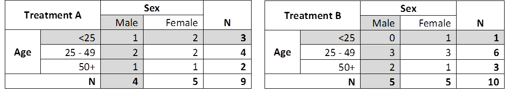{width=750px}

</center>

Which treatment should 20th patient - 20 year old male - receive? 

According to Taves (REF:Taves DR. Minimization: a new method of assigning patients to treatment and control groups. Clin Pharmacol Ther. 1974;15(5):443-453), we need to examine marginal totals (i.e. row and column Ns) within each treatment group and assign treatment with lower marginal total. 

So in the table above:

* Treatment A: 3 patients <25 and 4 male patients. Marginal total = 3 + 4 = 7
* Treatment B: 1 patients <25 and 5 male patient. Marginal total = 1 + 5 = 6

Hence, assign next <25 year old male to **Treatment B** as it has less assigned patients (as 6<7).


## 3. Know your **data**

In this section we'll be looking at the importance of knowing how your data was obtained - are you dealing with a population or a sample? And if you have the latter, do you know how the sample was obtained? Survey sampling techniques are a subject in its own right (e.g. Survey Research Design and Analysis (EDST5103) course), so we'll only examine the basic concepts in this Chapter. 

Here are the definitions  (adapted from Scheaffer RL, Rnadenhall W, Utt L. Elementary Survey Sampling. 6th edition. Duxbury):

* **Element** (or observation unit): an object on which a measurement is taken. In our case it's usually a person 
* **Population**:  a complete collection of elements about which we wish to make an inference 
* **Sample**: a subset of population drawn from a frame
* **Frame**: a list of sampling units 
* **Sampling unit**: the unit we actually sample 

Sampling allows us to make inferences about the population of interest, in a quicker and more cost effective way. However, we need to understand how to estimate population parameters and place bounds on the error of estimation. Using simple unweighted R commands such as `mean()` or `glm()` won't give us the right answers as we have not properly accounted for sampling design. We will consider a few different designs below.

### **Simple random sample**
Simplest of probability samples, where each unit of the population has the same probability of being selected. Usually used with small, homogeneous (similar) population concentrated in a particular location. 

<center>

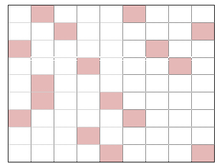

</center>

### **Stratified sample **
As you can guess, in this case a population is divided into strata, and a simple random sample is selected within each stratum. It is usually used when there are several sub-populations (e.g age groups) that are more similar within groups than across them. 


<center>

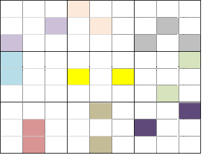

</center>

### **Cluster sample **
In cluster sampling, the selection occurs at the group level rather than the individual level (as is the case in stratified sampling). So the population is divided into groups, which are randomly selected. Then all units within the selected groups are sampled. This type of sampling works best when the population is geographically dispersed. 

<center>

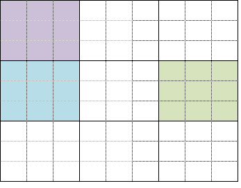

</center>

### **Multistage sample**
In Multistage clustering the population is sub divided into clusters (as in the cluster example above), and a sample of units from a cluster is used (as opposed to all the units). Multistage cluster samples are usually used in national health surveys.


<center>

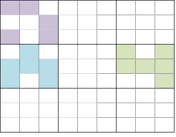

</center>


#### _How to analyse survey data in R?_
First we need to tell R that we are dealing with a survey data, and specify our sampling units, strata and weights. The function survyedesign() from the survey package does the rest for us. We first need to install and load the survey package:

```
 install.packages("survey"))
```

The svydesign function (see [documentation](http://r-survey.r-forge.r-project.org/survey/example-design.html)) specifies which survey design we are dealing with using: 

* **Id** - sampling units (1 in simple random sample)
* **Strata** - strata 
* **Weights** - sampling weight
* **Fpc** - finite population size corrections (if omitted we assume sampling with replacement)
* **Data** - data set we are using

The sample code looks like this:

```
data_design<- svydesign(id =~ 1 , strata = ~stratavar , data = ~datafile )
```

Tilde (~) is used to denote variables in the dataset. 
Once we specify the survey design, we can analyse the data. Any of the following can be used for summarising the data:

```
svymean, svytotal, svyratio, svyvar, svyqantile, svyciprop, svyby
```

#### **Example: Simple random sample **

Let's examine a simple random sample of the API dataset built into the survey package. API dataset contains the California Academic Performance Index scores from schools in California. Data dictionary for the API dataset can be found [here](https://www.cde.ca.gov/re/pr/reclayoutapiavg.asp). 


Apisrs dataset contains the simple random sample of API population. 


```{r exercise3_1, exercise.cap = "Simple Random Sample (SRS)", exercise=TRUE, exercise.eval=FALSE, exercise.lines=20}
library(survey)
# Load API data
data(api)

# Specify sampling 
srs_design <-svydesign(id =~ 1 , data = apisrs, fpc=~fpc )

# Total number of students enrolled
svytotal(~enroll, srs_design)

# Average school size
svymean(~enroll, srs_design)

# Average school size by school type
svyby(~api99, ~stype, srs_design,svymean)

# Average API in 1999 and 2000
svymean(~api99+api00, srs_design)

```

The code above tells R that the apisrs dataset contains individually sampled schools (`id=~1`) and `fpc`=~fpc  says `fpc` variable contains the population size. R will use these to compute weights. Now we can go ahead and produce estimated totals (`svytotal`) and averages (`svymean`) which will give us weighted estimates incorporating sampling design in the calculation. Remember that our variable names are prefixed by `~` (e.g. variable `enroll` is referred to as `~enroll`). `svyby` is used when we want to stratify the answers by groups - in the above case I wanted to see the average school size (`svymean`) by school type (`~stype`). 

I'll let you practice yourself in the example below.

```{r SRS}
library(survey)
# Load API data
data(api)
srs_design <-svydesign(id =~ 1 , data = apisrs, fpc=~fpc )
```

```{r exercise3_2, exercise.cap = "Exercise: SRS", exercise=TRUE, exercise.setup='SRS'}
# What is the average API in year 2000 by school type?

```

```{r exercise3_2-solution}
# Average API by school type
svyby(~api00, ~stype, srs_design, svymean)
```


#### **Example: Stratified sample **

In order to increase precision of our estimates, stratified sampling is preferred over simple random sample. Why? Because stratification ensures that required number of individuals from each strata end up in the sample, rather than allowing their distribution to be random. This is particularly useful when we know there are differences in groups of interest (e.g. age, sex, education status, Indigenous status etc).


Let's go back to the API population and use apistrat dataset - which contains a sample stratified by school type (100 elementary schools, 50 middle schools and 50 high schools). The code to set up the design in R is below.

```{r Stratified, exercise.cap = "Stratified sample: SETUP", exercise=TRUE}
# Specify sampling 
strat_design <-svydesign(id =~ 1 , strata=~stype, data = apistrat, fpc=~fpc )
strat_design

```


```{r Stratified2}
library(survey)
# Load API data
data(api)
strat_design <-svydesign(id =~ 1 , strata=~stype, data = apistrat, fpc=~fpc )
srs_design <-svydesign(id =~ 1 , data = apisrs, fpc=~fpc )
```

Now let's revisit some summary statistics from the SRS example above and compare them with the stratified example:

```{r Statified-example, exercise.cap="Stratified sample: EXAMPLE",exercise=TRUE, exercise.setup = "Stratified2", exercise.lines=10}

# Average school size
svymean(~enroll, strat_design)

# Average API by school
svyby(~api00+api99, ~stype, strat_design, svymean)

```

```{r Statified-exercise, exercise.cap = "Exercise: Stratified sample", exercise=TRUE, exercise.setup="Stratified2"}
# Compare average school size (~enroll) using SRS and stratified sample

```


```{r Statified-exercise-solution}
# Compare average school size (~enroll) using SRS and stratified sample
svymean(~enroll, srs_design)
svymean(~enroll, strat_design)
```


```{r quizSRS, echo=FALSE}
quiz(caption = "Quiz: SRS vs Stratified randomisation",
  question("From the exercise above, which method has smaller standard error?",
    answer("Stratified sample", correct=TRUE),
    answer("Simple random sample"),
    random_answer_order = TRUE,
    allow_retry = TRUE
  )
)
```


#### **Example: Cluster sampling**

Going back to the API population and using a cluster sample in which 15 districts were sampled, and then all schools in each district. The data is called apiclus1, sampling unit is `~dnum`, and population size (`~fpc`), sampling weights are in `~pw`. 

```{r survey-data}
library(survey)
# Load API data
data(api)
```


```{r exercise3_6, exercise=TRUE, exercise.setup="survey-data"}

# Specify cluster sampling 
cluster_design <-svydesign(id =~ dnum , data = apiclus1, fpc=~fpc, weights=~pw )
cluster_design

# Average school size
svymean(~enroll, cluster_design)

# Average API by school type
svyby(~api00, ~stype, cluster_design, svymean)


```


## 4. Know your **analysis method**

In your previous HDAT courses, you were introduced to an array of study designs and ways of analysing data. In this Chapter we will examine surveys, randomised controlled trials and meta analysis, which you have not had a chance to analyse in detail thus far.

### **Surveys**

In the previous section we examined how survey designs impact on the estimated standard errors, and how we need to be mindful of the study design in producing estimates. In this section we expand on that knowledge by having a quick look at how to analyse survey data. Like before, we need to set up the study design first.  Then conduct analysis. In the example below we will construct GLM of API score (using `cluster_design` setup from above), and examine whether two socioeconomic variables (average % of English language learners (`~ell`) and % of students eligible for free or reduced price lunch program (`~meals`) are predictive of API scores (`apil00`).

```{r survey-analysis}
# Load API data
data(api)
cluster_design <-svydesign(id =~ dnum , data = apiclus1, fpc=~fpc, weights=~pw )
```

```{r exercise4_1, exercise.cap = "Survey analysis: EXAMPLE",exercise=TRUE, exercise.setup="survey-analysis"}

regmodel <- svyglm(api00~ell+meals,design=cluster_design)
summary(regmodel)

```

From the results we can see that % of students eligible for free or reduced price lunch program (`~meals`) is significant and average % of English language learners (`~ell`) variable is not.


### **Randomised controlled trials (RCTs)**
Randomised controlled trials (RCTs) are an important tool when examining the effect of health interventions. Trial design is a whole subject in itself, but for our purposes we will discuss some key concepts which are important to know when being involved in RCTs.

#### _RCT types and phases_

Clinical trials have several phases, ranging from preclinical studies through to Phase IV trials. The most frequent in health research are Phase III trials. The main differences are shown in the table below (from this [Reference](https://www.australianclinicaltrials.gov.au/what-clinical-trial/phases-clinical-trials))

Phase         |Size         |Description
--------------|------------ |------------------------------------------------------------------------
Phase 0/pilot |10           |Testing how a body responds to experimental drug. Small doses used. 
Phase I       |20 - 100     |Used to determine a safe dosage range and identify side effects
Phase II      |100 - 300    |Used to determine efficacy (working as intended) and evaluate safety
Phase III     |300 - 3000   |Used to study safety and efficacy by comparing the intervention to other treatments/placebo. 
Phase Iv      |             |Designed to monitor effectiveness in the general population, and collect information about longer term adverse effects.
--------------------------------------------------------------------------------------------------


Aside from the phases, RCTs can be distinguished by their

1. **Design**:
    + _Parallel_ - each person is randomised into treatment/no treatment group and followed over time 
    + _Crossover_ - each person receives both treatments, over time, in a randomly assigned  order
    + _Factorial_ - each person randomly assigned to a particular combination of 2 or more treatments.
  

2. **Hypothesis**:
     + _Superiority_ - wishing to show that one treatment is better than another 
    + _Non-inferiority_ - wishing to show that one treatment is no worse than the other, usually by a pre-specified margin  
    + _Equivalence_ - wishing to show that the two treatments are similar 
    

<center>

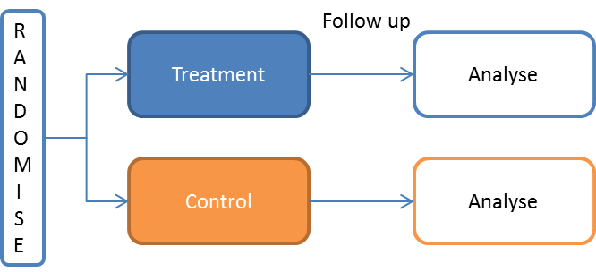{width=425px} 

</center>


<center>

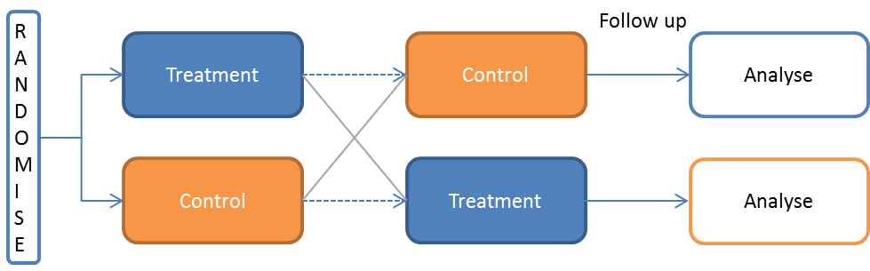{width=425px} 


</center>

<center>

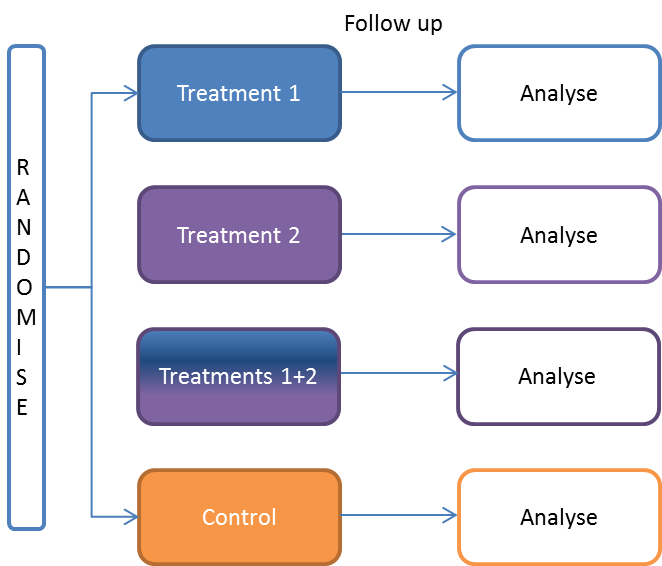{width=425px} 

</center>

#### _Good practice_
  
There are usually rigorous procedures in setting up the RCT design, predefined primary endpoints, study protocols and writing and interpreting trial reports. For trials involving human participants, ethical conduct of research requires that **every clinical trial must be registered** before recruitment of the first patient. In Australia, the Australian and New Zealand Clinical Trials Registry (ANZCTR) is one of the Primary Registries in the WHO Registry Network. 

Reporting of clinical trials usually follows a required standard, most commonly [CONSORT](www.consort-statement.org/consort-2010) (CONsolitated Standards of Reporting Trials) . There are numerous articles on trial design, writing and reporting of trial results, and interpretation of findings. 

`EXERCISE`: Examining RCT registry 

Examine the registry information for the [WATCH trial](https://www.anzctr.org.au/Trial/Registration/TrialReview.aspx?id=365023&isReview=true) I'm involved in. Let's discuss what information is included in the registry BEFORE participants are recruited. 

#### _Non compliance_

Compliance (adherence) refers to the degree which a patient followed their treatment protocol (e.g. if they were assigned to take a treatment drug, were they taking it or using something else). If patients do not comply with the randomised treatment, the effect of treatment could be weakened, and bias our results. Three ways of analysing data from an RCT need to be discussed:

* Intention to treat (**ITT**) analysis - patients are analysed with respect to their randomised group, even if they did not take the assigned treatment (non-compliance) or received different treatment [once randomised, always analysed]
* Per protocol (**PP**)  analysis - patients who comply with treatment regime are analysed, others are excluded from the analysis 
* As treated (**AT**) - analyse patients according to the treatment they actually received, regardless of their randomised treatment. 

`Exercise`: ITT vs PP vs AT analysis 

Assume there are 4 subjects in Treatment 1 and 4 subjects in Treatment 2 groups. Also assume 75% of the participants have a good outcome (i.e. 3/4 ). Let's examine the differences in the outcomes when we have non-compliance. 

1)	What happens when a patient with a **bad outcome** is non-compliant in Treatment 2 group? How do the results differ between ITT/PP/AT analyses?
2)	What happens when a patient with a **good outcome** is non-compliant in Treatment 2 group? How do the results differ between ITT/PP/AT analyses?

ITT analysis is considered the gold standard (Ref: Newell DJ. Intention-to-treat analysis: implications for quantitative and qualitative research. Int J Epidemiol. 1992 Oct;21(5):837-41), as it produces unbiased results. However, care should be noted for non-inferiority trials, as ITT could underestimate treatment effects. In these scenarios both ITT and PP analyses should be reported.  


#### _Missing data_

Missing data is common in RCTs, as interventions and follow up usually takes some time, so losses to follow up are sometimes inevitable. The level of missing data, and more importantly, their distribution between treatments groups needs to be examined in order to determine whether study results will be biased. You will learn more about missing data in latter chapters of this course. Briefly, there are numerous ways in which missing data can be treated. The simplest, and not recommended method is to carry over the last known value.

</center>

<center>

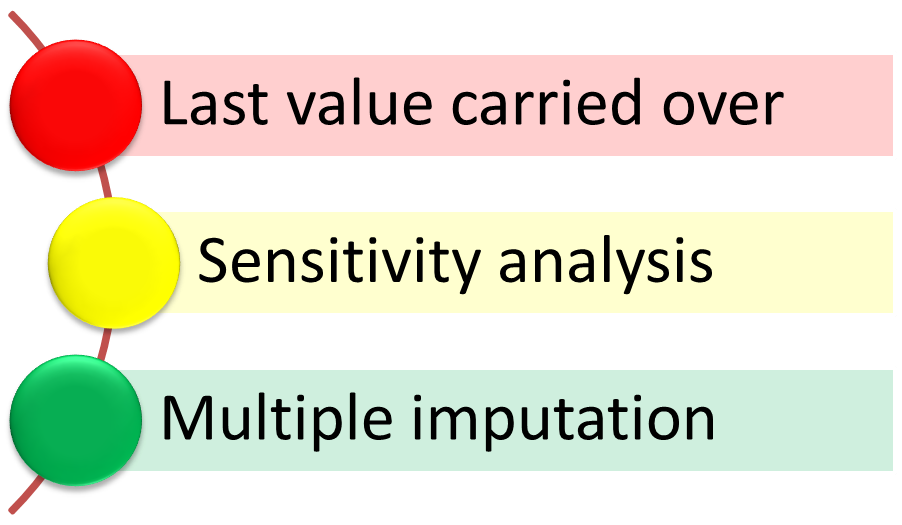{width=350px} 

</center>


### Meta analysis

You may recall the hierarchy of evidence pyramid from HDAT9100: Context of Health Data Science, where systematic reviews and meta-analyses provided strongest evidence. Meta-analysis is 'analysis of analyses' where we combine evidence from previous studies, usually from RCTs. A good meta-analysis starts with a systematic review of evidence, and proceeds to summarising the overall **effect**. The effect is usually presented as a summary statistic, depending on the data type (continuous, binary, ordinal, counts, time to event data) and can be any of the following:

* Relative risk (RR), Odds ratio (OR), Risk difference (RD) - for binary data
* Incidence Rate, Prevalence, Rate ratios, Proportions - for count data
* Mean, mean difference (MD), mean change - for continuous data
* Hazard ratio (HR) - for time to event data

You may have seen [Cochrane reviews](https://www.cochranelibrary.com/cdsr/reviews) with their detailed systematic review search strategy, data collection and appraisal, analysis and interpretation of evidence. Meta-analyses use either a **fixed effect** or a **random effect** model:

*	**Fixed effect** model (ref: NHMRC How to review evidence handbook) - assumes there is a single (fixed) treatment effect, which studies are attempting to measure but with some imprecision. 
* **Random effect** model - allows for differences in the treatment from study to study, with underlying variation used in the weighting for each study. 

When **to conduct** meta-analysis? 

If we wish to summarise good quality studies, with similar participants, settings and reported effects, and get all the information to synthesise the evidence. For consistent treatment effect across studies, meta analysis can be used to identify the common effect. For inconsistent effects, meta analysis can be used to identify the reason for variation.


When **not to conduct** meta-analysis? 

If there are too few studies or they are very different it may not be appropriate to conduct meta-analysis. Also, bear in mind that meta-analysis does not resolve poorly designed study design issues. If studies are of poor quality to start off with, or are too heterogeneous in terms of participants, settings and effects measured, meta analysis should not be used.

#### _Interpreting meta-analysis_
The results of meta-analysis are summarised in a forest plot, with each study (name and result) listed in a separate row. Individual study's effect is presented as a square (size proportional to the study size) and 95% confidence intervals shown as horizontal lines. A diamond shows overall (summary) estimate incorporating each study's result, weighted by the study size/precision:  

<center>

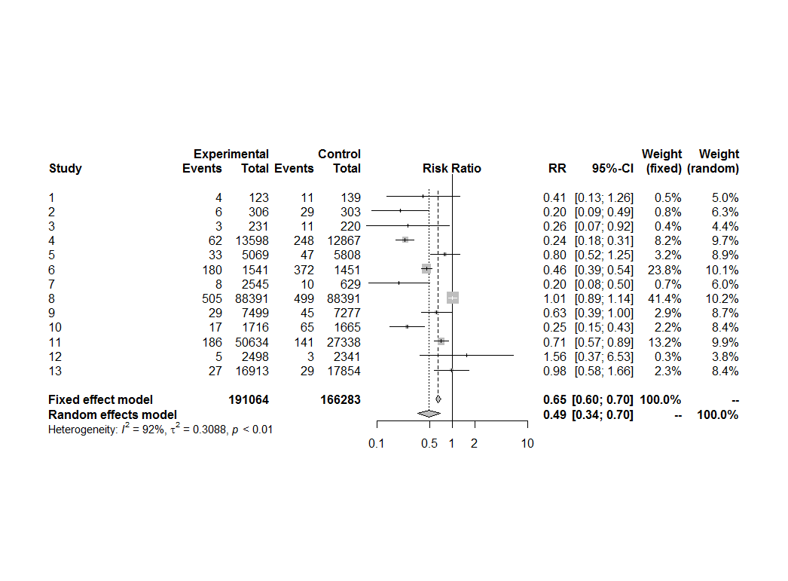{width=650px}  

</center>
</center>


#### **Meta-analysis in R**
There are 63 R packages for meta-analysis in R, from general meta analysis to more specialised ones (e.g. diagnostic test accuracy, genome data, Bayesian meta analysis) (ref: Polanin, J.R., Hennessy, E.A. and Tanner-Smith, E.E., 2017. A review of meta-analysis packages in R. Journal of Educational and Behavioral Statistics, 42(2), pp.206-242). 

We'll consider two of them:

* `meta` (Author: Guido Schwarzer) More info [here](https://www.rdocumentation.org/packages/meta/versions/4.9-2) 

* `metafor`(Author: Wolfgang Viechtbauer) More info [here](https://www.rdocumentation.org/packages/metafor/versions/1.9-9). One of the most highly downloaded meta analysis R packages. 

We'll use the data `BCG` from the `metafor` package (data originally from Colditz GA, Brewer TF, Berkey CS, et al. Efficacy of BCG Vaccine in the Prevention of Tuberculosis Meta-analysis of the Published Literature. JAMA. 1994;271(9):698-702).  The data contains a summary of 12 RCTs on efficacy of BCG vaccine against tuberculosis. For each study, relative risk (RR) of tuberculosis for vaccine recipients compared to non-recipients was reported. 

We will be replicating Table 1 from the original paper by Colitz et al, to estimate the overall Relative Risk (RR) 0.49 (95% CI 0.34-0.70). The authors used the DerSimonian and Laird random effects model to obtain  the summary estimate of RR. We'll use the same method in order to arrive at the same conclusion.


```{r exercise4_2, exercise.cap = "Example: Meta analysis",exercise=TRUE, exercise.eval=FALSE}

# Load BCG dataset
data(dat.bcg) 
# Create total N for treatment and control groups in the BCG dataset
dat.bcg$tn <- dat.bcg$tpos + dat.bcg$tneg
dat.bcg$cn <- dat.bcg$cpos + dat.bcg$cneg
# Perform meta-analysis 
meta_rr <- metabin(event.e = tpos, n.e = tn, event.c = cpos, n.c = cn,
                          data = dat.bcg,
                          sm = "RR",
                          method = "Inverse",
                          method.tau = "DL")

# Summary of the meta analysis results
summary(meta_rr)

```

`metabin` option calculates fixed and random effects estimates for meta analysis of binary outcome data, which is the case in the example above. The options include:

* `event.e` Number of events in experimental group.
* `n.e` Number of observations in experimental group.
* `event.c` Number of events in control group.
* `n.c` Number of observations in control group.
* `data` An optional data frame containing the study information, i.e., event.e, n.e, event
* `sm` A character string indicating which summary measure (risk ratio "RR", odds ratio "OR", risk difference "RD", or arcsine difference "ASD") is to be used for pooling of studies. 
* `method.tau` A character string indicating which method is used to estimate the between-study variance τ^2^. `method.tau="DL"` corresponds to the DerSimonian-Laird estimate


```{r meta}
# Load BCG dataset
data(dat.bcg) 
# Create total N for treatment and control groups in the BCG dataset
dat.bcg$tn <- dat.bcg$tpos + dat.bcg$tneg
dat.bcg$cn <- dat.bcg$cpos + dat.bcg$cneg
# Perform meta-analysis 
meta_rr <- metabin(event.e = tpos, n.e = tn, event.c = cpos, n.c = cn,
                          data = dat.bcg,
                          sm = "RR",
                          method = "Inverse",
                          method.tau = "DL")
```

#### _Forest plot_

To produce a forest plot we can use `forest` option and specify where our meta analysis results are located. Let's have a look at the code and the output. 

```{r exercise4_3, exercise.cap = "Meta analysis: forest plot",exercise=TRUE, exercise.setup="meta"}
# Forest plot
forest(meta_rr)

```

For the full set of `forest` options you can look look at the [R website](https://www.rdocumentation.org/packages/meta/versions/4.9-2/topics/forest). In the code above we have just used the default values. Let's examine the forest plot (same as Figure 10 above) and interpred a few features:

  * **Each study** is represented in a separate line, with total numbers, RR (95% CI) shown in graphical as well as numeric format. Study contribution to the overall effect (fixed and random) estimate is given as % weight in the last two columns
  * **Overall study effect** is shown as a diamond at the bottom of the graph, with bold estimates (from both fixed effects and random effects models)
  * **Heterogeniety** - Overall hererogeniety test p-value is given (Null is homogeniety), alongside I^2^ and $\tau^{2}$. 

#### _Interpreting heterogeniety_

Heterogeniety represents the degree of variation in the effects between studies. The I^2^ describes the % variation across studies that is due to heterogeniety rather than chance alone.I^2^ values range from 0% (no heterogeniety present) to 100%, with values I^2^ > 50% indicating significant heterogeniety. If there is no heterogeniety (i.e _p_-value > 0.05 and I^2^<50%) we can undertake a fixed effects meta analysis. However in the presence of heterogeniety, a random effects model is needed. A random effects meta-analysis produces a wider confidence interval for the total overall effect than a fixed effects meta-analysis. You can confirm this for yourself from the forest plot above. 


#### _Publication bias_

Although a meta-analysis represents mathematically accurate summary of included studies, if these studies are a biased sample of all relevant studies, then
the mean effect computed by the meta-analysis will also be biased. You would have heard about **publication bias** where studies with significant (positive) findings end up being published, with smaller, negative finding studies often not. One way of examining if there is publication bias is to look at the funnel plot using `funnel()` option. Let's examine what a funnel plot for BCG data looks like.

```{r exercise4_4, exercise.cap = "Meta analysis: Funel plot",exercise=TRUE, exercise.setup="meta"}
# Funnel plot of publication bias
funnel(meta_rr)

```

Typically, X-axis in a funnel plot will show effect sizes, and Y-axis a sample size or variance/standard error. So larger studies are at the top of the graph, usually around the mean effect size, and smaller studies are towards the bottom, and spread out more as their standard errors are usually larger. 

If there is no publication bias, the studies will be distributed symmetrically
about the middle (mean effect size). If publication bias exists, there will be asymmetry in the funnel plot (a few studies missing in the middle, and more studies missing near the bottom). To help us in seeing which studies might be missing from the funnel we can use `trimfill` option like this:

```{r exercise4_5, exercise.cap = "Meta analysis: Funel plot - trim and fill",exercise=TRUE, exercise.setup="meta"}

# Trim fill method
funnel(trimfill(meta_rr))
```

The trim and fill method estimates (and adds) the number of missing Null studies from the meta-analysis. In our example, four studies on the right hand side are evident.


<div class="aside">

### **Fun fact** 

The forest plot in the Cochrane logo (horizontal lines representing individual studies and a diamond showing an overall effect) is from one of the first systematic reviews published (by Crowley et al 1990) and shows how an intervention has an effect on the outcome - giving corticosteroids to women about to give birth prematurely reduces complications ([reference](https://www.cochrane.org/about-us/difference-we-make)). 

Here is the logo and forest plot from the publication.  

Crowley P, Chalmers I, Kierse MJ. The effects of corticosteroid administration before preterm delivery: an overview of the evidence from controlled trials. BJOG. 1990;97:11-25 


<center>

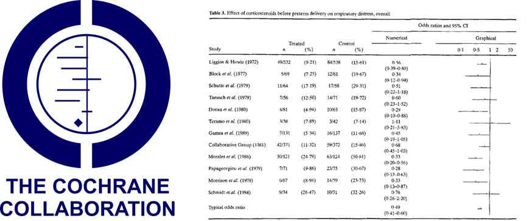{width=650px}  

</center>
</div>

 
## 5. Know your **purpose**

When it comes to modelling, it is useful to think about the purpose of the model. Are we interested in predicting an outcome (most common in machine learning) or explaining relationships? For the former, we have a luxury of including multiple covariates, of varying functional forms and interactions (2, 3, 4-way even), in order to produce the best fitting model to the data, which can then be used to predict future observations. However, when we want to explicitly explain certain relationships between variables and their impact on the outcome, we usually restrict our analysis to a smaller and more meaningful set of covariates. 

<div class="aside">

### Optional reading and video

Shmueli, Galit. To Explain or to Predict?. Statist. Sci. 25 (2010), no. 3, 289-310 [you can read the introduction only pp. 289-293]

Web page: [http://www.galitshmueli.com/content/explain-or-predict](http://www.galitshmueli.com/content/explain-or-predict)


</div>


## Practical

### Overview
**Data**

In this practical we will examine 2015 Youth Risk Behavour Surveillance System (YBSS) data from the [CDC](https://www.cdc.gov/healthyyouth/data/yrbs/data.htm). The dataset is a 3-stage cluster sample of kids in years 9-12 from public and private schools in the US. The stages involved selecting primary sampling units (PSUs) consisting of counties, than school from PSU, and finally 1-2 classes from the school. 

Original data can be found at this [website](https://www.cdc.gov/healthyyouth/data/yrbs/data.htm). We’ll be using **2015** in this example. The data has been pre-loaded into your environment, and is named `yrs2015`.


**Practical aim**

* Estimate % of students which perceive themselves as overweight
* Estimate % of students which would like to lose weight
* Examine proportions between males and females


### Setup 

Let us first create some new variables so it is easier to know which variables are which.Variables `qn69` and `qn70` are coded as 1 (yes) and 2 (no). We will need to change these to binary (1/0) when estimating proportions in the survey pacakage.

```{R data-prac, exercise=TRUE, datalines=12}
nrow(yrs2015)
ncol(yrs2015)

yrs2015v2 <- transform(yrs2015,  
    female = as.numeric( q2 == "1" ) ,
    perceive_overweight = as.numeric( qn69 == 1 ) ,
    lose_weight = as.numeric( qn70 == 1 ),
    bmi=q7/(q6*q6)
  )
```

So we have created 4 new variables:

* `female` - which is a binary variable (0/1), where 1 denotes females
* `perceive_overweight` - which is a binary variable (0/1), where 1 denotes responses where students perceive themselves as slightly or very overweight
* `lose_weight` - which is a binary variable (0/1), where 1 denotes response where students would like to lose weight.
* `bmi` -  continuous BMI variable

Lets check whether the newly created variables were created correctly:

```{R freq1, exercise=TRUE, datalines=6}

table(yrs2015v2$qn69, yrs2015v2$perceive_overweight)
table(yrs2015v2$qn70, yrs2015v2$lose_weight)
table(yrs2015v2$q2, yrs2015v2$female)


```


Remember that we need to specify the survey design in R using the following command:

```
data_design <- svydesign(id =~varname_id , strata = ~varname_strata , data = dataname , weights = ~varname_weight , nest = TRUE)
```

For YRBS dataset, the variables for sampling inits, strata and weights and called  `psu`, `stratum` and `weight`. Remember also that the variable names start with tilde (~):


```{r setup-data, exercise=TRUE}
library(survey)
yrs2015_design <- svydesign(id =~ psu , strata = ~ stratum , data = yrs2015v2 , weights = ~ weight , nest = TRUE)
```

We’re now ready to produce population estimates from the survey data.

### Exercise 1: $N$s

In this exercise we will examine the differences between unweighted and weighted $N$s:

```{r ex1-unweighted, exercise.cap = "Exercise 1", exercise=TRUE, exercise.setup="setup-data"}

# Unweighted N 
table(yrs2015$qn69)

# OR use svyby command
svyby( ~ one , ~ qn69 , yrs2015_design , unwtd.count )

# weighted N
svytotal( ~ one , yrs2015_design )
svyby( ~ one , ~qn69 , yrs2015_design , svytotal )
```


### Exercise 2: Means

Find the mean (SE) of BMI. You'll need to use `na.rm = TRUE` in order to exclude missing data from the calculation. 

```{r ex2, exercise.cap = "Exercise 2", exercise=TRUE, exercise.eval=FALSE, exercise.setup="setup-data"}
# What is the mean (SE) BMI in the dataset?

```


```{r ex2-hint-1}
# Revisit svymean function 
```

```{r ex2-hint-2}
svymean( ~ varname, survey_design_name , na.rm = TRUE )
```

### Exercise 3: Descriptive statistics (means): 1-way  

Let's say we are interested in knowing mean(SE) between groups of people. We can use `svyby` to tell R to stratify the results by groups, and within the command state what statistic (in this case we want to know the mean - so we'll use `svymean` option):

```
svyby( ~outcome_var , ~group_var , survey_design_name , svymean, na.rm = TRUE  )
```

Using the above code, produce summary BMI means(SEs) by sex:

```{r ex3, exercise.cap = "Exercise 3", exercise=TRUE, exercise.eval=FALSE, exercise.setup="setup-data"}
# Mean(SE) BMI by sex:

```


```{r ex3-hint-1}
# outcome=bmi, group=female, survey_desing= yrs2015_design
```


### Exercise 4: Descriptive statistics (means): 2-way  

Sometimes we would like to stratify by a few variables (e.g. age and sex) instead of a single variable. To do this, we can use `+` operator when specifying which group variables we are interested in:

```
svyby( ~outcome_var , ~group_var1+group_var2 , survey_design_name , svymean, na.rm = TRUE  )
```

Using the above code, produce summary BMI means(SEs) by sex **and** perceive overweight status:

```{r ex4, exercise.cap = "Exercise 4", exercise=TRUE, exercise.eval=FALSE, exercise.setup="setup-data"}
# Mean(SE) BMI by sex+perceive overweight:

```


```{r ex4-hint-1}
# svyby( ~ bmi , ~ female+perceive_overweight , yrs2015_design , svymean, na.rm = TRUE  )
```

### Exercise 5: Practice yourself

```{r ex5, exercise.cap = "Exercise 5", exercise=TRUE, exercise.eval=FALSE, exercise.setup="setup-data", exercise.lines=8}
#  What is the mean (95 % CI) of BMI between the two perceived_overweight groups?


# What is the mean (95 % CI) of BMI between the perceived_overweight and sex variables?
```

```{r ex5-hint-1}
# Save the svyby output and use confint() function 
```

### Exercise 6: Proportions

So far we have examined continuous variables. Let us now look at how we estimate proportions in survey data. The command is `svyciprop`. Full documentation about it can be found on the [R website](https://www.rdocumentation.org/packages/survey/versions/3.33-2/topics/svyciprop).In short, the command is:

```
svyciprop( ~ varname, survey_design_name, na.rm = TRUE )
```
We're still using `na.rm = TRUE` to exclude cases with missing values. 
`NOTE`: In order for the command to run, variable of interest must be coded as 0/1. Which is why we used `transform()` in the Setup of the tutorial to create new binary variables. 

Let us examine % of students (with 95% CI) that consider themselves as overweight:

```{r ex6a, exercise.cap = "Exercise 6a", exercise=TRUE, exercise.eval=FALSE, exercise.setup="setup-data"}
# % (95%CI) overweight:
svyciprop( ~ perceive_overweight , yrs2015_design, na.rm = TRUE )
```

We get 31.5% (30.2% - 33.0%) as the answer. 

Can you see whether these proportions differ by sex?
```{r ex6b, exercise.cap = "Exercise 6b", exercise=TRUE, exercise.eval=FALSE, exercise.setup="setup-data"}
# % (95%CI) overweight by sex:
svyciprop( ~ perceive_overweight , yrs2015_design, na.rm = TRUE )
```


```{r ex6b-hint-1}
# Create separate datasets for males and females and use svyciprop for each
```


### Exercise 7: Practice yourself

```{r ex7, exercise.cap = "Exercise 7", exercise=TRUE, exercise.eval=FALSE, exercise.setup="setup-data", exercise.lines=8}
# What proportion of students are trying to lose weight (variable: lose_weight)?


# Are there differences beween males and females?

```


## Summary  

In this Chapter we covered:

  1. Know your *research question*
  2. Know your *study design*
  3. Know your *data*
  4. Know your *analysis method*
  5. Know your *purpose*
  
As with all analyses, stop, think, plan and then do. And (of course) have fun while exploring the data!


