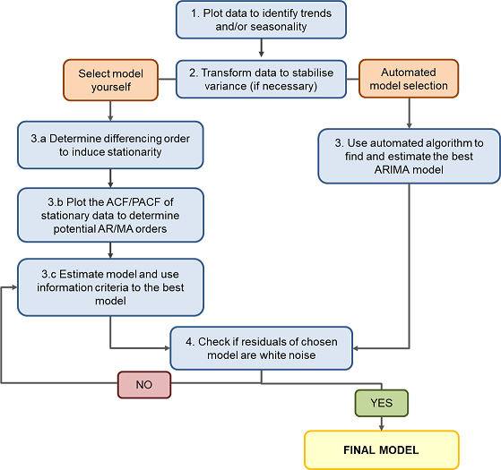

{width="75%"}

```{r setup, include=FALSE, warning=FALSE}
knitr::opts_chunk$set(echo = FALSE)

# Load required libraries
library("learnr")
library("astsa")
library("tseries")
library("forecast")
library("fpp")
library("fpp2")
library("kableExtra")
library("magrittr")
library("formatR")
library("zoo")

resp <- read.csv(file="data/uk-deaths-by-sex.csv", header=TRUE)
resp_ts <- ts(resp, start=c(2001,1), frequency=12)

air <- read.csv(file="data/international-airline-passengers.csv", header=TRUE)
air <- ts(air[,2], start=c(1948,1), end=c(1959,12), frequency = 12)

set.seed(1)
z <- arima.sim(model=list(order=c(2,0,0), ar=c(1.5, -0.75)), n=200)

model1 <- sarima(z, p=3, d=0, q=1, details=FALSE)
model2 <- sarima(z, p=2, d=0, q=0, details=FALSE)

set.seed(1)
p <- arima.sim(model=list(order=c(1,1,0), seasonal=list(order=c(1,1,0)), ar=c(.75)), n=100)
p <- ts(p, start=c(2000,1), frequency=12)

set.seed(123)
vector1 <- sample(40:80, 48, replace=TRUE)

x1 <- ts(vector1, start=c(2005,7), end=c(2009,6), frequency=12)

```


## Overview
Welcome to HDAT9700 Time Series Analysis!


In this chapter we will focus on time series data. 

There will be three short lectures:  

1. Working with time series data in R
2. Statistical properties of time series data
3. Fitting time series models

Each lecture will be followed by a practical session where you will write your own R code to explore the concepts and methods we discuss.   

The prereading for this chapter is "On Time Series Analysis of Public Health and Biomedical Data" by Scott L Zeger, Rafael Irizarry and Roger D Peng available [here](https://www.annualreviews.org/doi/10.1146/annurev.publhealth.26.021304.144517).

For those wanting more detail, I suggest "Time series analysis and its applications: with R examples" (Chapters 1-3) by Robert H Shumway and David S Stoffer, which can be downloaded [here](https://www.stat.pitt.edu/stoffer/tsa4/) or through the UNSW library. The content goes beyond what is covered in this Chapter, but there are a lot of examples and R code for those who are interested.  David S Stoffer is also the author of the `astsa` R package (Applied Statistical Time Series Analysis).

Some other useful resources:

* Rob J Hyndman and George Athanasopoulos (Monash University) [Forecasting: Principles and Practice](https://otexts.com/fpp2/)

* Penn State [Applied Time Series Analysis](https://newonlinecourses.science.psu.edu/stat510/) 

While the following two papers are about intervention analysis, they also start by discussing properties of time series data which is relevant for this Chapter:

* Lagarde. How to do (or not to do): Assessing the impact of a policy change with routine longitudinal data. *Health Policy Planning* 2012;27(1):76-83. [doi: 10.1093/heapol/czr004](https://doi.org/10.1093/heapol/czr004)

* Schaffer et al. Interrupted time series analysis using autoregressive integrated moving average (ARIMA) models: a guide for evaluating large-scale health interventions. *BMC Medical Research Methodology* 2021;21(58). [doi: 10.1186/s12874-021-01235-8](https://bmcmedresmethodol.biomedcentral.com/articles/10.1186/s12874-021-01235-8)


Let's get started!  

## Lecture 1: Working with time series data

### What are time series data?

Time series data are everywhere. Some examples include:

* Daily maximum temperature
* Weekly count of emergency department visits for influenza
* Monthly cardiovascular mortality rate
* Yearly cancer incidence per 100,000 population.

To interpret time series data, it is important to understand the underlying structure, and how this affects its behaviour. For instance, a sudden drop in prescriptions for antibiotics in a given month may represent a true decline, or just be part of the normal variation of those data.

A time series is a chronological sequence of measurements equally spaced through time, with one observation for every time point. The time unit can be daily, weekly, monthly, etc.; however, it is always the same for a given series. Time series data can be raw measures, such as the daily maximum temperature, or hourly blood pressure readings, or it can be a summary (aggregate) statistic, such as counts, rates, ratios, averages, or percentages. 

In the context of health data, one of the advantages of time series data is that they often involve aggregate data (such as counts of hospital separations), and thus they don't necessarily require access to identifiable person-level data. Thus, these data are often easier to access as aggregate data often do not require ethics approval, and there are currently a many freely available time series datasets available online. 

Time series data have several unique properties. The chronological ordering is important. Time series data are also well suited to visualisation. Most importantly, observations made at neighbouring time points are often correlated and thus not independent, meaning that they do not meet the assumptions necessary for standard regression analysis. Therefore, specialised methods for analysing time series data are needed.

There are many potential uses for time series analysis in health. These include: 

* **Descriptive analysis** to understand trends or patterns over time, or to compare patterns between jurisdictions or specific populations;
* **Statistical process control** to monitor changes in health care indicators;
* **Surveillance** of infectious diseases;
* **Forecasting** to predict future trends; 
* **Explanatory analysis** to identify predictors of variation in outcomes; and
* **Intervention analysis** to determine the impact of an intervention (to be covered in the next Chapter). 

***

Here are a couple of examples of time series:


***

Check out the short video about the definition and uses for time series data:


***


```{r quiz1_1, echo=FALSE}
quiz(caption = "Quiz 1.1: Definition of time series data", 
     question("Which of these would not be considered a time series?",
    answer("Number of illicit drug related ambulance calls per week over two years"),
    answer("Proportion of people taking antidepressants who discontinue use per month over 5 years"),
    answer("Percent decrease in BMI measured over 1 year in 100 individuals", correct=TRUE),
    answer("Yearly rates of smoking in males and females over 20 years"),
    answer("They are all examples of time series data"),
    random_answer_order = FALSE, allow_retry = TRUE))
```

***
### Working with time series data in R

In this first section we will describe how to set up your time series data in R, explore the structure of the data, and conduct some basic visualisations. 

#### Creating time series objects

To start off with, we will convert our data to the form of an R time series (*ts*) object, rather than a data frame. A *ts* object is a vector or matrix of data sampled chronologically at equispaced points in time. Information about the time points at which the data were sampled is held in an *index*, rather than as its own variable. 

The `ts()` function converts a numeric vector or matrix into a ts object. In the case of a matrix, each column is assumed to contain a separate time series. A multivariate *ts* object is called an *mts* object. 

The syntax is:
```{r, eval=FALSE, echo=TRUE, tidy=TRUE} 
ts(data=, start=, end=, frequency=)
```

The main arguments are:

* *data* - the name of the vector or matrix,
* *start* - the date of the first observation,
* *end* - the date of the last observation,
* *frequency* - the number of observations per unit of time (most commonly year). 

Only one of *start* or *end* needs to be specified. In most cases, the "unit of time" will be a year, and the frequency will reflect this. The table below shows how to write your syntax for the most common frequencies, assuming yearly cycles.

**Table 1.** Example of syntax for time series from 1 Jan 2015 to 31 Dec 2017 
```{r, echo=FALSE, eval=TRUE}
text_tbl <- data.frame(
  Data = c("Annual","Quarterly","Monthly","Weekly"),
  Example = c("start = 2015, frequency = 1","start = c(2015, 1), end = c(2017, 4), frequency = 4","start = c(2015, 1), end = c(2017, 12), frequency = 12","start = c(2015, 1), end = c(2017, 52), frequency = 52"))

kable(text_tbl, col.names=c("Series type","Example of syntax")) %>%
  kable_styling(full_width = F, font_size=12, bootstrap_options="striped", position="left") %>%
  column_spec(1, bold = T, width="8em") %>%
  column_spec(2, width = "25em") %>%
  row_spec(0, color="#2D8787")
```

Strictly speaking, there are 52.18 weeks in a year (365.25/7). However, many time series functions require integers and in most cases the impact will be minimal.

Let's try it out.
```{r tsobject, exercise=TRUE, exercise.eval=FALSE, fig.height=3.5, fig.width=5, tidy=TRUE}
# Create a vector with 48 random observations taking values between 40 and 80
set.seed(123)
vector1 <- sample(40:80, 48, replace=TRUE)

# Now transform it into a time series (ts) object
# Let's assume the vector is monthly data from July 2005 to June 2009
x1 <- ts(vector1, start=c(2005,7), end=c(2009,6), frequency=12)

# Now plot the time series
plot(x1)
```

Good work, you've created your first time series!

Note that with a ts object, the date or time information is stored in an index (not as a separate variable). We can access it by using `time()`. Try it:


```{r time, exercise=TRUE, exercise.eval=FALSE}
# Extract time information
time(x1)
```

As you can see, the ts object index stores time as a fraction, not a date. To convert the time index to date formats, we can use `as.Date()`, `as.yearmon()`, `as.yearqtr()` which are part of the `zoo` package.

```{r time2, exercise=TRUE, exercise.eval=FALSE}
# Extract time information
as.yearmon(time(x1))
```

***

```{r quiz1_2, echo=FALSE}
quiz(caption = "Quiz 1.2: Creating time series objects", 
     question("How would you specify the start, end, and frequency for biannual data from first half of 2000 to second half of 2014?",
    answer("start = 2000, end = 2014, frequency = 2"),
    answer("start = c(2000,2), end = c(2014,2), frequency = 1"),
    answer("start = 2000, end = 2014, frequency = 1"),
    answer("start = c(2000,1), end = c(2014,2), frequency = 2", correct=TRUE),
    answer("None of them are correct"),
    random_answer_order = FALSE, allow_retry = TRUE))
```

***

#### Combining multiple time series objects

`ts.union()` and `ts.intersect()` can be used to combine two ts objects into one 
mts object. `ts.union()` will perform an outer join, and will create *NAs* to fill in missing values. `ts.intersect()` will restrict to the time periods where the two series overlap (inner join).

However, in both cases the individual ts objects must have the same frequency, although they don't have to have the same start and/or end. Try it below with the ts objects `x2` and `x3`, and observe the difference when using `ts.union()` vs `ts.intersect()`.
```{r tsunion, exercise=TRUE, exercise.eval=FALSE, tidy=TRUE}
# Create two time series objects
x2 <- ts(sample(100:150, 10, replace=TRUE), start=1950, frequency=1)
x3 <- ts(sample(100:150, 10, replace=TRUE), start=1955, frequency=1)

# Combine using ts.union and view the results
x4 <- ts.union(x2, x3)
print(x4)

# Combine using ts.intersect and view the results
x5 <- ts.intersect(x2, x3)
print(x5)
```

***

```{r quiz1_3, echo=FALSE}
quiz(caption = "Quiz 1.3: Combining time series objects", 
    question("A mts object created by ts.intersect will always be shorter than a mts object created by ts.union",
      answer("True", correct=FALSE, message="If both ts objects have the same start and end dates, then the resulting mts object will have the same        length regardless of whether ts.union or ts.intersect is used"), 
      answer("False", correct=TRUE),
      random_answer_order = FALSE
    ),
    question("ts objects with different frequencies can be combined using ts.union or ts.intersect",
      answer("True"), answer("False", correct=TRUE),
      random_answer_order = FALSE
    ),
    question("Non-overlapping ts objects can be combined using ts.union",
      answer("True", correct=TRUE), answer("False"),
      random_answer_order = FALSE
    )
    )
```

***

### Visualising time series data ###

Time series data are well suited to visualisation. One of the first steps when working with time series data should be to plot it. The simplest approach is to use the base `plot()` function. For more customisation options, you can use a more sophisticated function like `autoplot()`, which is part of the `ggplot2` package and automatically converts the ts object to a data frame so that it can be plotted with `ggplot2`. 

If you have multiple time series in one mts object, they can be plotted in one graph on separate facets using `plot()` and the argument `plot.type="m"` (*m* = multiple, the default), or on the same graph using `plot.type="s"` (*s* = single plot). 

Let's look at an example. Below, we will extract data on weekly respiratory and cardiovascular mortality in Los Angeles (1970 to 1979) collected as part of the LA Pollution-Mortality Study. These series are in the `lap` dataset that is part of the `astsa` package. Remember that since a ts object is a vector/matrix, to extract specific columns you must use [ ], rather than $. 

First, plot these time series on separate facets, and then on the same plot. We will also customise the graphs by adding a title and axis labels, setting an appropriate range for the y-axis, and using different colours and line types to distinguish between the two time series. 
```{r plot, exercise=TRUE, exercise.eval=FALSE, fig.height=4.5, fig.width=6, tidy=TRUE}
# Load and extract cardiovascular and respiratory mortality data
data(lap, package="astsa")
mort <- lap[,c(2:3)]

# Plot 1: multiple facets with customisation
plot(mort, plot.type="m", xlab="Week", col="blue", lty="solid", main="LA Respiratory and Cardiovascular Mortality, 1970-1979")

# Plot 2: single plot with customisation
plot(mort, plot.type="s", ylab="Deaths", xlab="Week", col=c("blue","red"), lty=c("solid","solid"), ylim=c(0, 150), main="Fig 1: LA Respiratory and Cardiovascular Mortality, 1970-1979")
# Add a legend
legend("topright", legend=c("Respiratory","Cardiovascular"), col=c("blue","red"), lty=c("solid","solid"), cex=.8)
```

Think about when you would prefer each of these types of plots - what are the strengths and weaknesses of each?

In this video I describe what makes a good plot:


****

### Components of a time series

A time series is made up of three principal components, which are:

1. **Trend:** A trend is a long-term increase or decrease in the data. It can be linear, or non-linear (e.g. exponential growth). A cyclic trend occurs when there is a repeating cycle of increases and decreases of no fixed period, often lasting for several years. An example would be the boom and bust of the stock market, or the sunspot cycle; however, cyclic trends are uncommon in health services data.

2. **Seasonality:** Seasonality occurs when the time series is affected by calendar time, such as time of year or day of the week. Seasonality is always of a fixed and known frequency. It can be due to natural causes, such as the variation in weather patterns between seasons, or business/administrative processes, such as weekend/weekday effects. Whether there is seasonality may depend on the time unit of your series (e.g. daily, weekly, etc.).

3. **Error:** The error is the remaining random variation unexplained by the trend or seasonality.

***

This videos provides a brief overview of these components:


***

Let's look at a few examples of time series with different properties.

Load the `flu` dataset which is part of the `astsa` package. It contains data on pneumonia and influenza deaths per 10,000 population the United States. It is already a ts object and does not have to be converted.

Like any dataset, one of the first steps when working with time series data is to explore the data. Below, we'll use the functions `start()`, `end()`, `frequency()`, `length()`, and `summary()` to explore the time series. 
```{r sum, exercise=TRUE, exercise.eval=FALSE,tidy=TRUE}
data(flu, package="astsa")

# What is the frequency?
cat("Frequency:", frequency(flu))

# When is the first observation?
cat("Start date:", start(flu))

# When is the last observation?
cat("End date:", end(flu))

# What is the length of the time series?
cat("Length:", length(flu))

# What is the mean, median and range of the time series?
summary(flu, digits=2)
```

Now we know that the series starts in January 1968 and ends in December 1978, and that the data are monthly (frequency = 12). The maximum value is 0.82 deaths per 10,000 population and the minimum is 0.18 deaths per 10,000 population. 

***

Now visualise the flu time series by plotting it. Think about the kind of pattern that you expect to see. Always remember when creating graphs to choose clear axis labels, and to set the y-axis limits to something reasonable, as axes that are too narrow or too wide can be misleading.
```{r plotflu, exercise=TRUE, exercise.eval=FALSE, fig.height=4, fig.width=5, tidy=TRUE}
# Plot flu data
plot(flu, ylab="Deaths per 10,000 people", xlab="Month", main="Pneumonia and influenza deaths\nin the US (1968-1978)", ylim=c(0,1))
```

What are the key features of this time series?

* **Trend:** There is no strong trend, but overall rates appear to be decreasing slightly over time. 
* **Seasonality:** These data are highly seasonal, with pneumonia and influenza deaths more common in the northern hemisphere winter than in the summer which is what we'd expect. 
* **Outliers**: Some years had higher rates of deaths than others. The 1968/69 flu season was particularly bad, leading to the deaths of approximately 1 million people worldwide. 

***

Now let's look at a different time series. Here is the yearly number of international visitors to Australia (1980-2010) (`austa`) which is part of the `fpp` package.
```{r plotausta, exercise=TRUE, exercise.eval=FALSE, fig.height=4, fig.width=5,tidy=TRUE}
# Load data
data(austa, package="fpp")

# Plot austa data
plot(austa, ylab="International visitors (millions)", xlab="Year", main="International visitors to Australia (1980-2010)", ylim=c(0,6))
```

* **Trend**: Here there is a very obvious increasing trend.
* **Seasonality**: There is no seasonality. However, this is because the data are yearly. If we were to look at monthly or quarterly data, we'd likley see seasonal effects with higher rates in summer and lower in winter. 
* **Outliers**: Some years appear somewhat higher/lower than others but nothing that stands out.

***

Here is the quarterly Hawaiian hotel occupancy rates (%) from 1982 to 2015 (`hor` in the `astsa` package).

```{r plothor, exercise=TRUE, exercise.eval=FALSE, fig.width=5, fig.height=4,tidy=TRUE}
# Load data
data(hor, package="astsa")

# Plot hor data
plot(hor, ylab="Occupancy rates (%)", xlab="Quarter", main="Hawaiian hotel occupancy rates (1982-2015)", ylim=c(50,100))
```

* **Trend**: The trend appears to be cyclic, changing over time. For instance, it is decreasing from 2006 to 2009, but increasing from 2009 to 2013. 
* **Seasonality**: There is clear seasonality. Although it is difficult to tell from this plot when the occupancy rates are highest/lowest, we will see later how to better visualise the seasonal effects.
* **Outliers**: Occupancy rates in the fourth quarter of 2001 were the lowest in the 30 year period. This is most likely related to reduced air travel after the terrorist attacks of September 11, 2001.

***

```{r, echo=FALSE, eval=TRUE, fig.width=7, fig.height=6,tidy=TRUE}
data(cafe, package="fpp")
data(birth, package="astsa")
data(chicken, package="astsa")
data(elecdaily, package="fpp2")
elec <- ts(elecdaily[188:360,1], start=c(2014,188), frequency=360)

par(mfrow=c(2,2), mar=c(4,4,2,2), oma=c(0,0,0,0))
plot(window(cafe, start=2005), ylim=c(4000,10000), ylab="Series 1", xlab="Quarter")
plot(window(birth, start=1965), ylim=c(200, 400), ylab="Series 2", xlab="Month")
plot(chicken, ylim=c(50,120), ylab="Series 3", xlab="Month")
plot(elec, ylim=c(100,300), ylab="Series 4", xlab="Day")
```
```{r quiz1_4, echo=FALSE}
quiz(caption = "Quiz 1.4: Seasonality", 
    question("Which of the series above show seasonality?",
    answer("All of them"),
    answer("Series 2 and 4"),
    answer("Series 1, 2 and 4", correct=TRUE, message="Series 1 is expenditure on eating in restaurants in Australia, Series 2 is births in the US, and Series 4 is daily electricity demand in Victoria"),
    answer("Series 2 and 3"),
    answer("Series 1 and 2"),
    random_answer_order = FALSE, allow_retry = TRUE),
    question("Which of these time series would you least expect to exhibit seasonality?",
    answer("Monthly prescriptions for antibiotics", correct=FALSE, message="Antibiotics are more commonly prescribed in the winter, when rates of respiratory infections are highest"),
    answer("Monthly cancer mortality", correct=TRUE, message="While deaths according to other causes such as cardiovascular disease do exhibit seasonality, cancer deaths generally do not"),
    answer("Daily alcohol-related ED admissions", correct=FALSE, message="Alcohol-related ED admissions would exhibit weekly seasonality, being more common on weekends"),
    answer("Monthly counts of drownings", correct=FALSE, message="Drownings are more common in summer"),
    random_answer_order=FALSE, allow_retry=TRUE)
    )
```

***
#### Visualising seasonal effects

Another way of plotting seasonal time series is to use the function `seasonplot()` or `ggseasonplot()` from the `forecast` package. This can also help identify outliers, by comparing values to the same time period in previous years, as it can sometimes be difficult to identify extreme values in the presence of seasonal effects. 

Here's what a seasonal plot looks like for the flu data:
```{r season, exercise=TRUE, exercise.eval=FALSE, fig.width=5, fig.height=3,tidy=TRUE}
# Pneumonia and influenza deaths (monthly)
ggseasonplot(flu, ylab="Influenza deaths per 10,000")
```

This confirms that influenza deaths were much higher in December 1968 than in other Decembers. Further, there is an unusual pattern in influenza deaths in 1976, with higher than expected values in March; this wasn't as evident in the non-seasonal plot. This was due to the 1976 swine flu outbreak in the US, which led to a mass vaccination campaign of 25% of the US population. You can also observe that deaths in earlier years tend to be higher than in later years.

***

Now let's check the Hawaiian occupancy rates data. A second option to compare rates across seasons is to use the function `tapply()`. We can use `FUN=summary` to request the summary statistics (min, median, mean, interquartile range, max) for the `hor` data. We also specify `INDEX=cycle(hor)`, which tells R that we want the summary by season, in this case quarters.

```{r season2, exercise=TRUE, exercise.eval=FALSE, fig.width=5, fig.height=3, tidy=TRUE}
# Seasonal plot of Hawaiian occupancy rates (quarterly)
ggseasonplot(hor, ylab="Hawaiian occupancy rates (%)")

# Get summary statistics by quarter
tapply(hor, INDEX=cycle(hor), FUN=summary)
```

And this confirms that the occupancy rates are highest in the 1st quarter (Jan-Mar). We also see that rates in the fourth quarter of 2001 stands out as being lower than all other quarters.

***

#### Decomposition 

An easy way to visualise the components of a time series (trend, seasonality, error) is to use the `decompose()` function. This function separates out the trend component, seasonal component and random error from your time series. This function will give an error if there is no seasonality in the data (e.g. yearly data).

First, you need to identify whether your time series is *additive* or *multiplicative*. 

* **Additive decomposition:** Use an additive model to decompose the time series if the variance is more or less constant. An additive model is expressed as:

$$\text{Time series}=\text{Trend}+\text{Seasonal}+\text{Error}$$

* **Multiplicative decomposition:** We use a multiplicative model to decompose our time series if the variance increases over time. A multiplicative model is expressed as:

$$\text{Time series}=\text{Trend}\times\text{Seasonal} \times \text{Error}$$

***

Let's use the data on monthly corticosteroid prescriptions (millions) in Australia (Jul 1991 to Jun 2008) (`h02` in the `fpp` package).

```{r, eval=TRUE, echo=FALSE, fig.height=4, fig.width=5,tidy=TRUE} 
# Load time series
data(h02, package="fpp")

# Plot time series
plot(h02, ylim=c(0,1.5), ylab="Corticosteroid Rx (millions)", xlab="Month")
```

**Figure.** Monthly corticosteroid prescriptions in Australia

***

The raw data has slightly increasing variance, so let's use a multiplicative model indicated using the argument `type=`. Note that "additive" is the default type. 
```{r dec}
# Decompose the data into trend, seasonality and error and plot
dec <- decompose(h02, type="multiplicative")
```
```{r dec2, exercise=TRUE, exercise.eval=FALSE, tidy=TRUE}
# Decompose the data into trend, seasonality and error and plot
dec <- decompose(h02, type="multiplicative")
plot(dec)
```

The first panel is the raw data. Looking at the decomposed series, we can conclude that 1) there is an increasing trend; and 2) there is substantial monthly seasonality, with prescriptions greatest at the end of the year (November, December), and lowest at the beginning (January, February). This is because of the Pharmaceutical Benefits Scheme (PBS) Safety Net - once an individual or family reaches their Safety Net limit on out-of-pocket spending on medicines in a calendar year, the co-payment they must pay for each dispensing decreases for the remainder of the calendar year, leading some individuals to stockpile their medicines at the end of the year when they are cheaper. 

Looking at the "random" plot, there are two values that stand out, one that is higher than expected around 1993, and one lower than expected in 2007. It may be worth investigating anything that may have happened around these times - e.g. changes in the PBS co-payments, a change to reimbursement policies, or listing of a new corticosteroid. If these are true outliers (i.e. due to external factors, not random variation), they should be controlled for when modelling your time series.

Using `which.min()` and `which.max()` can help identify these points, as can the seasonal plot. Note that we use the random component of the decompose series, not the raw data, as the raw data still has seasonality. 

```{r random, exercise=TRUE, exercise.eval=FALSE, tidy=TRUE, exercise.setup="dec"}
# Identify observations with minimum and maximum values
cat("Observation with min outlier:", which.min(dec$random))
cat("Observation with max outlier:", which.max(dec$random))

# Identify dates
# This code tells R we want the date of the time component of the min/max values
cat("Date of min outlier:", time(dec$random)[which.min(dec$random)])
cat("Date of max outlier:", time(dec$random)[which.max(dec$random)])
```

This tells us that the low outlier was at observation 190, which is April 2007 (2007.25). The high outlier was at observation 30, which is December 1993 (1993.917).

***

Another use for `decompose()` is to "seasonally adjust" your data by removing the seasonal component. This may help in visualising trends or non-seasonal patterns in the time series. To deseason an additive model, you subtract the seasonal component from the original time series. To deseason a multiplicative model, you divide the raw data by the seasonal component.
```{r des, exercise=TRUE, exercise.eval=FALSE, fig.height=4, fig.width=5 , exercise.setup="dec"}
# "dec" is the decomposed time series
# Calculate the deseasoned time series
deseason <- h02/dec$seasonal

# Combine the original time series with the deseasoned time series 
h02.d <- ts.union(h02, deseason)

# Plot them both on the same graph
plot(h02.d, plot.type="s", ylim=c(0,1.5), col=c("blue","red"), lty=c("solid","dashed"), ylab="Corticosteroid Rx (millions)", xlab="Month")
legend("topleft", legend=c("Observed","Seasonally adjusted"), col=c("blue","red"), lty=c("solid","dashed"))
```

***

You can also plot the smoothed trend along with the raw data.
```{r trend, exercise=TRUE, exercise.eval=FALSE, fig.height=4, fig.width=5,tidy=TRUE,  exercise.setup="dec"}
# Combine the original time series with the trend information
h02.t <- ts.union(h02, dec$trend)

# Plot them both on the same graph
plot(h02.t, plot.type="s", ylim=c(0,1.5), col=c("blue","red"), lty=c("solid","dashed"), ylab="Corticosteroid Rx (millions)", xlab="Month")
legend("topleft", legend=c("Observed","Trend"), col=c("blue","red"), lty=c("solid","dashed"))
```

***

## Practical 1 ##

In this practical session you will visualise and explore a time series. For these exercises you will use data on monthly deaths in the UK by sex obtained from the Office for National Statistics (https://www.ons.gov.uk/). The start date is January 2001.

You will learn the following functions:  

* ts()
* start(), end(), summary()
* head()
* plot()
* decompose()
* seasonplot()/ggseasonplot()

***

#### Exercise 1.1 Creating a ts object 
```{r exercise1_1, exercise.cap="Exercise 1.1", exercise=TRUE, tidy=TRUE, exercise.eval=FALSE, exercise.lines=9}
# Check if the data "resp" is in the format of a ts object using class()


# If not, convert to a ts object and call the new ts (or mts) object "resp_ts"


# Check the class again


```

***

#### Exercise 1.2 Checking structure of time series
```{r exercise1_2, exercise.cap = "Exercise 1.2", exercise=TRUE, tidy=TRUE, exercise.eval=FALSE, exercise.lines=14}
# Check start and end dates of resp_ts


# Check frequency of resp_ts


# View first few lines


```
```{r exercise1_2-hint-1, exercise.eval=FALSE}
# Check the start and end dates using start() and end()
start(resp_ts)
end(resp_ts)
```
```{r exercise1_2-hint-2, exercise.eval=FALSE}
# View the first few lines using head()
head(resp_ts)
```

***

#### Exercise 1.3 Data exploration
```{r exercise1_3, exercise.cap="Exercise 1.3", exercise=TRUE, tidy=TRUE, exercise.lines=7, exercise.eval=FALSE, exercise.lines=6}
# What is the minimum value in males/females? maximum value in males/females? 


# What is the mean and median number of deaths in males/females?


```
```{r exercise1_3-hint-1, exercise.eval=FALSE}
# Get the min/max/mean/median values using summary()
summary(resp_ts)
```

***

#### Exercise 1.4 Data visualisation
```{r exercise1_4, exercise=TRUE, exercise.cap="Exercise 1.4", tidy=TRUE, exercise.eval=FALSE, fig.height=4, fig.width=5, exercise.lines=10}
# Plot the male and female time series in different facets


# Plot the data again, this time with males and females on the same graph with different colours and/or line types.
# Remember to use appropriate x- and y-axis labels, a title, and y-axis limits


# Add a legend to the plot above

```
```{r exercise1_4-hint-1}
# To plot on the same graph, use the argument "plot.type="s" "
```
```{r exercise1_4-hint-2}
# To change the plot colours or linetype, use the arguments "col=" or "lty="
```

***

#### Exercise 1.5 Data decomposition
```{r exercise1_5, exercise=TRUE, exercise.cap="Exercise 1.5", tidy=TRUE, exercise.eval=FALSE, fig.height=4.5, fig.width=5, exercise.lines=12}
# When you plotted your series, did you observe any trend? any seasonality? any outliers?
# Create a plot of the decomposed time series for males (call it "males"), and see if it confirms what you observed above


# Plot the trend on the same plot as the raw data for males only


```
```{r exercise1_5-hint-1}
# To decompose the males time series:
males <- decompose(resp_ts[,1])
```
```{r exercise1_5-hint-2}
# To combine the raw data with the trend data, use 
ts.union(resp_ts[,1], males$trend)
```

***

#### Exercise 1.6 Data manipulation 
```{r exercise1_6, exercise.cap="Exercise 1.6", exercise.lines=6, tidy=TRUE, exercise=TRUE, exercise.eval=FALSE}
# Create a ts object with the male:female respiratory death ratio


# Plot this time series


```
```{r exercise1_6-hint-1}
# To calculate the ratio, use 
ratio <- resp_ts[,1]/resp_ts[,2]
```
***

## Lecture 2: Statistical properties of time series ##

Now let's talk about the statistical properties of time series data. Let's start with some basic notation. 

Let $Y_t$ represent the values of your time series ($Y$) at times $t$, from $t_1$ through $t_n$, where $n$ is the number of observations or time points in your series.

***

### Stationarity 

To facilitate working with time series data, your time series should be **stationary**. 

A time series is considered *strictly stationary* if the distribution of a sequence of *i* observations is unchanged by shifts in time. That means that the probability distribution of $Y_t$ at times $(t_1, t_2, t_3,... t_i)$ is the same as the distribution at times $(t_1+m,t_2+m,t_3+m,...t_i+m)$ (where $m$ is a constant by which times are shifted). 

**Why is stationarity important?** A stationary series is easier to work with because it is stable over time and can thus be modelled with fewer parameters. While a stationarity series may fluctuate, it will always revert to a constant mean, meaning that it is easier to predict. It does not have any trend or seasonality. However, a strictly stationary series is rare, and it is often enough to assume *weak stationarity*. 

A weakly stationary series has three properties:

1. the mean of $Y_t$ is the same for all $t$;
2. the variance of $Y_t$ is the same for all $t$; and
3. the covariance of $Y_t$ and $Y_{t-m}$ is the same for all $t$ and depends only on $m$ (the distance between values, or the lag).

Look at the example below - here, the top series is not stationarity due to the increasing trend, while the bottom series is stationary. 

```{r, echo=FALSE, eval=TRUE, fig.width=5, fig.height=4, tidy=TRUE}
set.seed(1)
rw <- arima.sim(model= list(order=c(1,1,0), ar=0.5), n=100) + 100
set.seed(7)
stat <- arima.sim(model=list(order=c(1,0,0), ar=0.7), n=100) + 20

par(mfrow=c(2,1), mar=c(2,4,2,2), oma=c(0,0,0,0))
plot(rw, ylab="Not stationary", ylim=c(100,125))
plot(stat,  ylab="Stationary", ylim=c(10,30))
```

**Figure. ** Example of a non-stationary and stationary series. 

***
#### White Noise Series

A stationary time series is also known as a white noise series, and is the simplest type of time series. 

Here are some examples:

```{r, echo=FALSE, eval=TRUE, fig.height=6, fig.width=6, tidy=TRUE}
wn1 <- arima.sim(model= list(order=c(0,0,0)), n=150, mean=50, sd=12)
wn2 <- arima.sim(model=list(order=c(0,0,0)), n=300, mean=104, sd=7)
wn3 <- arima.sim(model=list(order=c(0,0,0)), n=100, mean=77 ,sd=20)
wn4 <- arima.sim(model=list(order=c(0,0,0)), n=50, mean=120, sd=15)

par(mfrow=c(2,2), mar=c(2,4,2,2), oma=c(0,0,0,0))
plot(wn1, ylim=c(0,100), ylab='Series 1', main=('Mean = 50, SD = 12'))
plot(wn2, ylim=c(50,150), ylab='Series 2', main=('Mean = 104, SD = 7'))
plot(wn3, ylim=c(0,150), ylab='Series 3', main=('Mean = 77, SD = 20'))
plot(wn4, ylim=c(0,250), ylab='Series 4', main=('Mean = 120, SD = 15'))
```

**Figure.** Examples of white noise series (SD = standard deviation)

***

#### How to deal with non-stationarity

White noise series are rare, and it is unusual that a time series is stationary to begin with. There are two main causes of non-stationarity: the presence of a trend, or non-constant variance. 

One way of dealing with non-stationarity is to apply a transformation to the data. If the variance is changing over time, this can be addressed by a log transformation ($\log(Y_t)$).

On the other hand, if there is a linear trend in the data, taking the first difference of the data ($Y_t-Y_{t-1}$) will usually result in a stationary series. If there is still a trend, then a second differencing will be required, but that is rare. 

Let's try it with the corticosteroid data we saw earlier.

```{r, echo=FALSE, eval=TRUE, fig.height=3.5, fig.width=5, tidy=TRUE}
plot(h02, ylab='Corticosteroid Rx', ylim=c(0,1.5))
```

***

This time series has a slightly increasing trend. There also appears to be slightly increasing variance over time. Let's start by taking the log of $Y_t$. If there is both non-constant variance and mean, you should apply the log transformation first since taking the difference will generally result in negative values.

```{r log, exercise=TRUE, exercise.eval=FALSE, fig.width=5, fig.height=3.5, tidy=TRUE}
# Let's plot the logged data
plot(log(h02), ylab='Corticosteroid Rx (log)', ylim=c(-1.5, 0.5))
```

The variance looks better but there is still a slight trend, particularly in the early part of the series, so the next step is to take the difference of the logged series. 

```{r diff, exercise=TRUE, exercise.eval=FALSE, fig.width=5, fig.height=3.5, tidy=TRUE}
# Take the difference and plot the data
plot(diff(log(h02)), ylab='Corticosteroid Rx (log, diff)', ylim=c(-1,0.5))
```

Now the series is stationary. However, the seasonality is still a problem - we will deal with this later! 

Note that when you take the first difference, you will lost the first observation of your time series since you can't calculate a difference for this observation. 

*** 

You can also formally test for non-stationarity using the Augmented Dickey-Fuller (ADF) test, or the Kwiatkowski-Phillips-Schmidt-Shin (KPSS) test. The functions are `adf.test()` and  `kpss.test()`, both available in the `tseries` package. 

The null hypothesis of the ADF test is that the series is NOT stationary, while the null hypothesis of the KPSS test is that the series IS stationary. For the ADF test you need to specify the number of lags to check - it is better to choose too many than too few. Since our data is seasonal, here we have used 12.

```{r adf, exercise=TRUE, exercise.eval=FALSE, tidy=TRUE}
# Check stationarity for raw and differenced series
adf.test(h02, k=12)
adf.test(diff(log(h02)), k=12)

kpss.test(h02)
kpss.test(diff(log(h02)))
```

The results are consistent that the raw data are not stationary (ADF: p=0.53, KPSS: p<0.01), whereas the differenced and logged series is stationary (ADF: p<0.01, KPSS: p>0.1).

***

Look at the time series below. Which appear to be stationary (i.e. white noise series)?

```{r, echo=FALSE, eval=TRUE, fig.height=6, fig.width=6, tidy=TRUE}
set.seed(42)
wn1 <- arima.sim(model= list(order=c(0,1,0)), n=150)
set.seed(43)
wn2 <- arima.sim(model=list(order=c(0,0,0)), n=120, sd=3)
wn4 <- arima.sim(model=list(ar=.95), n=200)
wn3 <- arima.sim(model=list(order=c(0,0,0)), n=170,  sd=25)

par(mfrow=c(2,2), mar=c(2,4,2,2), oma=c(0,0,0,0))
plot(wn1, ylim=c(-20,20), ylab="Series 1")
plot(wn2, ylim=c(-20,20), ylab="Series 2")
plot(wn3, ylim=c(-100,100), ylab="Series 3")
plot(wn4, ylim=c(-10,10), ylab="Series 4")
```
```{r quiz2_1, echo=FALSE}
quiz(caption= "Quiz 2_1: Stationarity",
    question("Which of these series are white noise processes?",
    answer("Series 2, 3, and 4"),
    answer("Series 2 and 3", correct=TRUE),
    answer("Series 1 and 4"),
    answer("Series 3 only"),
    answer("All of them"),
    random_answer_order = FALSE, allow_retry = TRUE),
    question("Which is not a property of a stationary series?",
    answer("It doesn't fluctuate", correct=TRUE, message="A stationarity series can fluctuate, but always reverts to a constant mean"),
    answer("It has a constant mean"),
    answer("It has constant variance"),
    answer("It doesn't exhibit a trend"), 
    random_answer_order = FALSE, allow_retry = TRUE)
 )
```

***

### Autocorrelation

As mentioned, time series data cannot usually be analysed using standard regression methods due to correlation between observations within the series, i.e. autocorrelation. 

To check for first order autocorrelation (correlation with the previous observation), use the `lag1.plot()` function in the `astsa` package to plot the correlation between $Y_t$ and its first order lag $Y_{t-1}$. Let's look at two examples below.
```{r lag, exercise=TRUE, exercise.eval=FALSE, fig.height=3, fig.width=3, tidy=TRUE}
# Check first order autocorrelation for the monthly Hawaiian occupancy rates
data(hor, package="astsa")
lag1.plot(hor)

# Check first order autocorrelation for yearly international visitor nights in Australia
data(austa, package="fpp")
lag1.plot(austa)
```

There is virtually no first-order autocorrelation present in the Hawaiian occupancy data (r = 0.13), whereas there is near perfect correlation in the international visitor nights data (r=0.92)

***

Autocorrelation at more than one lag is not uncommon with time series data. To check for autocorrelation beyond the first lag, use the `acf()` function that plots the autocorrelation function (ACF). An ACF plot is a bar chart showing the autocorrelation between $Y_t$ and $Y_{t-1}$, $Y_{t-2}$, etc. for a given number of lags. If a bar is above or below the dotted blue line, then the correlation is statistically significant (p<0.05). Note that the ACF also plots the autocorrelation at lag 0, which will always be 1 - therefore, you can ignore the first bar.

```{r acf, exercise.eval=FALSE, exercise=TRUE,fig.width=4, fig.height=4, tidy=TRUE}
# Load data
data(austa, package="fpp")

# Plot the ACF for international visitor nights in Australia
acf(austa)
```

Here we confirm that the correlation between $Y_t$ and $Y_{t-1}$ is high, and gradually dies off until it is no longer significant at lag 8.

***

A useful companion to the ACF plot is the partial ACF (PACF) plot. The partial autocorrelation is the correlation between a variable and itself that is not explained by correlations at lower order lags. For instance, the PACF value at lag 4 is the correlation between $Y_t$ and $Y_{t-4}$ after adjusting for the correlation between $Y_t$ and $Y_{t-1}$, $Y_{t-2}$, and $Y_{t-3}$.

```{r pacf, exercise.eval=FALSE, exercise=TRUE,fig.width=4, fig.height=4, tidy=TRUE}
# Plot the PACF for international visitor nights in Australia
pacf(austa)
```

Here there is no significant partial autocorrelation. Therefore, the higher order autocorrelation observed in the ACF plot above was entirely due to autocorrelation at lag 1. 

***

#### How to deal with autocorrelation

Data that are autocorrelated are often not stationary. Therefore, sometimes differencing the data (or otherwise controlling for trend) will be enough to remove the autocorrelation, so always perform any necessary transformations before checking for autocorrelation. Otherwise, it may be necessary to include one or more lag terms as predictors in your regression analysis. We will cover other approaches for dealing with autocorrelation in more detail later.

```{r acfdiff, exercise.eval=FALSE, exercise=TRUE, fig.width=5, fig.height=4, tidy=TRUE}
# Plot the lag-1 correlation and ACF for the differenced austa data
lag1.plot(diff(austa))
acf(diff(austa))
```

Here we see that the differenced `austa` series no longer exhibits significant autocorrelation (except at lag 0, which we can ignore). Therefore, always remember to check for autocorrelation on the stationary series, not the raw data.

***

```{r quiz2_2, echo=FALSE}
quiz(caption = "Quiz 2_2: Autocorrelation", 
    question("Which statement is incorrect about autocorrelation?",
    answer("Autocorrelation can invalidate inference from traditional regression models"),
    answer("Differencing your data can sometimes eliminate autocorrelation"),
    answer("Autocorrelation only occurs at the first lag", correct=TRUE, message="Autocorrelation can occur at any lag, though the first lag is most common"),
    answer("Seasonal time series will generally exhibit autocorrelation"), 
    random_answer_order = FALSE, allow_retry = TRUE)
 )
```

***

### Seasonality 

Lots of time series are seasonal - we have seen some examples already. Seasonality refers to variations that occur at regular time intervals. For instance, hospitalisations for respiratory infections are more common in the winter months, but emergency department visits for accidents and injuries are more common in the summer, when people are outside and more active. If you have daily data, you may have both weekly and yearly seasonality - people are less likely to see a doctor on the weekends, but also on yearly holidays like Christmas and New Year's Eve.

```{r, echo=FALSE, eval=TRUE, fig.height=6, fig.width=6, tidy=TRUE}
par(mfrow=c(2,2), mar=c(2,4,2,2), oma=c(0,0,0,0))
plot(flu, ylab='Influenza deaths')
plot(birth, ylab='US births (thousands)')
plot(austourists,ylab='International visitors')
plot(h02,ylab='Corticosteroid Rx (millions)')
```

**Figure.** Examples of seasonal time series

***

ACF plots can also help identify seasonality. If you have monthly seasonality, then you would expect to see significant autocorrelation at lag 12. If you don't, then the seasonality may not be strong enough to need adjustment.

You can plot both the ACF and the PACF simultaneously using the function `acf2()` in the `astsa` package. Let's try it with the corticosteroid data. Since we know our data are seasonal, we'll specify `max.lag=24` to make sure to observe the seasonal effects. Confusingly, note that for seasonal data, the x-axis ("Lag") is labelled as fractions of the unit of time (year). Thus, in the following plot "Lag 1" is actually "Lag 12" (one year). Also, `acf2()` *doesn't* plot the autocorrelation at lag 0 (like `acf()`) so don't ignore the first bar!

```{r acf2, exercise.eval=FALSE, exercise=TRUE,fig.width=4, fig.height=4, tidy=TRUE}
# Plot the PACF for corticosteroid prescriptions in Australia
acf2(h02, max.lag=24)
```

Here you see that the autocorrelation is greatest between $Y_t$ and $Y_{t-1}$ as well as $Y_t$ and $Y_{t-12}$ ("Lag 1" in the plot) suggesting that there is strong seasonality that should be controlled for.

***

#### How to deal with seasonality

Sometimes, you aren't interested in estimating the seasonal effects. In this case, the simplest way to get rid of them is to aggregate the data to yearly. However, aggregating data to larger time units will reduce the number of observations. 

To aggregate data, we use the function `aggregate()`; however, we also need to specify *how* we will aggregate the data. This could be by calculating the sum, the mean, the median, etc. specified using the `FUN=` argument. Be careful when aggregating data, and think about whether it is meaningful to combine your data. For instance, it doesn't make sense to sum rates, percentages or ratios.

***

The syntax to go from monthly to quarterly and monthly to yearly is below. Let's use the data on monthly corticosteroid prescriptions again. Since these data are in millions of prescriptions, we can add them up using `FUN=sum`.

```{r agg, exercise=TRUE, exercise.eval=FALSE, fig.height=4, fig.width=5, tidy=TRUE}
# Plot raw data again
plot(h02, ylim=c(0,1.5), ylab="Corticosteroid Rx (millions)", xlab="Month")

# Aggregate from monthly to quarterly data
# nfrequency is the new frequency, FUN is the function
h02.qtr <- aggregate(h02, nfrequency=4, FUN=sum)
plot(h02.qtr, ylim=c(0,4), ylab="Corticosteroid Rx (millions)", xlab="Quarter")

# Aggregate from monthly to yearly data
h02.yr <- aggregate(h02, nfrequency=1, FUN=sum)
plot(h02.yr, ylim=c(0,15), ylab="Corticosteroid Rx (millions)", xlab="Year")
```

Compare the three plots, and think about the pros and cons of each one. 

The main cons of using yearly data is that you can't estimate the effects of the month on prescriptions. However, depending on your research question you may not be interested in that. If you are only interested in long-term trends, then yearly data should be sufficient, and it makes it easier to visualise trends.

***

If aggregating data is not suitable, there are two methods of dealing with seasonality. The first is to include season as a dummy variable in your model. Second, you can take the **seasonal difference**. That is, if you have monthly data, you calculate the difference $Y_t-Y_{t-12}$. If you have quarterly data, you would do $Y_t-Y_{t-4}$.

Recall that we made our time series of corticosteroid prescriptions stationary by taking the log and the first difference above. But seasonality remained. Now let's take the seasonal difference, using the `diff()` function and specifying `lag = 12`. If the data were quarterly, then we would use `lag = 4`. 

```{r sdiff, exercise=TRUE, exercise.eval=FALSE, tidy=TRUE}
# As a reminder, plot the stationary data without seasonal differencing
plot(diff(log(h02)), ylab="Corticosteroid Rx (millions)", xlab="Month", ylim=c(-1,1), xlim=c(1991.5,2008.5))

# Plot the new data
plot(diff(diff(log(h02)), lag=12), ylab="Corticosteroid Rx (millions)", xlab="Month", ylim=c(-1,1), xlim=c(1991.5,2008.5)) 
```

That looks much better and easier to work with. Note that when taking the seasonal difference for monthly data, you lose the first 12 observations, since you can't calculate the seasonal difference for those observations. That is important to keep in mind - if you have seasonal data, in general you will need more time points. If you need both a first difference and a seasonal difference, it doesn't matter which you do first. 

***

```{r quiz2_3, echo=FALSE, tidy=TRUE}
quiz(caption = "Quiz 2_3: Seasonality", 
    question("Which is not a method of controlling for seasonality?",
    answer("Taking a seasonal difference"),
    answer("Aggregating data"),
    answer("Including seasonal dummy variables in a regression model"),
    answer("Restricting to only one year of data", correct=TRUE, message="Restricting your time series doesn't eliminate seasonal effects, it only limits your ability to distinguish actual changes vs variations related to seasonal effects"), 
    random_answer_order = FALSE, allow_retry = TRUE)
 )
```

***


In this video, I review the statistical properties of time series (stationarity, autocorrelation, and seasonality).


***

## Practical 2

In this practical session you will identify stationarity, autocorrelation and seasonality. For these exercises you will use data on monthly international airline passengers (in thousands) from Jan 1948 to Dec 1960.

You will learn the functions:  

* log(), diff()
* aggregate()
* acf(), pacf(), acf2()

***

#### Exercise 2.1 Stationarity
```{r exercise2_1, exercise.cap = "Exercise 2.1", tidy=TRUE, exercise=TRUE, exercise.eval=FALSE, exercise.lines=18}
# "Air" is the ts object containing the airline passengers time series
head(air)

# Plot the data - check for non-stationarity


# Is there non-constant variance? If so, apply an appropriate transformation and plot the data again


# Is there a trend? If so, apply an appropriate transformation and plot the data again


# Does your time series now appear stationary?

```
```{r exercise2_1-hint-1}
# If there is non-constant variance transform the data using log()

# If there is a trend transform the data using diff()

```
```{r exercise2_1-hint-2}
# To plot the log-transformed and differenced series, use:
plot(diff(log(air)))

# If you plot "plot(log(diff(air)))" this will give an error as you cannot take the log of a negative number

```


***

#### Exercise 2.2 Autocorrelation
```{r exercise2_2, exercise.cap = "Exercise 2.2", exercise=TRUE, tidy=TRUE, exercise.eval=FALSE, exercise.lines=6}
# Plot the ACF/PACF plots on the raw data - what does this tell you about autocorrelation and seasonality?


# Plot the ACF/PACF plots on the transformed data 


```

***

#### Exercise 2.3 Seasonality
```{r exercise2_3, exercise.cap = "Exercise 2.3", exercise=TRUE, tidy=TRUE, exercise.eval=FALSE, exercise.lines=7}
# Aggregate the data to yearly and call the new series air_yr

  
  
# Plot the yearly data


```
```{r exercise2_3-hint-1}
# To aggregate, use:
air_yr <- aggregate(air, nfrequency=1)
```

***

## Lecture 3: Time series models

Now it's time to bring it all together and estimate a time series model. 

The most basic type is **ordinary regression models** that use time as a predictor variable. 

This type of modelling is appropriate if your time series has a linear or easily modelled trend and limited autocorrelation and seasonality. 

Including a time variable and dummy variables representing seasonal units (e.g. month or quarter) as predictors in your model can control for linear trends and seasonality, and allow you to estimate the trend and the seasonal variation if desired. If your model has autocorrelation, sometimes controlling for trend and seasonality is enough to eliminate it.

In real-life research and practice the patterns of the data can be complex, with considerable error, and it can be difficult to determine the patterns in the data. After creating your model, it is also important to check for autocorrelation of residuals - if present, even after controlling for trend and seasonality, an ordinary regression model may not be appropriate.

There are various approaches for modelling data with substantial autocorrelation and/or complex seasonality. We will cover one such approach, **ARIMA models**, which relate the present value of a series to past values and past errors. 

***

### ARIMA models

Simply put, **A**utoregressive **I**ntegrated **M**oving **A**verage (ARIMA) models are models of a single dependent variable  ($Y_t$) as a function of past values of $Y$ and past values of the error terms ($\epsilon_t$).

Before getting into full ARIMA models, let's introduce a few basic model types first. 

***

#### Autoregressive (AR) Model

In an autoregressive (AR) model, the value of $Y_t$ is predicted by one or multiple lagged values of $Y_t$. 

This can be expressed as:

$$Y_t = c+ \phi _1 Y_{t-1} + \phi _2 Y_{t-2}+ ... + \phi _p Y_{t-p} + \epsilon _t$$
Here, $c$ is a constant, $\phi$ is the magnitude of the autocorrelation, $p$ is the lag, and $\epsilon_t$ is the error.

* If $\phi=0$ then $Y_t=c + \epsilon_t$ and $Y_t$ is a white noise series.

* If $\phi \neq 0$ then the process is autocorrelated, as $Y_t$ depends on $Y_{t-1}...Y_{t-p}$.

* If $\phi <0$ then this results in an oscillatory time series. 

***

Here are a few examples of autocorrelated series, and their ACF plots:

```{r, echo=FALSE, eval=TRUE, fig.width=6, fig.height=5}
set.seed(1)
ar1 <- arima.sim(model=list(ar=0.99), n=150)
ar2 <- arima.sim(model=list(ar=.75), n=150)
ar3 <- arima.sim(model=list(ar=.1), n=150)
ar4 <- arima.sim(model=list(ar=-.75), n=150)
par(mfrow=c(2,2), mar=c(2,4,1.5,2), oma=c(0,0,0,0))
plot(ar1, main=paste('\U03D5 = 0.99'), ylab='AR Series 1')
plot(ar2, main=paste('\u03d5 = 0.75'), ylab='AR Series 2')
plot(ar3, main=paste('\u03d5 = 0.10'), ylab='AR Series 3')
plot(ar4, main=paste('\u03d5 = -0.75'),ylab='AR Series 4')
```

**Figure.** Examples of autoregressive series

```{r, echo=FALSE, eval=TRUE, fig.width=6, fig.height=5}
set.seed(1)
ar1 <- arima.sim(model=list(ar=0.99), n=150)
ar2 <- arima.sim(model=list(ar=.75), n=150)
ar3 <- arima.sim(model=list(ar=.1), n=150)
ar4 <- arima.sim(model=list(ar=-.75), n=150)
par(mfrow=c(2,2), mar=c(2,4,1.5,2), oma=c(0,0,0,0))
acf(ar1,main=paste('\U03D5 = 0.99'), ylab="ACF 1")
acf(ar2,main=paste('\U03D5 = 0.75'), ylab="ACF 2")
acf(ar3,main=paste('\U03D5 = 0.10'),ylab="ACF 3")
acf(ar4,main=paste('\U03D5 = -0.75'),ylab="ACF 4")
```

**Figure.** Examples of ACF plots

***

#### Moving Average (MA) Model

A moving average model is when $Y_t$ depends on past values of the error $\epsilon_t$. This is not to be confused with moving average smoothing. 

This can be expressed as:

$$Y_t = c + \epsilon _t + \theta _1\epsilon _{t-1} + \theta _2 \epsilon _{t-2} + ... + \theta _q \epsilon _{t-q}$$
Here $c$ is a constant, $\theta$ is the value of the autocorrelation, and $q$ is the number of lags. 

* If $\theta =0$ then the process is white noise. 

* If $\theta \neq 0$ then the process is autocorrelated and $Y_t$ depends on past values of $\epsilon _{t-1}...\epsilon _{t-q}$.

* If $\theta <0$ then this results in an oscillatory time series. 

***

Here are a few examples of moving average series, and their ACF plots. It's difficult to identify MA series just from their ACF plots. Note that the ACF plots show a very different pattern than for AR series.

```{r, echo=FALSE, eval=TRUE, fig.width=6, fig.height=5}
set.seed(1)
ma1 <- arima.sim(model=list(ma=0.99), n=150)
ma2 <- arima.sim(model=list(ma=.75), n=150)
ma3 <- arima.sim(model=list(ma=.1), n=150)
ma4 <- arima.sim(model=list(ma=-.75), n=150)
par(mfrow=c(2,2), mar=c(2,4,1.5,2), oma=c(0,0,0,0))
plot(ma1, main=paste('\U03B8 = 0.99'), ylab='MA Series 1')
plot(ma2, main=paste('\u03B8 = 0.75'), ylab='MA Series 2')
plot(ma3, main=paste('\u03B8 = 0.10'), ylab='MA Series 3')
plot(ma4, main=paste('\u03B8 = -0.75'),ylab='MA Series 4')
```

**Figure.** Examples of moving average series

```{r, echo=FALSE, eval=TRUE, fig.width=6, fig.height=5}
set.seed(1)
ma1 <- arima.sim(model=list(ma=0.99), n=150)
ma2 <- arima.sim(model=list(ma=.75), n=150)
ma3 <- arima.sim(model=list(ma=.1), n=150)
ma4 <- arima.sim(model=list(ma=-.75), n=150)
par(mfrow=c(2,2), mar=c(2,4,1.5,2), oma=c(0,0,0,0))
acf(ma1,main=paste('\U03B8 = 0.99'), ylab="ACF 1")
acf(ma2,main=paste('\U03B8 = 0.75'), ylab="ACF 2")
acf(ma3,main=paste('\U03B8 = 0.10'), ylab="ACF 3")
acf(ma4,main=paste('\U03B8 = -0.75'), ylab="ACF 4")
```

**Figure.** Examples of ACF plots

***

#### Seasonal models

A seasonal model is when $Y_t$ depends on past values of $Y_t$ at a regular interval (the season) and is a type of autocorrelation.

It can be expressed as: 

$$ Y_t = c + \Phi Y_{t-s} + \epsilon_t $$
Here $c$ is a constant, $\Phi$ is the value of the autocorrelation, and $s$ is the seasonality (e.g. 12 for monthly, 4 for quarterly). 

***

```{r quiz3_1, echo=FALSE}
quiz(caption = "Quiz 3.1: Basic models", 
     question("Which of these statements is incorrect?",
    answer("White noise processes can have seasonality", correct=TRUE, message="White noise processes have no autocorrelation"),
    answer("Seasonality can be identified from ACF plots", correct=FALSE),
    answer("Significant autocorrelation can result in oscillatory series", correct=FALSE, message="If autocorrelation is negative, then that results in an oscillatory series"),
    answer("Autocorrelation must be accounted for in regression models", correct=FALSE, message="The presence of autocorrelation can lead to invalid inference"),
    random_answer_order = FALSE, allow_retry = TRUE))
```

***

### Autoregressive integrated moving average (ARIMA) model

An ARIMA model is a combination of an **AR** model, **MA** model, and differencing (**I**ntegration) to induce stationarity. A model without differencing is sometimes called an ARMA model.

#### ARIMA notation

The basic notation for describing a non-seasonal ARIMA model is $(p,d,q)$.

* **p** = the order of the AR part of the model;
* **d** = the degree of differencing; and
* **q** = the order of the MA part of the model.

For example, a White Noise model is ARIMA(0,0,0). An AR model is ARIMA(*p*,0,0), an MA model is ARIMA(0,0,*q*), and an ARMA model is ARIMA(*p*,0,*q*).

If there is seasonality, the ARIMA model is expressed as: $(p,d,q)\times (P,D,Q)_S$. Here, *D* is the degree of seasonal differencing, and *P* and *Q* are the autoregressive and moving average terms for the seasonal component.

***
### Fitting the model

#### Step 1: Determine if your time series is non-stationary

The first step in fitting your ARIMA model is to plot your time series to check for non-stationarity, i.e. changing variance or trends, as well as seasonality. 

To deal with non-constant variance, apply a log transformation. Take note if a first difference or seasonal difference may be required - you do not have the apply the differencing yourself as this will be taken care of within the ARIMA model. Generally, if a first difference (*d*=1) is required and the data are seasonal, a seasonal difference (*D*=1) will also be required. It is unusual to require more than one first/seasonal difference.

The ACF plot can also be used to check for seasonality.

***

#### Step 2: Identify potential AR and MA orders using the ACF/PACF plots

After the time series has been made stationary by transformation, the next step is to determine which AR (*p*, *P*) or MA (*q*, *Q*) orders are needed to correct for any remaining autocorrelation. Sometimes, taking the difference will be enough to eliminate autocorrelation.

Determining the values for *p* and *q* can be done by looking at the ACF and PACF plots. However, it is not always straightfoward, especially if your series requires both AR and MA terms. 

The table below includes guidance on selecting the most appropriate AR and MA terms. In practice, there are automated algorithms in R that will select the most appropriate orders for you based on statistical criteria, and are easier to work with - we will see these later.

**Table.** Guidance for determining AR and MA orders

```{r ACF, echo=FALSE, eval=TRUE}
text_tbl <- data.frame(
  Type = c("AR(p)","MA(q)","ARMA(p,q)"),
  ACF = c("Tails off","Cuts off lag q","Tails off"),
  PACF = c("Cuts off lag p","Tails off","Tails off"))

kable(text_tbl) %>%
  kable_styling(full_width = F) %>%
  column_spec(1, bold = T, border_right = T) %>%
  column_spec(2, border_right=T, width = "10em") %>%
  column_spec(3, width="10em")
```


#### Step 3: Estimate the model and check model fit

Next estimate your model, and check the model fit using residuals. If your model has a poor fit, then you will have to choose a different AR or MA order. Sometimes, determining the AR and MA terms is an iterative process, involving a lot of trial and error. 

Aim for the simplest model (i.e. lowest AR and MA orders), that has a good fit (no remaining autocorrelation, normally distributed residuals). Information criteria (AIC and BIC) can be useful in determining the best fitting model.

***

```{r quiz3_2, echo=FALSE}
quiz(caption = "Quiz 3.1: Basic models", 
     question("Which of these statements is incorrect?",
    answer("Requiring a second differencing to achieve stationarity is common", correct=TRUE),
    answer("Autocorrelation should be assessed on stationary series", correct=FALSE),
    answer("Not all time series have seasonality", correct=FALSE),
    answer("A PACF plot that tails off indicates that an MA term is needed", correct=FALSE),
    random_answer_order = FALSE, allow_retry = TRUE))
```




***

In this video, I talk about ARIMA models, including how to interpret the residual plots produced by `sarima()` and determine whether your model has a good fit.


***

#### Worked example 1

Let's work through an example.

*z* is a simulated time series generated from the following AR(2) (the same as ARIMA(2,0,0)) model:
$$Y_t = 1.5Y_{t-1} - 0.75Y_{t-2} + \epsilon_t$$

```{r ar, exercise=TRUE, exercise.eval=FALSE, fig.width=5, fig.height=4, tidy=TRUE}
# Simulate an AR model, ARIMA(2,0,0)
set.seed(1)
z <- arima.sim(model=list(order=c(2,0,0), ar=c(1.5, -0.75)), n=200)

# Plot the series, the ACF and the PACF
plot(z)
acf2(z)
```

The data have constant variance, and no trend. Therefore, there is no need for a transformation, or differencing. 

In the ACF/PACF plots we can see that the PACF plot cuts off sharply at lag 2, while the ACF plot tails off. This indicates that this is an AR model, and that *p* = 2.

An alternative and simpler approach is to use `auto.arima()` from the `forecast` package, which will determine the *p*, *q*, *P*, *Q* values for you, based on the best AIC or BIC. You can specify several constraints, including the maximum and starting values for *p*, *q*, *d*, and the seasonal equivalents. If your time series has a trend and/or seasonality,  specify *d*=1 and/or *D*=1 to start.

Let's try it with the time series *z* above. As there is no trend or seasonality, no differencing is required and we will specify *d*=0 and *seasonal*=FALSE.
```{r arima, exercise=TRUE, exercise.eval=FALSE}
# Automated selection specifying first order difference
auto.arima(z, d=0, seasonal=FALSE)
```

The algorithm gives us an ARIMA(3,0,1) model, which is different from ARIMA(2,0,0) we estimated from the ACF/PACF plots above.

Let's see what is happening. We'll use the `sarima()` function to specify our ARIMA model from the `astsa` package. This function is useful because it also produces model fit plots.
```{r sarima, exercise=TRUE, exercise.eval=FALSE}
model1 <- sarima(z, p=2, d=0, q=0)
model2 <- sarima(z, p=3, d=0, q=1)

cat("AIC Model 1", model1$AIC)
cat("AIC Model 2", model2$AIC)

cat("BIC Model 1", model1$BIC)
cat("BIC Model 2", model2$BIC)
```

We see that the AIC is lower for ARIMA(3,0,1), while the BIC is lower for ARIMA(2,0,0). In fact, if we rerun `auto.arima()` and tell it to use BIC only, this is what we get:
```{r bic, exercise=TRUE, exercise.eval=FALSE}
auto.arima(z, d=0, seasonal=FALSE, ic='bic')
```

Now it gives us ARIMA(2,0,0). We also see that AR1 = 1.44, and AR2 = -0.67, not that different from the true parameters (1.5 and -0.75). 

The last step is to check the model fitting by visualising the residuals.
```{r resid, exercise=TRUE, exercise.eval=FALSE}
sarima(z, p=2, d=0, q=0)

```

This produces the following:

* Plot of standardised residuals
* ACF plot of residuals
* Normal Q-Q plot of residuals
* Ljung-Box test for independence of observations.

Note that the null hypothesis for the Ljung-Box test is that the series is independent (no autocorrelation). For this plot, we want to see all points above the blue line, as dots below the blue line indicate autocorrelation.

Here, based on the ACF plot of residuals and the Ljung-Box test, we see that there is no significant autocorrelation. The residuals also appear to be normally distributed based on the Q-Q plot. Remember, in a good fitting model there are no clear patterns in the residuals, and they are normally distributed with no autocorrelation.

***

What is the lesson? Like all automated regression procedures, it should not be relied on completely, but rather viewed as a jumping off point. When determining the best parameters for your ARIMA model, consider the following:

* If there is a trend, choose *d*=1. It is unusual to require *d*>1.
* If there is strong seasonality in the ACF plot and *d*=1, then choose *D*=1. 
* Start with `auto.arima()` - if the model it produces does not have a good fit, use ACF/PACF plots to help decide on the AR/MA terms.
* Start with AR terms only, or MA terms only, rather than both. 
* Generally you shouldn't require more than one of the seasonal *P* or *Q*.
* Simpler models (with fewer parameters) are preferred.
* Model fit is extremely important - always check residual plots.
* AIC and BIC can help choose between similar models.

The most important thing to remember is there is no perfect model - there are just good models and bad models!

***

#### Worked example 2

Let's use data on the thousands of international airline passengers (1949-1960).

**Step 1:** Check for non-stationarity

```{r arima1a, exercise=TRUE, eval=FALSE, fig.height=4, fig.width=5}
# Load data on monthly airline passengers and plot
data(AirPassengers)
plot(AirPassengers, ylim=c(0,650), ylab="Air passengers (thousands)")
```

There is clear increasing variance, so a log transformation will be required. 
Now let's check for trend and seasonality.

```{r arima1b, exercise=TRUE, exercise.eval=FALSE, fig.height=4, fig.width=5}
# Check for non-stationarity and seasonality
plot(decompose(log(AirPassengers)))
```

There is a clear increasing trend, and clear seasonality, so therefore a first order difference and a seasonal difference will likely be required.

***

**Step 2:** Select AR and MA orders

Start by check ACF/PACF plots. We should always check the ACF/PACF plots on the detrended and deseasoned data. Therefore, we will specify a first order difference and a seasonal difference.

```{r arima1c, exercise=TRUE, exercise.eval=FALSE, fig.width=5}
# Remember to run ACF/PACF plots on transformed series
acf2(diff(diff(log(AirPassengers)),12)) 
```

In this case, it's not entirely clear, It looks like the PACF plot is tailing off, which suggests an MA model. 

Let's check using `auto.arima()` - remember to use the logged series, but not the differenced series. We've already determined that both a first and seasonal difference will be required, so we'll specify *d*=1 and *D*=1 and let `auto.arima()` do the rest. 

Given that different information criterion can give different results, we'll check all of them separately and choose the simplest of the models.
```{r arima1d, exercise=TRUE, exercise.eval=FALSE}
# Automated AR and MA selection
auto.arima(log(AirPassengers), d=1, D=1, ic="bic")
auto.arima(log(AirPassengers), d=1, D=1, ic="aic")
```

`auto.arima()` suggests ARIMA(0,1,1)x(0,1,1), regardless of information criterion used. 

***

**Step 3:** Model fitting 

Let's fit our model with `sarima()` and check model fit.
```{r arima1e, exercise=TRUE, exercise.eval=FALSE, fig.height=8, fig.width=6, messages=FALSE}
# Estimate model and check residuals
sarima(log(AirPassengers), p=0, d=1, q=1, P=0, D=1, Q=1, S=12)
```

Looks good! Therefore our final model is $(0,1,1)\times(0,1,1)_{12}$. 


***

### Where to from here?

ARIMA doesn't produce easily interpretable output - however, this is simply a reflection of the fact that the time series they are modelling exhibit complex patterns and cannot easily be summarised using one or two numbers.

ARIMA modelling is useful for forecasting, identifying outliers, and intervention analysis. We will be covering this in the next Chapter.

***

## Practical 3

In this practical session you will estimate and fit an ARIMA model. For these exercises you will use simulated data "*p*". 

You will learn the functions:  

* auto.arima()
* sarima()
* adf.test()
* kpss.test()

***

#### Exercise 3.1 Step 1 - Stationarity
```{r exercise3_1, exercise.cap="Exercise 3.1", tidy=TRUE, exercise=TRUE, exercise.eval=FALSE,  exercise.lines=6}
# Check the data "p" for stationarity - will a transformation be needed?


# Check the transformed data for stationarity


```
```{r exercise3_1-hint-1}
# Check for stationarity by plotting the data, plotting the decomposed series, and/or using adf.test() or kpss.test()
```

***

#### Exercise 3.2 Step 2 - AR and MA orders
```{r exercise3_2, exercise.cap="Exercise 3.2", tidy=TRUE, exercise=TRUE, exercise.lines=7, exercise.eval=FALSE }
# Plot the ACF/PACF plots - what are the potential AR/MA terms?


# Check auto.arima - what does it suggest?
# Consider whether d and/or D should be prespecified


```
```{r exercise3_2-hint-1}
# Make sure to plot the ACF/PACF plots of the differenced series:
acf2(diff(p))
```
```{r exercise3_2-hint-2}
# Prespecify "d" and "D" based on what you observed in your stationarity test, and in the ACF/PACF plots
auto.arima(p, d=1)
```

***

#### Exercise 3.3 Step 3 - Estimating model and checking fit
```{r exercise3_3, exercise.cap="Exercise 3.3", tidy=TRUE, exercise=TRUE, exercise.eval=FALSE , fig.height=7, fig.width=5, exercise.lines=9}
# Run the ARIMA model using sarima()


# Check the model fit - how does it look?
# If it doesn't fit try different AR/MA orders


# Try several other ARIMA models and see what happens


```
```{r exercise3_3-hint-1}
# Try:
sarima(p, p=1, d=1, q=0)
```
